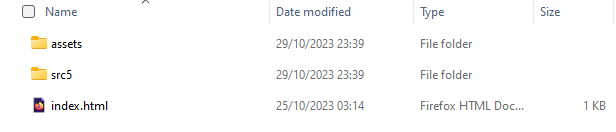

## React to github page

This  object here is to add a couple of markdown files to a React app, navigate between views of the two files and deploy as a github page.

The markdown files will be the svelte presentation and markdown descriptions, but the pages are being displayed in a react app.

### Setup

This app will use the [react router version 6](https://reactrouter.com/en/main) to navigate between views of different components so to setup return the the ReactTS24 folder and add the router so that it will be available for all react pages on the platform.

> npm install react-router-dom

> A utility which will be useful to allow bootstrap navigation to be used with the react-router-dom should also be installed.

> npm install react-router-bootstrap

Now add markdown handling, just for this particular project.

> cd react24
 
> npm install react-markdown --save


### Routing

 The addition of the react router enbles the app to move between views of multiple components.  One component will be for the display of the presentation file, and this will be the home page.  The other component will be for the display of the tutorial.

The routes for navigation will be separated into a component file components/Routes.tsx.  

The createBrowserRouter and RouterProvider elements are imported from react-router-dom.

The pages which will be routed are the Presentation (containing slides and text on Svelte) and the tutorial (containing a brief how-to tutorial on Svelte).  A third page, NoMatch is there to be called if the user browses to an invalid link.

A navigation bar will be provided in components/Header.tsx


**components/Routes.tsx**
```javascript
import React from "react";
import {
  createBrowserRouter,
  RouterProvider,
} from "react-router-dom";
import Presentation from "./Presentation";
import Tutorial from "./Tutorial";
import NoMatch from "./NoMatch";
import Header from "./Header";
```
The routes are described by a path based on the url and the element to display.

On each of the routed paths the element includes the navigation element ``<Header />`` and the element to be displayed, for example ``<Presentation />``.  All JSX elements must be nested in a single outer element.  The simplest of these is a JSX fragment represented by ``<></>``.

In this way the navigation will appear on every page rendered.

```javascript
function Routes() : React.JSX.Element {

  const Routes =  createBrowserRouter([
    {
      path: "/",
      element: (<><Header/><Presentation /></>),
    },
    {
      path: "/tutorial",
      element: (<><Header/><Tutorial /></>),
    },
    {
      path: "*",
      element: <NoMatch />,
    },
  ]);
```
A ``<RouterProvider>`` is returned by the Routes function. This includes all the routes described in the ``const Routes``.

```javascript
  return <RouterProvider router={Routes} />;  
}
export default Routes;
```

Putting this  together the full  listing is

**components/Routes.tsx**
``` javascript
import React from "react";
import {
  createBrowserRouter,
  RouterProvider,
} from "react-router-dom";
import Presentation from "./Presentation";
import Tutorial from "./Tutorial";
import NoMatch from "./NoMatch";
import Header from "./Header";

function Routes() : React.JSX.Element {

  const Routes =  createBrowserRouter([
    {
      path: "/",
      element: (<><Header/><Presentation /></>),
    },
    {
      path: "/tutorial",
      element: (<><Header/><Tutorial /></>),
    },
    {
      path: "*",
      element: <NoMatch />,
    },
  ]);

  return <RouterProvider router={Routes} />;  
}
export default Routes;
```

Now for the ``<Header>`` component.  Any elements required from react-bootstrap are imported together with the ``LinkContainer`` from react-bootsrap.

**components/Header.tsx**
```javascript
import React from "react";
import { Navbar, Nav } from "react-bootstrap";
import { LinkContainer } from "react-router-bootstrap";
```
The bootsrap navbar is made up following the usual pattern but wherever a ``<Nav.Link>`` would normally have included an ``href = `` this is omitted and the action of the navbar is drawn from the routes by nesting the ``<NavLink>`` inside a ``<LinkContainer>`` to the required path.  This will cause the navigation to be carried out client side without calls to the server.

```javascript
<LinkContainer to="/tutorial">
  <Nav.Link>Tutorial</Nav.Link>
</LinkContainer>
```

The full listing is then:
**components/Header.tsx**
```javascript
import React from "react";
import { Navbar, Nav } from "react-bootstrap";
import { LinkContainer } from "react-router-bootstrap";

const Header = () => {
  return (
    <Navbar expand="lg" className="bg-body-tertiary">
      <Navbar.Brand href="#home">Svelte Starter</Navbar.Brand>
      <Navbar.Toggle aria-controls="basic-navbar-nav" />
      <Navbar.Collapse id="basic-navbar-nav">
        <Nav className="me-auto">
          <LinkContainer to="/">
            <Nav.Link>Presentation</Nav.Link>
          </LinkContainer>
          <LinkContainer to="/tutorial">
            <Nav.Link>Tutorial</Nav.Link>
          </LinkContainer>
        </Nav>
      </Navbar.Collapse>
    </Navbar>
  );
};
export default Header;
```


App.tsx then becomes very simple because all that is required at the moment is to render the routes to show all the pages and navigation.  The full listing is:

  **App.tsx**
```javascript
import React from "react";
import Routes from "./components/Routes";

function App() {
  return (
    <>
      <Routes />
    </>
  );
}

export default App;
```


In case a route is seleted which does not match one of the prescribed selections, an error message should be displayed.  A component can be added as components/NoMatch.tsx

This can be customise with whatever error message you want to give to the client who browses to an invalid url.

**components/NoMatch.tsx**
```javascript
import React from "react";

function NoMatch() : React.JSX.Element {
    return (
      <div style={{ padding: 20 }}>
        <h2>404: Page Not Found</h2>
        <p>The page selected does not exist.</p>
      </div>
    );
  }
  export default NoMatch
```


### Displaying markdown.

The presentation and tutorial components are in the components folder.  These will display the markdown files which have been stored with their images in the assets folder separately within page 1 and page 2 folders.


For me these are in src5 folder, but you may have a different folder name here.

The markdown files are similar to their original form, but because they are now in a new folder structure the paths to the images has changed and each needs to be modified to reflect this.

For example an extract from **SveltePresentation.md** will be modified to:

```markdown
## Svelte Presentation

React is one of many frameworks which could be used for web app development, here is a brief introduction to an alternative which is popular with developers.

Most of the information here is drawn from the [Svelte Website](https://svelte.dev/) and if this taster is appealing you should follow up by going through the full tutorial sequence on that site.


Presentation front page with presenter names and appropriate theme.


React initially seems like a single framework so it may initially look as though Svelte is a framework and SvelteKit is some kind of development environment.
```
Take care that the case of PNG matches the image files.

The markdown file will be displayed using the [react-markdown tool](https://retool.com/blog/react-markdown-component-the-easy-way-to-create-rich-text) which has already been installed.

**Presentation.tsx** uses useEffect and useState hooks  to return the content fetched from the markdown file.

```javascript
import React, { useEffect, useState } from "react";
import ReactMarkdown from "react-markdown";

const Presentation = () => {
  const [content, setContent] = useState("");

  useEffect(() => {
    fetch("/src5/assets/page1/SveltePresentation.md")
      .then((res) => res.text())
      .then((text) => setContent(text));
  }, []);

  return (
    <div style={{ padding: 20 }}>
      <ReactMarkdown children={content} />
    </div>
  );
};

export default Presentation;
```
In an equivalent way **Tutorial.tsx** fetches code from SvelteTutorial.md.

```javascript
import React, { useEffect, useState } from "react";
import ReactMarkdown from "react-markdown";

const Tutorial = () => {
  const [content, setContent] = useState("");

  useEffect(() => {
    fetch("/src5/assets/page2/SvelteTutorial.md")
      .then((res) => res.text())
      .then((text) => setContent(text));
  }, []);

  return (
    <div style={{ padding: 20 }}>
      <ReactMarkdown children={content} />
    </div>
  );
};

export default Tutorial;
```

This code could be refactored to reduce duplication, but it is easy enough to use as it is.

The app then appears as:


Following navigation to the tutorial:


## building pages

Close the development server 

> CTRL + C

Before proceeding check that the case of any .png or .PNG images is correct.  The development server is not case sensitive, but the build process is.

In the public folder make a folder src5 to match the one already used and copy the assets into this.

The build process uses the assets in the public folder.


Then build the project

> npm run build

The build can be previewed

> npm run preview

The preview runs on port 4173.  Check that this works properly.


And the links should also be tested.


Stop the development server.

> CTRL + C

Make sure that all editor files are closed and then 

>CTRL + SHIFT + P


Reopen the container locally.


Now copy the files into a local folder



Confirm that you can run these with the live server in visual studio code.  These files are all you need to run the app from an html server.