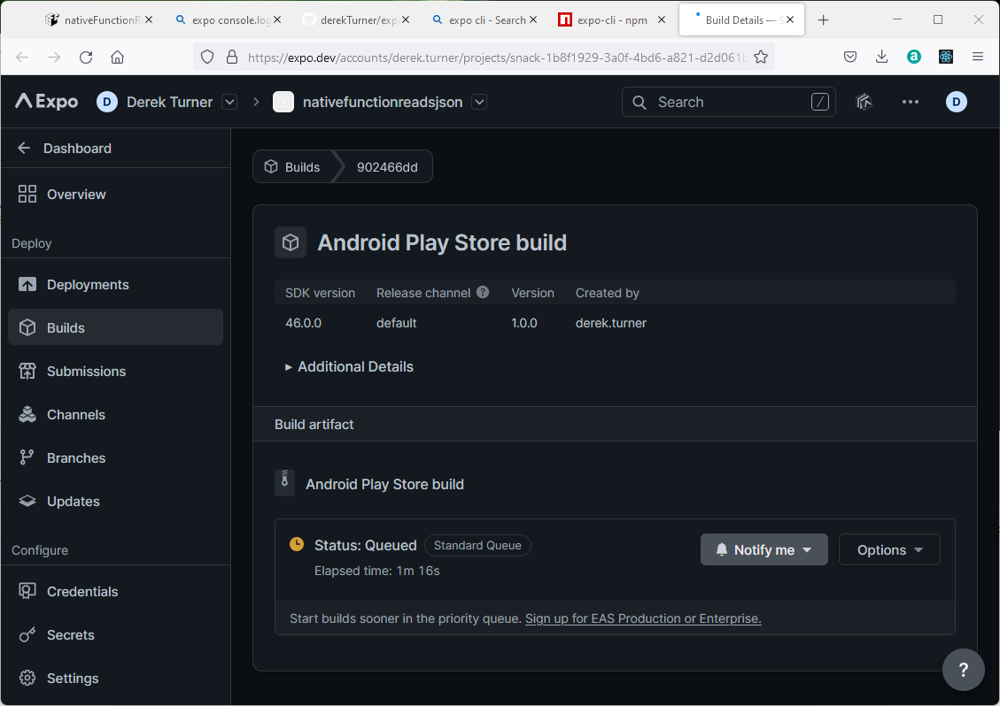

## Running in EXPO

In order to build an app from a snack, Expo provides a command line interpreter.  This can be run locally under node, but it will generate many node modules which are a nuisance to delete.  One way to remove unwanted node modules is to edit package.json to emptiness and then let npm update the project, but this is a work around.  

In the next section the docker development facility is considered.  The aim is to set up the expo CLI without the need for a local node environment.


## Docker and Expo

The developer environment can use an existing image and code placed on gitHub to create a volume which can be kept in synchronisation with gitHub by using git within visual studio.

The system should use the code on gitHub as a guide to install  its best guess environment out of the box.  To do this it can take advantage of the json package file to determine dependancies.  There is also the possibility of leaving information in a *.docker* folder on github which will inform the creation of the environment.  This might include docker files and docker compose files, but for now the simplest approach is to include a file as config.json in this folder.  Within this config file the image on which the development environment willl be based can be indicated.

In the usual way create a github repository named expo and add to it the .docker/config.json

```javascript
{
    "image": "node"
}
```
Also add to this repository the files downloaded from expo which describe the app.


If files are subsequenly edited locally they can be committed and uploaded to keep the git repository up to date.

When installation is complete the starter files can be set up on gitHub.  Firstly,on github I log in and create a cloud repository named expo with a gitingore file for node.


Now I can use github desktop to add the expo app files and docker file to this github directory.

 

I now have the starter filed for the dev environment I can create a new environment in docker desktop pointing to this repository.


As the environment is made progress can be viewed and the base image can be seen to be loaded.


Finally the environment is shown running.


The running container environment can be started and stopped from within docker desktop's dashboard and can also be opened into its own visual studio code window from here.

The first view of VSC shows the code cloned into a folder named com.docker.devenvironments.code.  The terminal view confirms that this is a node environment.


To check that node is working enter into the terminal shell:

> node --version

```code
v18.10.0
```

# install expo CLI

At this point, the bash shell within visual studio code is running as user node and does not have root priveledges to create a directory to load the node modules for expo.  This is a security feature.  

> whoami

to confirm:

```code
node
```

However a work around is available.

Close the visual studio code view of the development container and in powershell open a bash shell as the root user.

Check the running container for expo (yours will be differently named).

> docker exec -u 0 -it ecstatic_fermi bash

To check this is the root type 

> whoami

to confirm:

```code
root
```

Now as the root user install the expo command line.

> npm install expo-cli --global 

```code
root@0ff82547b16b:/# npm install expo-cli --global --no-optional
npm WARN config optional Use `--omit=optional` to exclude optional dependencies, or
npm WARN config `--include=optional` to include them.
npm WARN config
npm WARN config     Default value does install optional deps unless otherwise omitted.
npm WARN EBADENGINE Unsupported engine {
npm WARN EBADENGINE   package: 'expo-cli@6.0.6',
npm WARN EBADENGINE   required: { node: '>=12 <=16' },
npm WARN EBADENGINE   current: { node: 'v18.10.0', npm: '8.19.2' }
npm WARN EBADENGINE }
npm WARN deprecated urix@0.1.0: Please see https://github.com/lydell/urix#deprecated
npm WARN deprecated source-map-url@0.4.1: See https://github.com/lydell/source-map-url#deprecated
npm WARN deprecated resolve-url@0.2.1: https://github.com/lydell/resolve-url#deprecated
npm WARN deprecated source-map-resolve@0.5.3: See https://github.com/lydell/source-map-resolve#deprecated
npm WARN deprecated uuid@3.4.0: Please upgrade  to version 7 or higher.  Older versions may use Math.random() in certain circumstances, which is known to be problematic.  See https://v8.dev/blog/math-random for details.
npm WARN deprecated uuid@3.4.0: Please upgrade  to version 7 or higher.  Older versions may use Math.random() in certain circumstances, which is known to be problematic.  See https://v8.dev/blog/math-random for details.
npm WARN deprecated querystring@0.2.0: The querystring API is considered Legacy. new code should use the URLSearchParams API instead.
npm WARN deprecated chokidar@2.1.8: Chokidar 2 does not receive security updates since 2019. Upgrade to chokidar 3 with 15x fewer dependencies
npm WARN deprecated stable@0.1.8: Modern JS already guarantees Array#sort() is a stable sort, so this library is deprecated. See the compatibility table on MDN: https://developer.mozilla.org/en-US/docs/Web/JavaScript/Reference/Global_Objects/Array/sort#browser_compatibility
npm WARN deprecated svgo@1.3.2: This SVGO version is no longer supported. Upgrade to v2.x.x.
npm WARN deprecated uuid@3.4.0: Please upgrade  to version 7 or higher.  Older versions may use Math.random() in certain circumstances, which is known to be problematic.  See https://v8.dev/blog/math-random for details.
npm WARN deprecated uuid@3.4.0: Please upgrade  to version 7 or higher.  Older versions may use Math.random() in certain circumstances, which is known to be problematic.  See https://v8.dev/blog/math-random for details.
npm WARN deprecated uuid@3.4.0: Please upgrade  to version 7 or higher.  Older versions may use Math.random() in certain circumstances, which is known to be problematic.  See https://v8.dev/blog/math-random for details.
npm WARN deprecated uuid@3.4.0: Please upgrade  to version 7 or higher.  Older versions may use Math.random() in certain circumstances, which is known to be problematic.  See https://v8.dev/blog/math-random for details.
npm WARN deprecated chokidar@2.1.8: Chokidar 2 does not receive security updates since 2019. Upgrade to chokidar 3 with 15x fewer dependencies

added 1696 packages, and audited 1697 packages in 59s

127 packages are looking for funding
  run `npm fund` for details

24 vulnerabilities (6 moderate, 15 high, 3 critical)

To address all issues (including breaking changes), run:
  npm audit fix --force

Run `npm audit` for details.
```

To check this has worked (still in the powershell as root)

> expo --version

```code
WARNING: expo-cli has not yet been tested against Node.js v18.10.0.
If you encounter any issues, please report them to https://github.com/expo/expo-cli/issues

expo-cli supports following Node.js versions:
* >=12.13.0 <15.0.0 (Maintenance LTS)
* >=16.0.0 <17.0.0 (Active LTS)

6.0.6
```

Lets' hope that this will be ok with our node version!


Check that yarn is installed

> yarn --version

```code
1.22.19
```
So no need to try to install this.

Exit from the root user

> exit

and close powershell.

Return to the VScode remote container.

It seems that all the depependancies are in place now.  The state of package.json indecates the dependancies which have been met.

```json
{
  "main": "node_modules/expo/AppEntry.js",
  "scripts": {
    "start": "expo start",
    "android": "expo start --android",
    "ios": "expo start --ios",
    "web": "expo start --web"
  },
  "dependencies": {
    "expo": "~46.0.13",
    "expo-status-bar": "~1.4.0",
    "react": "18.0.0",
    "react-native": "0.69.6",
    "react-native-paper": "4.9.2",
    "expo-constants": "~13.2.4"
  },
  "devDependencies": {
    "@babel/core": "^7.12.9"
  },
  "private": true
}
```

# Building the project

Return to the visual studio code terminal view now running as user node.

Can the project be built now?  In the development environment bash shell:

> expo build:android

Seems the dependencies are not all there yet.

```code
Cannot determine which native SDK version your project uses because the module `expo` is not installed. Please install it with `yarn add expo` and try again.
```
Follow these instructions:

> yarn add expo

This seems to repeat some of the actions already done. However the code runs.

```code
 yarn add expo
yarn add v1.22.19
info No lockfile found.
[1/4] Resolving packages...
warning react-native > @react-native-community/cli > 

...

Too many lines to incluide here!
...
├─ xcode@3.0.1
├─ xmlbuilder@14.0.0
├─ xtend@4.0.2
├─ y18n@4.0.3
├─ yargs-parser@18.1.3
└─ yocto-queue@0.1.0
Done in 62.93s.
node@0ff82547b16b:/com.docker.devenvironments.code$ expo --version
WARNING: expo-cli has not yet been tested against Node.js v18.10.0.
If you encounter any issues, please report them to https://github.com/expo/expo-cli/issues

expo-cli supports following Node.js versions:
* >=12.13.0 <15.0.0 (Maintenance LTS)
* >=16.0.0 <17.0.0 (Active LTS)

6.0.6
```

Now try again

> expo build:android

Hmm... I note that this will be removed in January - what will replace it?

```code
expo-cli supports following Node.js versions:
* >=12.13.0 <15.0.0 (Maintenance LTS)
* >=16.0.0 <17.0.0 (Active LTS)

6.0.6
node@0ff82547b16b:/com.docker.devenvironments.code$ expo build:android
WARNING: expo-cli has not yet been tested against Node.js v18.10.0.
If you encounter any issues, please report them to https://github.com/expo/expo-cli/issues

expo-cli supports following Node.js versions:
* >=12.13.0 <15.0.0 (Maintenance LTS)
* >=16.0.0 <17.0.0 (Active LTS)


expo build:android has been superseded by eas build. Learn more: https://blog.expo.dev/turtle-goes-out-to-sea-d334db2a6b60

Run the following:

› npm install -g eas-cli
› eas build -p android https://docs.expo.dev/build/setup/

expo build:android will be discontinued on January 4, 2023 (91 days left).

📝  Android package Learn more: https://expo.fyi/android-package

? What would you like your Android package name to be? › 
```

I will just type in here

> readjson.apk

```code
✔ What would you like your Android package name to be? … readjson.apk
An Expo user account is required to proceed.
? How would you like to authenticate? › - Use arrow-keys. Return to submit.
❯   Make a new Expo account
    Log in with an existing Expo account
    Cancel
```
Press down arrow to select option.

```code
? How would you like to authenticate? › - Use arrow-keys. Return to submit.
    Make a new Expo account
❯   Log in with an existing Expo account
    Cancel
```

> Enter

```code
✔ Username/Email Address: … enter your account details
✔ Password: … *********
```

Now I have another choice and will select apk

```code
Success. You are now logged in as ***********.
? Choose the build type you would like: › - Use arrow-keys. Return to submit.
❯   apk
    Build a package to deploy to the store or install directly on Android devices
    app-bundle
```

> Enter

```code
Accessing credentials for ************ in project snack-1b8f1929-3a0f-4bd6-a821-d2d061ba3b8b
? Would you like to upload a Keystore or have us generate one for you?
If you don't know what this means, let us generate it! :) › - Use arrow-keys. Return to submit.
❯   Generate new keystore
    I want to upload my own file
```

>Enter

```code
? In order to publish an update, expo-updates needs to be installed. Do you want to install it now? › (Y/n)
```

> Y

```code
Running expo install expo-updates


› Expo SDK: 46.0.0
› Release channel: default
› Workflow: Managed

- Optimization: Project may contain uncompressed images. Optimizing image assets can improve app size and performance.
  To fix this, run npx expo-optimize. Learn more: https://docs.expo.dev/distribution/optimizing-updates/#optimize-images

Building optimized bundles and generating sourcemaps...
Starting Metro Bundler
Started Metro Bundler
Android Bundling complete 21133ms

Bundle                     Size
┌ index.ios.js           863 kB
├ index.android.js       866 kB
├ index.ios.js.map      3.37 MB
└ index.android.js.map  3.38 MB

💡 JavaScript bundle sizes affect startup time. Learn more: https://expo.fyi/javascript-bundle-sizes

Analyzing assets
Saving assets
No assets changed, skipped.

Processing asset bundle patterns:
- /com.docker.devenvironments.code/**/*

Uploading JavaScript bundles
Publish complete

📝  Manifest: https://exp.host/@derek.turner/snack-1b8f1929-3a0f-4bd6-a821-d2d061ba3b8b/index.exp?sdkVersion=46.0.0 Learn more: https://expo.fyi/manifest-url
⚙️   Project page: https://expo.dev/@derek.turner/snack-1b8f1929-3a0f-4bd6-a821-d2d061ba3b8b?serviceType=classic&distribution=expo-go Learn more: https://expo.fyi/project-page

Checking if this build already exists...

Build started, it may take a few minutes to complete.
You can check the queue length at https://expo.dev/turtle-status

You can monitor the build at

 https://expo.dev/accounts/derek.turner/projects/snack-1b8f1929-3a0f-4bd6-a821-d2d061ba3b8b/builds/902466dd-2d1e-44fa-b86c-3470d6cfbcbb

Waiting for build to complete.
You can press Ctrl+C to exit. It won't cancel the build, you'll be able to monitor it at the printed URL.
⠸ Build queued...
```

Follow the web link



The build is being completed on a remote server, not using your local machine resources.

Come back here later to see the completed build and a download link to test the app.

https://expo.dev/accounts/derek.turner/projects/snack-1b8f1929-3a0f-4bd6-a821-d2d061ba3b8b/builds/902466dd-2d1e-44fa-b86c-3470d6cfbcbb


Success, follow the link above on and android device to download install and run the application.

# Conclusion

It took a lot of effort to build a docker environment which could build a mobile application.  However, from this point all we need to do is update the github and synchronise and we have the ready made development environment to generate many apps.

As long as expo SDK46 is selected this should work without much update for around a year.


