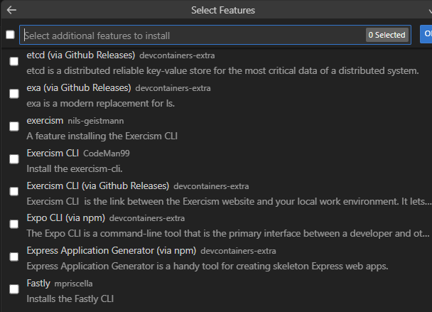
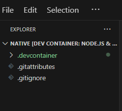
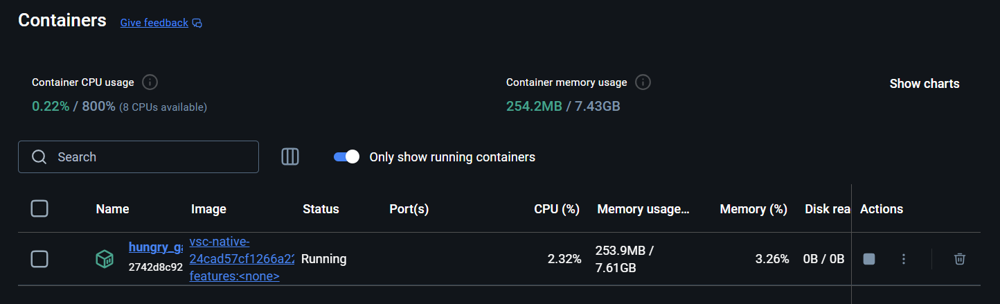

## Running in EXPO

Expo will run on a node system within a docker container.  This includes all that is needed to support development (like a local snack) and a command line interpreter CLI which can be used to build the final product.


## Docker and Expo

To start off you can use github desktop to add a new repository, which I have named "native" and to publish this publically available on a github repository.

Ensure that docker is running but note that no containers are currently running.

Now I am going to open this into visual studio code and prepare an environment in a container.The developer environment can use an existing image and code placed on gitHub to create a volume which can be kept in synchronisation with gitHub by using git within visual studio or github desktop.

Open the empty "native" repository folder on visual studio code.

> CTRL + SHIFT + P

Navigate and select the required folder, "native".

Select "add configuration to the workspace"

Show all templates and select node and typescript.

This time I will select node version 2022 which will enter long term support October 2024.

When asked for additional features I note that the expo cli is available: I tried selecting this but it loaded an old version which was not compatible with node 22 so choose none I will leave this for later.



Press return and continue through the default selections to get the container downloading.


......

The file list will initially be quite sparse.



The container is running in the background.



To check that node is working enter into the terminal shell:

> node --version

```code
v22.2.0
```

Install expo.


> npm i expo


Check that yarn is installed

> yarn --version

```code
1.22.19
```

It seems that all the depependancies are in place now.  The state of package.json indicates the dependancies which have been met.

```json
{
  "dependencies": {
    "expo": "^51.0.38"
  }
}
```

# Building the project

Can the project be built now?  In the development environment bash shell:

> expo build:android

Seems the dependencies are not all there yet.

```code
Cannot determine which native SDK version your project uses because the module `expo` is not installed. Please install it with `yarn add expo` and try again.
```
Follow these instructions:

> yarn add expo

This seems to repeat some of the actions already done. However the code runs.

```code
 yarn add expo
yarn add v1.22.19
info No lockfile found.
[1/4] Resolving packages...
warning react-native > @react-native-community/cli > 

...

Too many lines to incluide here!
...
├─ xcode@3.0.1
├─ xmlbuilder@14.0.0
├─ xtend@4.0.2
├─ y18n@4.0.3
├─ yargs-parser@18.1.3
└─ yocto-queue@0.1.0
Done in 62.93s.
node@0ff82547b16b:/com.docker.devenvironments.code$ expo --version
WARNING: expo-cli has not yet been tested against Node.js v18.10.0.
If you encounter any issues, please report them to https://github.com/expo/expo-cli/issues

expo-cli supports following Node.js versions:
* >=12.13.0 <15.0.0 (Maintenance LTS)
* >=16.0.0 <17.0.0 (Active LTS)

6.0.6
```

Now try again

> expo build:android

Hmm... I note that this will be removed in January - what will replace it?

```code
expo-cli supports following Node.js versions:
* >=12.13.0 <15.0.0 (Maintenance LTS)
* >=16.0.0 <17.0.0 (Active LTS)

6.0.6
node@0ff82547b16b:/com.docker.devenvironments.code$ expo build:android
WARNING: expo-cli has not yet been tested against Node.js v18.10.0.
If you encounter any issues, please report them to https://github.com/expo/expo-cli/issues

expo-cli supports following Node.js versions:
* >=12.13.0 <15.0.0 (Maintenance LTS)
* >=16.0.0 <17.0.0 (Active LTS)


expo build:android has been superseded by eas build. Learn more: https://blog.expo.dev/turtle-goes-out-to-sea-d334db2a6b60

Run the following:

› npm install -g eas-cli
› eas build -p android https://docs.expo.dev/build/setup/

expo build:android will be discontinued on January 4, 2023 (91 days left).

📝  Android package Learn more: https://expo.fyi/android-package

? What would you like your Android package name to be? › 
```

I will just type in here

> readjson.apk

```code
✔ What would you like your Android package name to be? … readjson.apk
An Expo user account is required to proceed.
? How would you like to authenticate? › - Use arrow-keys. Return to submit.
❯   Make a new Expo account
    Log in with an existing Expo account
    Cancel
```
Press down arrow to select option.

```code
? How would you like to authenticate? › - Use arrow-keys. Return to submit.
    Make a new Expo account
❯   Log in with an existing Expo account
    Cancel
```

> Enter

```code
✔ Username/Email Address: … enter your account details
✔ Password: … *********
```

Now I have another choice and will select apk

```code
Success. You are now logged in as ***********.
? Choose the build type you would like: › - Use arrow-keys. Return to submit.
❯   apk
    Build a package to deploy to the store or install directly on Android devices
    app-bundle
```

> Enter

```code
Accessing credentials for ************ in project snack-1b8f1929-3a0f-4bd6-a821-d2d061ba3b8b
? Would you like to upload a Keystore or have us generate one for you?
If you don't know what this means, let us generate it! :) › - Use arrow-keys. Return to submit.
❯   Generate new keystore
    I want to upload my own file
```

>Enter

```code
? In order to publish an update, expo-updates needs to be installed. Do you want to install it now? › (Y/n)
```

> Y

```code
Running expo install expo-updates


› Expo SDK: 46.0.0
› Release channel: default
› Workflow: Managed

- Optimization: Project may contain uncompressed images. Optimizing image assets can improve app size and performance.
  To fix this, run npx expo-optimize. Learn more: https://docs.expo.dev/distribution/optimizing-updates/#optimize-images

Building optimized bundles and generating sourcemaps...
Starting Metro Bundler
Started Metro Bundler
Android Bundling complete 21133ms

Bundle                     Size
┌ index.ios.js           863 kB
├ index.android.js       866 kB
├ index.ios.js.map      3.37 MB
└ index.android.js.map  3.38 MB

💡 JavaScript bundle sizes affect startup time. Learn more: https://expo.fyi/javascript-bundle-sizes

Analyzing assets
Saving assets
No assets changed, skipped.

Processing asset bundle patterns:
- /com.docker.devenvironments.code/**/*

Uploading JavaScript bundles
Publish complete

📝  Manifest: https://exp.host/@derek.turner/snack-1b8f1929-3a0f-4bd6-a821-d2d061ba3b8b/index.exp?sdkVersion=46.0.0 Learn more: https://expo.fyi/manifest-url
⚙️   Project page: https://expo.dev/@derek.turner/snack-1b8f1929-3a0f-4bd6-a821-d2d061ba3b8b?serviceType=classic&distribution=expo-go Learn more: https://expo.fyi/project-page

Checking if this build already exists...

Build started, it may take a few minutes to complete.
You can check the queue length at https://expo.dev/turtle-status

You can monitor the build at

 https://expo.dev/accounts/derek.turner/projects/snack-1b8f1929-3a0f-4bd6-a821-d2d061ba3b8b/builds/902466dd-2d1e-44fa-b86c-3470d6cfbcbb

Waiting for build to complete.
You can press Ctrl+C to exit. It won't cancel the build, you'll be able to monitor it at the printed URL.
⠸ Build queued...
```

Follow the web link


The build is being completed on a remote server, not using your local machine resources.

Come back here later to see the completed build and a download link to test the app.

https://expo.dev/accounts/derek.turner/projects/snack-1b8f1929-3a0f-4bd6-a821-d2d061ba3b8b/builds/902466dd-2d1e-44fa-b86c-3470d6cfbcbb


Success, follow the link above on and android device to download install and run the application.

# Conclusion

It took a lot of effort to build a docker environment which could build a mobile application.  However, from this point all we need to do is update the github and synchronise and we have the ready made development environment to generate many apps.

As long as expo SDK46 is selected this should work without much update for around a year.


