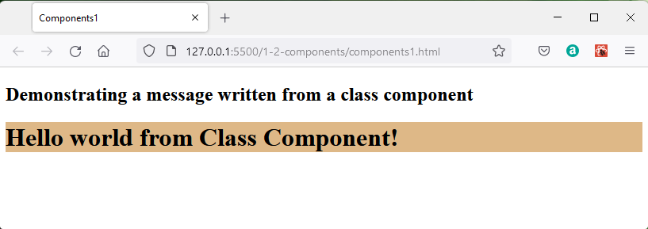
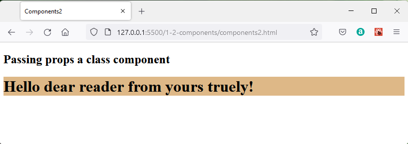
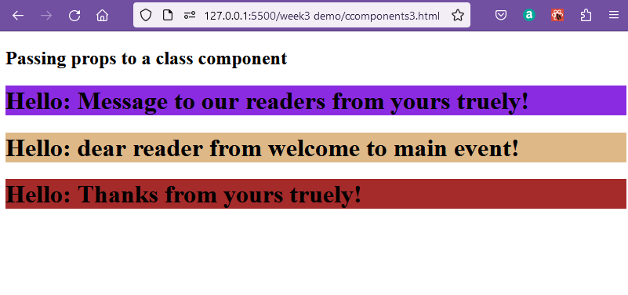
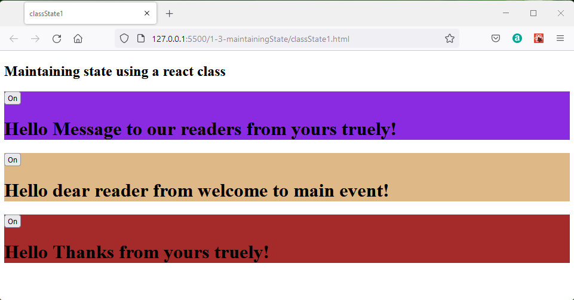
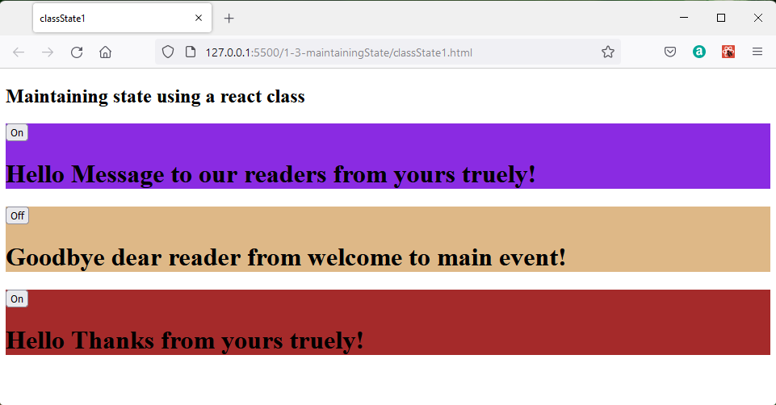

## Class Components

Remeber that these should not be used for new designs.

Create working files **ccomponents1.html** and **ccomponents1.js**

A class component is a class which features a render method which returns the user interface typically expressed in JSX.

**cccomponents1.js**
```javaScript
const main   = ReactDOM.createRoot(document.getElementById("main"));

class Message extends React.Component {
    render() {
        return <h1>Hello world from Class Component!</h1>;
    }
  } 

main.render(<Message />);
```
In this example the class is referenced by the `<Message />` element and this is substituted by the returned text from the message renderer method.

This is displayed as:




### Class Component Props

Working files **ccomponents2.html** and **ccomponents2.js**

Class components are able to respond to props to modify the rendered JSX.  

Within a class the *this* keyword is use to refer to items belonging to the current instance of the class.  A particular prop is named within brackets as {this.props.propName}.

In calling the component the `<Classname>` is estended by adding attributes as name value pairs matching the prop names in the class `<Message propName1="value1" propName2="value2"/>`

In this example the props named reader and author are passed.

**ccomponents2.js**
```javaScript
const main   = ReactDOM.createRoot(document.getElementById("main"));

class Message extends React.Component {
    render() {
        return <h1>Hello {this.props.reader} from {this.props.author}!</h1>;
    }
  } 

main.render(<Message reader="dear reader" author="yours truely"/>);
```

The prop values are passed to the class when it is invoked within the root.render which places the returned code into a container.

This renders as:




### Class components props and containers

Working files **ccomponents3.html** and **ccomponents3.js**

The class can be invoked in different renderers to write different messages to three distinct containers.

Edit ccomponents3.html so that it has header, main and footer sections with uniquie id's.

**ccomponents3.html**
```html
  <body>
    <h2>Passing props to a class component</h2>
    <header id="header"></header>
    <main   id="main"></main>
    <footer id="footer"></footer>
  </body>

```
Now create an instance of Message to display in each of these elements.

**ccomponents3.js**
```javaScript
const header   = ReactDOM.createRoot(document.getElementById("header"));
const main     = ReactDOM.createRoot(document.getElementById("main"));
const footer   = ReactDOM.createRoot(document.getElementById("footer"));

class Message extends React.Component {
    render() {
        return <h1>Hello: {this.props.reader} from {this.props.author}!</h1>;
    }
  } 

header.render(<Message reader="Message to our readers" author="yours truely"/>);  
main.render(  <Message reader="dear reader"            author="welcome to main event"/>);
footer.render(<Message reader="Thanks"                 author="yours truely"/>);
```

This shows the effect of different prop values being passed to a single class.

This renders as:




## Maintaining State

What maintaining state means is providing stored memory which can be associated with classes and functions and is available each time the class or function is called.

## Maintaining State with Class Components

Working files **classState1.html** and **classState1.js**.

A traditional class can be thought of as having properties and methods.  The properties are essentially maintaining state within the class and the methods are functions which may be called from the main code which can access the current values of the properties.  The properties may be changed from by interaction with the functions and so are said to be mutable.  An example of a mutable property would be a counter which changes each time a method was called.

A React class can be programmed to maintain state by adding a constructor function which:
 
 * picks up the props of the parent type; component in this case.

 * Uses a JSON object to define the inital value of this.state
  
 * Defines a handler function and binds it to this

Why is it necessary to bind the handler to this?  The keyword *this* is contextual, roughly translated it means the current object which should be the class instance.  However, when a button is clicked it is the button which is the current object and has the context of *this*, so if the event handler is not bound to the class context  *this*, it will not work.


```javascript
constructor(props) {
        super(props);
        this.state = { hello: true };
        this.handleClick = this.handleClick.bind(this);
      }
```
The click event handler function is then defined.  A function *setState()* is used to change the state of the state variable *state.hello*. In this simple example the handler inverted the logic state of hello as *true* or *false*.

```javascript
handleClick() {
        this.setState(state => ({greet: !state.greet}));
    }  
```
In the render method of the component a button is added which will call the handleClick function when it is clicked.

```javascript
<button onClick={this.handleClick}>
```
The renderer in the class then writes a message based on the state.  In this case the two way choice *on* or *off*.

Depending on the state *hello* the message printed on a button can be controlled by

```javascript
{this.state.greet ? "On": "Off"}
```

The message returned by the class render function is set by:

```javascript
 {this.state.greet ? 
    <h1>Hello {this.props.reader} from {this.props.author}!</h1>
    : 
    <h1>Goodbye {this.props.reader} from {this.props.author}!</h1>
}
```
As a reminder the full listing of classState1.js is:

**classState1.js**
```javascript
const header   = ReactDOM.createRoot(document.getElementById("header"));
const main     = ReactDOM.createRoot(document.getElementById("main"));
const footer   = ReactDOM.createRoot(document.getElementById("footer"));

class Message extends React.Component {
  constructor(props) {
      super(props);
      this.state = { greet: true };
      this.handleClick = this.handleClick.bind(this);
    }
   
  handleClick() {
      this.setState(state => ({greet: !state.greet}));
  }  

  render() {
      return(
      <span>   
      <button onClick={this.handleClick}>
           {this.state.greet ?  "On" : "Off" }
      </button>
      {this.state.greet ? 
              <h1>Hello {this.props.reader} from {this.props.author}!</h1>
              : 
              <h1>Goodbye {this.props.reader} from {this.props.author}!</h1>
          }
      </span>
      );
  }
} 

header.render(<Message reader="Message to our readers" author="yours truely"/>);  
main.render(  <Message reader="dear reader"            author="welcome to main event"/>);
footer.render(<Message reader="Thanks"                 author="yours truely"/>);
```
Which renders as:



Each button controls the state of a class instance independently so that when the button on the main section is clicked only this line changes.



