## Docker/Vite/ Client Side App

[React](https://reactjs.org) is a javascript library for building user interfaces.

It is isomorphic, which means it may run on the server or on the client.  In this section a client app examples are developed in a container on a local machine using a development server in a node environment.

Since React is a javascript library it can be run in a simple way as we have done so far using script files.


```javascript
<script crossorigin src="https://unpkg.com/react@18/umd/react.development.js"></script>
      <script crossorigin src="https://unpkg.com/react-dom@18/umd/react-dom.development.js"></script>
      <script src="https://unpkg.com/babel-standalone@6.26.0/babel.js"></script>
```

However, this approach is inefficient.  

The normal approach is to develop client sideReact Apps within a node environment and then build them to produce a final codebase which stands alone and can be run from a simple HTML server with no reference to node.


## Node environment on PC

Javascript is a scripting language, which means that it runs inside an application and does not compile down to stand-alone executable code.  Normally that environment is a browser, but browsers are sandboxed and constrain javascript is allowed to do.

If you are working on a development machine you can use a javascript run time environment to develop code.

If you wish javascript to run on a server, this can be done if a javascript run time is available.

The most popular run time is nodejs.  This is built upon Chrome's V8 javaScript engine.  There is usually a current version (20) and a Long Term Support version (22), the latter is recommended for most users.

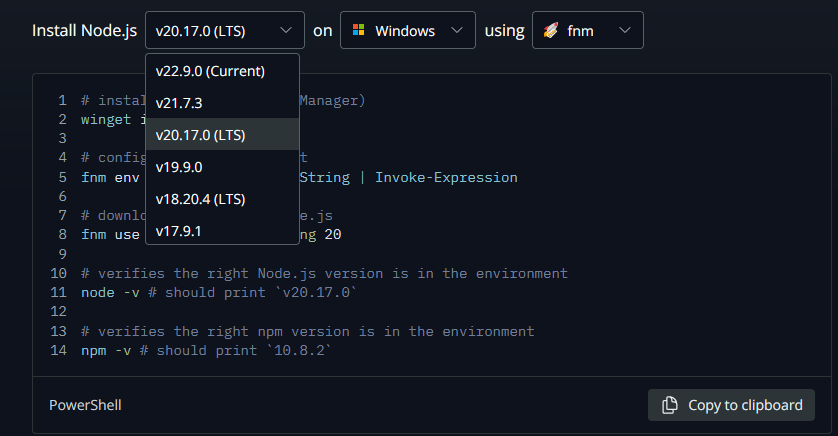


So I will follow through with node version 20 in these notes.

As well as node, there are now two alternative javascript run times, [deno](https://deno.land/) and [bun](https://bun.sh/).

Deno has been developed to overcome some of the drawbacks of node, but it is not fully backward compatible with node.

Bun uses the webkit javascript core engine, which is claimed to run faster than V8, it also claims to be backwards compatible with node. This is at version 1.1.6.

Both of these alternative run times are worthy of investigation, but for the present purpose I will work with the stable node version 20.

Node is also associated with the package manager [npm](https://www.npmjs.com/) this is a repository which holds thousands of node modules which can be drawn into javascript applications.

Node is good, but it relies on installing many small node modules.  If you are careful you should make a distinction between modules which are installed globally, and therefore become part of your base node environment and those which are installed within the node-modules folder of your application.

Applications may be dependant on different versions of these node modules, so it is essential to be careful with version installation. Node dependencies are an important consideration in getting an application to run. This takes care to manage on a personal machine, but on a multi-user machine could become impracticable.

If you are using gitHub, there is no need to store node modules as part of your repository code, so a .gitnore file is often used to prevent this.

Because of dependancies you may run into problems if you try to develop a number of applications in the same node environment.

You could use a number of virtual linux machines to hold separate node environments for different applications.  This would work, but the codebase which is being duplicated for each machine is large.

I prefer to us lightweight linux based Docker containers to hold isolated node environments.

>If after that warning you still want to run node locally on windows you can install node locally but I generally prefer not to.  I suggest you adopt the docker approach as below.


## VSC/Docker development

Since you have loaded the remote containers plug-in to visual studio code, you can easily open up code which sits on your local machine into a container.

The code can run on a server in the container  while you develop it.  When you are ready the container can be closed and the developed code is once again available in the local folder.

If this local folder is a gitHub repository, this can be kept up to date by committing and synchronising changes as you work.

Docker has a number of modes of use, this is the simplest.  Docker can also set up a development environment which links to github, but does not use the local file structure.

Finally Docker can be used to set up containers with fuly developed code ready for deployment.


## Using React/Vite in a Development environment

This is an adaptation of the tutorial [Creating a react app with Vite]](https://blog.openreplay.com/how-to-build-your-react-app-using-vite/) to create a docker development system supporting react and the typescript language.  Before considering react, an environment will be set up and then vite will be used in this environment to run a simple demonstration typescript application.


Before starting you will need docker desktop installed and running.  

The about tab shows version details.

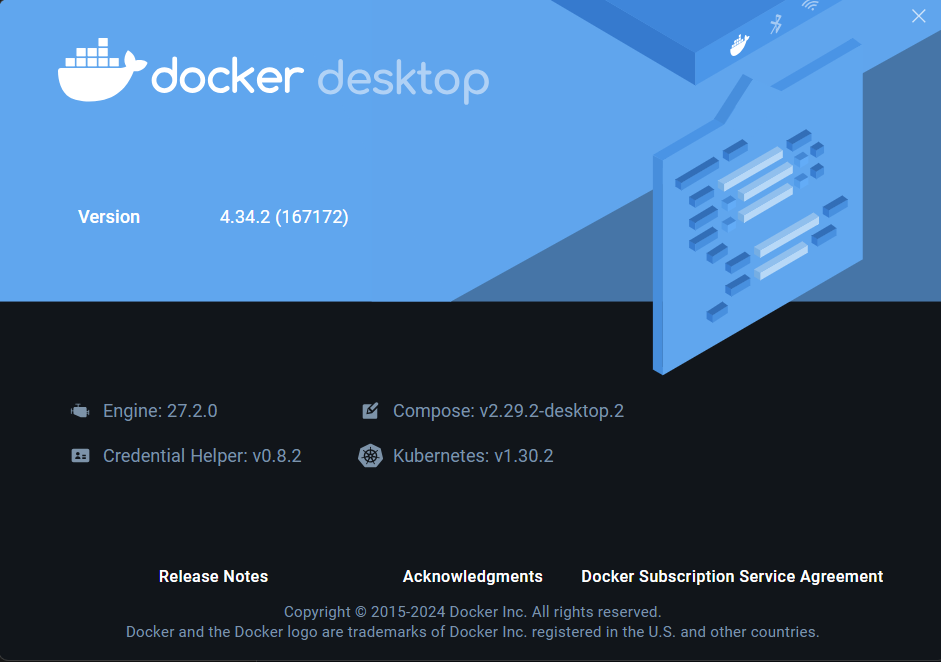

Then you will need VScode with the devContainers extension installed.

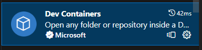

This will allow any local folder to be run in a docker development container and is an easy way to run with a development environment.

Using github desktop, create a new repository named reactTS24.  This will be your initial working space for react code development.

> File|New Reppository or CTRL + N

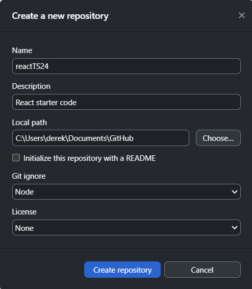

Publish the repository.

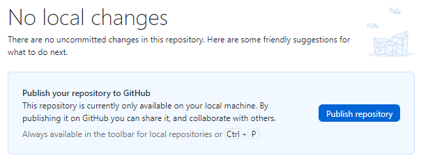

Open this in visual studio code and create a blank file in the folder called notes.md.  You can use this file subsequently to keep notes on your code development as you go.

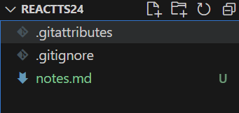

In VScode 

>CRTL + SHIFT + P

to show a list of commands and select open folder in container.

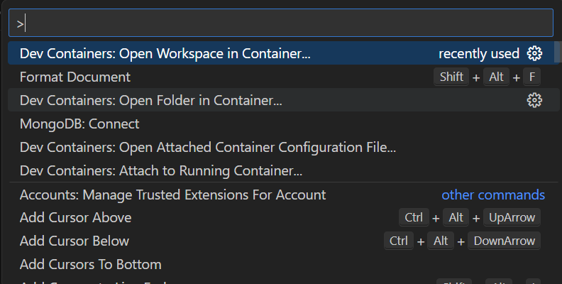

Click on Open Folder in Container. This will then open a browser dialog to choose the devContainer folder and open.

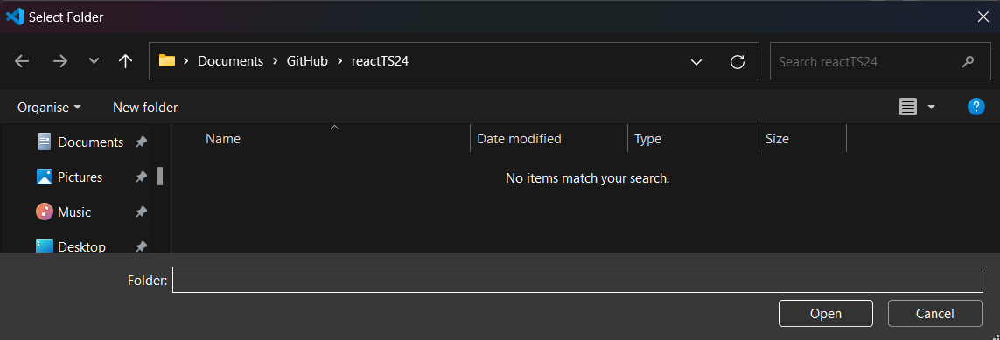

Make sure you select the folder itself and not a parent gitHub folder or a file within the folder.


On the first time of opening you are asked where you want to store the configuration, choose the lower option of workspace, then a system file will be placed into the folder which will describe the nature of the folder setup.

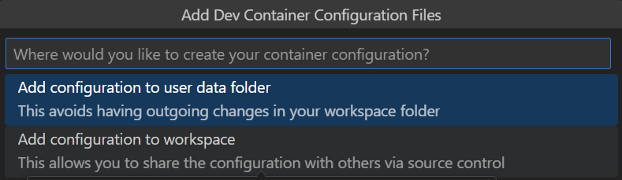

Then a prompt appears asking what type of container is needed.  Click on "Show all template definitions and then choose 'Node & Typescript'

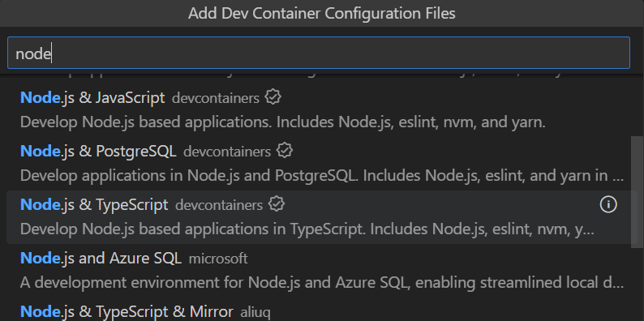

Then you are asked to choose a node version, I have accepted the LTS version 20-bookworm rather than going to the current version.

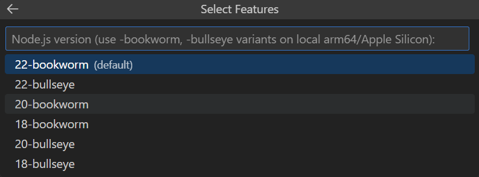


Then you are asked what additional features you need from a large checklist.  I selected none and pressed ok.

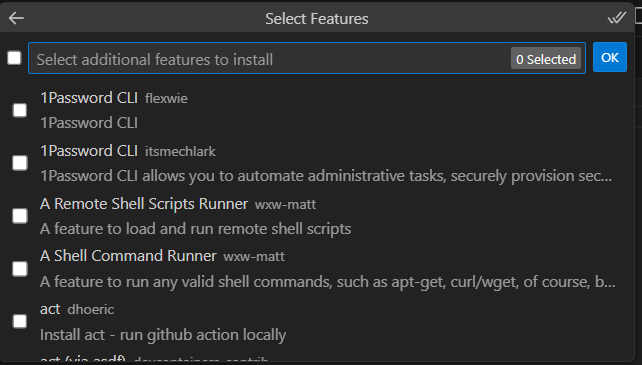

Finally you are asked about optional files and I did not select these.

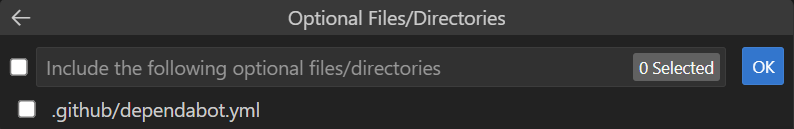

The system then takes time to create the container image.  

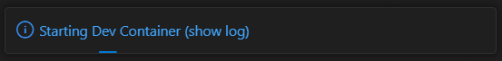

Click on show log to view progress, be patient.


The details list in the terminal.

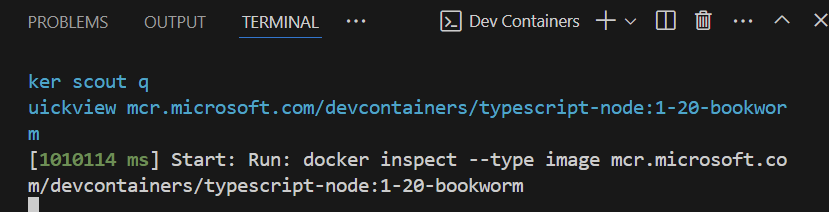


When this is complete docker desktop shows that the container is running.

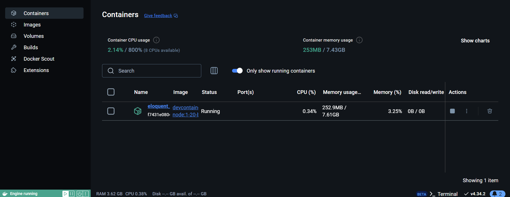

The file structure which has been created in the container contains .devcontainer which contains devcontainer.json showing that this is a node and typescript environment.


``` json
// For format details, see https://aka.ms/devcontainer.json. For config options, see the
// README at: https://github.com/devcontainers/templates/tree/main/src/typescript-node
{
	"name": "Node.js & TypeScript",
	// Or use a Dockerfile or Docker Compose file. More info: https://containers.dev/guide/dockerfile
	"image": "mcr.microsoft.com/devcontainers/typescript-node:1-20-bullseye"

	// Features to add to the dev container. More info: https://containers.dev/features.
	// "features": {},

	// Use 'forwardPorts' to make a list of ports inside the container available locally.
	// "forwardPorts": [],

	// Use 'postCreateCommand' to run commands after the container is created.
	// "postCreateCommand": "yarn install",

	// Configure tool-specific properties.
	// "customizations": {},

	// Uncomment to connect as root instead. More info: https://aka.ms/dev-containers-non-root.
	// "remoteUser": "root"
}
```
Open a terminal from the VSC menu.  The prompt should appear as

```code
node ➜ /workspaces/reactTS23 (main) $
```

The node version can be checked by 

>node -v

```code
v20.17.0
```

The typescript version is checked by:

>tsc -v

```code
Version 5.6.2
```

Install vite with

>npm install vite

This led to a comment inviting an update to npm.

```
added 16 packages, and audited 17 packages in 3s

3 packages are looking for funding
  run `npm fund` for details

1 high severity vulnerability

To address all issues, run:
  npm audit fix

Run `npm audit` for details.
npm notice 
npm notice New minor version of npm available! 10.2.1 -> 10.8.3
npm notice Changelog: https://github.com/npm/cli/releases/tag/v10.8.3
npm notice Run npm install -g npm@10.8.3 to update!
npm notice 
```

Don't update at this stage.


Once the loading process has completed a package.json file is crated in the reactTS23 folder, this displays the dependancy for Vite.

```json
{
  "dependencies": {
    "vite": "^5.4.8"
  }
}
```

Now initialise vite

> npm init vite

```code
Need to install the following packages:
create-vite@5.5.2
Ok to proceed? (y) 
```
> y

```code
? Project name: › react24
```

Select a framework

```code
Select a framework: › - Use arrow-keys. Return to submit.
    Vanilla
    Vue
❯   React
    Preact
    Lit
    Svelte
    Solid
    Qwik
    Others

```

Choose typescript

```code
? Select a variant: › - Use arrow-keys. Return to submit.
❯   TypeScript
    TypeScript + SWC
    JavaScript
    JavaScript + SWC
```
Project is scaffolded

```code
Scaffolding project in /workspaces/reactTS24/react24...

Done. Now run:

  cd react24
  npm install
  npm run dev
```

The folder react24 has been set up with the basic template code in the src folder.  Any necessary assets are in the public folder.

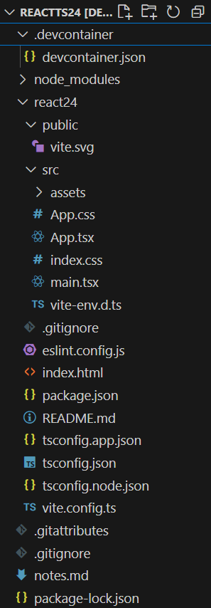

Note that there is a package.json file outside the react 24 project which we used to install vite.  There is a second package.json file inside the project react 24.

> cd react24


Install the dependancies listed in src/package.json

**src/package.json**
```json
{
  "name": "react24",
  "private": true,
  "version": "0.0.0",
  "type": "module",
  "scripts": {
    "dev": "vite",
    "build": "tsc -b && vite build",
    "lint": "eslint .",
    "preview": "vite preview"
  },
  "dependencies": {
    "react": "^18.3.1",
    "react-dom": "^18.3.1"
  },
  "devDependencies": {
    "@eslint/js": "^9.9.0",
    "@types/react": "^18.3.3",
    "@types/react-dom": "^18.3.0",
    "@vitejs/plugin-react": "^4.3.1",
    "eslint": "^9.9.0",
    "eslint-plugin-react-hooks": "^5.1.0-rc.0",
    "eslint-plugin-react-refresh": "^0.4.9",
    "globals": "^15.9.0",
    "typescript": "^5.5.3",
    "typescript-eslint": "^8.0.1",
    "vite": "^5.4.1"
  }
}
```
Note that you are working now inside the react24 project.

> npm install

```code
added 193 packages, and audited 194 packages in 2m

41 packages are looking for funding
  run `npm fund` for details

found 0 vulnerabilities
```

Before running the src code on the Vite development server.

Make a minor ajustment to src/package.json adding --host to the script.

```json
  "scripts": {
    "dev": "vite --host",
    "build": "tsc -b && vite build",
    "lint": "eslint .",
    "preview": "vite preview --host"
  },
```

> npm run dev

```code
 VITE v5.4.8  ready in 550 ms

  ➜  Local:   http://localhost:5173/
  ➜  Network: http://172.17.0.2:5173/
  ➜  press h + enter to show help
```

The output is available to the browser on port 5173.

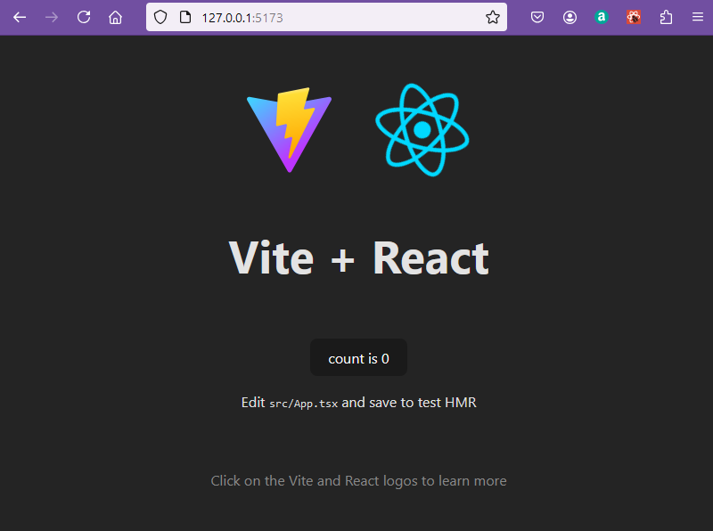

> CTRL + C to stop the server

While the server is running any changes will update immediately.

The index.html file has a div id = root which will be written into by react.

```html
<!doctype html>
<html lang="en">
  <head>
    <meta charset="UTF-8" />
    <link rel="icon" type="image/svg+xml" href="/vite.svg" />
    <meta name="viewport" content="width=device-width, initial-scale=1.0" />
    <title>Vite + React + TS</title>
  </head>
  <body>
    <div id="root"></div>
    <script type="module" src="/src/main.tsx"></script>
  </body>
</html>
```

The starting react app code is in main.tsx

```javascript
import React from 'react'
import ReactDOM from 'react-dom/client'
import App from './App.tsx'
import './index.css'

ReactDOM.createRoot(document.getElementById('root')!).render(
  <React.StrictMode>
    <App />
  </React.StrictMode>,
)
```

This imports React and ReactDom and then imports from App.tsx.

The <App /> component which is imported contains the operational code.

**App.tsx**
```javascript
import { useState } from 'react'
import reactLogo from './assets/react.svg'
import viteLogo from '/vite.svg'
import './App.css'

function App() {
  const [count, setCount] = useState(0)

  return (
    <>
      <div>
        <a href="https://vitejs.dev" target="_blank">
          
        </a>
        <a href="https://react.dev" target="_blank">
          
        </a>
      </div>
      <h1>Vite + React</h1>
      <div className="card">
        <button onClick={() => setCount((count) => count + 1)}>
          count is {count}
        </button>
        <p>
          Edit <code>src/App.tsx</code> and save to test HMR
        </p>
      </div>
      <p className="read-the-docs">
        Click on the Vite and React logos to learn more
      </p>
    </>
  )
}

export default App
```

App.tsx includes a function based component App(){}  which uses the useState hook to maintain the state of a count which is incremented when a button is clicked.

Once code has been completed it can be built.  This polls all the javascript into a small number of files which can be run on a server which does not have a node environment.

> CTRL + C

> npm run build


```code
> react24@0.0.0 build
> tsc -b && vite build

vite v5.4.8 building for production...
✓ 34 modules transformed.
dist/index.html                   0.46 kB │ gzip:  0.30 kB
dist/assets/react-CHdo91hT.svg    4.13 kB │ gzip:  2.05 kB
dist/assets/index-DiwrgTda.css    1.39 kB │ gzip:  0.72 kB
dist/assets/index-f40OySzR.js   143.20 kB │ gzip: 46.06 kB
✓ built in 807ms
```

Refresh the Explorer view in VSC to see that a new dist folder has been created.

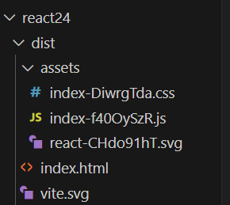

This folder can be copied to a local folder and run on a server such as VSC live server of uploaded to a flat file server online.

Commit code via VScode or github desktop

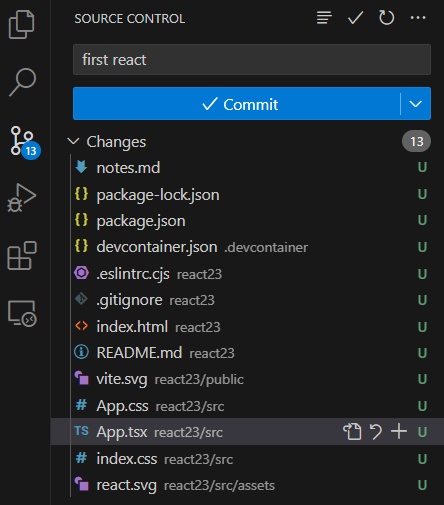

Sync changes to github

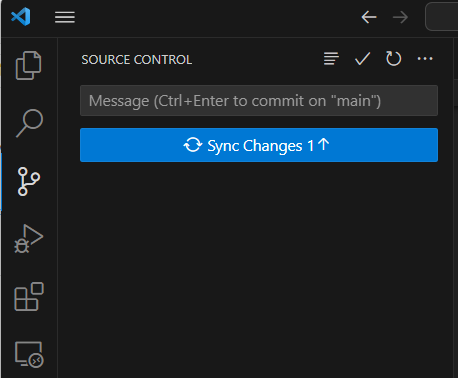

## Challenge 1

Edit the code to implement the three containers which display 5 different messages each.

## Challenge 2

Implement a game of tic tac toe referring to the online tutorial.

[Tic Tac Toe](https://react.dev/learn/tutorial-tic-tac-toe)

Watch out for minor differences between typescript and javascript.

The instructions also note that you could use the codesandbox development environment.  If you follow the fork in the tutorial this will take you to a framework vased on create-react-app and not vite.  This works but is not as up to date as an approach.