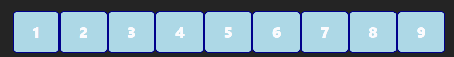
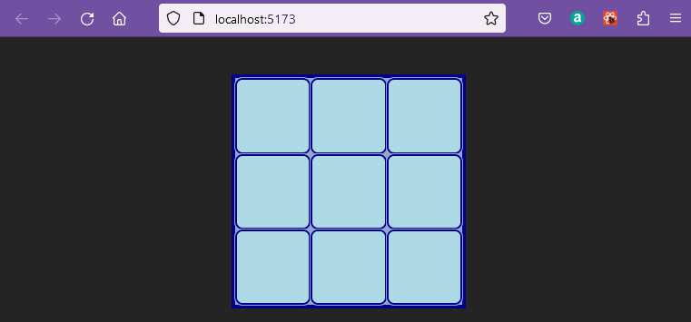
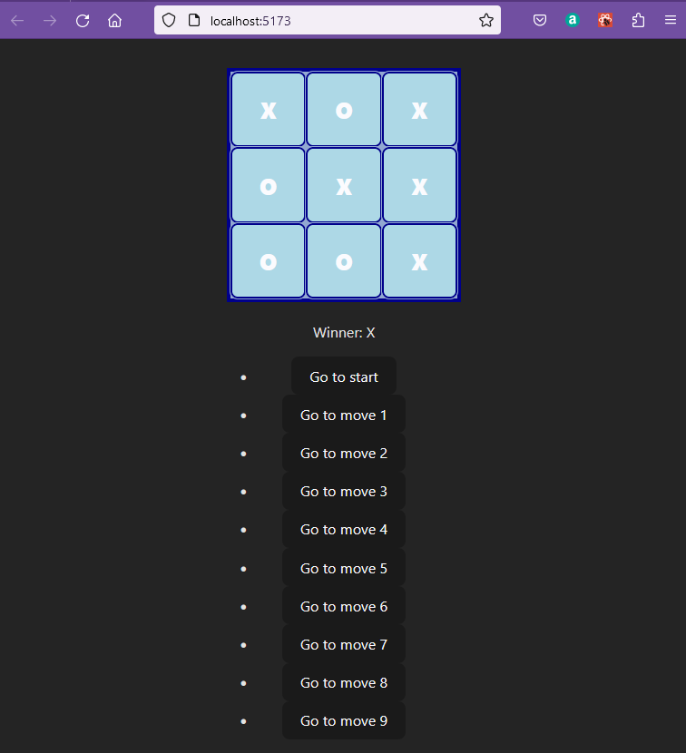

## Tic Tac Toe

Now a simple react Noughts and crosses game can be created.

This follows a [basic tutorial](https://react.dev/learn/tutorial-tic-tac-toe) on the React website.

I am not following the tutorial through to the very end, which you can. 

 There is a very good tutorial which covers a tic-tac-toe appliccation and uses the MUI css framework to add a little style at  ["How to make Tic-Tac-Toe in React & Typescript Application"](https://beverlybuilds.medium.com/tic-tac-toe-react-typescript-application-4c53cc743279)


The vite server serves from the src directory so you can copy the current src directory to src-demo and then edit into the src directory replacing the current contents.

This example will use [styled components](https://styled-components.com/), so inside react 24.

>npm install styled-components

## Components

We already have a main.tsx file which will be the starting point of the application.

```javascript
import React from 'react'
import ReactDOM from 'react-dom/client'
import App from './App'
import './index.css'

ReactDOM.createRoot(document.getElementById('root')!).render(
  <React.StrictMode>
    <App />
  </React.StrictMode>,
);
```

Note that the the .tsx extension has been dropped from the import of ./App, this removes the VScode warning that you can't import from a .tsx file.

A .ts file is a general typescript file whereas a .tsx file is one which contains JSX.

This will render into an element with id = "root" on the HTML page.

main.tsx imports App.tsx so  this will be the main module for the application.  This can be simplified to:

**APP.tsx**
```javascript
import React from 'react';
import './App.css';

function App() {
  return (
    <div className="App">
      Tic Tac Toe
    </div>
  );
}

export default App;
```

Components will be added in a new folder src/components.

* src/components.Game.js will hold the game logic.
* src/components.Board.js will hold the playing area
* src/components.Square.js will define one playing square

These are initially set up with placeholder text.

**components/Board.tsx**

```javascript
import React from 'react';

const Board = () => <div>Board</div>

export default Board;
```
This uses an arrow function to define the Board, but regular functions will also work just as well.

**components/Game.tsx**
```javascript
import React from 'react';

  const Game = () => <div>Game</div>

export default Game;
```

**components/Square.tsx**
```javascript
import React from 'react';

const Square = () => <div>Square</div>

export default Square;
```

Now the Game can be imported into App.tsx and displayed.

**App.tsx**
```javascript
import React from 'react';
import './App.css'
import Game from './components/Game';

function App() {
  return (
    <div className="App">
      <Game />;
    </div>
  );
}

  export default App;
```

This shows the text 'tic tac toe' and confirms files are correctly imported.

### Square

The first component to create is the square in components/Square.tsx.  Using arrow functions in javascript the return could be implicit, but in typescript the return statement cannot be missed out.

The Square is going to recieve a value which is a string and n onClick which is a MouseEvent.

By creating a type the property types of the Square can be summarised and then SquareProps can be written  in place of the longer form of property types.  This will be a good programming habit where the number of items in the props grows larger.

```javascript
import React,  { MouseEvent } from 'react';

type SquareProps = {
    value : Int8Array;
    onClick: (event: MouseEvent<HTMLButtonElement>) => void;
}

const Square = ({ value, onClick }:SquareProps) => {
    return(
    <button onClick={onClick}>
        {value}
    </button>
    )
}

export default Square;
```
The button will receive a prop object which is destructured to separate out value and onClick within the function without the need to refer to props.onClick and props.value.

### Board

Modify components/Board.tsx to display nine squares with values ranging 1 - 9.

The board will be passed a function which will handle the onClick, this is expressed in an interface as a fuction taking a string parameter and returning nothing. 

**board.tsx**
```javascript
import React from 'react';
import Square from './Square';

interface BoardProps {
    squares: Array<Int8Array>,
	onClick: (i:number) => void;
}

const Board = ({ squares, onClick }:BoardProps) => {
    return(
    <GridDiv>
        <Square value ={squares[0]} onClick={() => onClick(0)} />
        <Square value ={squares[1]} onClick={() => onClick(1)} />
        <Square value ={squares[2]} onClick={() => onClick(2)} />
        <Square value ={squares[3]} onClick={() => onClick(3)} />
        <Square value ={squares[4]} onClick={() => onClick(4)} />
        <Square value ={squares[5]} onClick={() => onClick(5)} />
        <Square value ={squares[6]} onClick={() => onClick(6)} />
        <Square value ={squares[7]} onClick={() => onClick(7)} />
        <Square value ={squares[8]} onClick={() => onClick(8)} />
    </GridDiv>
    )
}

export default Board;

```

### Game

Import Board to the game and build the Game function.  This will hold the game logic so will need an explicit return function.

The board will need to handle a click and pass this through to the square.  This also needs empty stub functions for game logic to complete later to jumpTo and renderMoves.

**Game.tsx**
```javascript
import React from 'react';
import Board from './Board';

const Game = () => {
    const handleClick = () => {   
    }
    const jumpTo = () => {  
    }
    const renderMoves = () => {  
    }
    return (
        <Board onClick={handleClick} />
    )
}

export default Game;
```
The stub functions will indicate a warning as they are unused at the moment.


The app should now be viewable, but does nothing yet.


### Style on squares


Rather than using the css file for the moment, style can be defined as a constant using JSON object format.

This is created in components/square.js so that it is local to the Square function and can be referenced as a prop without the need to pass this through the props list.

The style is added by replacing the reference to button by the styled Button.

**Square.tsx**
```javascript
import React,  { MouseEvent } from 'react';
import styled from "styled-components";

type SquareProps = {
    value : Int8Array;
    onClick: (event: MouseEvent<HTMLButtonElement>) => void;
}

const MyButton = styled.button`
background: lightblue;
border: 2px solid darkblue;
font-size:25px;
font-weight: 800;
cursor: pointer;
outline-style: solid;
outline-width: thin;
outline-color:  #92a8d1;
/*margin: 1px;*/
`;


const Square = ({ value, onClick }:SquareProps) => {
    return(
    <MyButton  onClick={onClick}>
        {value}
    </MyButton>
    )
}

export default Square;
```




### Style on Board

The style for the board can also be set using a styled component, this time a styled div.

The [css gridTemplate](https://developer.mozilla.org/en-US/docs/Web/CSS/grid-template) takes care of presenting the [1 fr unit squares on three rows](https://www.digitalocean.com/community/tutorials/css-css-grid-layout-fr-unit).

```javascript
import React from 'react';
import Square from './Square';
import styled from "styled-components";


const GridDiv = styled.div`
background-color:#92a8d1;
border: 4px solid darkblue;
borderRadius: 10px;
width:  250px;
height: 250px;
margin: 0 auto;
display: grid;
grid-template: repeat(3, 1fr) / repeat(3, 1fr);
`;


interface BoardProps {
    squares: Array<Int8Array>,
	onClick: (i:number) => void;
}

const Board = ({ squares, onClick }:BoardProps) => {
    return(
    <GridDiv>
        <Square value ={squares[0]} onClick={() => onClick(0)} />
        <Square value ={squares[1]} onClick={() => onClick(1)} />
        <Square value ={squares[2]} onClick={() => onClick(2)} />
        <Square value ={squares[3]} onClick={() => onClick(3)} />
        <Square value ={squares[4]} onClick={() => onClick(4)} />
        <Square value ={squares[5]} onClick={() => onClick(5)} />
        <Square value ={squares[6]} onClick={() => onClick(6)} />
        <Square value ={squares[7]} onClick={() => onClick(7)} />
        <Square value ={squares[8]} onClick={() => onClick(8)} />
    </GridDiv>
    )
}

export default Board;

```




### Calculate Winner

This is copied from the original tutorial on the Reactjs.org site.

A function calculateWinner is added to helpers.js in the same folder as App.js (i.e. not in the components folder.).

The array of lines represents the sequence of sqares which would be covered drawing a lines across, down or cornerwise.
Each of these sequences needs to be tested in turn for the criterion of winning which is that three array elements in the sequence are identical and not null.

Null represents false so if(squares[a]) tests if the array is non-null.

**helpers.ts**
```javascript
export function calculateWinner(squares: Array<Int8Array>){
    const lines = [
      [0, 1, 2],
      [3, 4, 5],
      [6, 7, 8],
      [0, 3, 6],
      [1, 4, 7],
      [2, 5, 8],
      [0, 4, 8],
      [2, 4, 6],
    ];
    for (let i = 0; i < lines.length; i++) {
      const [a, b, c] = lines[i];
      if (squares[a] && squares[a] === squares[b] && squares[a] === squares[c]) {
        return squares[a];
      }
    }
    return null;
  }
```

### Game logic

Game can now import the calculate winner helper.

**Game.tsx**
```javascript
import React, {useState, Fragment} from 'react';
import Board from './Board';

import styled from "styled-components";
import {calculateWinner} from '../helpers';

const GameState = styled.div`
	width: 200px;
	margin: 20px auto;
`;


const  Game = () => {
	const [history, setHistory] = useState([Array(9).fill(null)]);
	const [stepNumber, setStepNumber] = useState(0);
	const [xIsNext, setXisNext] = useState(true);
	const winner = calculateWinner(history[stepNumber]);

	const handleClick = (i: number) => {
		const timeInHistory = history.slice(0, stepNumber + 1);

		const current = timeInHistory[stepNumber];

		const squares = [...current];
		// if user click an occupied square or if game is won, return
		if (winner || squares[i]) return;

		// Put an X or an O in the clicked square
		squares[i] = xIsNext ? 'X' : 'O';
		setHistory([...timeInHistory, squares]);
		setStepNumber(timeInHistory.length);

		setXisNext(!xIsNext);
	}

	const jumpTo = (step: number) => {
		setStepNumber(step);
		setXisNext(step % 2 === 0);
	}
	const renderMoves = () => {
		return history.map((_step, move) => {
			const destination = move ? `Go to move ${move}` : 'Go to start';
			return (
				<li key={move}>
					<button onClick={() => jumpTo(move)}> {destination}</button>
				</li>
			)
		})
	}

	return (
		<Fragment>
			<Board squares={history[stepNumber]} onClick={handleClick} />
			<GameState>
				<p>{winner ? `Winner: ${winner}` : `Next Player ${xIsNext ? 'X' : 'O'}`}</p>
				{renderMoves()}
			</GameState>
		</Fragment>
	);
};

export default Game;
```

The return function uses [<Fragment> ](https://react.dev/reference/react/Fragment) to allow elements to be grouped without a wrapper node.

The game can now be played with history.

