## Create and populate a database

In this section I am adapting from the tutorial example at [Mozilla developer](https://developer.mozilla.org/en-US/docs/Learn/Server-side/Express_Nodejs/mongoose)

An web app will be developed to administer a book library.

For this purpose the objects which need to be described in the database are:

1. Book: described by title author ISBN etc
2. BookInstance: The library can hold several copies of one book. When it is loaned each book instance will have a due date for return.
3. Author: name and birth/death dates
4. Genre: Crime, Sci-fi, Romance etc

The relationships between these are:

- 1 book may have 0..many instances
- 1..many books may be written by 1 author (ignore multiple authors for the time being)
- 0..many books may match 0..many genres (a book might fit more than one genre or defy categorisation)

This relationship is captured in the UML diagram which has been generated using [plantUML](https://plantuml.com/):

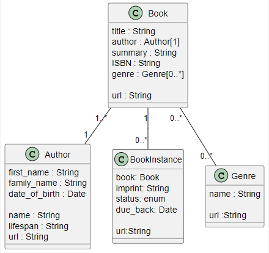

So examples of inital database entries would be:

Book:

- title:'The Name of the Wind (The Kingkiller Chronicle, #1)',
- summary:'I have stolen princesses back from sleeping barrow kings. I burned down the town of Trebon. I have spent the night with Felurian and left with both my sanity and my life. I was expelled from the University at a younger age than most people are allowed in. I tread paths by moonlight that others fear to speak of during day. I have talked to Gods, loved women, and written songs that make the minstrels weep.',
- ISBN: '9781473211896',
- author: authors[0],
- genre: [genres[0],]

BookInstance

- book: books[0],
- imprint: 'London Gollancz, 2014.',
- due_back: false,
- status: 'Available'

Author:

- first_name:'Patrick',
- family_name:'Rothfuss',
- d_birth:'1973-06-06',
- d_death:false

Genre:  
name: "Fantasy"


### Implementing the database

The database to be used to implement the database is MongoDB.  It may seem odd to use a noSQL database for a relational database but it is a good choice for this application.  We should consider noSQL to represent not only SQL.  MongoDB is a document database which is capable of supporting both [structured and unstructured](https://www.mongodb.com/resources/basics/unstructured-data/structured-vs-unstructured) data.

The database can be implemented one any of the following:
* mongodb running locally on docker with an image loaded in powerpoint using docker CLI commands.
* mongodb running locally on a docker development environment created within visual studio code.
* mongodb running in the cloud using MongoDB Atlas.

The code to populate the database will be the same for all three options but the connection stings to the database will be different.

The library application will be developed in a separate docker container.

When the react tutorial was installed to a local docker container the process was slow.  A major part or this was the time taken to download the image from the docker hub.  If the machine in use has a hard disk drive then the large number of files in the node modules directory will lead to slow performance.  The solution to this is to use a solid state drive.  If your computer has both a hard disk drive and a solid state drive then the docker container should be created on the solid state drive.  This will speed up the download of the node modules directory.

# Setting up a container

The docker container for this exercise will be named "RemixLibrary24".  This will include an application to seed the database and another to perforCRUD functions on it.

Let's use github desktop to create a new repository on github called "RemixLibrary24".  This will be the location for the code for the application.

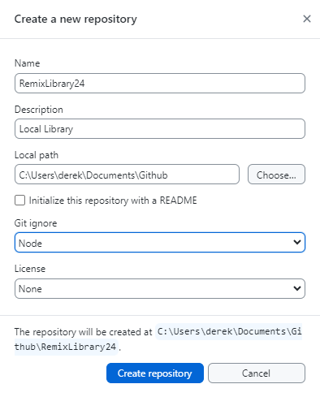

Publish the repository in its empty state.

Open the folder in a container visual studio code ctrl + shift + p.

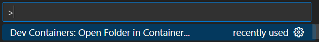

Browse to the folder RemixLibrary24 and open the folder RemixLibrary24 in the container visual studio code.

Add the configuration to the workspace.


Add a configuration file for node and typescript.

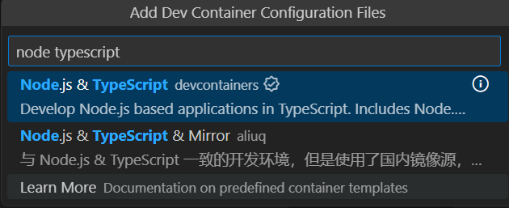

Choosse the node.js version to use as 22 bookworm.

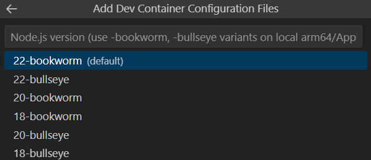

No extra features required.

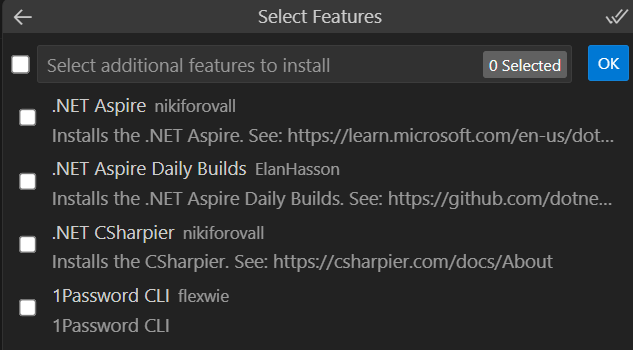

No optional settings required.


The library application will be developed on vite but the seed code will not need this.

# Seeding a database

Create a new folder named seed in the RemixLibrary24 folder.

> cd seed


The dependencies needed for running the seed code are listed in this package.json file.  copy this to the seed folder.

```json
{
  "name": "seed",
  "version": "1.0.0",
  "description": "",
  "main": "index.js",
  "type": "module",
  "scripts": {
    "test": "echo \"Error: no test specified\" && exit 1",
    "start": "nodemon app.js"
  },
  "keywords": [],
  "author": "",
  "license": "ISC",
  "dependencies": {
    "dotenv": "^16.4.5",
    "express": "^4.18.3",
    "mongodb": "^6.5.0",
    "mongoose": "^8.2.2",
    "nodemon": "^3.1.0"
  }
}
```

* [Dotenv](https://www.npmjs.com/package/dotenv) is used to load the environment variables from the .env file. 

* [Express](https://expressjs.com/) is a web application framework for Node.js.

* [Mongodb](https://www.npmjs.com/package/mongodb) is a MongoDB driver for Node.js.

* [Mongoose](https://www.npmjs.com/package/mongoose) is a MongoDB object modeling tool designed to work in an asynchronous environment.

* [Nodemon](https://www.npmjs.com/package/nodemon) is a tool that helps develop node.js based applications by automatically restarting the node application when file changes in the directory are detected.

To install the dependencies run the following command.

> npm install

Update a minor vesion of npm

> npm install -g npm@10.9.0

Add a file called env.txt to the seed folder.  This will be used to store copies of the environment variables for later reference and transference to github. (This is not the same as the .env file.) Don't leave this file in the repository longer than necessary as it contains sensitive information.

The details from the atlas database will be added later.

```code
DB_STRING=mongodb+srv://<details from atlas>/local_library
DB_STRING=mongodb://host.docker.internal:27017/local_library
```
Now create a file called ".env" in the seed folder.  This will be used to store the environment variables for the database.  This file will be added to the .gitignore file.

```code
DB_STRING=mongodb://host.docker.internal:27017/local_library
```
This file should only contain one database connection string at a time.  The connection used here is for a local database.  Note that the "host.docker.internal" is used in the string rather than "127.0.0.1" in order to gain access to the host.  The connection string for the database in the cloud will be added later.

Now add a config folder and in this a file called db.js.  This will be used to store the database connection string.

**config/db.js**
```javascript
import dotenv from 'dotenv';
import mongoose from 'mongoose';

dotenv.config()
const connectionString = process.env.DB_STRING
console.log("Connection String: " + connectionString);

const db = async () => {
    try {
        await mongoose.connect(connectionString, {
            autoIndex: true
        })
        console.log('Connected to Mongodb Atlas');} catch (error) {
        console.error(error);
    }
}
export default db;
```

This uses dotenv to read the connection string from the .env file.  The connection string is then used to connect to the database.  The connection string is printed to the console for debugging purposes.

The fuction db() is asynchronous and returns a promise.  The promise is resolved when the connection is made.  The promise is rejected if there is an error.  The promise is returned by the function.  However the use of [await](https://www.w3schools.com/js/js_async.asp) means that the function waits fro the promise to be resolved before continuing.

This module is exprted as the default export.  This means that the function can be imported into other modules using the following syntax.

```javascript
import db from './config/db.js';
```

## seeding the database

Now add a file called app.js.  This will be used to seed the database.


The seed/index.js code defines MongoDB schemas and models to represent authors, books, book instances, and genres in a library application. It also includes code to seed sample data into a MongoDB database for this library app.


Dotenv is needed to read the .env contents via the process.

**config.db.js**


For a local database running in docker it is important that port 27017 is available externally.

To access an application running on the local host from within a docker environment the **host.docker.internal** should be addressed rather than 127.0.0.1.

So a connection string for a local instance of mongodb with database named "local_library" and accessed from an application running on docker will be:

```javascript
DB_STRING=mongodb://host.docker.internal:27017/local_library
```
Create a file called index.js in the seed folder.  This will be used to seed the database.

The application in **index.js"** starts by importing required Node.js modules like express, mongoose, and a database connection module.

**index.js"**
```javascript
import express from 'express';
import db from './config/db.js'

import mongoose from 'mongoose';
const { Schema } = mongoose;

const app = express();
db(); // connection to database
```

It defines some empty arrays to hold IDs of created authors, books, and genres.

```javascript
var authors = [];
var genres  = [];
var books   = [];
```
It then defines [mongoose schemas](https://mongoosejs.com/docs/guide.html) for Author, Book, BookInstance, and Genre documents using the mongoose.Schema class.  This matches the structure of the documents in the local_library database illustrated in the diagram above.

```javascript
// Define the schema for an author
var AuthorSchema = new Schema(
    {
      first_name: {type: String, required: true, max: 100},
      family_name: {type: String, required: true, max: 100},
      date_of_birth: {type: Date},
      date_of_death: {type: Date},
    }
  );

  var BookSchema = new Schema(
    {
      title: {type: String, required: true},
      summary: {type: String, required: true},
      isbn: {type: String, required: true},
      author: {type: Schema.Types.ObjectId, ref: 'Author', required: true},
      genre: [{type: Schema.Types.ObjectId, ref: 'Genre'}]
    }
  );

  var BookInstanceSchema = new Schema(
    {
      book: { type: Schema.Types.ObjectId, ref: 'Book', required: true }, //reference to the associated book
      imprint: {type: String, required: true},
      status: {type: String, required: true, enum: ['Available', 'Maintenance', 'Loaned', 'Reserved'], default: 'Maintenance'},
      due_back: {type: Date, default: Date.now}
    }
  );

  var GenreSchema = new Schema(
    {
      name: {type: String, required: true}
    }
  );
```
The Author schema has fields for first name, last name, birth date, and death date.

The Book schema has fields like title, summary, ISBN, author reference, and genre references.

Tote the use of ref: to allow [references](https://mongoosejs.com/docs/api/schematype.html#SchemaType.prototype.ref()) to other models.

The BookInstance schema stores info like the associated Book, imprint, status, and due date.

The Genre schema just has a name field.

Mongoose models are created from these schemas like Author, Book, BookInstance, and Genre.

**index.js**
```javascript
// Create a model for the user schema
const Author = mongoose.model('Author', AuthorSchema);
const authorDoc = new Author();
const Book = mongoose.model('Book', BookSchema);
const BookInstance = mongoose.model('BookInstance',BookInstanceSchema);
const Genre = mongoose.model('Genre', GenreSchema);
```

Next, there are async functions defined to [save()](https://mongoosejs.com/docs/api/document.html#Document.prototype.save()) new instances of these models to the database and store their IDs in the arrays.

In this case I have used a simpler syntax for the promises.

So the function authorCreate() makes a new Author and saves it.

genreCreate() makes a new Genre.

bookCreate() makes a new Book.

And bookInstanceCreate() makes a BookInstance document.

**index.js**
```javascript
// code to seed database for local library

async function authorCreate(authors, first_name, family_name, d_birth, d_death) {
  if (d_birth == false) d_birth = null;
  if (d_death == false)  d_death = null;  
  let newAuthor = new Author({
    first_name: first_name,
    family_name: family_name,
    date_of_birth: d_birth,
    date_of_death: d_death
  });
  await newAuthor.save()
   .then( 
    user =>{console.log('Author created:', user._id);authors.push(user._id);console.log(authors)
    })
   .catch(err => console.error(err));
}

async function genreCreate(genres, name) {
  let newGenre = new Genre({ name: name });
  await newGenre.save()
  .then( user =>{console.log('Genre created:', user._id);genres.push(user._id);console.log(genres)})
  .catch(err => console.error(err));
}

async function bookCreate(books, title, summary, isbn , authors, genres) {
  if (genres == false) genres = null;
  let newBook = new Book({
    title: title,
    summary: summary,
    authors: authors,
    isbn: isbn,
    genres: genres
  });
  await newBook.save()
  .then( user =>{console.log('Book created:', user._id);books.push(user._id);console.log(books)})
  .catch(err => console.error(err));
}

async function bookInstanceCreate(book, imprint, status, due_back ) {
  if (due_back == false) due_back = null;
  if (status == false) status = 'Maintenance';
  let newBookInstance = new BookInstance ({
    book: book,
    imprint: imprint,
    status: status,
    due_back: due_back,
  });
  await newBookInstance.save()
  .then( user =>{console.log('Book Instance created:', user._id);})
  .catch(err => console.error(err));
}
```

Next a seed() function is defined that drops the existing collections (that will create empty colllections if they do not already exist), calls the create functions to seed sample data, and catches any errors.

**index.js**
```javascript
// seeding data
async function seed(){

await Book.collection.drop().then(() => { }).catch(() => { console.log('error dropping book collection') });  
await Author.collection.drop().then(() => { }).catch(() => { console.log('error dropping author collection') }); 
await BookInstance.collection.drop().then(() => { }).catch(() => { console.log('error dropping bookinstance collection')}); 
await Genre.collection.drop().then(() => { }).catch(() => { console.log('error dropping genre collection') }); 
```
Next the create functions are called to seed the database with sample data.

It is important that collections which are referenced by other collections are populated before the collections that reference them, so authorCreate() is called before bookCreate().

**index.js**
```javascript
await authorCreate(authors,"Patrick", "Rothfuss", "1973-06-06", false);
await authorCreate(authors,"Ben", "Bova", "1932-11-8", false);
await authorCreate(authors,"Isaac", "Asimov", "1920-01-02", "1992-04-06");
await authorCreate(authors,"Bob", "Billings", false, false);
await authorCreate(authors,"Jim", "Jones", "1971-12-16", false);

await genreCreate(genres, "Fantasy");
await genreCreate(genres, "Science Fiction");
await genreCreate(genres, "French Poetry");

await bookCreate(
  books,
  "The Name of the Wind (The Kingkiller Chronicle, #1)",
  "I have stolen princesses back from sleeping barrow kings. I burned down the town of Trebon. I have spent the night with Felurian and left with both my sanity and my life. I was expelled from the University at a younger age than most people are allowed in. I tread paths by moonlight that others fear to speak of during day. I have talked to Gods, loved women, and written songs that make the minstrels weep.",
  "9781473211896",
  [authors[0]],
  [genres[0]]
);

await bookCreate(
  books,
  "The Wise Man's Fear (The Kingkiller Chronicle, #2)",
  "Picking up the tale of Kvothe Kingkiller once again, we follow him into exile, into political intrigue, courtship, adventure, love and magic... and further along the path that has turned Kvothe, the mightiest magician of his age, a legend in his own time, into Kote, the unassuming pub landlord.",
  "9788401352836",
  [authors[0]],
  [genres[0]]
);

await bookCreate(
  books,
  "The Slow Regard of Silent Things (Kingkiller Chronicle)",
  "Deep below the University, there is a dark place. Few people know of it: a broken web of ancient passageways and abandoned rooms. A young woman lives there, tucked among the sprawling tunnels of the Underthing, snug in the heart of this forgotten place.",
  "9780756411336",
  [authors[0]],
  [genres[0]]
);

await bookCreate(
  books,
  "Apes and Angels",
  "Humankind headed out to the stars not for conquest, nor exploration, nor even for curiosity. Humans went to the stars in a desperate crusade to save intelligent life wherever they found it. A wave of death is spreading through the Milky Way galaxy, an expanding sphere of lethal gamma ...",
  "9780765379528",
  [authors[1]],
  [genres[1]]
);

await bookCreate(
  books,
  "Death Wave",
  "In Ben Bova's previous novel New Earth, Jordan Kell led the first human mission beyond the solar system. They discovered the ruins of an ancient alien civilization. But one alien AI survived, and it revealed to Jordan Kell that an explosion in the black hole at the heart of the Milky Way galaxy has created a wave of deadly radiation, expanding out from the core toward Earth. Unless the human race acts to save itself, all life on Earth will be wiped out...",
  "9780765379504",
  [authors[1]],
  [genres[1]]
);

await bookCreate(
  books,
  "Test Book 1",
  "Summary of test book 1", 
  "ISBN111111", 
  [authors[4],authors[3]], 
  [
    genres[0],
    genres[1]
  ]);

  await bookCreate(
  books,
  "Test Book 2",
  "Summary of test book 2",
  "ISBN222222",
  [authors[4]],
  [
    genres[0],
    genres[1]
  ]
);

await bookInstanceCreate(books[0], "London Gollancz, 2014.", "Available",false );
await bookInstanceCreate(books[1], " Gollancz, 2011.",  "Loaned","2020-06-06");
await bookInstanceCreate(books[2], " Gollancz, 2015.", false, false);
await bookInstanceCreate( 
  books[3],
  "New York Tom Doherty Associates, 2016.",
  "Available",
  false,
);
await bookInstanceCreate(
  books[3],
  "New York Tom Doherty Associates, 2016.",
  "Available",
  false,
);
await bookInstanceCreate(
  books[3],
  "New York Tom Doherty Associates, 2016.",
  "Available",
  false
);
await bookInstanceCreate(
  books[4],
  "New York, NY Tom Doherty Associates, LLC, 2015.",
  "Available",
  false
  
);
await bookInstanceCreate(
  books[4],
  "New York, NY Tom Doherty Associates, LLC, 2015.",
  "Maintenance",
  false,
);
await bookInstanceCreate(
  books[4],
  "New York, NY Tom Doherty Associates, LLC, 2015.",
  "Loaned",
  false
);
await bookInstanceCreate(books[0], "Imprint XXX2", false, false);
await bookInstanceCreate(books[1], "Imprint XXX3", false, false);

}
```
This completes the function seed().

Now the seed() function can be called to action the seeding process.

**index.js**
```javascript
seed();

app.listen(3000, () => {
    console.log('Server started on port 3000');
});
```

It is the normal pattern to provide the app with a port to listen on.  However in this case it is not strictly necessary as the app can be closed with CTRL+C as soon as the seed() function has completed.


This provides a way to populate a MongoDB database with some initial authors, genres, books, and book instances to work with in the library app. The create functions allow passing parameters to make customizable sample data.

So in summary, it defines MongoDB models, functions to easily generate sample data for them, and a seed process to initialize the database for a library app to have data to use right away.

## Using docker database from powershell

Provided docker desktop is running a new docker container can be created and run from powershell using [docker commands](https://docs.docker.com/get-started/docker_cheatsheet.pdf).

> docker pull mongodb/mongodb-community-server:latest

The docker pull command will pull an image from docker hub.  In this case this is the mongodb community edition.

```code
latest: Pulling from mongodb/mongodb-community-server
1ad8c9a48820: Download complete
cb3ba67a27ee: Download complete
6414378b6477: Download complete
9e76cc5bf612: Download complete
800c06661679: Download complete
4b22dcbdd565: Download complete
e22e1502765c: Download complete
258c8fd240ad: Download complete
c60691e353f0: Download complete
4f4fb700ef54: Already exists
3b0835278bd8: Download complete
Digest: sha256:f687619cd827704be8a78e28d89e4160a5faf405b8a097ec4360e61cd4700ad1
Status: Downloaded newer image for mongodb/mongodb-community-server:latest
docker.io/mongodb/mongodb-community-server:latest

What's next:
    View a summary of image vulnerabilities and recommendations → docker scout quickview mongodb/mongodb-community-server:latest
```

To run this image in a container:

> docker run --name mongodb -p 27017:27017 -d mongodb/mongodb-community-server:latest

The -p option allows port 27017 to be forwarded and accessed from the host.

```code
202e508603474f4122a5b02bee22591d9d2515d20ed27e701ec3b99261cc8fc9
```

To see what containers are running 

> docker container ls

In this case I had two containers running, one with the seed programme and one with the database.

```code
CONTAINER ID   IMAGE                                                           COMMAND                  CREATED         STATUS         PORTS                      NAMES
202e50860347   mongodb/mongodb-community-server:latest                         "python3 /usr/local/…"   4 minutes ago   Up 4 minutes   0.0.0.0:27017->27017/tcp   mongodb
30a026c7487a   mcr.microsoft.com/devcontainers/typescript-node:1-20-bullseye   "/bin/sh -c 'echo Co…"   2 hours ago     Up 2 minutes                              loving_wilbur
```

When you have finised interacting with the database.

> docker stop mongodb

List the containers still running:

> docker container ps

The mongodb container has closed.

```code
CONTAINER ID   IMAGE                                                           COMMAND                  CREATED       STATUS             PORTS     NAMES
30a026c7487a   mcr.microsoft.com/devcontainers/typescript-node:1-20-bullseye   "/bin/sh -c 'echo Co…"   4 hours ago   Up About an hour             loving_wilbur
```
To start mongodb back up does not need another run command as the container is already built.

> docker start mongodb

```code
mongodb
```
The container retains the data while it is stopped.

To close again

> docker stop mongodb

You can still use the start command to restart the container even when docker desktop has been closed and later reopened.

With the mongodb container running:

>cd seed
> npm run start

The seed programme will run and populate the database.

```bash
> seed@1.0.0 start
> nodemon app.js

[nodemon] 3.1.7
[nodemon] to restart at any time, enter `rs`
[nodemon] watching path(s): *.*
[nodemon] watching extensions: js,mjs,cjs,json
[nodemon] starting `node app.js index.js`
Connection String: mongodb://host.docker.internal:27017/local_library
Server started on port 3000
Connected to Mongodb Atlas
Author created: new ObjectId('673329d7d3bfde41981fe51b')
[ new ObjectId('673329d7d3bfde41981fe51b') ]
Author created: new ObjectId('673329d7d3bfde41981fe51d')
[
  new ObjectId('673329d7d3bfde41981fe51b'),
  new ObjectId('673329d7d3bfde41981fe51d')
]
Author created: new ObjectId('673329d7d3bfde41981fe51f')
[
  new ObjectId('673329d7d3bfde41981fe51b'),
  new ObjectId('673329d7d3bfde41981fe51d'),
  new ObjectId('673329d7d3bfde41981fe51f')
]
Author created: new ObjectId('673329d7d3bfde41981fe521')
[
  new ObjectId('673329d7d3bfde41981fe51b'),
  new ObjectId('673329d7d3bfde41981fe51d'),
  new ObjectId('673329d7d3bfde41981fe51f'),
  new ObjectId('673329d7d3bfde41981fe521')
]
Author created: new ObjectId('673329d7d3bfde41981fe523')
[
  new ObjectId('673329d7d3bfde41981fe51b'),
  new ObjectId('673329d7d3bfde41981fe51d'),
  new ObjectId('673329d7d3bfde41981fe51f'),
  new ObjectId('673329d7d3bfde41981fe521'),
  new ObjectId('673329d7d3bfde41981fe523')
]
Genre created: new ObjectId('673329d7d3bfde41981fe525')
[ new ObjectId('673329d7d3bfde41981fe525') ]
Genre created: new ObjectId('673329d7d3bfde41981fe527')
[
  new ObjectId('673329d7d3bfde41981fe525'),
  new ObjectId('673329d7d3bfde41981fe527')
]
Genre created: new ObjectId('673329d7d3bfde41981fe529')
[
  new ObjectId('673329d7d3bfde41981fe525'),
  new ObjectId('673329d7d3bfde41981fe527'),
  new ObjectId('673329d7d3bfde41981fe529')
]
Book created: new ObjectId('673329d7d3bfde41981fe52b')
[ new ObjectId('673329d7d3bfde41981fe52b') ]
Book created: new ObjectId('673329d7d3bfde41981fe52d')
[
  new ObjectId('673329d7d3bfde41981fe52b'),
  new ObjectId('673329d7d3bfde41981fe52d')
]
Book created: new ObjectId('673329d8d3bfde41981fe52f')
[
  new ObjectId('673329d7d3bfde41981fe52b'),
  new ObjectId('673329d7d3bfde41981fe52d'),
  new ObjectId('673329d8d3bfde41981fe52f')
]
Book created: new ObjectId('673329d8d3bfde41981fe531')
[
  new ObjectId('673329d7d3bfde41981fe52b'),
  new ObjectId('673329d7d3bfde41981fe52d'),
  new ObjectId('673329d8d3bfde41981fe52f'),
  new ObjectId('673329d8d3bfde41981fe531')
]
Book created: new ObjectId('673329d8d3bfde41981fe533')
[
  new ObjectId('673329d7d3bfde41981fe52b'),
  new ObjectId('673329d7d3bfde41981fe52d'),
  new ObjectId('673329d8d3bfde41981fe52f'),
  new ObjectId('673329d8d3bfde41981fe531'),
  new ObjectId('673329d8d3bfde41981fe533')
]
Book created: new ObjectId('673329d8d3bfde41981fe535')
[
  new ObjectId('673329d7d3bfde41981fe52b'),
  new ObjectId('673329d7d3bfde41981fe52d'),
  new ObjectId('673329d8d3bfde41981fe52f'),
  new ObjectId('673329d8d3bfde41981fe531'),
  new ObjectId('673329d8d3bfde41981fe533'),
  new ObjectId('673329d8d3bfde41981fe535')
]
Book created: new ObjectId('673329d8d3bfde41981fe537')
[
  new ObjectId('673329d7d3bfde41981fe52b'),
  new ObjectId('673329d7d3bfde41981fe52d'),
  new ObjectId('673329d8d3bfde41981fe52f'),
  new ObjectId('673329d8d3bfde41981fe531'),
  new ObjectId('673329d8d3bfde41981fe533'),
  new ObjectId('673329d8d3bfde41981fe535'),
  new ObjectId('673329d8d3bfde41981fe537')
]
Book Instance created: new ObjectId('673329d8d3bfde41981fe539')
Book Instance created: new ObjectId('673329d8d3bfde41981fe53b')
Book Instance created: new ObjectId('673329d8d3bfde41981fe53d')
Book Instance created: new ObjectId('673329d8d3bfde41981fe53f')
Book Instance created: new ObjectId('673329d8d3bfde41981fe541')
Book Instance created: new ObjectId('673329d8d3bfde41981fe543')
Book Instance created: new ObjectId('673329d8d3bfde41981fe545')
Book Instance created: new ObjectId('673329d8d3bfde41981fe547')
Book Instance created: new ObjectId('673329d8d3bfde41981fe549')
Book Instance created: new ObjectId('673329d8d3bfde41981fe54b')
Book Instance created: new ObjectId('673329d8d3bfde41981fe54d')
```
> CTRL + C

Close the mongodb container ready to try a different approach.

> docker stop mongodb

Close powershell.

## Working with mongodb in a VSC development container

If you wish you can run a development container opening with node and mongo.

This works fine and allows you to peek in to the database to inspect.

Open a new window of visual studio code and install the mongoDB for VS Code extension.

[mongoforVSC](images/mongoforVSC.png)

Now proceed as normal to create a development container starting by opening a folder in a container.  This time I won't bother to make a github repository as this local container is easily recreated on another machine.


Locate the configuration files in the workspace.

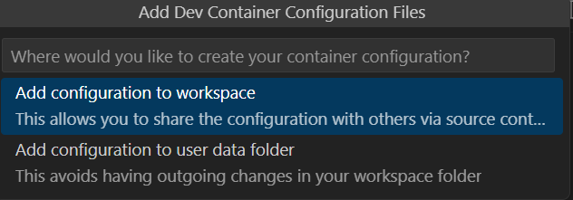

Select a node and mongo container.

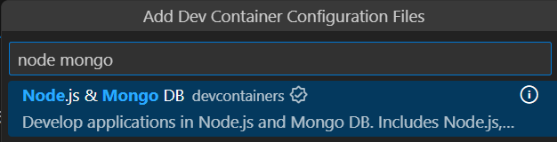

Dont select and extra or optional items and proceed to let the container files download.

Wait for the container to open in docker desktop.

From the mongo extension menu select connect to a database.

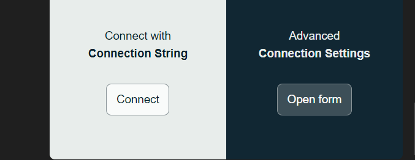

On first connection you will need see the default databases.

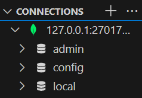

Now return to the seed folder in a separate VSC window and run the application.

> npm run start

The connection string now accesses the local mongodb container running under visual studio code.

After seeding the database you can inspect the database in the mongo extension.

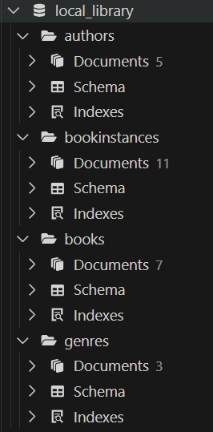

You can look at the collections and documents to see details of the data.


The details of the selected document can be viewed in the editor.

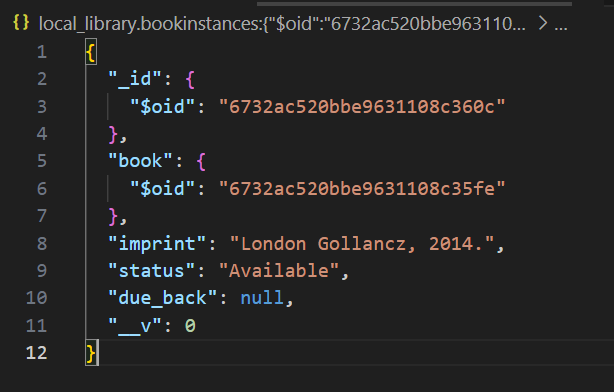

Note the selectod item has and _id field which is a unique identifier.

Where references are made to other documents the _id field is used.

Take some time to look at the data in the database and familiarise yourself with the structure of the data.

## Working with a mongodb in and Atlas online cluster

Provided you are not prevented b a firewall you can access a remote database atlas cluster.

Best approach is to develop locally then chang the connection string to allow a real cluster to be accessed.

You will need to ensure that the IP adress from which you access the atlas cluster is in the site white list.  It is a security feature to limit the access to listed IPs.

If you have a dynamic local IP you can set the white list to "my current IP".


