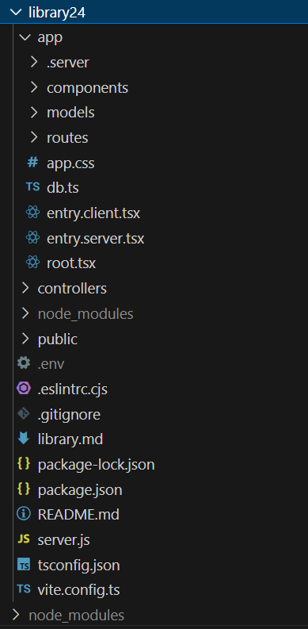

# Setup to read Database

In this section the remix framework will be set up to read details from the local_library database which was seeded in the previous section.

Make sure that docker and the database are running in the background.

To run the database open powershell and start the database with:

> docker start mongodb

Check that the container starts in docker desktop.

## Before Starting

**The instructions to [get started with remix](https://remix.run/docs/en/main/start/quickstart) are online, but if you run these directly they will not install all the latest versions, so read through the process without following the steps, and then we will take a shortcut.**

## Getting Started

At this point you should have a folder named 'RemixLibrary' with a devcontainer which opens to node 22 when the folder is opened in VS Code.  This has a folder "seed" with code which resets the database running in the mongodb container to the default contents on issue of:

>npm run start

When the seeding has completed you can close the server.

> CTRL + C

Within the root folder of the project. create a new folder named library24.

Through the next sections the folder will be populated with the files which make up the application.




### vite configuration file

Add a configuration file for vite.

**vite.config.ts**
```javascript
import { vitePlugin as remix } from "@remix-run/dev";
import { installGlobals } from "@remix-run/node";
import { defineConfig } from "vite";
import tsconfigPaths from "vite-tsconfig-paths";
import svgLoader from 'vite-svg-loader';
import react from '@vitejs/plugin-react';

installGlobals();

export default defineConfig({
  plugins: [remix({
    /* appDirectory: "app",*/
    /* buildDirectory: "build", */
    future: {
      /* any enabled future flags to add */
    },
  }),
  react({ include: /\.(mdx|js|jsx|ts|tsx)$/ }),
  tsconfigPaths(), svgLoader()],
  server: {
    hmr: true,
    fs: {
      // Restrict files that could be served by Vite's dev server.  Accessing
      // files outside this directory list that aren't imported from an allowed
      // file will result in a 403.  Both directories and files can be provided.
      // If you're comfortable with Vite's dev server making any file within the
      // project root available, you can remove this option.  See more:
      // https://vitejs.dev/config/server-options.html#server-fs-allow
      allow: ["app", "node_modules"]
    }
  }
});
```
The import of vitePlugin as remix is the key to getting remix to work with vite.

The exported function "defineConfig" is the configuration for vite includes a list of plugins using the imported functions. The plugins added are:

1. remix - the remix plugin for vite
2. react - the react plugin for vite listing all the files that are react files.
3. tsconfigPaths - this allows the use of relative paths in the code.
4. svgLoader - this allows the use of svg files in the project.

The server section of the configuration is used to allow the server to serve files from the app folder.

### typescript configuration file

Next create a new file named "tsconfig.json" in the root folder of the project.

**tsconfig.json**

```json
{
  "include": [
    "**/*.ts",
    "**/*.tsx",
    "**/.server/**/*.ts",
    "**/.server/**/*.tsx",
    "**/.client/**/*.ts",
    "**/.client/**/*.tsx"
  ],
  "compilerOptions": {
    "lib": ["DOM", "DOM.Iterable", "ES2022"],
    "types": ["@remix-run/node", "vite/client"],
    "isolatedModules": true,
    "esModuleInterop": true,
    "jsx": "react-jsx",
    "module": "ESNext",
    "moduleResolution": "Bundler",
    "resolveJsonModule": true,
    "target": "ES2022",
    "strict": true,
    "allowJs": true,
    "skipLibCheck": true,
    "forceConsistentCasingInFileNames": true,
    "baseUrl": ".",
    "paths": {
      "~/*": ["./app/*"]
    },

    // Vite takes care of building everything, not tsc.
    "noEmit": true
  }
}
```
This is the configuration file for typescript.

The include section lists all the files that typescript.

The compilerOptions section is the configuration for typescript.

The "types" section is the list of types that are used in the project.

The "jsx" section allows the use of react style jsx syntax in the code.  This is the default for remix since remix is based on react.

The "target" section is the version of javascript that is used in the project.  This determines the browser compatibility of the code.

The "paths" section is used to allow the use of relative paths in the code.  This is used to allow the use of the "~" symbol in the code.

Note that the "noEmit" is set to true.  This is because vite takes care of building the project.

### The server

Within the root folder of the project create a new file named "server.js".  

**server.js**
```javascript
import { createRequestHandler } from "@remix-run/express";
import { installGlobals } from "@remix-run/node";
import compression from "compression";
import express from "express";
import morgan from "morgan";


installGlobals();

const viteDevServer =
  process.env.NODE_ENV === "production"
    ? undefined
    : await import("vite").then((vite) =>
        vite.createServer({
          server: { middlewareMode: true },
        })
      );

const remixHandler = createRequestHandler({
  build: viteDevServer
    ? () => viteDevServer.ssrLoadModule("virtual:remix/server-build")
    : await import("./build/server/index.js"),
});

const app = express();

app.use(compression());

// http://expressjs.com/en/advanced/best-practice-security.html#at-a-minimum-disable-x-powered-by-header
app.disable("x-powered-by");

// handle asset requests
if (viteDevServer) {
  app.use(viteDevServer.middlewares);
} else {
  // Vite fingerprints its assets so we can cache forever.
  app.use(
    "/assets",
    express.static("build/client/assets", { immutable: true, maxAge: "1y" })
  );
}

// Everything else (like favicon.ico) is cached for an hour. You may want to be
// more aggressive with this caching.
app.use(express.static("build/client", { maxAge: "1h" }));

app.use(morgan("tiny"));

// handle SSR requests
app.all("*", remixHandler);

const port = process.env.PORT || 3000;
app.listen(port, () =>
  console.log(`Express server listening at http://localhost:${port}`)
);
```
This is the server file for the project.  It is used to start the server which will listen for requests.  

This uses:
    [express](https://expressjs.com/) which is a web framework for node.js.
    [morgan](https://www.npmjs.com/package/morgan) which is a logging middleware for express.
    [compression](https://www.npmjs.com/package/compression) which is a middleware for express that compresses the response body.

The constant "viteDevServer" is used to check if the project is in development mode.  If it is in development mode then the vite server is used to serve the files.  If it is not in development mode then the files are served from the build folder.

The constant "app" is the express app that is used to handle the requests.  This uses express to serve the files.

### package.json

The package.json file is used to store the dependencies for the project.  This is used to install the dependencies for the project.

The package json here includes current dependencies and some which will be used at a later stage.

The "scripts" section is used to store the scripts that are used to run the project.  This includes the scripts for starting the project, building the project, and running the tests.

```json
{
  "name": "library24",
  "private": true,
  "sideEffects": false,
  "type": "module",
  "scripts": {
    "dev": "remix vite:dev --host",
    "build": "remix vite:build",
    "start": "remix-serve ./build/server/index.js",
    "lint": "eslint --ignore-path .gitignore --cache --cache-location ./node_modules/.cache/eslint .",
    "typecheck": "tsc"
  },
  "dependencies": {
    "@popperjs/core": "^2.11.8",
    "@remix-run/express": "^2.13.0",
    "@remix-run/node": "^2.13.1",
    "@remix-run/react": "^2.13.1",
    "@remix-run/serve": "^2.13.1",
    "@remix-validated-form/with-zod": "^2.0.7",
    "@rvf/remix": "^6.0.0",
    "@rvf/zod": "^6.0.0",
    "@types/mongoose": "^5.11.97",
    "@vitejs/plugin-react": "^4.2.1",
    "bootstrap": "^5.3.3",
    "compression": "^1.7.4",
    "dotenv": "^16.4.5",
    "express": "^4.18.2",
    "isbot": "^4.4.0",
    "luxon": "^3.4.4",
    "match-sorter": "^6.3.1",
    "mongodb": "^6.5.0",
    "mongoose": "^8.2.2",
    "morgan": "^1.10.0",
    "react": "^18.2.0",
    "react-bootstrap": "^2.10.2",
    "react-dom": "^18.2.0",
    "sort-by": "^0.0.2",
    "tiny-invariant": "^1.3.1",
    "zod": "^3.23.4",
    "zod-form-data": "^2.0.2"
  },
  "devDependencies": {
    "@remix-run/dev": "^2.13.1",
    "@types/compression": "^1.7.5",
    "@types/express": "^4.17.20",
    "@types/morgan": "^1.9.9",
    "@types/react": "^18.2.20",
    "@types/react-dom": "^18.2.7",
    "@typescript-eslint/eslint-plugin": "^8.10.0",
    "@typescript-eslint/parser": "^8.10.0",
    "cross-env": "^7.0.3",
    "eslint": "^9.13.0",
    "eslint-import-resolver-typescript": "^3.6.1",
    "eslint-plugin-import": "^2.28.1",
    "eslint-plugin-jsx-a11y": "^6.7.1",
    "eslint-plugin-react": "^7.33.2",
    "eslint-plugin-react-hooks": "^5.0.0",
    "typescript": "^5.1.6",
    "vite": "^5.1.6",
    "vite-svg-loader": "^5.1.0",
    "vite-tsconfig-paths": "^4.2.1"
  },
  "engines": {
    "node": ">=20.18.0"
  },
  "description": "📖 See the [Remix docs](https://remix.run/docs) and the [Remix Vite docs](https://remix.run/docs/en/main/future/vite) for details on supported features.",
  "version": "1.0.0",
  "main": "server.js",
  "keywords": [],
  "author": "",
  "license": "ISC"
}
```

The package-locl.json file will be gererated when the files are installed.

> npm install


### github utility file

Add a ".gitnore" file with simple contents:

**.gitnore**
```bash
node_modules

/.cache
/build
.env
```
This file is used to tell git to ignore the files in the folder.  This is used to prevent the files from being uploaded to github.In particular the ,env file is used to store the environment variables for the project which will include the database connection string (with password).  This file is not added to git because it contains sensitive information.

### .env file

Add the ".env" file with the following contents:

**.env**
```bash
DB_STRING=mongodb://host.docker.internal:27017/local_library
```
This is the connection string for the local database.  This can be swapped out for a cloud based database when the project is deployed.

### Linting configuration

Add a ".eslintrc.cjs" file with the following contents:
**.eslintrc.cjs**
```javascript
/**
 * This is intended to be a basic starting point for linting in your app.
 * It relies on recommended configs out of the box for simplicity, but you can
 * and should modify this configuration to best suit your team's needs.
 */

/** @type {import('eslint').Linter.Config} */
module.exports = {
  root: true,
  parserOptions: {
    ecmaVersion: "latest",
    sourceType: "module",
    ecmaFeatures: {
      jsx: true,
    },
  },
  env: {
    browser: true,
    commonjs: true,
    es6: true,
  },

  // Base config
  extends: ["eslint:recommended"],

  overrides: [
    // React
    {
      files: ["**/*.{js,jsx,ts,tsx}"],
      plugins: ["react", "jsx-a11y"],
      extends: [
        "plugin:react/recommended",
        "plugin:react/jsx-runtime",
        "plugin:react-hooks/recommended",
        "plugin:jsx-a11y/recommended",
      ],
      settings: {
        react: {
          version: "detect",
        },
        formComponents: ["Form"],
        linkComponents: [
          { name: "Link", linkAttribute: "to" },
          { name: "NavLink", linkAttribute: "to" },
        ],
        "import/resolver": {
          typescript: {},
        },
      },
    },

    // Typescript
    {
      files: ["**/*.{ts,tsx}"],
      plugins: ["@typescript-eslint", "import"],
      parser: "@typescript-eslint/parser",
      settings: {
        "import/internal-regex": "^~/",
        "import/resolver": {
          node: {
            extensions: [".ts", ".tsx"],
          },
          typescript: {
            alwaysTryTypes: true,
          },
        },
      },
      extends: [
        "plugin:@typescript-eslint/recommended",
        "plugin:import/recommended",
        "plugin:import/typescript",
      ],
    },

    // Node
    {
      files: [".eslintrc.cjs", "server.js"],
      env: {
        node: true,
      },
    },
  ],
};
```
This is the [eslint](https://typescript-eslint.io/) configuration file.  This is used to configure the eslint rules for the project.  This is used to ensure that the code is consistent and follows the best practices.

## Folder Structure

Now add the following folders to the library24 folder:
- app
- public

The app folder will contain the code for the application.  This could have been created by running a command in the terminal to invoke a template, but by adding it manually you ensure that the version is the same as the one used in the tutorial.

In the app folder add the following folders:

- .server
- components
- models
- routes


### Server Folder


To the **".server"** folder add the following file:

**auth.ts**

```javascript
// empty file in structure suggested at https://remix.run/docs/en/main/future/vite
```

This is an empty file in the structure suggested by remix.  Although it is not being use there is a [web authentication](https://remix.run/resources/remix-auth-webauthn-strategy) strategy within the remix framework.  But I will not discuss this here.

### Components Folder

The **components** folder can be left empty for now.  It will be used to store the components for the application.

### Models Folder

The **models** folder will contain the models for the application.  This will be used to define the schema for the database and as such should reflect the schema which was created in the previous section when the database was seeded.


Create the following empty files in the models folder (these will be populated later):

* **author.ts**
* **book.ts**
* **bookinstance.ts**
* **genre.ts**

### Routes Folder

Create the following empty files in the **routes** folder (these will be populated later):

* **_index.tsx**
* **catalog._index.tsx**
* **catalog.authors.tsx**
* **catalog.books.tsx**
* **catalog.genres.tsx**
* **catalog.instances.tsx**


## Key files in the app folder

The following files should be added to the app folder to provide the basic structure and functionality for the application.

### Root component

This is the root component for the application.  It is the first component that is rendered when the application is loaded. 

**root.tsx**

```javascript
//import {redirect } from "@remix-run/node";
import { Container, Row, Col } from 'react-bootstrap';
import Card from 'react-bootstrap/Card';

import {
  Links,
  Meta,
  NavLink,
  Outlet,
  Scripts,
  ScrollRestoration,
} from "@remix-run/react";

import type { MetaFunction } from "@remix-run/node";
// existing imports

import "./app.css"; // includes bootstrap

export const meta: MetaFunction = () => {
  return [
    { title: "Local Library" },
    {
      property: "og:title",
      content: "Very cool app",
    },
    {
      name: "description",
      content: "Acess local library",
    },
  ];
};


export default function App() {

  const retrieve = [
    ['/', 'home'],
    ['/catalog/', 'Catalog'],
    ['/catalog/books/', 'All books'],
    ['/catalog/authors/', 'All authors'],
    ['/catalog/genres/', 'All genres'],
    ['/catalog/instances/', 'All book-instances']

  ]

  return (
    <html lang="en">
      <head>
        <Meta />
        <Links />
      </head>
      <body>
        {/* comments in JSX are in braces  */}
        <Container fluid="md">
          <Row >
            <Col xs={3} >
              <h1>Local Library</h1>
              <Card className="text-left" border="primary">
                <Card.Body>
                  <ul>
                    <nav>
                      {retrieve.map((retriever) => (
                        <li key={retriever[1]}>
                          <NavLink
                            className={({ isActive, isPending }) =>
                              isActive
                                ? "active" : isPending
                                  ? "pending" : ""
                            }
                            to={retriever[0]}
                          >
                            {retriever[1]}
                          </NavLink>
                        </li>
                      ))}
                    </nav>
                  </ul>
                </Card.Body>
              </Card>
            </ Col>

            <Col >
              <Outlet />
              <ScrollRestoration />
              <Scripts />
            </Col>
          </Row>
        </Container>
      </body>
    </html>
  );
}
```


At the top of the file the required resources are imported.  These include the react-bootstrap components, the Remix components, the Remix meta function, and the app stylesheet.

React bootstrap is used to provide the layout for the application to be consistent with our earlier react applications.  

**root.tsx (extract)**
```javascript
import { Container, Row, Col } from 'react-bootstrap';
import Card from 'react-bootstrap/Card';

import {
  Links,
  Meta,
  NavLink,
  Outlet,
  Scripts,
  ScrollRestoration,
} from "@remix-run/react";

import type { MetaFunction } from "@remix-run/node";
// existing imports

import "./app.css"; // includes bootstrap
```

Next a **meta** function is used to set the title and description for the application.  This is used by search engines to display the application in search results. The values here can be edited to suit your choice.

**root.tsx (extract)**
```javascript
export const meta: MetaFunction = () => {
  return [
    { title: "Local Library" },
    {
      property: "og:title",
      content: "Very cool app",
    },
    {
      name: "description",
      content: "Acess local library",
    },
  ];
};
```

The **App** function is the root component for the application.  It is the first component that is rendered when the application is loaded.  At the start of this a constant array is used to provide the links to the different pages of the application.  This is used to provide the navigation links.  

As the application is being developed the links will be added (or uncommented) to the array.  This will allow the application to be developed in a modular way.

A starting point would be just the home page and the catalog page.  The catalog page will be used to display the list of books, authors, genres and book instances.

**root.tsx (extract)**
```javascript
export default function App() {

  const retrieve = [
    ['/', 'home'],
    ['/catalog/', 'Catalog']
//    ['/catalog/books/', 'All books'],
//    ['/catalog/authors/', 'All authors'],
//    ['/catalog/genres/', 'All genres'],
//    ['/catalog/instances/', 'All book-instances']

  ]
 ``` 
Notice that the links which are provided in an array match the routes that are provided in the **app/routes** folder, where the naming convention is that an underscore denotes a privat file and the ```.``` stands in place of ```/```.  The route files do not occupy a nested file structure in the way that the array of routes might suggest/.

The route files which mach the array are as follows:
  
*  **_index.tsx**
*  **catalog._index.tsx**
*  **catalog.authors.tsx**
*  **catalog.books.tsx**
*  **catalog.genres.tsx**
*  **catalog.instances.tsx**

The file conventions for the route file naming ar described in the [Remix documentation](https://remix.run/docs/en/v1/guides/routing#index-routes).

 The **App()** function returns the jsx for the application.  The jsx is built using the react-bootstrap components.  
    The **Container** component is used to provide a fluid layout for the application.  
    The **Row** component is used to separate areas for links and responss display.  
    The **Col** component is used with bootstrap sizing to control the responsive break points of the layout.  
    The **Card** component is used to provide a clear demarcation of the link information on the page.  
    The **Card.Body** component is used contain the card contents which include  **ul** component is used to provide an unordered list of **nav** components within which the elements of the "retrieve" array are mapped into  **NavLink** components.

**root.tsx (extract)**
```javascript
    return (
<html lang="en">
    <head>
    <Meta />
    <Links />
    </head>
    <body>
    {/* comments in JSX are in braces  */}
    <Container fluid="md">
        <Row >
        <Col xs={3} >
            <h1>Local Library</h1>
            <Card className="text-left" border="primary">
            <Card.Body>
                <ul>
                <nav>
                    {retrieve.map((retriever) => (
                    <li key={retriever[1]}>
                        <NavLink
                        className={({ isActive, isPending }) =>
                            isActive
                            ? "active" : isPending
                                ? "pending" : ""
                        }
                        to={retriever[0]}
                        >
                        {retriever[1]}
                        </NavLink>
                    </li>
                    ))}
                </nav>
                </ul>
            </Card.Body>
            </Card>
        </ Col>
```
The second **Col** component is used to provide an area where the result of database interactions will be displayed.
The **Outlet** component is used to provide a target for the output to be rendered into.  

**root.tsx (extract)**
```javascript
            <Col >
              <Outlet />
              <ScrollRestoration />
              <Scripts />
            </Col>
          </Row>
        </Container>
      </body>
    </html>
  );
}
```


### Client and Server Entry Points

The two files entry.client .tsx and entry.server.tsx are used to provide the entry points for the application.  The entry.client.tsx file is used to provide the client side functionality for the application.  The entry.server.tsx file is used to provide the server side functionality for the application.  This ensures that code which is only required on the server side (and may include passwords and sensitive data) is not included in the client side code.

These two files are standard Remix files and do not require any modification.  Add them to the project.

**entry.client.tsx**
```javascript
/**
 * By default, Remix will handle hydrating your app on the client for you.
 * You are free to delete this file if you'd like to, but if you ever want it revealed again, you can run `npx remix reveal` ✨
 * For more information, see https://remix.run/file-conventions/entry.client
 */

import { RemixBrowser } from "@remix-run/react";
import { startTransition, StrictMode } from "react";
import { hydrateRoot } from "react-dom/client";
import "bootstrap/dist/css/bootstrap.min.css"; 

startTransition(() => {
  hydrateRoot(
    document,
    <StrictMode>
      <RemixBrowser />
    </StrictMode>
  );
});

```

And also:

**entry.server.tsx**
```javascript
/**
 * By default, Remix will handle generating the HTTP Response for you.
 * You are free to delete this file if you'd like to, but if you ever want it revealed again, you can run `npx remix reveal` ✨
 * For more information, see https://remix.run/file-conventions/entry.server
 */

import { PassThrough } from "node:stream";

import type { AppLoadContext, EntryContext } from "@remix-run/node";
import { createReadableStreamFromReadable } from "@remix-run/node";
import { RemixServer } from "@remix-run/react";
import { isbot } from "isbot";
import { renderToPipeableStream } from "react-dom/server";

const ABORT_DELAY = 5_000;

export default function handleRequest(
  request: Request,
  responseStatusCode: number,
  responseHeaders: Headers,
  remixContext: EntryContext,
  // This is ignored so we can keep it in the template for visibility.  Feel
  // free to delete this parameter in your app if you're not using it!
  // eslint-disable-next-line @typescript-eslint/no-unused-vars
  loadContext: AppLoadContext
) {
  return isbot(request.headers.get("user-agent") || "")
    ? handleBotRequest(
        request,
        responseStatusCode,
        responseHeaders,
        remixContext
      )
    : handleBrowserRequest(
        request,
        responseStatusCode,
        responseHeaders,
        remixContext
      );
}

function handleBotRequest(
  request: Request,
  responseStatusCode: number,
  responseHeaders: Headers,
  remixContext: EntryContext
) {
  return new Promise((resolve, reject) => {
    let shellRendered = false;
    const { pipe, abort } = renderToPipeableStream(
      <RemixServer
        context={remixContext}
        url={request.url}
        abortDelay={ABORT_DELAY}
      />,
      {
        onAllReady() {
          shellRendered = true;
          const body = new PassThrough();
          const stream = createReadableStreamFromReadable(body);

          responseHeaders.set("Content-Type", "text/html");

          resolve(
            new Response(stream, {
              headers: responseHeaders,
              status: responseStatusCode,
            })
          );

          pipe(body);
        },
        onShellError(error: unknown) {
          reject(error);
        },
        onError(error: unknown) {
          responseStatusCode = 500;
          // Log streaming rendering errors from inside the shell.  Don't log
          // errors encountered during initial shell rendering since they'll
          // reject and get logged in handleDocumentRequest.
          if (shellRendered) {
            console.error(error);
          }
        },
      }
    );

    setTimeout(abort, ABORT_DELAY);
  });
}

function handleBrowserRequest(
  request: Request,
  responseStatusCode: number,
  responseHeaders: Headers,
  remixContext: EntryContext
) {
  return new Promise((resolve, reject) => {
    let shellRendered = false;
    const { pipe, abort } = renderToPipeableStream(
      <RemixServer
        context={remixContext}
        url={request.url}
        abortDelay={ABORT_DELAY}
      />,
      {
        onShellReady() {
          shellRendered = true;
          const body = new PassThrough();
          const stream = createReadableStreamFromReadable(body);

          responseHeaders.set("Content-Type", "text/html");

          resolve(
            new Response(stream, {
              headers: responseHeaders,
              status: responseStatusCode,
            })
          );

          pipe(body);
        },
        onShellError(error: unknown) {
          reject(error);
        },
        onError(error: unknown) {
          responseStatusCode = 500;
          // Log streaming rendering errors from inside the shell.  Don't log
          // errors encountered during initial shell rendering since they'll
          // reject and get logged in handleDocumentRequest.
          if (shellRendered) {
            console.error(error);
          }
        },
      }
    );

    setTimeout(abort, ABORT_DELAY);
  });
}

import db from './db';     
db(); // connection to database
```
 Note that the entry.server.tsx file is used to connect to the database.

### Reading the environment variables

 The details of the constant function db are in the file **db.ts** which is the next file to be created.

 **db.ts**
 ```javascript
import dotenv from 'dotenv';
import mongoose from 'mongoose';

dotenv.config()
// eslint-disable-next-line no-undef
const connectionString:string = process.env.DB_STRING ?? "no connection string";
console.log(connectionString);

const db = async () => {
    try {
        await mongoose.connect(connectionString!, {
            autoIndex: true
        })
        console.log('Connected to Mongodb Database');} catch (error) {
        console.error(error);
    }
}
export default db;
```
[Dotenv](https://www.npmjs.com/package/dotenv) is used to load environment variables from a .env file into process.env.
[Mongoose](https://www.npmjs.com/package/mongoose) is used to connect to the database.
The connection string is loaded from the .env file.
The connection to the database is asynchronous and returns a promise.  The [async/await](https://www.w3schools.com/js/js_async.asp) syntax is used to handle the promise.
A console.log statement is used to print the connection string to the console for debugging purposes and to check that the connection string is loaded from the .env file. This should be removed before deployment.

### Stylesheet

The inal file needed is the **app.css** file  supports the appearance of the application.

**app.css**
```javascript

html {
  box-sizing: border-box;
}
*,
*:before,
*:after {
  box-sizing: inherit;
}

body {
  font-family: -apple-system, BlinkMacSystemFont, "Segoe UI", "Roboto", "Oxygen",
    "Ubuntu", "Cantarell", "Fira Sans", "Droid Sans", "Helvetica Neue",
    sans-serif;
  -webkit-font-smoothing: antialiased;
  -moz-osx-font-smoothing: grayscale;
}

code {
  font-family: source-code-pro, Menlo, Monaco, Consolas, "Courier New",
    monospace;
}

html,
body {
  height: 100%;
  margin: 0;
  line-height: 1.5;
  color: #121212;
}
textarea,
input,
button {
  font-size: 1rem;
  font-family: inherit;
  border: none;
  border-radius: 8px;
  padding: 0.5rem 0.75rem;
  box-shadow: 0 0px 1px hsla(0, 0%, 0%, 0.2), 0 1px 2px hsla(0, 0%, 0%, 0.2);
  background-color: white;
  line-height: 1.5;
  margin: 0;
}
button {
  color: #3992ff;
  font-weight: 500;
}

textarea:hover,
input:hover,
button:hover {
  box-shadow: 0 0px 1px hsla(0, 0%, 0%, 0.6), 0 1px 2px hsla(0, 0%, 0%, 0.2);
}

button:active {
  box-shadow: 0 0px 1px hsla(0, 0%, 0%, 0.4);
  transform: translateY(1px);
}

#contact h1 {
  display: flex;
  align-items: flex-start;
  gap: 1rem;
}
#contact h1 form {
  display: flex;
  align-items: center;
  margin-top: 0.25rem;
}
#contact h1 form button {
  box-shadow: none;
  font-size: 1.5rem;
  font-weight: 400;
  padding: 0;
}
#contact h1 form button[value="true"] {
  color: #a4a4a4;
}
#contact h1 form button[value="true"]:hover,
#contact h1 form button[value="false"] {
  color: #eeb004;
}

form[action$="destroy"] button {
  color: #f44250;
}

.sr-only {
  position: absolute;
  width: 1px;
  height: 1px;
  padding: 0;
  margin: -1px;
  overflow: hidden;
  clip: rect(0, 0, 0, 0);
  white-space: nowrap;
  border-width: 0;
}

body {
  display: flex;
  height: 100%;
  width: 100%;
}

#sidebar {
  width: 22rem;
  background-color: #f7f7f7;
  border-right: solid 1px #e3e3e3;
  display: flex;
  flex-direction: column;
}

#sidebar > * {
  padding-left: 2rem;
  padding-right: 2rem;
}

#sidebar h1 {
  font-size: 1rem;
  font-weight: 500;
  display: flex;
  align-items: center;
  margin: 0;
  padding: 1rem 2rem;
  border-top: 1px solid #e3e3e3;
  order: 1;
  line-height: 1;
}


#sidebar > div {
  display: flex;
  align-items: center;
  gap: 0.5rem;
  padding-top: 1rem;
  padding-bottom: 1rem;
  border-bottom: 1px solid #e3e3e3;
}

#sidebar > div form {
  position: relative;
}

#sidebar > div form input[type="search"] {
  box-sizing: border-box;
  width: 100%;
  padding-left: 2rem;
  background-image: url("data:image/svg+xml,%3Csvg xmlns='http://www.w3.org/2000/svg' class='h-6 w-6' fill='none' viewBox='0 0 24 24' stroke='%23999' stroke-width='2'%3E%3Cpath stroke-linecap='round' stroke-linejoin='round' d='M21 21l-6-6m2-5a7 7 0 11-14 0 7 7 0 0114 0z' /%3E%3C/svg%3E");
  background-repeat: no-repeat;
  background-position: 0.625rem 0.75rem;
  background-size: 1rem;
  position: relative;
}

#sidebar > div form input[type="search"].loading {
  background-image: none;
}

#search-spinner {
  width: 1rem;
  height: 1rem;
  background-image: url("data:image/svg+xml,%3Csvg xmlns='http://www.w3.org/2000/svg' fill='none' viewBox='0 0 24 24'%3E%3Cpath stroke='%23000' strokeLinecap='round' strokeLinejoin='round' strokeWidth='2' d='M20 4v5h-.582m0 0a8.001 8.001 0 00-15.356 2m15.356-2H15M4 20v-5h.581m0 0a8.003 8.003 0 0015.357-2M4.581 15H9' /%3E%3C/svg%3E");
  animation: spin 1s infinite linear;
  position: absolute;
  left: 0.625rem;
  top: 0.75rem;
}

@keyframes spin {
  from {
    transform: rotate(0deg);
  }
  to {
    transform: rotate(360deg);
  }
}

#sidebar nav {
  flex: 1;
  overflow: auto;
  padding-top: 1rem;
}

#sidebar nav a span {
  float: right;
  color: #eeb004;
}
#sidebar nav a.active span {
  color: inherit;
}

i {
  color: #818181;
}
#sidebar nav .active i {
  color: inherit;
}

#sidebar ul {
  padding: 0;
  margin: 0;
  list-style: none;
}

#sidebar li {
  margin: 0.25rem 0;
}

#sidebar nav a {
  display: flex;
  align-items: center;
  justify-content: space-between;
  overflow: hidden;

  white-space: pre;
  padding: 0.5rem;
  border-radius: 8px;
  color: inherit;
  text-decoration: none;
  gap: 1rem;
  transition: background-color 100ms;
}

#sidebar nav a:hover {
  background: #e3e3e3;
}

#sidebar nav a.active {
  background: hsl(224, 98%, 58%);
  color: white;
}

#sidebar nav a.pending {
  animation: progress 2s infinite ease-in-out;
  animation-delay: 200ms;
}

@keyframes progress {
  0% {
    background: #e3e3e3;
  }
  50% {
    background: hsla(224, 98%, 58%, 0.5);
  }
  100% {
    background: #e3e3e3;
  }
}

#detail {
  flex: 1;
  padding: 2rem 4rem;
  width: 100%;
}

#detail.loading {
  opacity: 0.25;
  transition: opacity 200ms;
  transition-delay: 200ms;
}

#contact {
  max-width: 40rem;
  display: flex;
}

#contact h1 {
  font-size: 2rem;
  font-weight: 700;
  margin: 0;
  line-height: 1.2;
}

#contact h1 + p {
  margin: 0;
}

#contact h1 + p + p {
  white-space: break-spaces;
}

#contact h1:focus {
  outline: none;
  color: hsl(224, 98%, 58%);
}

#contact a[href*="twitter"] {
  display: flex;
  font-size: 1.5rem;
  color: #3992ff;
  text-decoration: none;
}
#contact a[href*="twitter"]:hover {
  text-decoration: underline;
}

#contact img {
  width: 12rem;
  height: 12rem;
  background: #c8c8c8;
  margin-right: 2rem;
  border-radius: 1.5rem;
  object-fit: cover;
}

#contact h1 ~ div {
  display: flex;
  gap: 0.5rem;
  margin: 1rem 0;
}

#contact-form {
  display: flex;
  max-width: 40rem;
  flex-direction: column;
  gap: 1rem;
}
#contact-form > p:first-child {
  margin: 0;
  padding: 0;
}
#contact-form > p:first-child > :nth-child(2) {
  margin-right: 1rem;
}
#contact-form > p:first-child,
#contact-form label {
  display: flex;
}
#contact-form p:first-child span,
#contact-form label span {
  width: 8rem;
}
#contact-form p:first-child input,
#contact-form label input,
#contact-form label textarea {
  flex-grow: 2;
}

#contact-form-avatar {
  margin-right: 2rem;
}

#contact-form-avatar img {
  width: 12rem;
  height: 12rem;
  background: hsla(0, 0%, 0%, 0.2);
  border-radius: 1rem;
}

#contact-form-avatar input {
  box-sizing: border-box;
  width: 100%;
}

#contact-form p:last-child {
  display: flex;
  gap: 0.5rem;
  margin: 0 0 0 8rem;
}

#contact-form p:last-child button[type="button"] {
  color: inherit;
}

#index-page {
  margin: 2rem auto;
  text-align: center;
  color: #818181;
}

#index-page a {
  color: inherit;
}

#index-page a:hover {
  color: #121212;
}


#error-page {
  display: flex;
  flex-direction: column;
  align-items: center;
  justify-content: center;
  width: 100%;
}
```

This should complete the basic structure of the Remix app.