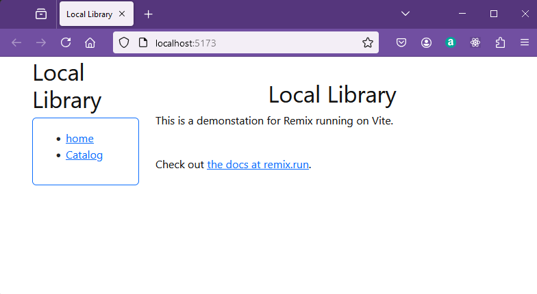
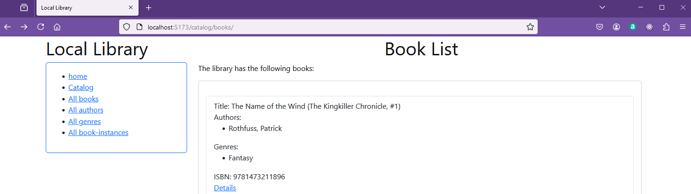

# Reading from the Local_Library database

In this section the routes models and controllers will be set up to read the database.

Make sure that docker and the database are running in the background.

To run the database open powershell and start the database with:

> docker start mongodb

Check that the container starts in docker desktop.

## Before Starting

**The instructions to get started with remix are [online](https://remix.run/docs/en/main/start/quickstart), but if you run these directly they will not install all the latest versions, so read through the process without following these steps, and then we will take a shortcut.**

## Implementing models

In the models folder the files must be populated with the schema for the database.
This will include author. book, bookinstance and genre.

For each of these files the imports from mongoose must be added.  There is also a date formatting type which  is using the [luxon](https://www.npmjs.com/package/luxon) package.

Each model file will export an interface which will include not only the schema but also the virtuals.  These are formatted items which are created from the schema.  For example a name could be fornmed from the family _name and the first_name.

The schema will exactly match the database.

The set and get methods are features of mongoose which allow the schema to be updated and read.

The virtuals are added to the schema using the get method.

Finally the model is exported.

The pattern is followed for each of the models so pouplate the models folder with the following files:

### Author

**author.ts**
```javascript
import { Schema, model } from 'mongoose';
import type { Date } from 'mongoose';
import { DateTime } from 'luxon';

export interface IAuthor extends Document {
  _id: string;
  first_name: string;
  family_name: string;
  date_of_birth: Date;
  date_of_death: Date;
  name: string;
  date_of_birth_formatted: string;
  date_of_death_formatted: string;
  lifespan: number;
  url: string;
}


const AuthorSchema = new Schema(
  {
    first_name: {type: String, required: true, max: 100},
    family_name: {type: String, required: true, max: 100},
    date_of_birth: {type: Date},
    date_of_death: {type: Date || null},
    
  }
);

AuthorSchema.set('toObject', { getters: true });  // https://mongoosejs.com/docs/guide.html#toObject  show virtuals in console logging
AuthorSchema.set('toJSON',   { getters: true });    //https://mongoosejs.com/docs/guide.html#toJSON   show virtuals in JSON.stringify


// Virtual for author's full name
AuthorSchema
.virtual('name')
.get(function () {
  return this.family_name + ', ' + this.first_name;
});

AuthorSchema
.virtual('date_of_birth_formatted')
.get(function () {
  return this.date_of_birth ? DateTime.fromJSDate(this.date_of_birth).toLocaleString(DateTime.DATE_MED) : '';
});

AuthorSchema
.virtual('date_of_death_formatted')
.get(function () {
 if (this.date_of_death != null) {
  return this.date_of_birth ? DateTime.fromJSDate(this.date_of_death).toLocaleString(DateTime.DATE_MED) : '';
 }else{
    return "living";
  }  
});

// Virtual for author's lifespan
AuthorSchema
.virtual('lifespan')
.get(function () {
  if(this.date_of_death != null){
  return "lifespan:" + (this.date_of_death.getFullYear() - this.date_of_birth!.getFullYear()).toString() + " years";
  } else {
    return "living"; 
  }
});


// Virtual for author's URL
AuthorSchema
.virtual('url')
.get(function () {
  return '/catalog/authors/' + this._id;
});


//Export model

const Author =  model<IAuthor>('Author', AuthorSchema);
export default Author;
```

And also:

### Genre

**genre.ts**
```javascript
import {Schema, model} from 'mongoose';

export interface IGenre extends Document{
  _id: string,
  name:string,
  url: string
}


const GenreSchema = new Schema(
  {
    name: {type: String, required: true}
  }
);

GenreSchema.set('toObject', { getters: true });  // https://mongoosejs.com/docs/guide.html#toObject  show virtuals in console logging
GenreSchema.set('toJSON',   { getters: true }); 

// Virtual for genre's URL
GenreSchema
.virtual('url')
.get(function () {
  return '/catalog/genres/' + this._id;
});

//Export model
const Genre = model<IGenre>('Genre', GenreSchema);
export default Genre;
```
And also:

### Book

**book.ts**
```javascript
import {Schema, model} from 'mongoose';
import { IAuthor } from './author';
import { IGenre } from './genre';


export interface IBook extends Document{
  _id: string,
  title: string,
  authors: IAuthor [],
  summary: string,
  isbn: string,
  genres: IGenre [],
  url: string 
}


const BookSchema:Schema = new Schema(
  {
    title:    {type: String, required: true},
    authors: [{type: Schema.Types.ObjectId, ref: 'Author', required: true}],
    summary:  {type: String, required: true},
    isbn:     {type: String, required: true},
    genres:  [{type: Schema.Types.ObjectId, ref: 'Genre', required: true}]
  }
);

BookSchema.set('toObject', { getters: true });  // https://mongoosejs.com/docs/guide.html#toObject  show virtuals in console logging
BookSchema.set('toJSON',   { getters: true });  

// Virtual for book's URL
BookSchema
.virtual('url')
.get(function () {
  return '/catalog/books/' + this._id;
});

//Export model
const Book = model<IBook>('Book', BookSchema);
export default Book;
```
And also:

### BookInstance

**bookinstance.ts**
```javascript
import { Schema, model } from 'mongoose';
import type { Date } from 'mongoose';
import { DateTime } from 'luxon';

export interface IBookInstance{
  _id: string;
  book:string,
  imprint:string,
  status:string,
  due_back: Date,
  due_back_formatted: string,
  url: string
}

const BookInstanceSchema = new Schema(
  {
    book: { type: Schema.Types.ObjectId, ref: 'Book', required: true }, //reference to the associated book
    imprint: {type: String, required: true},
    status: {type: String, required: true, enum: ['Available', 'Maintenance', 'Loaned', 'Reserved'], default: 'Maintenance'},
    due_back: {type: Date, default: Date.now}
  }
);

BookInstanceSchema.set('toObject', { getters: true });  // https://mongoosejs.com/docs/guide.html#toObject  show virtuals in console logging
BookInstanceSchema.set('toJSON',   { getters: true });  

// Virtual for bookinstance's URL
BookInstanceSchema
.virtual('url')
.get(function () {
  return '/catalog/instances/' + this._id;
});

BookInstanceSchema
.virtual('due_back_formatted')
.get(function () {
  if (this.due_back != null) {
  return DateTime.fromJSDate(this.due_back).toLocaleString(DateTime.DATE_MED);
}else{
  return "In Library";
}  
});

//Export model

const BookInstance = model<IBookInstance>('BookInstance', BookInstanceSchema);
export default BookInstance;
```

## Implementing the routes

In the roots folder files need to be created with names which match the routes which were created as links in the app.tsx file.  These files will be used to define the routes for the application.

The first file to be created is the **_index.tsx** file.  This file will be used to define the route when the application is called without a specific route. Note the filename has a leading underscore.  This is a convention used by React to indicate that the file is a private file.

### Index route

**routes/_index.tsx**
```javascript
export default function Index() {
    return (
      <p id="index-page">
         <center><h1>Local Library</h1></center>
      
        <p>This is a demonstation for Remix running on Vite.</p>
        <br />
        Check out{" "}
        <a href="https://remix.run">the docs at remix.run</a>.
      </p>
    );
  }
```  
Note that the file is a function which returns a JSX element.  This is the standard way to define a React component.  The component is a simple paragraph with a heading and a link to the Remix documentation.  This will be rendered in the ```<Outlet />``` element in the app.tsx file.

## Run the application

Change directory into the library 24 folder and run dev.

> cd library24
> npm run dev

There will be some warnings which can be ignored these are pointing towards the next version of react router which we are not using at the moment.

```bash

 warn  Fetcher persistence behavior is changing in React Router v7
┃ You can use the `v3_fetcherPersist` future flag to opt-in early.
┃ -> https://remix.run/docs/en/2.13.1/start/future-flags#v3_fetcherPersist
┗
 warn  Route discovery/manifest behavior is changing in React Router v7
┃ You can use the `v3_lazyRouteDiscovery` future flag to opt-in early.
┃ -> https://remix.run/docs/en/2.13.1/start/future-flags#v3_lazyRouteDiscovery
┗
 warn  Relative routing behavior for splat routes is changing in React Router v7
┃ You can use the `v3_relativeSplatPath` future flag to opt-in early.
┃ -> https://remix.run/docs/en/2.13.1/start/future-flags#v3_relativeSplatPath
┗
 warn  Data fetching is changing to a single fetch in React Router v7
┃ You can use the `v3_singleFetch` future flag to opt-in early.
┃ -> https://remix.run/docs/en/2.13.1/start/future-flags#v3_singleFetch
┗
 warn  The format of errors thrown on aborted requests is changing in React Router v7
┃ You can use the `v3_throwAbortReason` future flag to opt-in early.
┃ -> https://remix.run/docs/en/2.13.1/start/future-flags#v3_throwAbortReason
┗
```
The application should now be running on http://localhost:5173

```bash
Re-optimizing dependencies because lockfile has changed
  ➜  Local:   http://localhost:5173/
  ➜  Network: http://172.17.0.3:5173/
  ➜  press h + enter to show help
mongodb://host.docker.internal:27017/local_library
Connected to Mongodb Database
```


## Create the routes

Now the home page is running the application needs to be updated to include the routes for the application and the commented out array elements can be brought back. 

Populate the following route files with the following code.

### Catalog route

**routes/catalog._index.tsx**
```javascript
//import type { ActionFunctionArgs, LoaderFunctionArgs } from "@remix-run/node";//
//import type { FunctionComponent } from "react";


interface Details {
  numBooks: number,
  numBookInstances: number,
  numAvailableBookInstances: number,
  numAuthors: number,
  numGenres: number
}


import Card from 'react-bootstrap/Card';

import { json } from "@remix-run/node";

import { useLoaderData, } from "@remix-run/react";


import Book from '../models/book';
import Author from '../models/author';
import BookInstance from '../models/bookinstance';
import Genre from '../models/genre';


export const loader: unknown = async () => {


  const [
    numBooks,
    numBookInstances,
    numAvailableBookInstances,
    numAuthors,
    numGenres
  ] = await Promise.all([
    Book.countDocuments({}).exec(),
    BookInstance.countDocuments({}).exec(),
    BookInstance.countDocuments({ status: "Available" }).exec(),
    Author.countDocuments({}).exec(),
    Genre.countDocuments({}).exec(),
  ]);

  if (!numBooks) {
    throw new Response("Not Found", { status: 404 });
  }

  const details: Details = {
    numBooks,
    numBookInstances,
    numAvailableBookInstances,
    numAuthors,
    numGenres
  };

  return json({ details });
};


export default function Catalog() {
  console.log(useLoaderData<Details>());
  const detailJson = useLoaderData<{details:Details}>();
  const details: Details = detailJson.details;
  return (
    <div>
      <center><h1>Book Lists</h1></center>
      <p>The library has the following books:</p>
      <Card>
        <Card.Body>
          <Card.Text>
            Books: {details.numBooks} ,
            Instances: {details.numBookInstances} ,
            Available: {details.numAvailableBookInstances},
            Authors: {details.numAuthors},
            Genres: {details.numGenres}
          </Card.Text>
        </Card.Body>
      </Card>

    </div>
  );
}
```
The route file includes the loader function which is used to fetch the data from the database using appropriate mongoose commands.  In this case the query [contDocuments](https://mongoosejs.com/docs/api/query.html#Query.prototype.countDocuments()) is used to count items in the documents.  A filter {status:"Available"} is used to limit the counts to to show the book count available for loan. A default function is returned by the router.  In this case this is named "Catalog()". When this function is called the loader function is executed and the data is returned to the function.  The data is then displayed in the function. In this case with a card component from bootstrap.

The next route is for the author:

### Author route

**routes/catalog.authors.tsx**
```javascript
import Card from 'react-bootstrap/Card';
import ListGroup from 'react-bootstrap/ListGroup';

import { json } from "@remix-run/node";

import { useLoaderData, Link } from "@remix-run/react";

import Author, { IAuthor } from '../models/author';


export const loader: unknown = async () => {

  const authors = await Author.find({}, null, { virtuals: true })
    .sort([['family_name', 'ascending']])
    .exec();

  if (!authors) {
    throw new Response("Not Found", { status: 404 });
  }

  return json({ authors });
};


export default function Catalog() {
  const data = useLoaderData() as { authors: IAuthor[] };
  //console.log(data);
  return (
    <div>
      <center><h1>Author List</h1></center>

      <Card style={{ width: '60em' }}>
        <Card.Body>
          <Card.Text>
            <ListGroup>
              {data.authors.map((author) => (
                <ListGroup.Item className="card-text" key={author._id}>
                  First Name: {author.first_name} <br />
                  Name: {author.name} <br />
                  Date of Birth: {author.date_of_birth_formatted}<br />
                  Lifespan: {author.lifespan}<br />
                  <Link to={author.url}>Details</Link>
                </ListGroup.Item>
              ))}
            </ListGroup>
          </Card.Text>
        </Card.Body>
      </Card>

    </div>
  );
}
```

The loader function is used to fetch the data from the database using appropriate mongoose commands.  In this case the query [find](https://mongoosejs.com/docs/api/query.html#Query.prototype.find()) is used to find the documents.  A sort is used to sort the documents.  A default function is returned by the router.  In this case, again, this is named "Catalog()". When the Catalog() function is called the loader function is executed and the data is returned to the function.  The data is then displayed in the function. In this case with a card component from bootstrap.


and also:

### Genre route

**routes/catalog.genres.tsx**
```javascript
import Card from 'react-bootstrap/Card';
import ListGroup from 'react-bootstrap/ListGroup';

import { json } from "@remix-run/node";

import { useLoaderData, Link } from "@remix-run/react";

import Genre, { IGenre } from '../models/genre';


export const loader: unknown = async () => {

  const genres = await Genre.find({}, null, { virtuals: true })
    .sort([['name', 'ascending']])
    .exec();

  if (!genres) {
    throw new Response("Not Found", { status: 404 });
  }

  return json({ genres });
};


export default function Catalog() {
  const data = useLoaderData() as { genres: IGenre[] };
  //console.log(data);
  return (
    <div>
      <center><h1>Genre List</h1></center>
      <p>The library features the following book genres:</p>
      <Card style={{ width: '60em' }}>
        <Card.Body>
          <Card.Text>
            <ListGroup>
              {data.genres.map((genre) => (
                <ListGroup.Item className="card-text" key={genre._id}>
                  Name: {genre.name} <br />
                  <Link to={genre.url}>Details</Link>
                </ListGroup.Item>
              ))}
            </ListGroup>
          </Card.Text>
        </Card.Body>
      </Card>

    </div>
  );
}
```

The pattern of loader function and action function is used for all routes.  This is a good pattern to use as it allows the data retrieval and display to be combined in a single module file.  Some other frameworks use a separate module for the data retrieval and a separate module for the display.

and also:

### Book route

**routes/catalog.books.tsx**
```javascript
import Card from 'react-bootstrap/Card';
import ListGroup from 'react-bootstrap/ListGroup';

import { json } from "@remix-run/node";

import { useLoaderData, Link} from "@remix-run/react";

import Book, { IBook } from '../models/book';

export const loader: unknown = async () => {

  const books = await Book.find({}).populate('authors').populate('genres').exec();
  if (!books) {
    throw new Response("Not Found", { status: 404 });
  }
  return json({ books });
};


export default function Catalog() {
  const data = useLoaderData() as { books: IBook[] };

  return (
    <div>
      <center><h1>Book List</h1></center>
      <p>The library has the following books:</p>
      <Card style={{ width: '60em' }}>
        <Card.Body>
          <Card.Text>
            <ListGroup>
              {data.books.map((book) => (
                <ListGroup.Item className="card-text" key={book._id} >
                  Title: {book.title} <br />
                  Authors:
                  <ul>
                    {book.authors.map((author) => (
                      <li key={author._id}>
                        {author.name}
                      </li>
                    ))}
                  </ul>

                  {/*Description:{book.summary}<br /> */}
                  Genres:
                  {book.genres !== null && book.genres.length > 0 && (
                    <ul>
                      {book.genres.map((genre) => (
                        <li key={genre._id}>
                          {genre.name}
                        </li>
                      ))}
                    </ul>
                  )
                  }
                  ISBN: {book.isbn} <br />
                  <Link to={book.url}>Details</Link>
                </ListGroup.Item>
              ))}
            </ListGroup>
          </Card.Text>
        </Card.Body>
      </Card>

    </div>

  );
}
```
and also:

### BookInstance route

**routes/catalog.bookinstances.tsx**
```javascript
import Card from 'react-bootstrap/Card';
import ListGroup from 'react-bootstrap/ListGroup';

import { json } from "@remix-run/node";

import { useLoaderData } from "@remix-run/react";


import BookInstance, { IBookInstance } from '../models/bookinstance';


export const loader: unknown = async () => {

  //const instances = await BookInstance.find({book: '660e9425cd2a5343c986400a'}).exec();
  const instances = await BookInstance.find().exec();
  if (!instances) {
    throw new Response("Not Found", { status: 404 });
  }
  return json({ instances });
};


export default function Catalog() {
  const data = useLoaderData() as { instances: IBookInstance[] };
  //console.log(data);
  return (
    <div>
      <center><h1>Book List</h1></center>
      <p>The library has the following books:</p>
      <Card style={{ width: '60em' }}>
        <Card.Body>
          <Card.Text>
            <ListGroup>
              {data.instances.map((instance) => (
                <ListGroup.Item className="card-text" key={instance._id} >
                  Book: {instance.book} <br/>
                  Imprint:{instance.imprint}<br/>
                  Status:{instance.status}<br/> 
                </ListGroup.Item>
              ))}
            </ListGroup>
          </Card.Text>
        </Card.Body>
      </Card>

    </div>

  );
}
```

Then in root.tsx uncomment the retrieve array.

**root.tsx (extract)**
```javascript
  const retrieve = [
    ['/', 'home'],
    ['/catalog/', 'Catalog'],
    ['/catalog/books/', 'All books'],
    ['/catalog/authors/', 'All authors'],
    ['/catalog/genres/', 'All genres'],
    ['/catalog/instances/', 'All book-instances']

  ]
```

Note again the naming convention of the route file.  The route file name is not the same as the url!

Restart the vite server and test the application at this stage.

The application may need to start a couple of times as you run through this as the model compiles.  Restart if you see messages like:

```bash
[vite] Internal server error: Cannot overwrite `BookInstance` model once compiled.
```

This is because the model is compiled and the model is not recompiled when you make changes to the model.  

> CTRL + C
> npm run dev



The first level of the menu should work and the details links will not work yet.  These will be covered in the next section.


