## Setting up PC 

This module will use a MERN stack to create a web application.
The primary editor will be Visual Studio Code.
Docker containers will be used to manage the development environment.
Windows Subsystem for Linux WSL2 will be required to support Docker running Windows 11 (or windows 10).

## Visual Studio Code

Visual studio code is a lightweight code editor, that is what is required here.  This is not the same as Visual Studio which is an integrated development environment.  Please take care to install VSC and not VS!

Visual Studio Code can be downloaded [here](https://code.visualstudio.com/)

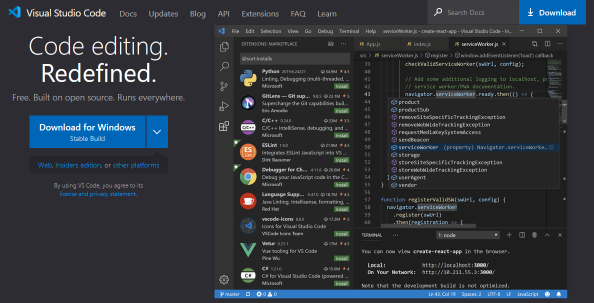

Open the extensions dialogue either by CTRL + Shift + X or clicking on the extensions icon on the left of the VSC display.

You will see a range of popular extensions which you can install.

If you don't see the extension you require listed you can just type the name in the extensions search bar.

Type Live Server in the search bar.


Installing  this will allow any website code in the editor to be previewed in a browser.

Further extensions will be installed to VSC as required.

## WSL 

Windows subsystem for Linux is easy to install on windows version beyond Windows 10 Home Version 21H1

The current system used a the time of writing these notes is:

    Edition:	Windows 11 Home

    Version:	21H2

    OS build:	22000.832

    Experience:	Windows Feature Experience Pack 1000.22000.832.0


WSL allows a command line linux distribution to be installed.  This is essentially needed to support the Docker application.

It is possible to go on to allow GUI linux applications to run on the PC, but this is not required for the present purpose.

Microsoft documents supporting WSL can be found [here](https://docs.microsoft.com/en-us/windows/wsl/).

Windows powershell is likely to be on a PC in version 5.1.  Version 7.2 is the current version and this features support for docker containers.  Microsoft documentation discusses how to [migrate from powershell 5.1 to Powershell 7](https://docs.microsoft.com/en-us/powershell/scripting/whats-new/migrating-from-windows-powershell-51-to-powershell-7?view=powershell-7.2)

I will [download Powershell 7](https://docs.microsoft.com/en-us/powershell/scripting/install/installing-powershell-on-windows?view=powershell-7.2) and install this with all default options along side powershell 5.1

For a fresh installation of WSL open powershell *as an administrator* and enter the command:

> wsl --install


The process takes a few minutes.

```code
PS C:\Windows\System32> wsl --install
Installing: Virtual Machine Platform
Virtual Machine Platform has been installed.
Installing: Windows Subsystem for Linux
Windows Subsystem for Linux has been installed.
Downloading: WSL Kernel
Installing: WSL Kernel
WSL Kernel has been installed.
Downloading: GUI App Support
Installing: GUI App Support
GUI App Support has been installed.
Downloading: Ubuntu
The requested operation is successful. Changes will not be effective until the system is rebooted.
PS C:\Windows\System32>
```

At this point a **system restart** is required.

When the computer restarts it opens a Linux window.

The default Linux distribution is Ubuntu.  Once it has loaded this will need a username and password.  Of course you should remember this!  However, there is advice [here](https://docs.microsoft.com/en-us/windows/wsl/setup/environment#set-up-your-linux-username-and-password) what to do if you forget your password.


Enter username and then password correctly typed twice.

```code
Installing, this may take a few minutes...
Please create a default UNIX user account. The username does not need to match your Windows username.
For more information visit: https://aka.ms/wslusers
Enter new UNIX username: derek
New password:
Retype new password:
passwd: password updated successfully
Installation successful!
To run a command as administrator (user "root"), use "sudo <command>".
See "man sudo_root" for details.

Welcome to Ubuntu 20.04 LTS (GNU/Linux 5.10.16.3-microsoft-standard-WSL2 x86_64)

 * Documentation:  https://help.ubuntu.com
 * Management:     https://landscape.canonical.com
 * Support:        https://ubuntu.com/advantage

  System information as of Mon Aug  8 15:06:01 BST 2022

  System load:  0.0                Processes:             8
  Usage of /:   0.4% of 250.98GB   Users logged in:       0
  Memory usage: 7%                 IPv4 address for eth0: 172.31.243.122
  Swap usage:   0%

0 updates can be installed immediately.
0 of these updates are security updates.


The list of available updates is more than a week old.
To check for new updates run: sudo apt update


This message is shown once once a day. To disable it please create the
/home/derek/.hushlogin file.
derek@TurnerHub:~$
```
Note that you as a named user do not have full privelidges on the system.  This is reserved for the root user.  In general it is preferred not to go in as the root user to protect yourself from causing dabage from an unitentional code error.  If you need to do an operation which requires root privelidges you can use the sudo command.

Opening powerShell again, you can confirm which version of WSL you have with 

>wsl -l -v

WSL should be maintained in the background by windows update, but if you want to manually update you can enter in powershell (still as administrator)

> wsl --update

```code
Checking for updates...
Downloading updates...
Installing updates...
This change will take effect on the next full restart of WSL. To force a restart, please run 'wsl --shutdown'.
Kernel version: 5.10.102.1
PS C:\Windows\System32>
```

>wsl --shutdown

```code
  NAME      STATE           VERSION
* Ubuntu    Running         2
```
To see what version of Ubuntu you are running go to the Ubuntu window and issue:

> lsb_release -a

```code
No LSB modules are available.
Distributor ID: Ubuntu
Description:    Ubuntu 20.04 LTS
Release:        20.04
Codename:       focal
```

This is not the most recent version of Ubuntu, but I don't reccommend trying to change release version at this point.

You can close both powershell and the ubuntu window now.

## Docker

Docker Desktop is the windows installation which includes all you need to work with Docker containers.

Before using this you must check that virtualization is enabled in your BIOS.  

You should use CTRL + ALT + DEL to open task manager and look that virtualisation is enabled under the performance tab.

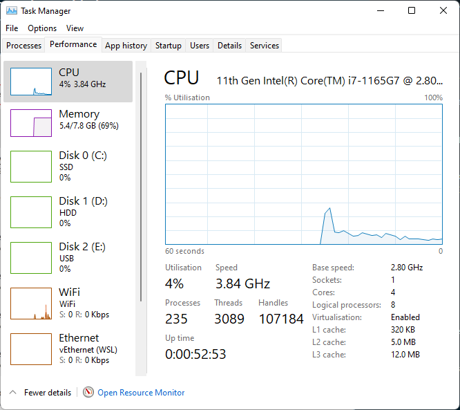

Install docker from [Docker hub](https://docs.docker.com/desktop/install/windows-install/).


 and install.

Installation runs through:

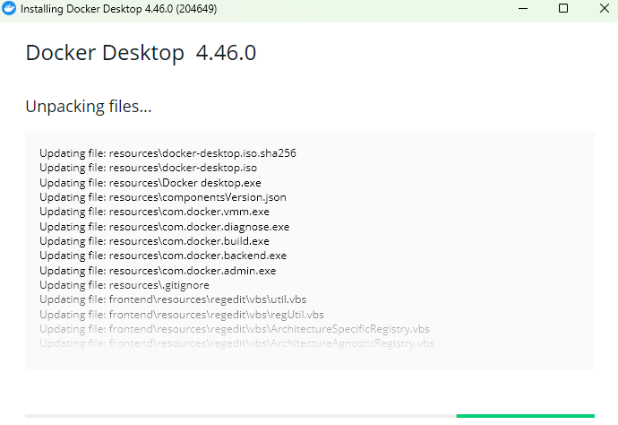

At this time the current version of docker is 4.46.0.  Please do not update your docker version beyond this while referring to these notes.

You must log out of windows to complete installation, so log out.  This is less drastic than a restart all you need to do is enter your pin to get back and the service agreement appears.

Note that docker is free for personal use and education.


Startup docker desktop.

A whale icon appers in the system tray.  This animates whilst docker is starting.

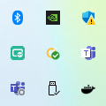

Right click the tray icon to see a menu.


At this point docker has not completed startup.  When startup is complete Docker desktop offers a tutorial - but dont follow this yet.  Click on the settings cog wheel icon next to the sign in.

Click on the option to use composeV2

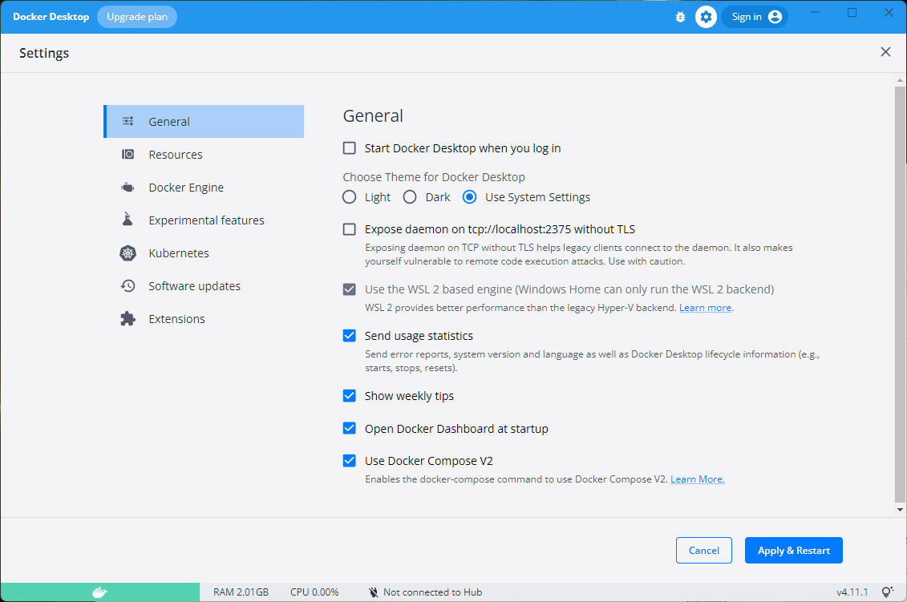

Then apply and restart.

Now you can quit docker desktop from the system tray menu.


## Github

If you dont already have one, [open a github account](https://github.com/join?source=login).  I suggest using your email address as password.

When you join there is a short tutorial available to explain what gitHub is but from our point of view it is an online repository which will contain a copy of the code which you are using in your docker containers.


## Github desktop

This is an application which is a convenience utility to help manage the maintenance of copies of the git repositories on your local machine.  I find it useful, it is not strictly necessary but easier than tryint to manage git commands directly.

[Install Github desktop](https://desktop.github.com/)


Once installed, you can sign into your gitHub account.


]

You will be prompted to allow the desktop to open the github account online where you will be able to enter your login details.

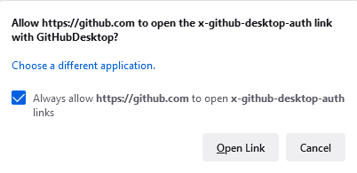

Your gitHub user name name and email will appear in the configure git screen

click on "Finish"

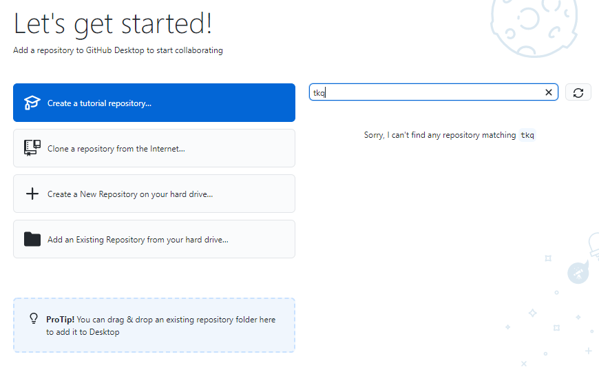

You can experiment with the tutorial repository, but for now installation is complete.

To log out (breaking the link to your online account and keeping your files safe) go to the File options menu or key in CTRL "+".


You can close github desktop now.

## Git

Git is an application which will allow visual studio code to interact with GitHub Directly.  Github desktop has git built in, but to use it with VSC you must explicitly install git.

Undoubtedly you will decide wheter you prefer to manage your github files from Desktop or VSC, but to have both options available is useful.

Download git [here](https://git-scm.com/).  You will find an online book on git here, but you dont need to issue git commands directly if you use VSC.

Current version of Git is 2.42.0


There is a 64-bit Git for windows setup.

Accept the default location.

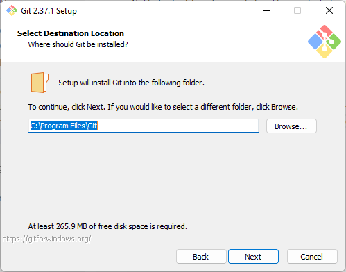

Accept the default components.


Accept the default Start folder.


Change the default editr from Vim to Visual Studio Code.

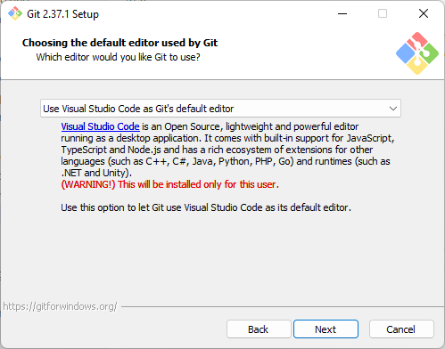

Change the name of the inital branch to "main"


Accept the default path to allow git from powerShell.

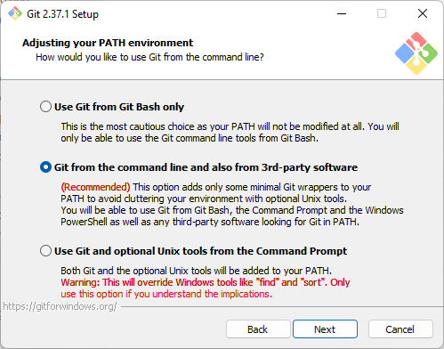

Use the default bundled SSH shell.

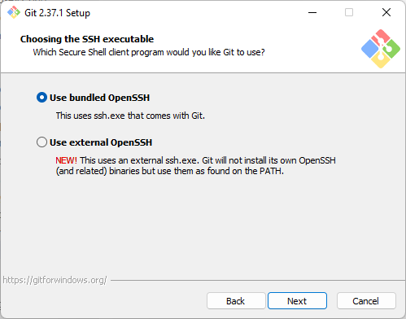

Accept the default SSL library.

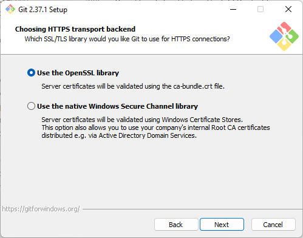

Accept the default windows style checkout.


Use the default minTTY terminal emulator.


Accept default pull behaviour.


Accept default credential manager.


Enable default file caching.


Don't require experimental features.


Install.

When installation has completed, that is enough, no need to start now or view release notes.


Finish!

Reload Visual Studio Code.

The source control icon in visual studio will now allow you to interact directly with gitHub.


The version 2.37.1 shown here will work fine, but if you have an old version of git installed from version 2.17.0 you can update it by opening powershell and use

> git update-for-windows

```code
PowerShell 7.3.6
PS C:\Users\username> git --version
git version 2.37.1.windows.1
PS C:\Users\username>
PS C:\Users\username> git update-git-for-windows
Git for Windows 2.37.1.windows.1 (64-bit)
Update 2.42.0.windows.2 is available
Download and install Git for Windows v2.42.0.windows.2 [N/y]? y
################################################################################################################ 100.0%
PS C:\Users\username> git --version
git version 2.42.0.windows.2
```

## VSC extensions

From the extensions menu search for the following useful extensions.

Docker


Development containers


That is sufficient set up and these features will be used as the module progresses.

If you wish you could install the remote development extension for visual studio code which incorported four remote acting extensions.:

* Dev Contaainers- to open a local folder into a container.
* WSL - to open any folder in the windows subsystem for linux.
* Remote SSH - to open a folder on a remote machine using secure shell
* Remote Tunnels to open a folder on a remote machine using a vscode tunnel.


That would provide the full suite of remote development tools.

