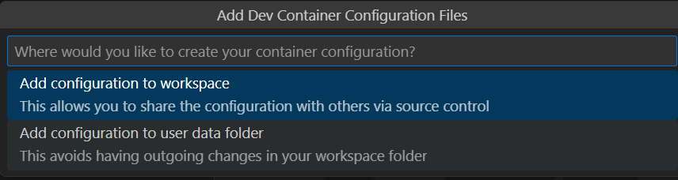
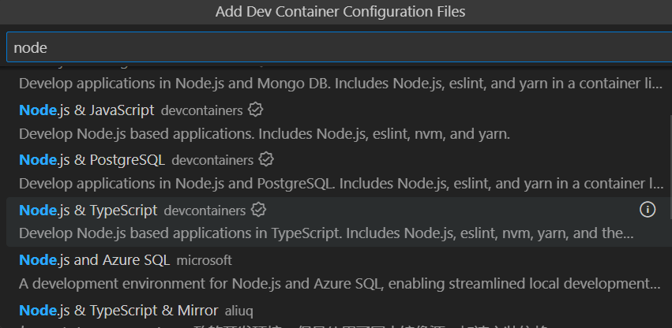
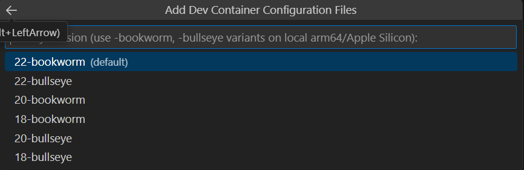
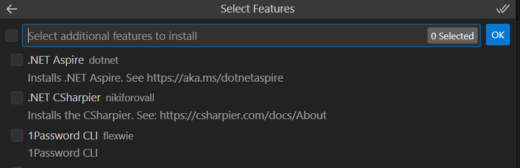
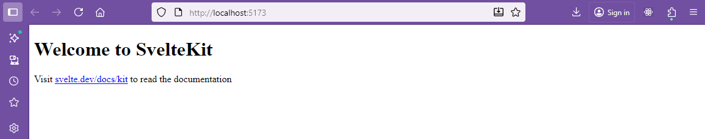
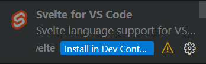
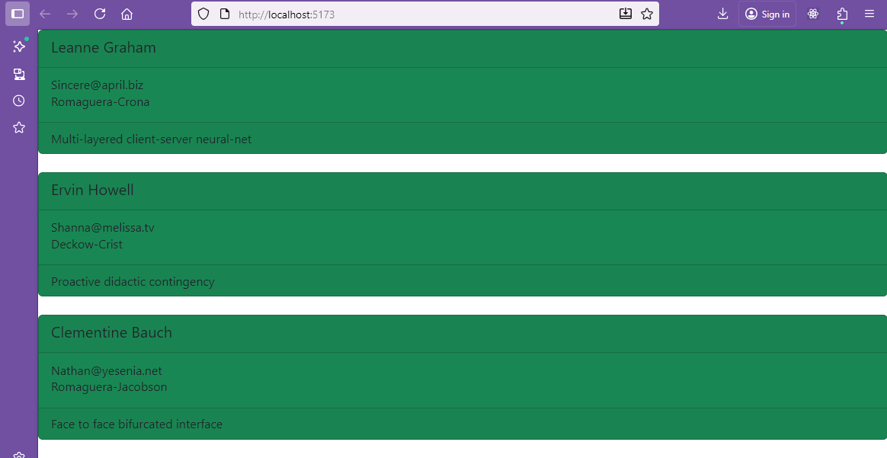

## Svelte Tutorial

### Setup

The object here is to demonstrate that Svelte can be used as an effective alternative to React to display the list of users from the typicode API.  You can be the judge of whether the syntax is more or less comfortable to work with.  If you want to go further you can extend to read from other typicode API content.

To start off I will make a new github repository named SvelteTS25 and clone this to my local machine.

Check that Docker is running and that you have the Dev Containers extension installed in Visual Studio Code.

Within visual studio code open this folder in a container which is for node and typescript.

Add the container configuration files to the workspace.



Select Node.js and Typescript.



Choose the current LTS version of node.



Choose no additional options.



Don't need any optional files


Allow time for the DevContainer to populate.  Watch the log to see this loading.  When it is ready, check the node version.

> node --version

```code
v22.9.0
```

Now [create a svelte app](https://svelte.dev/docs/svelte/getting-started) using sveltKit.  This is powered by vite so won't need a separate vite installation. 

> npx sv create myapp

```code
Need to install the following packages:
sv@0.9.8
Ok to proceed? (y) 
```

Yes to proceed (y).

Select a skeleton project rather than a demo file or library project.

```code
┌  Welcome to the Svelte CLI! (v0.9.8)
│
◆  Which template would you like?
│  ● SvelteKit minimal (barebones scaffolding for your
new app)
│  ○ SvelteKit demo
│  ○ Svelte library
└
```
Presse Enter to select the skeleton project.

Use Typescript

```code
 Which template would you like?
│  SvelteKit minimal
│
◆  Add type checking with TypeScript?
│  ● Yes, using TypeScript syntax
│  ○ Yes, using JavaScript with JSDoc comments
│  ○ No
└
```
Press Enter to select Typescript.

Add prettier code formatting.

```code
What would you like to add to your project? (use arrow
keys / space bar)
│  ◻ prettier (formatter - https://prettier.io)
│  ...
│  ◻ devtools-json
│  ◻ sveltekit-adapter
│  ◻ prettier
│  ◻ eslint
│  ◻ vitest
│  ◻ playwright
│  ◻ tailwindcss
│  ◻ sveltekit-adapter
│  ◻ devtools-json
│  ◻ drizzle
│  ◻ lucia
│  ◻ mdsvex
│  ◻ paraglide
│  ◻ storybook (frontend workshop -
https://storybook.js.org)
└
```
Choose a packate manager, I will use npm.

```code
◆  Which package manager do you want to install dependencies
with?
│  ○ None
│  ● npm
│  ○ yarn
│  ○ pnpm
│  ○ bun
│  ○ deno
└
```
Operation failed!  The error message suggests tha the node version is too old and needs to be updated to 22.12 or later.  

To change the node version  the mode version manager nvm can be used.  Install nvm from [nvm](https://github.com/nvm-sh/nvm#installing-and-updating) using the instal script.

> curl -o- https://raw.githubusercontent.com/nvm-sh/nvm/v0.40.3/install.sh | bash

Close and reopen your terminal to start using nvm.

> nvm install 22.20.0

```code
Now using node v22.20.0 (npm v10.9.3)
```
### Setup again!

> npx sv create myapp

```code
┌  Welcome to the Svelte CLI! (v0.9.8)
│
◆  Directory not empty. Continue?
│  ○ Yes / ● No
└
```
Choose yes to continue.

```code
◆  Which template would you like?
│  ● SvelteKit minimal (barebones scaffolding for your new app)
│  ○ SvelteKit demo
│  ○ Svelte library
└
```
Press Enter to select the skeleton project.

```code
 Which template would you like?
│  SvelteKit minimal
│
◆  Add type checking with TypeScript?
│  ● Yes, using TypeScript syntax
│  ○ Yes, using JavaScript with JSDoc comments
│  ○ No
└
```
Press Enter to select Typescript.

```code
◆  What would you like to add to your project? (use arrow keys / space bar)
│  ◻ prettier (formatter - https://prettier.io)
│  ◻ eslint
│  ◻ vitest
│  ◻ playwright
│  ◻ tailwindcss
│  ◻ sveltekit-adapter
│  ◻ devtools-json
│  ◻ drizzle
│  ◻ lucia
│  ◻ mdsvex
│  ◻ paraglide
│  ◻ storybook
└
```
Choose prettier with space bar and press Enter.

```code
Successfully setup add-ons
│
◆  Which package manager do you want to install dependencies with?
│  ○ None
│  ● npm
│  ○ yarn
│  ○ pnpm
│  ○ bun
│  ○ deno
└
```
Choose npm and press Enter.

```code
◇  Installing dependencies with npm...

◆  Successfully installed dependencies
│
◇  Successfully formatted modified files
│
◇  What's next? ───────────────────────────────╮
│                                              │
│  📁 Project steps                            │
│                                              │
│    1: cd myapp                               │
│    2: npm run dev -- --open                  │
│                                              │
│  To close the dev server, hit Ctrl-C         │
│                                              │
│  Stuck? Visit us at https://svelte.dev/chat  │
│                                              │
├──────────────────────────────────────────────╯
│
└  You're all set!
```

Ok so to see the default svelte app.

> cd myapp
> npm run dev -- --open

```code
> myapp@0.0.1 dev
> vite dev --open

10:40:51 PM [vite] (client) Forced re-optimization of dependencies

  VITE v7.1.9  ready in 13981 ms

  ➜  Local:   http://localhost:5173/
  ➜  Network: use --host to expose
  ➜  press h + enter to show help
```

Nearly there.

> CTRL + C to stop the server.

Look at the package.json file in the myapp folder.

```json
{
	"name": "myapp",
	"private": true,
	"version": "0.0.1",
	"type": "module",
	"scripts": {
		"dev": "vite dev",
		"build": "vite build",
		"preview": "vite preview",
		"prepare": "svelte-kit sync || echo ''",
		"check": "svelte-kit sync && svelte-check --tsconfig ./tsconfig.json",
		"check:watch": "svelte-kit sync && svelte-check --tsconfig ./tsconfig.json --watch",
		"format": "prettier --write .",
		"lint": "prettier --check ."
	},
	"devDependencies": {
		"@sveltejs/adapter-auto": "^6.1.0",
		"@sveltejs/kit": "^2.43.2",
		"@sveltejs/vite-plugin-svelte": "^6.2.0",
		"prettier": "^3.6.2",
		"prettier-plugin-svelte": "^3.4.0",
		"svelte": "^5.39.5",
		"svelte-check": "^4.3.2",
		"typescript": "^5.9.2",
		"vite": "^7.1.7"
	}
}
```

Edit the dev and preview scripts to add --host to allow access from outside the container.

```json
  "scripts": {
    "dev": "vite dev --host",
    "build": "vite build",
    "preview": "vite preview --host",
```
Now run the dev server again.

> npm run dev

```code
> myapp@0.0.1 dev
> vite dev --host


  VITE v7.1.9  ready in 13575 ms

  ➜  Local:   http://localhost:5173/
  ➜  Network: http://172.17.0.2:5173/
  ➜  press h + enter to show help> 
```
CTRL + Click on the local address to see the default svelte app in the browser.



> CTRL + C


> cd my-app

Install the dependancies currently in package.json

> npm install

This takes a while.

```code
> myapp@0.0.1 prepare
> svelte-kit sync || echo ''


added 1 package, and audited 58 packages in 16s

8 packages are looking for funding
  run `npm fund` for details

3 low severity vulnerabilities

To address all issues (including breaking changes), run:
  npm audit fix --force

Run `npm audit` for details.
```

Now to add the [sveltestrap](https://github.com/sveltestrap/sveltestrap) library to use bootstrap 5 components in svelte.  

> npm install svelte @sveltestrap/sveltestrap

```json
{
    "dependencies": {
        "svelte": "^3.59.2",
        "sveltestrap": "^5.11.2",
        "vite":"4.4.11"
    }
}    
```

> npm install

```code
added 2 packages, and audited 60 packages in 7s

9 packages are looking for funding
  run `npm fund` for details

3 low severity vulnerabilities

To address all issues (including breaking changes), run:
  npm audit fix --force

Run `npm audit` for details.
```


Finally install the [axios library](https://axios-http.com/) to retrieve json data from a rest API.

> npm i axios

```code
added 23 packages, and audited 83 packages in 3s

15 packages are looking for funding
  run `npm fund` for details

3 low severity vulnerabilities

To address all issues (including breaking changes), run:
  npm audit fix --force

Run `npm audit` for details.
```
Package,json now includes:
```json
	"dependencies": {
		"@sveltestrap/sveltestrap": "^7.1.0",
		"axios": "^1.12.2"
	}
```

### Svelte code

Check the contents of app.html in the src folder

app.html
```html
<!doctype html>
<html lang="en">
	<head>
		<meta charset="utf-8" />
		<meta name="viewport" content="width=device-width, initial-scale=1" />
		%sveltekit.head%
	</head>
	<body data-sveltekit-preload-data="hover">
		<div style="display: contents">%sveltekit.body%</div>
	</body>
</html>
```
It's essential to note that Bootstrap 5 components do not come with Bootstrap styles preloaded, so you'll need to add the stylesheet manually. Here's how you can add them.

In the myapp/routes folder edit +page.svelte.

**myapp/routes/+page.svelte**
```javascript
<svelte:head>
  <link rel="stylesheet" href="https://cdn.jsdelivr.net/npm/bootstrap@5.3.2/dist/css/bootstrap.min.css">
</svelte:head>
```

This code will insert into the head of the html file.

A useful helper will be to load the Vscode svelte extension to provide syntax highlighting and code completion.  This will be installed in the dev container.



**myapp/routes/+page.svelte**
```javascript          
<script lang="ts">
  import { onMount } from "svelte";
  import axios from "axios";
  import { Card,
    CardBody,
    CardFooter,
    CardHeader,
    CardSubtitle,
    CardText,
    CardTitle } from '@sveltestrap/sveltestrap';
```
The lang="ts" identifies this script as typescript.

The Card elements are imports from the sveltstrap library.  [The components available are listed](https://sveltestrap.js.org/?path=/docs/sveltestrap-overview--docs).

The import of onMount allows svelte to perform programmed functions when the page loads.

Axios is the library to retrieve JSON from the rest API.  This can be used as an alternative to fetch as discussed by [David Adeneye](https://www.sitepoint.com/svelte-fetch-data/).

**myapp/routes/+page.svelte**
```javascript
const endpoint = "https://jsonplaceholder.typicode.com/users";

interface Company{
  name:string
  catchPhrase:string;
  bs:string;
}

interface User {
  id: number;
  name: string;
  email: string;
  company:Company;
}

let values: User[] = [];
```
The endpoint is defined as a convenience.

For typescript the array of values must have a type of structure which matches the JSON data so interfaces are set up to match the data.


```javascript
onMount(async function () {
  const response = await axios.get(endpoint);
  console.log(response.data);
  values = response.data;
});

</script>
```
The asynchronous function retrieves data from the endpoint and stores response data into the values array.

```javascript

{#each values as item}               
<Card color="success">
  <CardHeader>
    <CardTitle>{item.name}</CardTitle>
  </CardHeader>
  <CardBody>
    <CardSubtitle>{item.email}</CardSubtitle>
    <CardText>
      {item.company.name}
    </CardText>
  </CardBody>
  <CardFooter>    
      {item.company.catchPhrase}
  </CardFooter>
</Card>
<br/>
{/each}
```

The #each ... /each syntax iterates around the values array storing one array element as item on each iteration.

item has the sturucture of a User so its company fields can be accessed and information is rendered on screen.

A color is added to the card, you can experiment with the styling of the card.

The full listing is 
**my-app/src/routes/+page.svelte**
```javascript
<svelte:head>
  <link rel="stylesheet" href="https://cdn.jsdelivr.net/npm/bootstrap@5.3.0/dist/css/bootstrap.min.css">
</svelte:head>
          

<script lang="ts">
  import { onMount } from "svelte";
  import axios from "axios";
  import { Card,
    CardBody,
    CardFooter,
    CardHeader,
    CardSubtitle,
    CardText,
    CardTitle } from '@sveltestrap/sveltestrap';


const endpoint = "https://jsonplaceholder.typicode.com/users";

interface Company{
  name:string
  catchPhrase:string;
  bs:string;
}

interface User {
  id: number;
  name: string;
  email: string;
  company:Company;
}

let values: User[] = [];

onMount(async function () {
  const response = await axios.get(endpoint);
  console.log(response.data);
  values = response.data;
});

</script>

{#each values as item}               
<Card color="success">
  <CardHeader>
    <CardTitle>{item.name}</CardTitle>
  </CardHeader>
  <CardBody>
    <CardSubtitle>{item.email}</CardSubtitle>
    <CardText>
      {item.company.name}
    </CardText>
  </CardBody>
  <CardFooter>    
      {item.company.catchPhrase}
  </CardFooter>
</Card>
<br/>
{/each}


<card >
	{#each values as item}
                  <option value={item.id}>{item.name}</option>
                {/each}
</card>
```

The working output is then:



The Svelte code is pretty straight forward, the biggest difficulty was the versioning changes around npm.