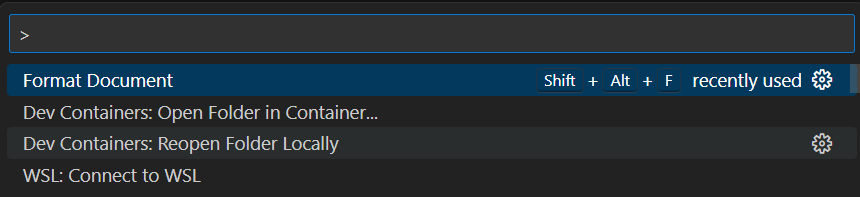

## React to github page

This  object here is to add a couple of markdown files to a React app, navigate between views of the two files and deploy as a github page.

The markdown files will be the svelte presentation and markdown descriptions, but the pages are being displayed in a react app.

This will demonstate how react router version 7 can be used to navigate between different views of components in a react app.  It will also show how a layout file can be used to provide navigation on each page.

### Setup

A blank folder named "Routing" should be created for this development and a new container will be created for this.  To use the latest versions of Vite and React-router the latest LTS version of node and a recent npm should be used.  Visual studio will call a recent version when it is run but the node version manager can be used to bring this up to the current long term support version.

Setting up the container for development issue 
> CTRL +SHIFT + P  

from visual studio code and open the "Routing" folder in a container.

> Add configuration to workspace

Add Dev Container Configuration files

> Node.js & Typescript

Select the latest version of node available.

>22-bookworm

Do not add any additional features.
Do not include optional files/directories.

Check the node version.

> node --version

```code
v22.9.0
```
Look to [nodejs.org](https://nodejs.org/en/) to confirm the latest LTS version.  At the time of writing this has just 
changed to v24.11.0 so this is the targer version.

The [node version manager](https://www.nvmnode.com/) can be used to install and use this version.

To install nvm on linux (which your container is running) use the install script.

>curl -o- https://raw.githubusercontent.com/nvm-sh/nvm/v0.39.3/install.sh | bash

Now set the node version to the latest LTS.

> nvm install --lts

```code
Installing latest LTS version.
Downloading and installing node v24.11.0...
Downloading https://nodejs.org/dist/v24.11.0/node-v24.11.0-linux-x64.tar.xz...
#################################### 100.0%
Computing checksum with sha256sum
Checksums matched!
Now using node v24.11.0 (npm v11.6.1)
```
Check the typescript compiler version.

> tsc --version

```code
Version 5.6.3
```
The latest version of typescript and its release notes can by found on github at [typescript releases](https://github.com/microsoft/typescript/releases)

At the time of writing the latest version is 5.9.3, but version 5.6.3 is the latest stavle build.

>npm install -g typescript@latest

Will update to the latest stable version so still 5.6.3.

Install vite.

>npm install vite 

Package json in the root of the routing folder should now include

```json
{
  "dependencies": {
    "vite": "^7.1.12"
  }
}
```
Now need to initialise vite for a react typescript project.

> npm init vite

```code
Need to install the following packages:
create-vite@8.0.2
Ok to proceed? (y) 

> y

```code
> npx
> "create-vite"

│
◆  Project name:
│  vite-project
└
```
> type over vite-project and enter.

```code
◆  Select a framework:
│  ● Vanilla
│  ○ Vue
│  ○ React
│  ○ Preact
│  ○ Lit
│  ○ Svelte
│  ○ Solid
│  ○ Qwik
│  ○ Angular
│  ○ Marko
│  ○ Others
└
```

> Select React and enter.

```code
◆  Select a variant:
│  ● TypeScript
│  ○ TypeScript + React Compiler
│  ○ TypeScript + SWC
│  ○ JavaScript
│  ○ JavaScript + React Compiler
│  ○ JavaScript + SWC
│  ○ React Router v7 ↗
│  ○ TanStack Router ↗
│  ○ RedwoodSDK ↗
│  ○ RSC ↗
└
```
Stick with TypeScript, this will allow react router to be added manually and give more control over the versions used.

```code
◆  Use rolldown-vite (Experimental)?:
│  ○ Yes
│  ● No
└
```

Dont use the experimental rolldown-vite.

```◆  Install with npm and start now?
│  ● Yes / ○ No
└
```
Yes install with npm and start now.

```code
◇  Scaffolding project in /workspaces/Routing 2/vite-project...
│
◇  Installing dependencies with npm...
```
> cd vite-project 

and note the contents of package json

```json
{
  "name": "vite-project",
  "private": true,
  "version": "0.0.0",
  "type": "module",
  "scripts": {
    "dev": "vite",
    "build": "tsc -b && vite build",
    "lint": "eslint .",
    "preview": "vite preview"
  },
  "dependencies": {
    "react": "^19.1.1",
    "react-dom": "^19.1.1"
  },
  "devDependencies": {
    "@eslint/js": "^9.36.0",
    "@types/node": "^24.6.0",
    "@types/react": "^19.1.16",
    "@types/react-dom": "^19.1.9",
    "@vitejs/plugin-react": "^5.0.4",
    "eslint": "^9.36.0",
    "eslint-plugin-react-hooks": "^5.2.0",
    "eslint-plugin-react-refresh": "^0.4.22",
    "globals": "^16.4.0",
    "typescript": "~5.9.3",
    "typescript-eslint": "^8.45.0",
    "vite": "^7.1.7"
  }
}
```

Edit the dev and preview scripts with --host to allow access from outside the container.


```json
"scripts": {
    "dev": "vite --host",
    "build": "tsc -b && vite build",
    "lint": "eslint .",
    "preview": "vite preview --host"
  },


This app will use the [react router version 7](https://reactrouter.com/en/main) so still in the vite-project folder install the required packages.

> npm install react-router-dom

> npm  install react-router
 
Next install [React bootstrap]( https://react-bootstrap.netlify.app/) 

This is  utility which will be useful to allow bootstrap navigation to be used with the react-router-dom should also be installed.  This requires bootstrap to be installed as well, so both can be installed together.

> npm install react-router-bootstrap bootstrap 

Package json at the root of the react24 folder should now include

```json
      "dependencies": {
        "bootstrap": "^5.3.8",
        "react": "^19.1.1",
        "react-dom": "^19.1.1",
        "react-router": "^7.9.5",
        "react-router-bootstrap": "^0.26.3",
        "react-router-dom": "^7.9.5"
      },

Now add markdown handling, just for this particular project
 
> npm install react-markdown --save

Package json in the react25 folder should now be:

```json
{
  "name": "vite-project",
  "private": true,
  "version": "0.0.0",
  "type": "module",
  "scripts": {
    "dev": "vite --host",
    "build": "tsc -b && vite build",
    "lint": "eslint .",
    "preview": "vite preview --host"
  },
  "dependencies": {
    "bootstrap": "^5.3.8",
    "react": "^19.1.1",
    "react-dom": "^19.1.1",
    "react-markdown": "^10.1.0",
    "react-router": "^7.9.5",
    "react-router-bootstrap": "^0.26.3",
    "react-router-dom": "^7.9.5"
  },
  "devDependencies": {
    "@eslint/js": "^9.36.0",
    "@types/node": "^24.6.0",
    "@types/react": "^19.1.16",
    "@types/react-dom": "^19.1.9",
    "@vitejs/plugin-react": "^5.0.4",
    "eslint": "^9.36.0",
    "eslint-plugin-react-hooks": "^5.2.0",
    "eslint-plugin-react-refresh": "^0.4.22",
    "globals": "^16.4.0",
    "typescript": "~5.9.3",
    "typescript-eslint": "^8.45.0",
    "vite": "^7.1.7"
  }
}

```

### Routing

The final src folder structure will be as follows:


The main.html file (outside the src folder) will include a script tag to the /src/main.tsx which will render react content to a  div of id "root" in the index.html file.

The main.tsx file will render the router component.

The router will be defined in components/Routes.tsx and this will import the app and the pages home, display and nomatch.

Modify the index.htlml to

**index.html**
```html
<!doctype html>
<html lang="en">
  <head>
    <meta charset="UTF-8" />
    <link rel="icon" type="image/svg+xml" href="/vite.svg" />
    <meta name="viewport" content="width=device-width, initial-scale=1.0" />
    <title>IT presentation and Tutorial</title>
  </head>
  <body>
    <div id="root"></div>
    <script type="module" src="/src/main.tsx"></script>
  </body>
</html>
```
The only change is to the title tag.

For the main.tsx file, add the imports for react and react-dom together with the Router provider andthe router.

Bootstrap css is also imported here so that the bootstrap styles are available throughout the app.

The only JSX element returned is the ```<RouterProvider>``` which includes the routes imported by from router.

**main.tsx**
```javascript
import 'bootstrap/dist/css/bootstrap.min.css';
import React from 'react'
import ReactDOM from 'react-dom/client'
import { RouterProvider } from "react-router-dom";
import { router } from "./router";
import './index.css'

ReactDOM.createRoot(document.getElementById('root')!).render(
  <React.StrictMode>
    <RouterProvider router={router} />
  </React.StrictMode>,
)
```

React Roter7 uses a different approach to routing from earlier versions.  The routes are created using the createBrowserRouter function and then provided to the app using the RouterProvider component.

Because this app is planned to be hosted on github pages the createHashRouter should be used instead of createBrowserRouter.  This will ensure that the routing works correctly when the app is hosted on github pages.  However the default for general development should be createBrowserRouter so that the urls are cleaner.

The general functon of a router is to provide navigation between different views of components in a react app.  The client requests a particular url path and the router provides the appropriate component to display.  All the content for the different views is preloaded in the app so that navigation is quick and does not require calls to the server.

In a traditional approach the router would identify a page such as "tutorial" and that page would be responsible for loading the content it requires.  That would mean asynchronous calls to the server to fetch content could be made from many pages in the application and these calls could use "fetch" or the "axios" library.  

The react router 7 approach is different because for each route the router can also provide a loader function which will fetch any content required for that page before the page is rendered.  This means that all the content required for a page is preloaded before the page is displayed.  This can make navigation quicker and more reliable because all the content is available when the page is rendered.

In this arrangeent the router will fetch the markdown files required for each page and provide this to the page component when it is rendered.

The routes incude a path "/" and also "/home" which will both render the home page component.

The "/presentation" and "/tutorial" paths will both use the ```<Display>``` component but will load markdown data from the appropriate file, presentation.md or tutorial.md.

The paths to the markdown files are defined at the start of the router file.  These paths are relative to the public folder because when the app is built for production the public folder is used to provide static assets.

In case of an invalid path being requested the "*"" path will render the ```<NoMatch>``` component to display an error message.

**router.tsx**
```javascript
import { createHashRouter } from "react-router-dom";
import App from "./App";
import Home from "./components/Home";
import Display from "./components/Display";
import NoMatch from "./components/NoMatch";

// Ensure these paths are correct relative to the public directory
const presentationPath = "/src/assets/page1/Presentation.md";
const tutorialPath = "/src/assets/page2/Tutorial.md";

export const router = createHashRouter([
    {
    path: "/",
    element: <App />,
    children: [
        {
        path: "/",
        element: <Home />,
        },
        {
        path: "/home",
        element: <Home />,
        },
        {
        path: "/presentation",
        element: <Display />,
        loader: async () =>
            fetch(presentationPath)
                .then((res) => res.text())
                .catch((error) => console.error("Error loading markdown:", error)),
        },
        {
        path: "/tutorial",
        element: <Display />,
        loader: async () =>
            fetch(tutorialPath)
                .then((res) => res.text())
                .catch((error) => console.error("Error loading markdown:", error)),
        },
        {
        path: "*",
        element: <NoMatch />,
        },
    ]
    },
]);
```

Note that as soon as a path starts with a "/" it renders the element at the root level.  So all paths here render the ```<App>``` component first.  Then the children paths are evaluated to render the appropriate component within the app.

The <App> component will act as a layout page and will include an ``<Outlet>`` element which will render the child components.

The <App> imports a header component to provide navigation on each page and the ``<Outlet>`` component from react-router-dom.

**App.tsx**
```javascript
import { Outlet } from 'react-router-dom';
import Header from './components/Header';

function App() {
  return (
    <>
      <Header />
      <div className="container pt-5">
        <Outlet />
      </div>
    </>
  );
}

export default App;
```

The ``<Header>`` component will provide navigation links to the home page, presentation and tutorial pages.

Most of the code is standard bootstrap navbar code, but instead of using anchor tags with href attributes to provide navigation, the ``<NavLink>`` component from react-router-dom is used.  This will provide client side navigation without calls to the server.

The fixed-top class is used to keep the navbar at the top of the page when scrolling.

**Header.tsx**
```javascript
import { NavLink } from 'react-router-dom';

function Header() {
  return (
    <nav className="navbar navbar-expand-lg navbar-light bg-light fixed-top shadow-sm">
      <div className="container-fluid">
        <NavLink className="navbar-brand" to="/">Svelte</NavLink>
        <button
          className="navbar-toggler"
          type="button"
          data-bs-toggle="collapse"
          data-bs-target="#mainNavbar"
          aria-controls="mainNavbar"
          aria-expanded="false"
          aria-label="Toggle navigation"
        >
          <span className="navbar-toggler-icon" />
        </button>
        <div className="collapse navbar-collapse" id="mainNavbar">
          <div className="navbar-nav ms-auto">
            <NavLink className="nav-link" to="/">Home</NavLink>
            <NavLink className="nav-link" to="/presentation">Presentation</NavLink>
            <NavLink className="nav-link" to="/tutorial">Tutorial</NavLink>
          </div>
        </div>
      </div>
    </nav>
  );
}

export default Header;
```

Whenthe router calls the ``<Home>`` component does not need any special handling because it is just a static page containing some welcome text.

This page is writtenas a functional component returning JSX.

**Home.tsx**
```javascript
const Home: React.FC = () => {
    return (
        <div style={{ fontFamily: "Arial, sans-serif", textAlign: "center", padding: "2rem" }}>
            <header style={{ marginBottom: "2rem" }}>
                <h1>Group Presentation</h1>
                <p>Todays topic!</p>
            </header>
            <main>
                <section style={{ marginBottom: "2rem" }}>
                    <h2>About Us</h2>
                    <p>
                        We are internet technologies group A consisting of members: a,b,c,d
                    </p>
                </section>
                <section>
                    <h2>Contact Us</h2>
                    <p>Email: contact@ourcompany.com</p>
                </section>
            </main>
            <footer style={{ marginTop: "2rem", fontSize: "0.9rem", color: "#555" }}>
                Generated for Internet Technologies 2025
            </footer>
        </div>
    );
};

export default Home;
```

When the navigaiton bar is used to select either the presentation or tutorial pages the ``<Display>`` component is rendered.

The router within the loader function has already fetched the markdown content required for the page and this is made available to the component using the useLoaderData hook from react-router-dom.  

In this example the content is simply cast to a string and stored in the content constant which is then rendered using the ReactMarkdown component from the react-markdown library.

**Display.tsx**
```javascript
import ReactMarkdown from "react-markdown";
import { useLoaderData } from 'react-router-dom';

const Display: React.FC = () => {
  const content = useLoaderData() as string;

  return (
    <div className="markdown-container" style={{ padding: 20 }}>
      <ReactMarkdown>{content}</ReactMarkdown>
    </div>
  );
};
```

In case and invalid path is requested the ```<NoMatch>``` component will be rendered.  This is a simple functional component which returns an error message.

**NoMatch.tsx**
```javascript
import React from "react";

function NoMatch() : React.JSX.Element {
    return (
      <div style={{ padding: 20 }}>
        <h2>404: Page Not Found</h2>
        <p>The page selected does not exist.</p>
      </div>
    );
  }
  export default NoMatch
```

### Displaying markdown.

The Display component will display  markdown files which have been stored with their images in the assets folder separately within page 1 and page 2 folders.


For me these are in src5 folder, but you may have a different folder name here.

The markdown files are similar to their original form, but because they are now in a new folder structure the paths to the images has changed and each needs to be modified to reflect this.

The images are now addressed relative to the root of the project so the paths need to start with /src/assets/page1/images/ or /src/assets/page2/images/ as appropriate.

For example an extract from **SveltePresentation.md** will be modified to:

```markdown
## Svelte Presentation

React is one of many frameworks which could be used for web app development, here is a brief introduction to an alternative which is popular with developers.

Most of the information here is drawn from the [Svelte Website](https://svelte.dev/) and if this taster is appealing you should follow up by going through the full tutorial sequence on that site.


Presentation front page with presenter names and appropriate theme.


React initially seems like a single framework so it may initially look as though Svelte is a framework and SvelteKit is some kind of development environment.
```

Take care that the case of PNG matches the image files.


## Building a distribution file

In order to deploy the app to github pages a production build of the app is required.

Close the development server 

> CTRL + C

Before proceeding check that the case of any .png or .PNG images is correct.  The development server is not case sensitive, but the build process is.

In the public folder make a folder src to match the one already used and copy the assets into this.

The build process uses the assets in the public folder.


Then build the project

> npm run build

The build can be previewed

> npm run preview

The preview runs on port 4173.  Check that this works properly.


And the links should also be tested.


Stop the development server.

> CTRL + C

Make sure that all editor files are closed and then 

>CTRL + SHIFT + P


Reopen the container locally.



Now copy the files into a local folder


Confirm that you can run these with the live server in visual studio code.  These files are all you need to run the app from an html server.