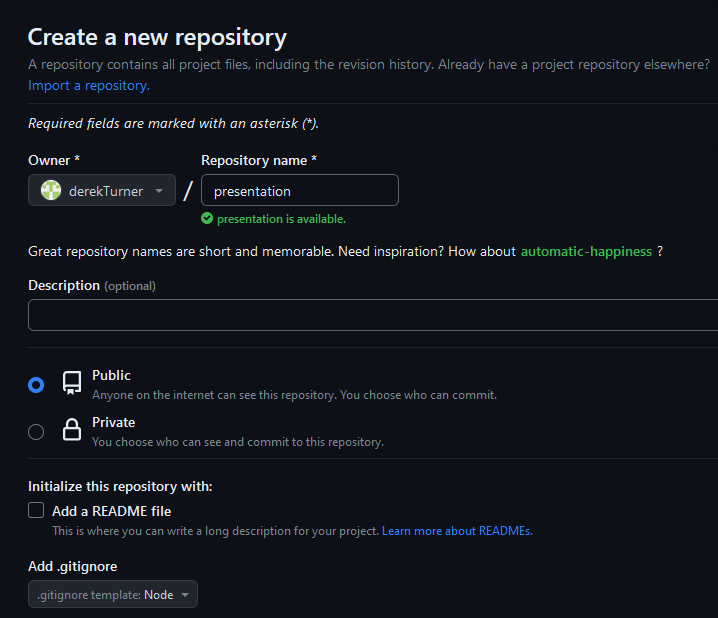
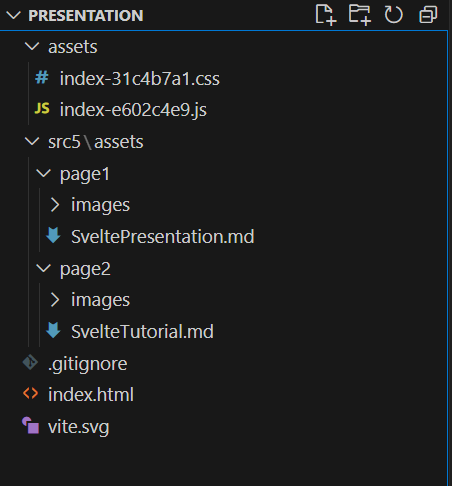
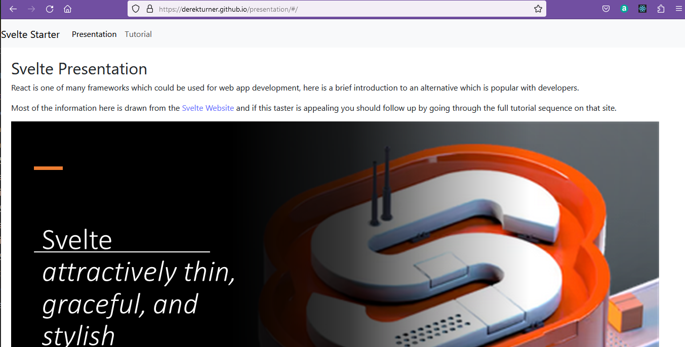

## Github pages

Web pages and apps can be deployed on github pages, however if you try this with the current application it will not work.

[GM Fuster](https://gmfuster.medium.com/deploying-a-react-app-to-github-pages-24c3e5485589) suggests the reasons for this.

1. The directory to the github repo will need to be accessed by the app.
2. Github pages can't use the Browser Router because they interpret the path of all but the indes page as a path to a page which does not exist and return a 404 error.

Many references use the gh-pages package to automate the deployment of gh-pages, but in this section I will deploy manually so that only the essential differences between local/html server and github pages are made.

Many references assume that the "create-react-app" template has been used to create the app and this is not the case if Vite is used, so there is specific [deployment advice for vite](https://vitejs.dev/guide/static-deploy.html#github-pages).

Addressing the first point, for github pages, a base must be set in the vite.config.ts site.

If you are deploying to

 ``https://<USERNAME>.github.io/<REPO>/``
 
 , for example your repository is at 
 
 ``https://github.com/<USERNAME>/<REPO>``
 
 , then set base to ``'/<REPO>/'``.

I will be deploying to a repository named 'presentation' so vite.config.ts becomes:

```javascript
import { defineConfig } from 'vite'
import react from '@vitejs/plugin-react'

// https://vitejs.dev/config/
export default defineConfig({
  plugins: [react()],
  base: `/presentation/`,
})
```
The second point is addresed by using the [react router ```<HashRouter>```](https://reactrouter.com/en/main/router-components/hash-router).  This is recommended for use when the URL should not be sent to the server.

HashRouter should not be selected for general usage, only where it is genuinely needed.

Modify **components/Routes.tsx** to import and use createHashRouter.

**components/Routes.tsx** 
```javascript
import React from "react";
import {
  createHashRouter,
  RouterProvider,
} from "react-router-dom";
import Presentation from "./Presentation";
import Tutorial from "./Tutorial";
import NoMatch from "./NoMatch";
import Header from "./Header";

function Routes() : React.JSX.Element {

  const Routes =  createHashRouter([
    {
      path: "/",
      element: (<><Header/><Presentation /></>),
    },
    {
      path: "/tutorial",
      element: (<><Header/><Tutorial /></>),
    },
    {
      path: "*",
      element: <NoMatch />,
    },
  ], {
    basename: ''
});

  return <RouterProvider router={Routes} />;  
}
export default Routes;
```


Now build the app again.

> npm run build

The files in the dist folder are updated.

Make sure that all editor files are saved and then 

>CTRL + SHIFT + P

Reopen the container locally.


Make a new github repository named presentation with gitnore node.



Use github desktop to clone this to the local machine.


Copy the contents of the dist folder from the reactTS23 local folder to the presentation folder.


Open this folder in visual studio, so now you are editing local files in the presentation folder, not files in the ReactTS23 folder! 

Because the site base is ``presentation`` this damages the addressing in the md files wich pick up the presentation prefix twice.  To correct for this use replace to set the addresses to /../presentation/src5

The listing of src5/assets/page1/SveltePresentation.md is listed here, but the code sections do not display well when the markdown is embedded in markdown here:

<pre>
## Svelte Presentation

React is one of many frameworks which could be used for web app development, here is a brief introduction to an alternative which is popular with developers. 

Most of the information here is drawn from the [Svelte Website](https://svelte.dev/) and if this taster is appealing you should follow up by going through the full tutorial sequence on that site.


Presentation front page with presenter names and appropriate theme.


React initially seems like a single framework so it may initially look as though Svelte is a framework and SvelteKit is some kind of development environment.

However, Svelte is actually a compliler to javascript modules which produces a very small code footprint.  SvelteKit is the framework.

Come to think of it React is not sufficient on its own you customarily include React Dom and may need other elements such as React Router.

### Svelte


The Svelte website has a good sequence of tutorials presented within an interactive online editor.

The four sections discuss basic and advanced Svelte and then basic and advanced SvelteKit framework.

I hope that by following quickly through the first few sections of the svelte tutorial and the first few of the basic SvelteKit we can gain enough awareness of the syntax to follow through the operation of the svelte demo application.


First the svelte syntax.  The page has a script section and an html like section.

A script variable, name, can be passed as a property into the presentation section.  Since it is a string, string functions can be applied to it.


Variables can also be included as properties in the attributes of an html element.

Where the variable name is chosen to match the attribute name a short form syntax can be used.


Style tags placed in a file apply their style to the scope of the file.


If a paragraph is imported into the page from a separate file, it does not pick up the style from the importing files style tags.


Whilst React would try to interpret `<strong/>` as JSX, svelte does not interpret this by default so the result of line 5 is to print the text literally.

The inclusion on line 6 of @html causes the html to be interpreted and produce bold text.


This script provides a counter defined outside a function which increments it.   No need to use hooks at this point.

The button element has an on attribute for mouse click which will call the increment function when the mouse is clicked.

Line 11 is a standard javascript short format if then else structure which ensures that if the count is exactly 1 the button will display the singular term of 'time'.


The $: syntax introduces a reactive variable which will result in an update of the display when it is changed.  This maintains the value of doubled as count * 2.  Note that the $: syntax is not needed in the display line 15.


The last basic example reviewed here is the array example.  The svelte syntax does not introduce much new, but this is a good reminder of some javascript syntax.

... spreads the array elements out and then another element is added.  This makes numbers in line 5 change when the addNumber function is called.
Some syntax variations which might look ok would not cause a change in a manner which would trigger a change in display through the reactive variable 'sum'.

A reducer is a function which acts on an array to evaluate a single numerical result, in this case the sum of array elements.

A join produces a string representation of the array whith a selected delimiter.


To learn more you should continue to work through the svelte tutorial examples yourself, but for now jump forward to get an introduction to the SvelteKit syntax.

### SvelteKit


The website lists some of the features provided by SvelteKit.  This includes routing (without needing a separate router) and server side rendering.  Svelte will need to run on a suitable server.  For development the Vite development server is appropriate.

The structure of the project directory includes a `src` folder with the app.html and a routes folder with at least on `+pages.svelte` file.


The html file contains a `<div>` which displays %sveltekit.body% this is the location where the svelteKit output will be rendered.

There is no link required, the file which provides the output is the first `+page.svelte` in the routes folder.


A second display page can be added within a nested folder within routes.  The name of the folder, 'about' will provide the adress for navigation.  So this is unlike a web page navigation there is not an http://filename call.

The routing syntax is simple and straightforward.


It would not be efficient to include the same navigation code on every page which needed it so the code can be incorporated into a layout.

The `<slot/>` is the location on the layout where the content from the individual pages will be rendered.


Hopefully that is enough to be able to read through a demo file running in a docker development container.

## Demo App


Start Docker desktop.

Create and empty folder and then using CTRL + P ask the remote container plugin to open it in a container.  Follow the prompts to select a node plus typescript container and allow time for this to download content.

When the container is ready check the version of node.

Now create a svelte app using the latest svelte version.

Follow the choice which creates the demo app.


Make choices to use Typescript syntax and to add the prettier code formatter.


With no further options selected the project comes to completion.

There are a range of plug-ins for svelte which can be reviewed on github, however these are not required for the simple demonstration.


The package json file reflects the available vite scripts and the dependancies.


Change directory to the application folder and install the dependancies.

After a wait the project is ready to run on the vite server with npm run dev.


The demo includes a navigation menu, a welcome image, some text and a counter.  These elements will be brought in from smaller files.


The Sverdle demo game mimics the operation of the popular wordle site which gives the option to guess a five letter word.  Correctly guessed letters have a border added and correctly placed letters are highlighted.

Incorrectly guesse letters are grayed out on the alphabet display.


An example game is played out here from the first guess of 'bread' to the final correct word 'icily'.  Because the source words are provided from the server there is nothing in the browser which could allow the player to cheat.


Looking over the demo code the html has a place for sveltekit head and sveltekit body.  There is nothing of the displayed content here.


The layout provides the common content for all pages which includes text imnported from Header.svelte.

The `<slot/>` in the main section is where individual page details will render.


The home page is the first `+page.svelte` in the routes folder.

This includes the header information with the title 'home'.

The counter is read from the counter file.  There is no need for an import statement, just use the `<Counter />` element reference.


The navigation bar is in the Header file which is called into the top of the layout for all pages in the app.


As with React, the application can be built on Vite and previewed to check that it is working.  The use of a different port indicates that this is a build preview.


Unlike react, the output is not an html/javascript file which can run from the live server.  

To deploy the user must first install an adapter and then edit the svelte.config.js file to mathch the deployment target, such as a node server in this example.


A number of deployment targets exist and this does include a static HTML page where this is right for the application.


Looking at use cases on the svelte website it is evident that well functioned applications can be produced.


Here data visualisation is shown on a svelte page.

The companies are real and significant, but tend not to be the larger companies which are still using the commercially supported frameworks such as react.


If you are willing to work with a system which is not as popular as the main players there is a benefit in code of server side rendering and a syntax which becomes comfortable to work with.

</pre>

And in a similar way the listing of src5/assets/page2/SvelteTutorial becomes:

<pre>
## Svelte Tutorial

### Setup

The object here is to demonstrate that Svelte can be used as an effective alternative to React to display the list of users from the typicode API.  You can be the judge of whether the syntax is more or less comfortable to work with.  If you want to go further you can extend to read from other typicode API content.

To start off I will make a new github repository named SvelteTS23 and clone this to my local machine.

Within visual studio code open this folder in a container which is for node and typescript.


Choose the recent version of node.


Choose no additional options.


Allow time for the DevContainer to start, then check the node version.

> node --version

```code
v20.3.1
```

Now create a svelte app using the latest version.

> npm create svelte@latest my-app

```code
Need to install the following packages:
  create-svelte@5.1.1
Ok to proceed? (y) 
```

Yes to proceed (y).

Select a skeleton project rather than a demo file or library project.

```code
create-svelte version 5.1.1

┌  Welcome to SvelteKit!
│
◆  Which Svelte app template?
│  ○ SvelteKit demo app
│  ● Skeleton project (Barebones scaffolding for your new SvelteKit app)
│  ○ Library project
└
```

Use Typescript

```code
 Welcome to SvelteKit!
│
◇  Which Svelte app template?
│  Skeleton project
│
◆  Add type checking with TypeScript?
│  ○ Yes, using JavaScript with JSDoc comments
│  ● Yes, using TypeScript syntax
│  ○ No
```

Add prettier code formatting.

```code
Select additional options (use arrow keys/space bar)
│  ◻ Add ESLint for code linting
│  ◼ Add Prettier for code formatting
│  ◻ Add Playwright for browser testing
│  ◻ Add Vitest for unit testing
```

Code is ready!

```code
  Your project is ready!

✔ Typescript
  Inside Svelte components, use <script lang="ts">

✔ Prettier
  https://prettier.io/docs/en/options.html
  https://github.com/sveltejs/prettier-plugin-svelte#options

Install community-maintained integrations:
  https://github.com/svelte-add/svelte-add

Next steps:
  1: cd my-app
  2: npm install
  3: git init && git add -A && git commit -m "Initial commit" (optional)
  4: npm run dev -- --open

To close the dev server, hit Ctrl-C

Stuck? Visit us at https://svelte.dev/chat
```

Don't bother to update the npm version.

```code
npm notice 
npm notice New major version of npm available! 9.6.7 -> 10.2.0
npm notice Changelog: https://github.com/npm/cli/releases/tag/v10.2.0
npm notice Run npm install -g npm@10.2.0 to update!
npm notice 
```

> cd my-app

Install the dependancies currently in package.json

> npm install

This takes a while.

```code
12 packages are looking for funding
  run `npm fund` for details

3 low severity vulnerabilities

To address all issues (including breaking changes), run:
  npm audit fix --force

Run `npm audit` for details.
```
Svelte has onlyrecently moved to version 4 and has gone up in version to 4.2.1 so adjust my-app/package.json to use the latest version.

```json
	"devDependencies": {
		"@sveltejs/adapter-auto": "^2.0.0",
		"@sveltejs/kit": "^1.20.4",
		"prettier": "^2.8.0",
		"prettier-plugin-svelte": "^2.10.1",
		"svelte": "^4.2.1",
		"svelte-check": "^3.4.3",
		"tslib": "^2.4.1",
		"typescript": "^5.0.0",
		"vite": "^4.4.2"
	},
```

Sveltestrap is not fully updated to Svelte version 4 so as a work around cd .. back to the folder SvelteTS23 and add add a package.json file.

```json
{
    "dependencies": {
        "svelte": "^3.59.2",
        "sveltestrap": "^5.11.2",
        "vite":"4.4.11"
    }
}    
```

> npm install

Now change directory back to my-app.

>cd my-app

> npm install --save sveltestrap svelte

Finally install the axios library to retrieve json data from a rest API.

> npm i axios@1.5.1

### Svelte code

Check the contents of app.html in the src folder

app.html
```html
<!DOCTYPE html>
<html lang="en">
	<head>
		<meta charset="utf-8" />
		<link rel="icon" href="%sveltekit.assets%/favicon.PNG" />
		<meta name="viewport" content="width=device-width, initial-scale=1" />
		%sveltekit.head%
	</head>
	<body data-sveltekit-preload-data="hover">
		<div style="display: contents">%sveltekit.body%</div>
	</body>
</html>
```

Then start to edit +page.svelte in the routes folder.

```javascript
<svelte:head>
  <link rel="stylesheet" href="https://cdn.jsdelivr.net/npm/bootstrap@5.3.0/dist/css/bootstrap.min.css">
</svelte:head>
```
Sveltestrap is only a wrapper for bootstrap and does not include the bootstrap CSS.  This can be included in a number of different ways described on the sveltestrap site, but until versioning is completely compatible with Svelte 4 this is a reliable way to bring the css in from a contend delivery network.

This code will insert into the head of the html file.

```javascript          

<script lang="ts">
  import { onMount } from "svelte";
  import axios from "axios";
  import { Card,
    CardBody,
    CardFooter,
    CardHeader,
    CardSubtitle,
    CardText,
    CardTitle } from "sveltestrap"; 
```
The lang="ts" identifies this script as typescript.

The import of onMount allows svelte to perform programmed functions when the page loads.

Axios is the library to retrieve JSON from the rest API.  This can be used as an alternative to fetch as discussed by [David Adeneye](https://www.sitepoint.com/svelte-fetch-data/).

The Card elements are imports from the sveltstrap library.  [The components available are listed](https://sveltestrap.js.org/v4/?path=/story/components--get-started).


```javascript

const endpoint = "https://jsonplaceholder.typicode.com/users";

interface Company{
  name:string
  catchPhrase:string;
  bs:string;
}

interface User {
  id: number;
  name: string;
  email: string;
  company:Company;
}

let values: User[] = [];
```
The endpoint is defined as a convenience.

For typescript the array of values must have a type of structure which matches the JSON data so interfaces are set up to match the data.


```javascript
onMount(async function () {
  const response = await axios.get(endpoint);
  console.log(response.data);
  values = response.data;
});

</script>
```
The asynchronous function retrieves data from the endpoint and stores response data into the values array.

```javascript

{#each values as item}               
<Card color="success">
  <CardHeader>
    <CardTitle>{item.name}</CardTitle>
  </CardHeader>
  <CardBody>
    <CardSubtitle>{item.email}</CardSubtitle>
    <CardText>
      {item.company.name}
    </CardText>
  </CardBody>
  <CardFooter>    
      {item.company.catchPhrase}
  </CardFooter>
</Card>
<br/>
{/each}
```

The #each ... /each syntax iterates around the values array storing one array element as item on each iteration.

item has the sturucture of a User so its company fields can be accessed and information is rendered on screen.

A color is added to the card, you can experiment with the styling of the card.

The full listing is 
**my-app/src/routes/+page.svelte**
```javascript
<svelte:head>
  <link rel="stylesheet" href="https://cdn.jsdelivr.net/npm/bootstrap@5.3.0/dist/css/bootstrap.min.css">
</svelte:head>
          

<script lang="ts">
  import { onMount } from "svelte";
  import axios from "axios";
  import { Card,
    CardBody,
    CardFooter,
    CardHeader,
    CardSubtitle,
    CardText,
    CardTitle } from "sveltestrap"; 


const endpoint = "https://jsonplaceholder.typicode.com/users";

interface Company{
  name:string
  catchPhrase:string;
  bs:string;
}

interface User {
  id: number;
  name: string;
  email: string;
  company:Company;
}

let values: User[] = [];

onMount(async function () {
  const response = await axios.get(endpoint);
  console.log(response.data);
  values = response.data;
});

</script>

{#each values as item}               
<Card color="success">
  <CardHeader>
    <CardTitle>{item.name}</CardTitle>
  </CardHeader>
  <CardBody>
    <CardSubtitle>{item.email}</CardSubtitle>
    <CardText>
      {item.company.name}
    </CardText>
  </CardBody>
  <CardFooter>    
      {item.company.catchPhrase}
  </CardFooter>
</Card>
<br/>
{/each}


<card >
	{#each values as item}
                  <option value={item.id}>{item.name}</option>
                {/each}
</card>
```

The working output is then:


The Svelte code is pretty straight forward, the biggest difficulty was the versioning changes around the style sheet code, that should be fixed in time.
</pre>


## Deploy

Check that the html file poits to all the correct files.

**index.html**
```html
<!doctype html>
<html lang="en">
  <head>
    <meta charset="UTF-8" />
    <link rel="icon" type="image/svg+xml" href="/presentation/vite.svg" />
    <meta name="viewport" content="width=device-width, initial-scale=1.0" />
    <title>Vite + React + TS</title>
    <script type="module" crossorigin src="/presentation/assets/index-e602c4e9.js"></script>
    <link rel="stylesheet" href="/presentation/assets/index-31c4b7a1.css">
  </head>
  <body>
    <div id="root"></div>
    
  </body>
</html>
```
Check that the vite svg figure is in the dist.



Now use github desktop to commit and upload the presentation files to the repository.


You should now see the github page



To confirm that my version is working go to the [Svelte Presentation](https://derekturner.github.io/presentation/#/)

You may need to exercise a bit of patience to get your own pages working, adapting them for github needs to be done with care.