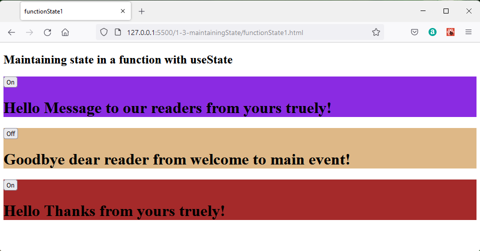
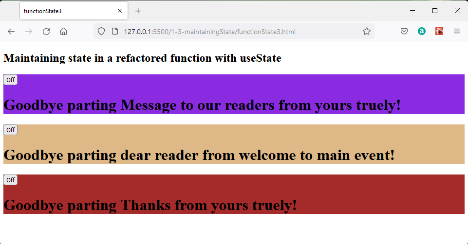

## Maintaining State with Functions

What maintaining state means is providing stored memory which can be associated with classes and functions and is available each time the class or function is called.

A normal javaScript function would not maintain state so the introduction of hooks is a React feature and not a javaScript feature.

### React Hooks


Functions are simpler to use than classes and can allow us to avoid some idiosynchratic syntax such as their not needing to bind to *this*.

Unfortunately when a javascript function is invoked memory is created and the function runs, on completion this is disposed so the function does not retain any state information.  When it is called for the second time it can not respond to reflect any activity from the first call.

One way round this would be to have some global variables which are read and modified by the function,  but this has a practical disadvantage:

* The function cannot be reused in another programme unless all the relevant global variables on which it depends are identifed and copied over and in thes copying no naming conflicts arise.

For many years object oriented programming has been the dominant programming approach, but now functional programming is becoming popular.  This claims a number of advantages including application scaleability.

The essence of functional programming is that all functions used should be pure:

* The action or returned value of a function is determined only by the arguments provided to the function and should be completely predictable.

A function which refers to a global variable to generate a response is not pure because the result depends on some external value rather than the arguments.

One solution might be to pass the value of the global variable in as an argument to the function.  However this still means the function is not stand alone.

> A react hook is a function which when called returns a structure which includes a way to interact with state.

There are a number of react hooks the basic ones are:

* useState
* useEffect
* useContext
  
Other hooks include:

* useRef
* useReducer
* useMemo
* useCallback
* useLayoutEffect
* useDebugValue

The **useState** hook is the one we require to add state to functions.

### Maintaining state with the useState hook

Working files **functionState1.html** and **functionState1.js**

The first step is normally to import the useState hook from react.

```javascript
import {useState} from 'react'
```
This is the line you will need when working in a node environment.  Node is a javascript server and this line represents the app asking for the javascript module to make useState work.  

Because we are working without a development environment we should just keep this line commented out for now to prevent errors.

```javascript
//import {useState} from 'react'
```
This will mean that as a work around, our code will need to refer to

```javascript
React.useState();
```
whereas normally it would be fine just to write:

```javascript
useState();
```

The simplest example of a state is to have two alternative states which can be denoted by changing a boolean variable from true to false or back to true again.

Developing the earlier Message function so that it will display a message as hello or goodbye. 

A constant is added in the form of an array which will be populated by the output of the useState function when the Message function is called.  The array has two elements because useState returns two elements.

The first is  is a named variable which is initialised with the value of the state as defined by the parameter to .useState.  For this example this is *true*.  So greet has the initial value of true.

The second element is a function which can subsequently be used change the state of the varable.  A naming convention makes the connection between the variable and its setter obvious.

```javascript
const [ greet, setGreet ] = React.useState(true);
```

Next we include within the function Message an event handler function which will be called when a button rendered inside the Message function is clicked.  

It would be possible if there were multiple buttons to read the value of the clicked button to see which was clicked and determine how to respond.  However in this case there is only one button and its value is not of interest, we just need to respond to it being clicked to change the state of the greet variabl.  When the button click is handled it will call the setGreet function to chang the value or the greet variable alternating between true and false.  The ! symbol inverts the logic value of greet.

```javascript
function handleClick(evt) {
  setGreet(!greet);
}  
```
In other programmes we may want within the event handling function to use the value from the element which launched the event in which case we could refer to 

```javascript
evt.target.value 
```
The Message function should return the JSX required which to display a button and this has an onClick attribute which will trigger the handleClick function when the button is clicked over by the mouse.

```javascript
  return (
    <span>
      <button onClick={handleClick}></button>
    </span>
  );
```

The handleClick function alternates the state of greet between true and false.  This can be indicated on the button by adding a value depending on the state of greet.

```javascript
  return (
    <span>
      <button onClick={handleClick}>{greet ? "On" : "Off"}</button>
    </span>
  );
```

Now a preface to the message as Hello or Goodbye can be added depending on the state of greet.

```javascript
  return (
    <span>
      <button onClick={handleClick}>{greet ? "On" : "Off"}</button>
      {greet ? (
        <h1>
          Hello {reader} from {author}!
        </h1>
      ) : (
        <h1>
          Goodbye {reader} from {author}!
        </h1>
      )}
    </span>
  );
```

The full listing of **functionState1.js** is:

```javascript
const header = ReactDOM.createRoot(document.getElementById("header"));
const main = ReactDOM.createRoot(document.getElementById("main"));
const footer = ReactDOM.createRoot(document.getElementById("footer"));

// import {useState} from 'react'

function Message({ reader, author }) {
  const [greet, setGreet] = React.useState(true);

  function handleClick(evt) {
    setGreet(!greet);
  }

  return (
    <span>
      <button onClick={handleClick}>{greet ? "On" : "Off"}</button>
      {greet ? (
        <h1>
          Hello {reader} from {author}!
        </h1>
      ) : (
        <h1>
          Goodbye {reader} from {author}!
        </h1>
      )}
    </span>
  );
}

header.render(
  <Message reader="Message to our readers" author="yours truely" />
);
main.render(<Message reader="dear reader" author="welcome to main event" />);
footer.render(<Message reader="Thanks" author="yours truely" />);

```
The messages are rendered in the header, main and footer sections and the buttons and state operate independantly in each section.


For example, when the button in the main element is toggled, the display changes only in this element.



### Refactoring useState example

In the first example the text for hello and goodbye was written in to the function.

```javascript
          {greet ? 
                  <h1>Hello   {reader} from {author}!</h1>
                  : 
                  <h1>Goodbye {reader} from {author}!</h1>
          }
```

These alternatives can be removed into sepatae functions greeting and parting These newly defined functions are expressed as constants within the Message function.

```javascript
    const greeting = () => <h1>Hello greeting  {reader} from {author}!</h1>;
    const parting  = () => <h1>Goodbye parting {reader} from {author}!</h1>;
```
The ternery expression which represents conditional execution is then simplified.

```javascript
{greet ? greeting() : parting() }
```
The code listing is then slightly shorter and easier to follow.

Full listing of **functionState2.js**:

```javascript
const header = ReactDOM.createRoot(document.getElementById("header"));
const main = ReactDOM.createRoot(document.getElementById("main"));
const footer = ReactDOM.createRoot(document.getElementById("footer"));

// import {useState} from 'react'

function Message({ reader, author }) {
  const [greet, setGreet] = React.useState(true);

  function handleClick(evt) {
    setGreet(!greet);
  }

  const greeting = () => (
    <h1>
      Hello greeting {reader} from {author}!
    </h1>
  );
  const parting = () => (
    <h1>
      Goodbye parting {reader} from {author}!
    </h1>
  );

  return (
    <span>
      <button onClick={handleClick}>{greet ? "On" : "Off"}</button>
      {greet ? greeting() : parting()}
    </span>
  );
}

header.render(
  <Message reader="Message to our readers" author="yours truely" />
);
main.render(<Message reader="dear reader" author="welcome to main event" />);
footer.render(<Message reader="Thanks" author="yours truely" />);
```

This renders as before so pressing two of the buttons:


You could now use class components or function components.  The general guidance is to move towards function components as the norm for new programme development.

### Further refactoring

Programmes can always be written in different ways to achieve the same results and this is refactoring. Each programmer will come to a different endpoint with refactoring because they will make different judgements on the criteria they are aiming for between:
    * Compact code
    * Ease of reading
    * Modular code reuse
    * Efficiency and speed of code

As an example of refactoring, instead of having two functions, greeting and parting, a single greeting function can be created which  returns a value depending on the state of the hello state variable.  

```javascript
  const greeting = () => {
    return greet ? (
      <h1>
        Hello greeting {reader} from {author}!
      </h1>
    ) : (
      <h1>
        Goodbye parting {reader} from {author}!
      </h1>
    );
  };
```

Also here the handleclick remains

```javascript
    function handleClick(evt) {
        setGreet(!greet);
    }  
```
which toggles the state of the hello variable.  But the display of the state of the variable is managed by a function label:

```javascript
    <button onClick={handleClick}>{label()}</button>
```
which pipes the state of the event from separate function:

```javascript
  const label = () => {
    return greet ? "On" : "Off";
  };
```
That sets the state of the button display depending on the state of the click.

The message can then be displayed by calling the greeting function.

```javascript
    {greeting()}
```

Now **functionState3.js** becomes:

```javascript
const header = ReactDOM.createRoot(document.getElementById("header"));
const main = ReactDOM.createRoot(document.getElementById("main"));
const footer = ReactDOM.createRoot(document.getElementById("footer"));

// import {useState} from 'react'

function Message({ reader, author }) {
  const [greet, setGreet] = React.useState(true);

  function handleClick(evt) {
    setGreet(!greet);
  }

  const greeting = () => {
    return greet ? (
      <h1>
        Hello greeting {reader} from {author}!
      </h1>
    ) : (
      <h1>
        Goodbye parting {reader} from {author}!
      </h1>
    );
  };

  const label = () => {
    return greet ? "On" : "Off";
  };

  return (
    <span>
      <button onClick={handleClick}>{label()}</button>
      {greeting()}
    </span>
  );
}

header.render(
  <Message reader="Message to our readers" author="yours truely" />
);
main.render(<Message reader="dear reader" author="welcome to main event" />);
footer.render(<Message reader="Thanks" author="yours truely" />);

```
The page operation is unchanged.



## Challenge

>Challenge: Write code based both the functional programming style to cycle around 5 different greeting messages each time the button is clicked.

>Challenge: Refactor your code examples so that 5 different sets of messages are cycled in each of the header, main and footer elements.


## References:

[Learn react hooks Daniel Bugl](https://www.packtpub.com/product/learn-react-hooks/9781838641443)

[useState documentation at react.dev](https://react.dev/reference/react/useState)