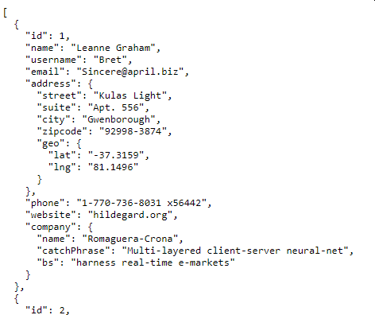
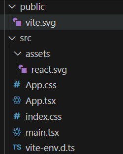
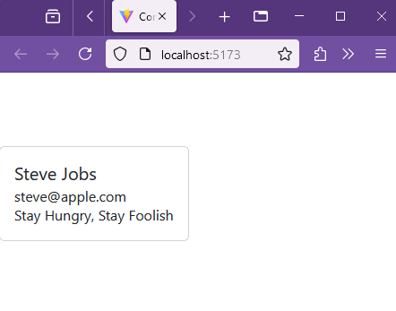

## Consume Json API

In this section we fetch information from a REST API and display the results.

## Sample Datasets

There is a json API for development at typicode.com. To view this browse to :

>https://jsonplaceholder.typicode.com/


On this page you will find a 'try it script', a link to a more detailed guide and and six common resources.

JSONPlaceholder comes with a set of 6 common resources:

/posts	100 posts

/comments	500 comments

/albums	100 albums

/photos	5000 photos

/todos	200 todos

/users	10 users


> http://jsonplaceholder.typicode.com/users

To generate sized photos for placeholder use try

> https://picsum.photos/

Another useful site for development is the json server where you can generate your own REST responses form a JSON file on gitHub

[Generate JSON Rest server from github repo](https://my-json-server.typicode.com/)


As an example of use, to get a response from the JSON| placeholder API issue a GET request from the browser by entering:

>http://jsonplaceholder.typicode.com/users

See the data returned to the browser.




For the user list there is a  [ tutorial on Pusher.com](https://pusher.com/tutorials/consume-restful-api-react) to retrieve data from the /user API

## Reading user API

Save all the previous SRC folders in react24 as "SRC-name" and leave a copy of "SRC" which can be edited to this section.  The renamed folders will be ignored and the new code will be served from the "SRC" directory.  If at any time you want to look back at old code, save the current "SRC" with an alternative name and re-name the old folder back to "SRC".

If you weree setting out on a larger project, you should create a new container from scratch to work in, but here I just rename folders.

Create a new working folder in react24 and point index.html towards it.


A minor renaming of the title keeps the display relevant.

**react24/index.txt** 

```html
<!doctype html>
<html lang="en">
  <head>
    <meta charset="UTF-8" />
    <link rel="icon" type="image/svg+xml" href="/vite.svg" />
    <meta name="viewport" content="width=device-width, initial-scale=1.0" />
    <title>Consume API</title>
  </head>
  <body>
    <div id="root"></div>
    <script type="module" src="/src/main.tsx"></script>
  </body>
</html>
```

### Styling with Bootstrap

The new SRC folder has the standard files from the last project which can be deleted or edited as required.  Remove helper.ts and components folder from previous project.



To add style to the app [React Bootstrap](https://react-bootstrap.github.io/) can be used.

From the react24 folder

> npm install react-bootstrap bootstrap


Import bootstrap CSS  to the  beginning of **src/main.tsx**

```javascript
import 'bootstrap/dist/css/bootstrap.css';
import React from 'react'
import ReactDOM from 'react-dom/client'
import App from './App'
import './index.css'

ReactDOM.createRoot(document.getElementById('root')!).render(
  <React.StrictMode>
    <App />
  </React.StrictMode>,
);
```

Returning to **App.tsx** delete previous code and add the code to render a card using the bootstrap classes: [card, card-body etc](https://react-bootstrap.github.io/docs/components/cards)

**App.tsx**
```javascript
import React from 'react';
import Card from 'react-bootstrap/Card';

function App() {
  return (
  <Card>
    <Card.Body>
      <Card.Title>Steve Jobs</Card.Title>
      <Card.Subtitle>steve@apple.com</Card.Subtitle>
      <Card.Text>Stay Hungry, Stay Foolish</Card.Text>
    </Card.Body>
  </Card>
  );
}

export default App;
```

To view the output

> npm run dev




### Reading Json with a function based solution

Calling the jsonplaceholder site from the the browser with 

>http://jsonplaceholder.typicode.com/users

Yields a JSON response which shows all users. For just a single user:

> http://jsonplaceholder.typicode.com/users/1

This shows the JSON data for user id 1 and this is typical of the REST format.

```JSON
{
  "id": 1,
  "name": "Leanne Graham",
  "username": "Bret",
  "email": "Sincere@april.biz",
  "address": {
    "street": "Kulas Light",
    "suite": "Apt. 556",
    "city": "Gwenborough",
    "zipcode": "92998-3874",
    "geo": {
      "lat": "-37.3159",
      "lng": "81.1496"
    }
  },
  "phone": "1-770-736-8031 x56442",
  "website": "hildegard.org",
  "company": {
    "name": "Romaguera-Crona",
    "catchPhrase": "Multi-layered client-server neural-net",
    "bs": "harness real-time e-markets"
  }
}
```

To separate code functions create a new empty file **src/components/List.tsx** in the components folder.  Modify App.tsx to refer to this.

**App.tsx**
```javascript
import React from 'react';
import List from './components/List'

function App() {
  return (
  <List></List>
  );
}

export default App;
```

Since List.tsx is empty you will see an error at this stage.

Make sure that the axios library is abailable from the react24 folder

> npm install axios

[Axios](https://axios-http.com/docs/intro) is a library to fetch data from an API, it presents the retreived data as a Json object.

Add this to the imports in **src/components/List.tsx** 

```javascript
import React, {useState, useEffect} from 'react';
import Card from 'react-bootstrap/Card';
import axios from "axios";
```
The structure of data returned must be modelled by an interface so that items can be retrieved in typescript.

Because the data contains json objects nested within the structure these must be picked out separately.  So for example the second level data for the Company can be modelled as:

```javascript
interface Company{
  name:string
  catchphrase:string;
  bs:string;
}
```
Then the Company will be a type which can be added to the list of first level data.

```javascript
interface User {
  id: number;
  name: string;
  email: string;
  company:Company;
}
```

The function List() will be used to collect and display the data.  UseState() is used to set up a constant which is an array of User[] data sets.  The const error is used to store error messeages which we hope not to see!

```javascript
function List() {
  const [users, setUsers] = useState<User[]>([]);
  const [error, setError] = useState('');
```

useEffect is a hook which enables an app to synchronise with external data.  The [syntax](https://react.dev/reference/react/useEffect#useeffect) is:

```javascript
useEffect(() => { setup function, optional dependancies),[]);
```

The empty [] at the end is included so that the useEffect is only evaluated once.  If this is omitted it is evalueated at every frame refresh.

Following the process of [axios](https://axios-http.com/docs/intro)

The useEffect becomes:

```javascript
 useEffect(() => {
      axios
        .get<User[]>("https://jsonplaceholder.typicode.com/users")
        .then((res) => setUsers(res.data))
        .catch(err => {
         setError(err.message);
    });
    }, []);
```

This leaves the value of users set to the returned data set of all users.

The returned JSX then displays the data on cards.  Since users is an array it can be mapped to an arrow syntax function which prints each entry using the id as a key.

```javascript
    return (
      <>
          {error && <p className="text-danger">{error}</p>}
          <div>
            {users.map((user) => (
              <Card>
                <Card.Body>
                <Card.Title key={user.id}>{user.name}</Card.Title>
                <Card.Subtitle key={user.id}>{user.email}</Card.Subtitle>
                <Card.Text key={user.id}>{user.company.name}</Card.Text>
                </Card.Body>
              </Card>
          ))}
        </div>
      </>
    );
  }
```
Finally the List must be exported so that it can be imported within App.tsx

```javascript
 export default List;
```

The full listing of List.tsx is then:

List.tsx

```javascript
import React, {useState, useEffect} from 'react';
import Card from 'react-bootstrap/Card';
import axios from "axios";

interface Company{
  name:string
  catchphrase:string;
  bs:string;
}


interface User {
  id: number;
  name: string;
  email: string;
  company:Company;
}

function List() {
  const [users, setUsers] = useState<User[]>([]);
  const [error, setError] = useState('');

    useEffect(() => {
      axios
        .get<User[]>("https://jsonplaceholder.typicode.com/users")
        .then((res) => setUsers(res.data))
        .catch(err => {
         setError(err.message);
    });
    }, []);
  
    return (
      <>
          {error && <p className="text-danger">{error}</p>}
          <div>
            {users.map((user) => (
              <Card>
                <Card.Body>
                <Card.Title key={user.id}>{user.name}</Card.Title>
                <Card.Subtitle key={user.id}>{user.email}</Card.Subtitle>
                <Card.Text key={user.id}>{user.company.name}</Card.Text>
                </Card.Body>
              </Card>
          ))}
        </div>
      </>
    );
  }
  
  export default List;
```
The resulting list is shown on cards.


### Challenge

1. Add some style to the display [Card Styles](https://react-bootstrap.github.io/docs/components/cards#card-styles)

2. Reconfigure this code to show a more complete representation of the user data.

3. Write a version which allows a user to be chosen by id.

4. Look at an alternative tipicode dataset and create a display for that.
   
5. Use postman to create a mock API and retrieve information from that.  

6. Experiment with bootstrap extend the repetoire of formatting structures which you can use.
  
7. Display an image from an address stored in an API