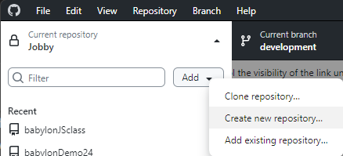
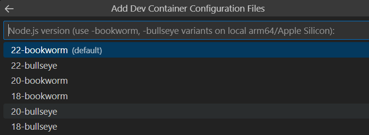
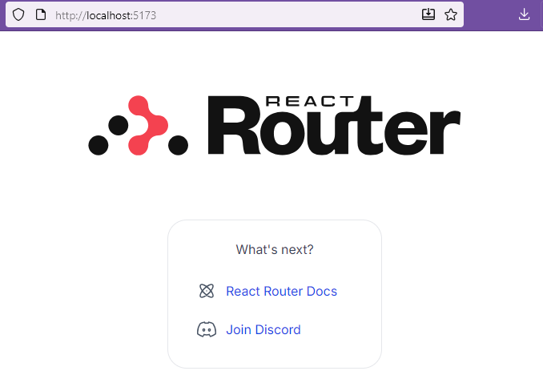
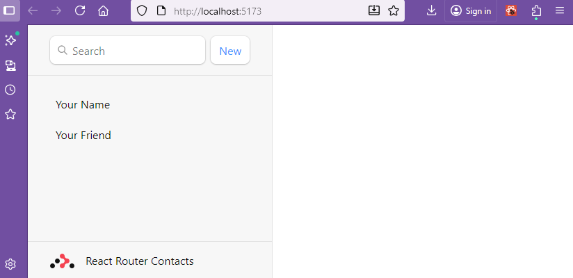
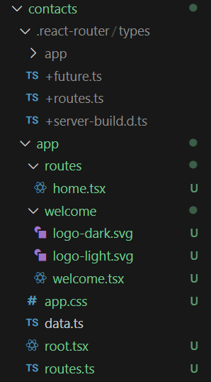
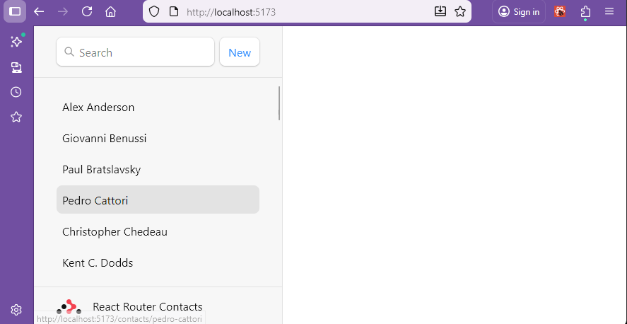
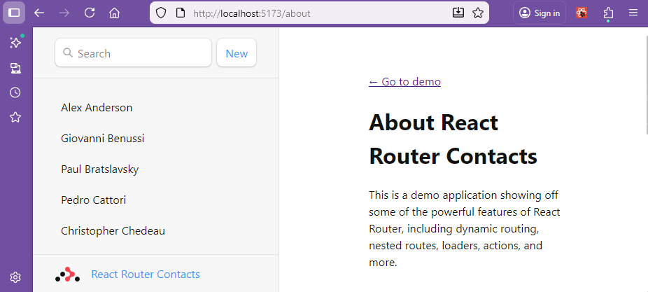
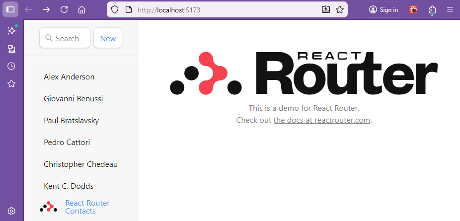

# React Router

React router has a [framework](https://reactrouter.com/start/modes#framework) mode to develop a full stack application.  Documentatio is available on the react router site.

On the Stackoverflow survey or 2025 React Router has not been mentioned.  The framework is subject to changes as it is developed further.  However, it is a good starting point for full stack applications.


Remix can be downloaded with a number of ready made [variant stacks](https://github.com/remix-run/react-router-templates) supporting different databases and features.  I will use the minimum stack to develop from here, but you can investigate any of these alternatives.

The best introduction to React Router is the [Address book tutorial](https://reactrouter.com/tutorials/address-book#setup) and this should be run in a docker container using Vite for consistancy with other notes.

## Container for remix default page

Start by creating a new Github repository "AddressBook25" from Github desktop.



Name the new repository AddressBook25.


Create the repository.

Publish the empty repository to github.

Open the new folder in visual studio code.

> CTRL + SHIFT + P

Open folder in container.


Select the folder AddressBook25.

Choose to add the configuration to the workspace so that it will be transferred to github and easily passed across to other machines.


Choose a node.js and typescript configuiration.


Select node version 22.  Remember that node version manager can be used to install different versions of node locally.




No additional features are required.


You will be offered github dependabot.  This is an alert system which identifies when the repository is using a software dependency with a known vunerability.  That is a good security feature.  However, we will not use this for the time being as it may lead to updates out of sync with these notes.


Allow time for the container to download software required.

In a new terminal

> npm install -D vite

```bash
added 13 packages in 7s

5 packages are looking for funding
  run `npm fund` for details
npm notice
npm notice New major version of npm available! 10.8.3 -> 11.6.2
npm notice Changelog: https://github.com/npm/cli/releases/tag/v11.6.2
npm notice To update run: npm install -g npm@11.6.2
npm notice 
```
Update  npm as suggested.

> npm install -g npm@11.6.2

```bash
added 1 package in 4s

28 packages are looking for funding
  run `npm fund` for details
```

Now install and initialise vite

> npm install

```bash
added 1 package, and audited 15 packages in 969ms

5 packages are looking for funding
  run `npm fund` for details

found 0 vulnerabilities
```

> npm init vite

```bash
Need to install the following packages:
create-vite@6.5.0
Ok to proceed? (y) 
```

>y

Set project name to 'contacts'

```bash
│
◆  Project name:
│  contacts█
└
```

Select React as the framework

```bash
◆  Select a framework:
│  ○ Vanilla
│  ○ Vue
│  ● React
│  ○ Preact
│  ○ Lit
│  ○ Svelte
│  ○ Solid
│  ○ Qwik
│  ○ Angular
│  ○ Marko
│  ○ Others
└
```

Select React Router as the variant

```bash
◆  Select a variant:
│  ○ TypeScript
│  ○ TypeScript + SWC
│  ○ JavaScript
│  ○ JavaScript + SWC
│  ● React Router v7 ↗ (npm create react-router@latest)
│  ○ TanStack Router ↗
│  ○ RedwoodSDK ↗
└
```

This will request an installation of create react router.

```bash
Need to install the following packages:
create-react-router@7.9.5
Ok to proceed? (y) 
```

> y
 
Wait for software to download ... this was a long wait, there ar some warnings about depracated code.

```bash
> npx
> "create-react-router" contacts


         create-react-router v7.9.5
      ◼  Directory:
         Using contacts as project directory

      ◼  Using default template
         See https://github.com/remix-run/react-router-templates for more
      ✔  Template copied

   git   Initialize a new git repository? (recommended)
        ○ Yes  ● No 
```
Select NO for git repository as one is already set up.

```bash
   deps   Install dependencies with npm? (recommended)
         ● Yes  ○ No 
```


Select yes for dependencies and wait for download

```bash
      ✔  Dependencies installed

  done   That's it!

 Enter your project directory using cd ./contacts
 Check out README.md for development and deploy instructions.

 Join the community at https://rmx.as/discord
```
At the end of the process there should be a package.json file in the root folder which holds the vite dependency for any project in the folder.

```json
{
  "devDependencies": {
    "vite": "^6.4.1"
  }
}
```
In the contacts folder there is a package.json file which holds the dependencies and scripts for the project.

```json
{
  "name": "contacts",
  "private": true,
  "type": "module",
  "scripts": {
    "build": "react-router build",
    "dev": "react-router dev",
    "start": "react-router-serve ./build/server/index.js",
    "typecheck": "react-router typegen && tsc"
  },
  "dependencies": {
    "@react-router/node": "^7.9.2",
    "@react-router/serve": "^7.9.2",
    "isbot": "^5.1.31",
    "react": "^19.1.1",
    "react-dom": "^19.1.1",
    "react-router": "^7.9.2"
  },
  "devDependencies": {
    "@react-router/dev": "^7.9.2",
    "@tailwindcss/vite": "^4.1.13",
    "@types/node": "^22",
    "@types/react": "^19.1.13",
    "@types/react-dom": "^19.1.9",
    "tailwindcss": "^4.1.13",
    "typescript": "^5.9.2",
    "vite": "^7.1.7",
    "vite-tsconfig-paths": "^5.1.4"
  }
}
```

> cd contacts

> npm install

```bash
node ➜ /workspaces/AdressBook25 (main) $ cd contacts
node ➜ /workspaces/AdressBook25/contacts (main) $ npm install
npm warn EBADENGINE Unsupported engine {
npm warn EBADENGINE   package: 'vite@7.2.2',
npm warn EBADENGINE   required: { node: '^20.19.0 || >=22.12.0' },
npm warn EBADENGINE   current: { node: 'v22.9.0', npm: '10.8.3' }
npm warn EBADENGINE }
```
Time to install a more recent version of node.js.  Use nvm to install version 22.19.0.

>curl -o- https://raw.githubusercontent.com/nvm-sh/nvm/v0.39.1/install.sh | bash

> nvm install --lts

```bash
Installing latest LTS version.
Downloading and installing node v24.11.0...
Downloading https://nodejs.org/dist/v24.11.0/node-v24.11.0-linux-x64.tar.xz...
################################################################### 100.0%
Computing checksum with sha256sum
Checksums matched!
Now using node v24.11.0 (npm v11.6.1)
```
Try again in contacts folder.

> npm install

```bash
added 65 packages, and audited 343 packages in 1s

57 packages are looking for funding
  run `npm fund` for details

found 0 vulnerabilities
```
The installation is complete.

Add the --host flag to the dev script in the package.json file.

```json
 "scripts": {
    "build": "react-router build",
    "dev": "react-router dev --host",
    "start": "react-router-serve ./build/server/index.js",
    "typecheck": "react-router typegen && tsc"
  },
```  

## Test the default react router site

> npm run dev




This is not the address book tutorial site, but it shows that the remix framework is working.

## Tutorial site

>cd ..

> npx create-react-router@latest --template remix-run/react-router/tutorials/address-book

```bash
        create-react-router v7.9.5

   dir   Where should we create your new project?
         ./contacts
```
Select the contacts folder.

```bash
   ◼  Template:
         Using remix-run/react-router/tutorials/address-book...
      ✔  Template copied
```        
Then

```bash
 overwrite   Your project directory contains files that will be overwritten by
             this template (you can force with `--overwrite`)

             Files that would be overwritten:
               .gitignore
               app
               app/app.css
               app/root.tsx
               app/routes.ts
               and 7 more...

             Do you wish to continue?
             
             ● Yes  ○ No 
```             
Select yes to overwrite the existing files.

```bash
   git   Initialize a new git repository? (recommended)
        ○ Yes  ● No 
```
Select NO for git repository as one is already set up.

```bash
   deps   Install dependencies with npm? (recommended)
         ● Yes  ○ No 
```
Wait ...

```bash
      ✔  Dependencies installed

  done   That's it!

 Enter your project directory using cd ./contacts
 Check out README.md for development and deploy instructions.

 Join the community at https://rmx.as/discord
 ```

 >cd contacts

Restore --host to dev script in package.json file.

```json
  "scripts": {
    "build": "cross-env NODE_ENV=production react-router build",
    "dev": "react-router dev --host",
    "start": "cross-env NODE_ENV=production react-router-serve ./build/server/index.js",
    "typecheck": "react-router typegen && tsc"
  },
```

> npm run dev

The address book tutorial site should now be displayed in its starting form.



## Explore the project files


The project folder contains the following files:



Below these are the configuration files.

** vite.config.ts **
```typescript
import { reactRouter } from "@react-router/dev/vite";
import { defineConfig } from "vite";

export default defineConfig({
  plugins: [reactRouter()],
});
```
Note that the reactRouter plugin runs in vite. 

**tsconfig.json**
```json
{
  "include": [
    "**/*",
    "**/.server/**/*",
    "**/.client/**/*",
    ".react-router/types/**/*"
  ],
  "compilerOptions": {
    "lib": ["DOM", "DOM.Iterable", "ES2022"],
    "types": ["node", "vite/client"],
    "target": "ES2022",
    "module": "ES2022",
    "moduleResolution": "bundler",
    "jsx": "react-jsx",
    "rootDirs": [".", "./.react-router/types"],
    "baseUrl": ".",
    "esModuleInterop": true,
    "verbatimModuleSyntax": true,
    "noEmit": true,
    "resolveJsonModule": true,
    "skipLibCheck": true,
    "strict": true
  }
}
```

The tsconfig.json file is the configuration file for typescript.  This is used to set up the project to use typescript.  Note that the target is set to es2022 and the module is set to es2022.  This is to ensure that the project is compatible with browsers that support es2020.  The features of ECMAscript update annually.  EcmaScript 2022 features are summarised by [w3 schools ECMAScript 2022](https://www.w3schools.com/js/js_2022.asp).

Vite takes care of building the project and running it so typescript is set to "noEmit:true.

## Tutorial

From here the [tutorial online](https://reactrouter.com/tutorials/address-book#setup) can be followed.

### The root route module

The file app/root.tsx is the first component rendered and it contains the global layout for the application. This is referred to as the root route module.  Note that App() function, at this stage only returns the sidebar component for the application.

app/root.tsx is ths only mandatory route in the application and is the parent route for all other routes.

Routes which are children of the root route module are created in the app/routes folder.  These will then be rendered inside an <Outlet> component in the root route module. (Outlet component not shown at this stage of the tutorial).

The root route module also allows a layout component to be exported.  This is a special export which acts as the document's "app shell" for all route components, HydrateFallback, and ErrorBoundary.

The layout component wraps the entire application in an html document structure and takes a children prop which is the defaut export of the root route module, in this case the App() function.

The layout component is rendered first and the children prop is rendered inside the body tag.  This allows the application to have a consistent html structure across all routes and also for common elements such as meta tags and stylesheets to be included in one place.

The error boundary component is also a special export which is rendered when the application throws an error.  This allows for a consistent error handling experience across all routes.

** app/root.tsx **
```javascript
import {
  Form,
  Scripts,
  ScrollRestoration,
  isRouteErrorResponse,
} from "react-router";
import type { Route } from "./+types/root";

import appStylesHref from "./app.css?url";

export default function App() {
  return (
    <>
      <div id="sidebar">
        <h1>React Router Contacts</h1>
        <div>
          <Form id="search-form" role="search">
            <input
              aria-label="Search contacts"
              id="q"
              name="q"
              placeholder="Search"
              type="search"
            />
            <div
              aria-hidden
              hidden={true}
              id="search-spinner"
            />
          </Form>
          <Form method="post">
            <button type="submit">New</button>
          </Form>
        </div>
        <nav>
          <ul>
            <li>
              <a href={`/contacts/1`}>Your Name</a>
            </li>
            <li>
              <a href={`/contacts/2`}>Your Friend</a>
            </li>
          </ul>
        </nav>
      </div>
    </>
  );
}

// The Layout component is a special export for the root route.
// It acts as your document's "app shell" for all route components, HydrateFallback, and ErrorBoundary
// For more information, see https://reactrouter.com/explanation/special-files#layout-export
export function Layout({
  children,
}: {
  children: React.ReactNode;
}) {
  return (
    <html lang="en">
      <head>
        <meta charSet="utf-8" />
        <meta
          name="viewport"
          content="width=device-width, initial-scale=1"
        />
        <link rel="stylesheet" href={appStylesHref} />
      </head>
      <body>
        {children}
        <ScrollRestoration />
        <Scripts />
      </body>
    </html>
  );
}

// The top most error boundary for the app, rendered when your app throws an error
// For more information, see https://reactrouter.com/start/framework/route-module#errorboundary
export function ErrorBoundary({
  error,
}: Route.ErrorBoundaryProps) {
  let message = "Oops!";
  let details = "An unexpected error occurred.";
  let stack: string | undefined;

  if (isRouteErrorResponse(error)) {
    message = error.status === 404 ? "404" : "Error";
    details =
      error.status === 404
        ? "The requested page could not be found."
        : error.statusText || details;
  } else if (
    import.meta.env.DEV &&
    error &&
    error instanceof Error
  ) {
    details = error.message;
    stack = error.stack;
  }

  return (
    <main id="error-page">
      <h1>{message}</h1>
      <p>{details}</p>
      {stack && (
        <pre>
          <code>{stack}</code>
        </pre>
      )}
    </main>
  );
}
```

The function App() returns the sidebar component for the application.  This contains a form to search contacts and a form to add a new contact.  There is also a navigation component which contains links to two contacts.

To start the application:

> cd contacts

> npm run dev

This displays a sideber with links to two contacts which can be clicket to activate href links, but these links do not yet work as there are no child route modules created.

### Child route modules

Creating child routes for the root route module is done by creating new route modules in the app/routes folder.

To create a route to match the url /contacts/1 a new file routes.tsx is created in the app/routes folder.

** app/routes.tsx **
```javascript
import type { RouteConfig } from "@react-router/dev/routes";
import { route } from "@react-router/dev/routes";

export default [
  route("contacts/:contactId", "routes/contact.tsx"),
] satisfies RouteConfig;
```
The colon after the url makes the route dynamic.  If a route follows the pattern contacts/123 then the value 123 will be passed to the contactId parameter in the route.

The route targets the route module contact.tsx which is created in the app/routes folder.

In this version of the tutorial the contact data is hard coded in the contact.tsx file. This is displayed and then forms are provided to edit or delete the contact. (The edit and delete functions are not yet implemented at this stage of the tutorial).

** app/routes/contact.tsx**
```javascript
import { Form } from "react-router";

import type { ContactRecord } from "../data";

export default function Contact() {
  const contact = {
    first: "Your",
    last: "Name",
    avatar: "https://placecats.com/200/200",
    twitter: "your_handle",
    notes: "Some notes",
    favorite: true,
  };

  return (
    <div id="contact">
      <div>
        
      </div>

      <div>
        <h1>
          {contact.first || contact.last ? (
            <>
              {contact.first} {contact.last}
            </>
          ) : (
            <i>No Name</i>
          )}
          <Favorite contact={contact} />
        </h1>

        {contact.twitter ? (
          <p>
            <a
              href={`https://twitter.com/${contact.twitter}`}
            >
              {contact.twitter}
            </a>
          </p>
        ) : null}

        {contact.notes ? <p>{contact.notes}</p> : null}

        <div>
          <Form action="edit">
            <button type="submit">Edit</button>
          </Form>

          <Form
            action="destroy"
            method="post"
            onSubmit={(event) => {
              const response = confirm(
                "Please confirm you want to delete this record.",
              );
              if (!response) {
                event.preventDefault();
              }
            }}
          >
            <button type="submit">Delete</button>
          </Form>
        </div>
      </div>
    </div>
  );
}

function Favorite({
  contact,
}: {
  contact: Pick<ContactRecord, "favorite">;
}) {
  const favorite = contact.favorite;

  return (
    <Form method="post">
      <button
        aria-label={
          favorite
            ? "Remove from favorites"
            : "Add to favorites"
        }
        name="favorite"
        value={favorite ? "false" : "true"}
      >
        {favorite ? "★" : "☆"}
      </button>
    </Form>
  );
}
```

The contact.tsx file exports a default function Contact() which displays the contact data.  There is also a Favorite() component which displays a star icon to indicate if the contact is a favorite or not.  Hoewever this is a child route so the root route module needs an outlet component to render the child route.


To do this the root route module app/root.tsx is updated to include an Outlet component from react-router.  This is placed at the end of the App() function to render the child routes inside the body of the application.

** app/root.tsx **
```javascript
import {
  Form,
  Outlet,
  Scripts,
  ScrollRestoration,
  isRouteErrorResponse,
} from "react-router";
import type { Route } from "./+types/root";

import appStylesHref from "./app.css?url";

export default function App() {
  return (
    <>
      <div id="sidebar">
        <h1>React Router Contacts</h1>
        <div>
          <Form id="search-form" role="search">
            <input
              aria-label="Search contacts"
              id="q"
              name="q"
              placeholder="Search"
              type="search"
            />
            <div aria-hidden hidden={true} id="search-spinner" />
          </Form>
          <Form method="post">
            <button type="submit">New</button>
          </Form>
        </div>
        <nav>
          <ul>
            <li>
              <a href={`/contacts/1`}>Your Name</a>
            </li>
            <li>
              <a href={`/contacts/2`}>Your Friend</a>
            </li>
          </ul>
        </nav>
      </div>
      <div id="detail">
        <Outlet />
      </div>
    </>
  );
}

// The Layout component is a special export for the root route.
// It acts as your document's "app shell" for all route components, HydrateFallback, and ErrorBoundary
// For more information, see https://reactrouter.com/explanation/special-files#layout-export
export function Layout({ children }: { children: React.ReactNode }) {
  return (
    <html lang="en">
      <head>
        <meta charSet="utf-8" />
        <meta name="viewport" content="width=device-width, initial-scale=1" />
        <link rel="stylesheet" href={appStylesHref} />
      </head>
      <body>
        {children}
        <ScrollRestoration />
        <Scripts />
      </body>
    </html>
  );
}

// The top most error boundary for the app, rendered when your app throws an error
// For more information, see https://reactrouter.com/start/framework/route-module#errorboundary
export function ErrorBoundary({ error }: Route.ErrorBoundaryProps) {
  let message = "Oops!";
  let details = "An unexpected error occurred.";
  let stack: string | undefined;

  if (isRouteErrorResponse(error)) {
    message = error.status === 404 ? "404" : "Error";
    details =
      error.status === 404
        ? "The requested page could not be found."
        : error.statusText || details;
  } else if (import.meta.env.DEV && error && error instanceof Error) {
    details = error.message;
    stack = error.stack;
  }

  return (
    <main id="error-page">
      <h1>{message}</h1>
      <p>{details}</p>
      {stack && (
        <pre>
          <code>{stack}</code>
        </pre>
      )}
    </main>
  );
}
```

The hard coded data is displayed when the either of the contact links in the sidebar are clicked.


### Link navigation

The links in the sidebar are currently using anchor tags which cause a full page reload when clicked.  To avoid this the anchor tags are replaced with Link components from react-router.  This allows for client side navigation without a full page reload.

** app/root.tsx **
```javascript
import {
  Form,
  Link,
  Outlet,
  Scripts,
  ScrollRestoration,
  isRouteErrorResponse,
} from "react-router";
import type { Route } from "./+types/root";

import appStylesHref from "./app.css?url";

export default function App() {
  return (
    <>
      <div id="sidebar">
        <h1>React Router Contacts</h1>
        <div>
          <Form id="search-form" role="search">
            <input
              aria-label="Search contacts"
              id="q"
              name="q"
              placeholder="Search"
              type="search"
            />
            <div aria-hidden hidden={true} id="search-spinner" />
          </Form>
          <Form method="post">
            <button type="submit">New</button>
          </Form>
        </div>
        <nav>
          <ul>
            <li>
              <Link to={`/contacts/1`}>Your Name</Link>
            </li>
            <li>
              <Link to={`/contacts/2`}>Your Friend</Link>
            </li>
          </ul>
        </nav>
      </div>
      <div id="detail">
        <Outlet />
      </div>
    </>
  );
}

// The Layout component is a special export for the root route.
// It acts as your document's "app shell" for all route components, HydrateFallback, and ErrorBoundary
// For more information, see https://reactrouter.com/explanation/special-files#layout-export
export function Layout({ children }: { children: React.ReactNode }) {
  return (
    <html lang="en">
      <head>
        <meta charSet="utf-8" />
        <meta name="viewport" content="width=device-width, initial-scale=1" />
        <link rel="stylesheet" href={appStylesHref} />
      </head>
      <body>
        {children}
        <ScrollRestoration />
        <Scripts />
      </body>
    </html>
  );
}

// The top most error boundary for the app, rendered when your app throws an error
// For more information, see https://reactrouter.com/start/framework/route-module#errorboundary
export function ErrorBoundary({ error }: Route.ErrorBoundaryProps) {
  let message = "Oops!";
  let details = "An unexpected error occurred.";
  let stack: string | undefined;

  if (isRouteErrorResponse(error)) {
    message = error.status === 404 ? "404" : "Error";
    details =
      error.status === 404
        ? "The requested page could not be found."
        : error.statusText || details;
  } else if (import.meta.env.DEV && error && error instanceof Error) {
    details = error.message;
    stack = error.stack;
  }

  return (
    <main id="error-page">
      <h1>{message}</h1>
      <p>{details}</p>
      {stack && (
        <pre>
          <code>{stack}</code>
        </pre>
      )}
    </main>
  );
}
```

### Client Loader for sidebar

Rather than displaying two hard coded links the sidebar should read a simulated database and print a list of contact names as links maintaining the contact.id as a parameter for the link.

To access the simulated database the getContacts() function is imported from ./data

The root route can load data from a database (or simulated database) with a ```clientLoader()```  function.  The loading action takes place asynchronously and is passed to the App() as ```loaderData```.  In this example the loaderData os stored in a constant {contacts}.

The loaderData is of type Route.ComponentProps.

The sidebar now displays links by contact name to different contact ids.



### Hydrate fallback

We are using browser routing suitable for a single page application.

Server side routing is turned off in react-router.config.ts

** react-router.config.ts **
```javascript
import { type Config } from "@react-router/dev/config";

export default {
  ssr: false,
} satisfies Config;
```

While the data is coming from the source the root route can display a hydrateFallback.  This will be briefly displayed until the asynchonous data is ready.

** root.tsx **
```javascript
import {
  Form,
  Link,
  Outlet,
  Scripts,
  ScrollRestoration,
  isRouteErrorResponse,
} from "react-router";
import type { Route } from "./+types/root";

import appStylesHref from "./app.css?url";

import { getContacts } from "./data";

export async function clientLoader() {
  const contacts = await getContacts();
  return { contacts };
}

export default function App({ loaderData }: Route.ComponentProps) {
  const {contacts} = loaderData;
  return (
    <>
      <div id="sidebar">
        <h1>React Router Contacts</h1>
        <div>
          <Form id="search-form" role="search">
            <input
              aria-label="Search contacts"
              id="q"
              name="q"
              placeholder="Search"
              type="search"
            />
            <div aria-hidden hidden={true} id="search-spinner" />
          </Form>
          <Form method="post">
            <button type="submit">New</button>
          </Form>
        </div>
        <nav>
           {contacts.length ? (
            <ul>
              {contacts.map((contact) => (
                <li key={contact.id}>
                  <Link to={`contacts/${contact.id}`}>
                    {contact.first || contact.last ? (
                      <>
                        {contact.first} {contact.last}
                      </>
                    ) : (
                      <i>No Name</i>
                    )}
                    {contact.favorite ? (
                      <span>★</span>
                    ) : null}
                  </Link>
                </li>
              ))}
            </ul>
          ) : (
            <p>
              <i>No contacts</i>
            </p>
          )}
        </nav>
      </div>
      <div id="detail">
        <Outlet />
      </div>
    </>
  );
}

// The Layout component is a special export for the root route.
// It acts as your document's "app shell" for all route components, HydrateFallback, and ErrorBoundary
// For more information, see https://reactrouter.com/explanation/special-files#layout-export
export function Layout({ children }: { children: React.ReactNode }) {
  return (
    <html lang="en">
      <head>
        <meta charSet="utf-8" />
        <meta name="viewport" content="width=device-width, initial-scale=1" />
        <link rel="stylesheet" href={appStylesHref} />
      </head>
      <body>
        {children}
        <ScrollRestoration />
        <Scripts />
      </body>
    </html>
  );
}

// The top most error boundary for the app, rendered when your app throws an error
// For more information, see https://reactrouter.com/start/framework/route-module#errorboundary
export function ErrorBoundary({ error }: Route.ErrorBoundaryProps) {
  let message = "Oops!";
  let details = "An unexpected error occurred.";
  let stack: string | undefined;

  if (isRouteErrorResponse(error)) {
    message = error.status === 404 ? "404" : "Error";
    details =
      error.status === 404
        ? "The requested page could not be found."
        : error.statusText || details;
  } else if (import.meta.env.DEV && error && error instanceof Error) {
    details = error.message;
    stack = error.stack;
  }

  return (
    <main id="error-page">
      <h1>{message}</h1>
      <p>{details}</p>
      {stack && (
        <pre>
          <code>{stack}</code>
        </pre>
      )}
    </main>
  );
}

export function HydrateFallback() {
  return (
    <div id="loading-splash">
      <div id="loading-splash-spinner" />
      <p>Loading, please wait...</p>
    </div>
  );
}
```
The loading spinner is now displayed before data loads ( the database simulation has a built in delay to allow the spinner time to be observed).

### index route

Before child routes are displayed in an <Outlet> there is a blank.  This can be filled by an index route which becomes the default route displayed in the <Outlet>

Add an index route to routes.ts which defaults to the route module routes/home.tsx.

** app/routes.tsx **
```Javascript
import type { RouteConfig } from "@react-router/dev/routes";
import { index, route } from "@react-router/dev/routes";

export default [
  index("routes/home.tsx"),   
  route("contacts/:contactId", "routes/contact.tsx"),
] satisfies RouteConfig;
```

Then home.tsx can contain what you choose.

app/routes/home.tsx
```javascript
export default function Home() {
  return (
    <p id="index-page">
      This is a demo for React Router.
      <br />
      Check out{" "}
      <a href="https://reactrouter.com">
        the docs at reactrouter.com
      </a>
      .
    </p>
  );
}
```

The default page is displayed in the <Outlet>


## About route

Adding a static page which does not need any database access.

** app/routes.ts **
```javascript
import type { RouteConfig } from "@react-router/dev/routes";
import { index, route } from "@react-router/dev/routes";

export default [
  index("routes/home.tsx"),   
  route("contacts/:contactId", "routes/contact.tsx"),
  route("about", "routes/about.tsx")
] satisfies RouteConfig;
```

Then add the route module:

** app/routes/about.tsx
```javascript
import { Link } from "react-router";

export default function About() {
  return (
    <div id="about">
      <Link to="/">← Go to demo</Link>
      <h1>About React Router Contacts</h1>

      <div>
        <p>
          This is a demo application showing off some of the
          powerful features of React Router, including
          dynamic routing, nested routes, loaders, actions,
          and more.
        </p>

        <h2>Features</h2>
        <p>
          Explore the demo to see how React Router handles:
        </p>
        <ul>
          <li>
            Data loading and mutations with loaders and
            actions
          </li>
          <li>
            Nested routing with parent/child relationships
          </li>
          <li>URL-based routing with dynamic segments</li>
          <li>Pending and optimistic UI</li>
        </ul>

        <h2>Learn More</h2>
        <p>
          Check out the official documentation at{" "}
          <a href="https://reactrouter.com">
            reactrouter.com
          </a>{" "}
          to learn more about building great web
          applications with React Router.
        </p>
      </div>
    </div>
  );
}
```

Add a link about into the sidebar.

** app/root.tsx
```javascript
import {
  Form,
  Link,
  Outlet,
  Scripts,
  ScrollRestoration,
  isRouteErrorResponse,
} from "react-router";
import type { Route } from "./+types/root";

import appStylesHref from "./app.css?url";

import { getContacts } from "./data";

export async function clientLoader() {
  const contacts = await getContacts();
  return { contacts };
}

export default function App({ loaderData }: Route.ComponentProps) {
  const {contacts} = loaderData;
  return (
    <>
      <div id="sidebar">
        <h1>
          <Link to="about">React Router Contacts</Link>
        </h1>
        <div>
          <Form id="search-form" role="search">
            <input
              aria-label="Search contacts"
              id="q"
              name="q"
              placeholder="Search"
              type="search"
            />
            <div aria-hidden hidden={true} id="search-spinner" />
          </Form>
          <Form method="post">
            <button type="submit">New</button>
          </Form>
        </div>
        <nav>
           {contacts.length ? (
            <ul>
              {contacts.map((contact) => (
                <li key={contact.id}>
                  <Link to={`contacts/${contact.id}`}>
                    {contact.first || contact.last ? (
                      <>
                        {contact.first} {contact.last}
                      </>
                    ) : (
                      <i>No Name</i>
                    )}
                    {contact.favorite ? (
                      <span>★</span>
                    ) : null}
                  </Link>
                </li>
              ))}
            </ul>
          ) : (
            <p>
              <i>No contacts</i>
            </p>
          )}
        </nav>
      </div>
      <div id="detail">
        <Outlet />
      </div>
    </>
  );
}

// The Layout component is a special export for the root route.
// It acts as your document's "app shell" for all route components, HydrateFallback, and ErrorBoundary
// For more information, see https://reactrouter.com/explanation/special-files#layout-export
export function Layout({ children }: { children: React.ReactNode }) {
  return (
    <html lang="en">
      <head>
        <meta charSet="utf-8" />
        <meta name="viewport" content="width=device-width, initial-scale=1" />
        <link rel="stylesheet" href={appStylesHref} />
      </head>
      <body>
        {children}
        <ScrollRestoration />
        <Scripts />
      </body>
    </html>
  );
}

// The top most error boundary for the app, rendered when your app throws an error
// For more information, see https://reactrouter.com/start/framework/route-module#errorboundary
export function ErrorBoundary({ error }: Route.ErrorBoundaryProps) {
  let message = "Oops!";
  let details = "An unexpected error occurred.";
  let stack: string | undefined;

  if (isRouteErrorResponse(error)) {
    message = error.status === 404 ? "404" : "Error";
    details =
      error.status === 404
        ? "The requested page could not be found."
        : error.statusText || details;
  } else if (import.meta.env.DEV && error && error instanceof Error) {
    details = error.message;
    stack = error.stack;
  }

  return (
    <main id="error-page">
      <h1>{message}</h1>
      <p>{details}</p>
      {stack && (
        <pre>
          <code>{stack}</code>
        </pre>
      )}
    </main>
  );
}

export function HydrateFallback() {
  return (
    <div id="loading-splash">
      <div id="loading-splash-spinner" />
      <p>Loading, please wait...</p>
    </div>
  );
}
```



### Modify layout

To allow routes to display different layouts a layout file can be specified in front of an array of routes.

In this example, home and contacts routes will use a layout which includes a sidebar, but the about route will not.

** app/routes.ts **
```javascript
import type { RouteConfig } from "@react-router/dev/routes";
import { index, layout, route } from "@react-router/dev/routes";

export default [
  layout("layouts/sidebar.tsx",[
    index("routes/home.tsx"),   
    route("contacts/:contactId", "routes/contact.tsx")
  ]),
  route("about", "routes/about.tsx")
] satisfies RouteConfig;
```

In a new folder, layouts, sidebar.tsx will now contain all the sidebar details and clientLoader from root.tsx.  Note that the relative location of data is now ../data.


** app/layouts/sidebar.tsx **
```javascript
import { Form, Link, Outlet } from "react-router";
import { getContacts } from "../data";
import type { Route } from "./+types/sidebar";

export async function clientLoader() {
  const contacts = await getContacts();
  return { contacts };
}

export default function SidebarLayout({
  loaderData,
}: Route.ComponentProps) {
  const { contacts } = loaderData;

return (
    <>
      <div id="sidebar">
        <h1>
          <Link to="about">React Router Contacts</Link>
        </h1>
        <div>
          <Form id="search-form" role="search">
            <input
              aria-label="Search contacts"
              id="q"
              name="q"
              placeholder="Search"
              type="search"
            />
            <div aria-hidden hidden={true} id="search-spinner" />
          </Form>
          <Form method="post">
            <button type="submit">New</button>
          </Form>
        </div>
        <nav>
           {contacts.length ? (
            <ul>
              {contacts.map((contact) => (
                <li key={contact.id}>
                  <Link to={`contacts/${contact.id}`}>
                    {contact.first || contact.last ? (
                      <>
                        {contact.first} {contact.last}
                      </>
                    ) : (
                      <i>No Name</i>
                    )}
                    {contact.favorite ? (
                      <span>★</span>
                    ) : null}
                  </Link>
                </li>
              ))}
            </ul>
          ) : (
            <p>
              <i>No contacts</i>
            </p>
          )}
        </nav>
      </div>
            <div id="detail">
        <Outlet />
      </div>
    </>
  );
}
```

Now the contact list is removed from root.tsx, just leaving the outlet.

** app/root.tsx **
```javascript
import {
  Outlet,
  Scripts,
  ScrollRestoration,
  isRouteErrorResponse,
} from "react-router";
import type { Route } from "./+types/root";

import appStylesHref from "./app.css?url";

export default function App() {
  return <Outlet />;
}

// The Layout component is a special export for the root route.
// It acts as your document's "app shell" for all route components, HydrateFallback, and ErrorBoundary
// For more information, see https://reactrouter.com/explanation/special-files#layout-export
export function Layout({ children }: { children: React.ReactNode }) {
  return (
    <html lang="en">
      <head>
        <meta charSet="utf-8" />
        <meta name="viewport" content="width=device-width, initial-scale=1" />
        <link rel="stylesheet" href={appStylesHref} />
      </head>
      <body>
        {children}
        <ScrollRestoration />
        <Scripts />
      </body>
    </html>
  );
}

// The top most error boundary for the app, rendered when your app throws an error
// For more information, see https://reactrouter.com/start/framework/route-module#errorboundary
export function ErrorBoundary({ error }: Route.ErrorBoundaryProps) {
  let message = "Oops!";
  let details = "An unexpected error occurred.";
  let stack: string | undefined;

  if (isRouteErrorResponse(error)) {
    message = error.status === 404 ? "404" : "Error";
    details =
      error.status === 404
        ? "The requested page could not be found."
        : error.statusText || details;
  } else if (import.meta.env.DEV && error && error instanceof Error) {
    details = error.message;
    stack = error.stack;
  }

  return (
    <main id="error-page">
      <h1>{message}</h1>
      <p>{details}</p>
      {stack && (
        <pre>
          <code>{stack}</code>
        </pre>
      )}
    </main>
  );
}

export function HydrateFallback() {
  return (
    <div id="loading-splash">
      <div id="loading-splash-spinner" />
      <p>Loading, please wait...</p>
    </div>
  );
}
```

Now the home page is served with a sidebar.



The about page is served withouot a sidebar.


## Pre-Render

The spinner shows before the about page displays.  To stop this static pages can be prerendered on build by setting a flag in the react-router config file.

**app/react-router.config.ts **
```javascript
import { type Config } from "@react-router/dev/config";

export default {
  ssr: false,
  prerender: ["/about"],
} satisfies Config;
```

### Server or Client loading

By changing ssr: to true in app/react-router.config.ts and then using loader() in place of clientLoader in sidebar.tsx the data can be loaded and server side rendered.

The [online tutorial follows this change](https://reactrouter.com/tutorials/address-book#server-side-rendering), but here I am sticking with client side loading so that a single page app can be made.

### URL params for loaders

When a contact name is selected the url called has a parameter made up of the first and second names separated by a hyphen.

For examle "http://localhost:5173/contacts/alex-anderson"

The route was to "contacts/:contactId" so the name alex-anderson will be passed as params.contactid.

Note that the loader ( in this case clientLoader ) is called in the route module here and not in the route component.

Within the loader a response is thrown if the contact is not found and that will display a 404 error page.

The export default function Contact() renders the contact page after the loader has finished loading.

** app/routes/contact.tsx **
```javascript
import { Form } from "react-router";

import { getContact, type ContactRecord } from "../data";
import type { Route } from "./+types/contact";

export async function clientLoader({ params }: Route.LoaderArgs) {
  const contact = await getContact(params.contactId);
    if (!contact) {
    throw new Response("Not Found", { status: 404 });
  }
  return { contact };
}

export default function Contact({
  loaderData,
}: Route.ComponentProps) {
  const { contact } = loaderData;

  return (
    <div id="contact">
      <div>
        
      </div>

      <div>
        <h1>
          {contact.first || contact.last ? (
            <>
              {contact.first} {contact.last}
            </>
          ) : (
            <i>No Name</i>
          )}
          <Favorite contact={contact} />
        </h1>

        {contact.twitter ? (
          <p>
            <a
              href={`https://twitter.com/${contact.twitter}`}
            >
              {contact.twitter}
            </a>
          </p>
        ) : null}

        {contact.notes ? <p>{contact.notes}</p> : null}

        <div>
          <Form action="edit">
            <button type="submit">Edit</button>
          </Form>

          <Form
            action="destroy"
            method="post"
            onSubmit={(event) => {
              const response = confirm(
                "Please confirm you want to delete this record.",
              );
              if (!response) {
                event.preventDefault();
              }
            }}
          >
            <button type="submit">Delete</button>
          </Form>
        </div>
      </div>
    </div>
  );
}

function Favorite({
  contact,
}: {
  contact: Pick<ContactRecord, "favorite"> | Partial<Pick<ContactRecord, "favorite">>;
}) {
  const favorite = contact.favorite;

  return (
    <Form method="post">
      <button
        aria-label={
          favorite
            ? "Remove from favorites"
            : "Add to favorites"
        }
        name="favorite"
        value={favorite ? "false" : "true"}
      >
        {favorite ? "★" : "☆"}
      </button>
    </Form>
  );
}
```

Selecting a name from the contact list now opens the individuals detail page in the outlet frame.


The online tutorial continues with the next section, but this a sufficient stage to look to reading from the mongodb database.
