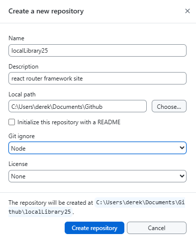
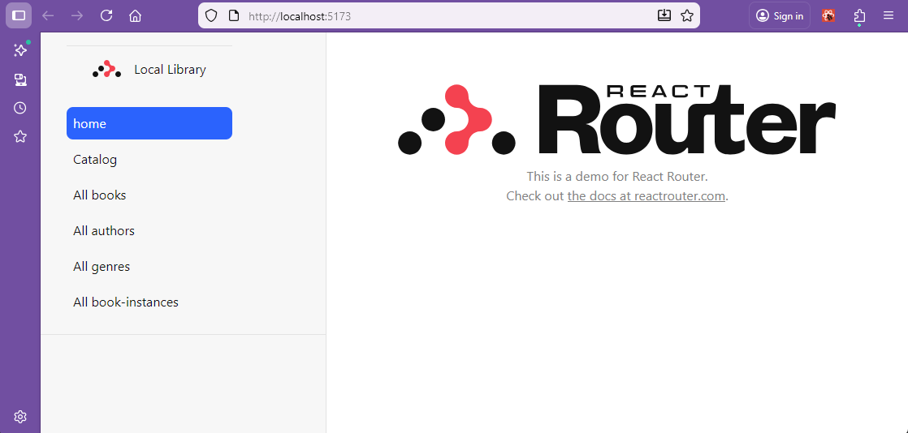

# Setup to read Database

In this section the localLibrary25 repository will be set up to read from the mongo database running under control of powershell.

The repository will be based as a starter on the react router tutorial files at the point where the contacts were able to be selected and content of the simulated database is displayed.

## Make a fresh repository for the library project

Create a new repository named localLibrary25.



Copy the contents (but not any node modules) of the react router tutorial files (in AddressBook25) to the new repository.

In VS Code open the new folder localLibrary25 in a container.

Install node version manager.

> curl -o- https://raw.githubusercontent.com/nvm-sh/nvm/v0.39.1/install.sh | bash

Check that the latest version of long term supported node is installed.

> nvm install --lts

```bash
Now using node v24.11.1 (npm v11.6.2)
```

Now install the existing dependencies.  First in the root folder of the project.

> npm install

Then in the contacts folder.

> npm install

Check that the app runs correctly.

> npm run dev

You may need to wait while vite updates dependencies before the app runs.

## Set up to read from the mongo database

In this section the react router framework will be set up to read details from the local_library database which was seeded in the previous section.

Make sure that docker and the database are running in the background.

To run the database open powershell and start the database with:

> docker start mongodb

Check that the container starts in docker desktop.

### .env file


Add the ".env" file to the root of the project with the following contents:

**.env**
```bash
DB_STRING=mongodb://host.docker.internal:27017/local_library
```
This is the connection string for the local database.  This can be swapped out for a cloud based database when the project is deployed.

To facilitate the transfer of the .env details insecurely by github add a file env.txt to the root of the project with the same contents as .env.  The .env file will not be committed to github as it is in the .gitignore file.

The env.txt file should be deleted after the project is cloned from github.

## Page Style
The contacts page already includes a stylesheet which can be used to provide a consistent look and feel for the application, however we will shift from this as we choose to use react-bootstrap to provide the layout for the application.

From the root folder of the pro ject install react-bootstrap and bootstrap.

> npm install react-bootstrap bootstrap

```bash
added 1 package, removed 3 packages, and audited 48 packages in 3s

7 packages are looking for funding
  run `npm fund` for details

found 0 vulnerabilities
```


## Folder Structure

Rename the **contacts** folder to **library** to reflect the project action,  
within library you will now have:
- app
- public

Rename the name of the project in the **package.json** file to **library**.

**package.json (extract)**
```json
{
  "name": "library",
  "private": true,
  "type": "module",
  ...
}
```

The app folder will contain the code for the application. 

In the app folder you already have folders: layouts, routes and welcome from the address book tutorial. Add the **models** folder to contain the models for the library application.

### Models Folder

The **models** folder will contain the models for the application.  This will be used to define the schema for the database and as such should reflect the schema which was created in the previous section when the database was seeded.


Create the following empty files in the models folder (these will be populated later):

* **author.ts**
* **book.ts**
* **bookinstance.ts**
* **genre.ts**

### Routes Folder

Create the following empty files in the **routes** folder (these will be populated later):

* **catalog.tsx**
* **catalog.server.ts
* **catalog._index.tsx**
* **catalog.authors.tsx**
* **catalog.books.tsx**
* **catalog.genres.tsx**
* **catalog.instances.tsx**


## Key files in the app folder

The following files should be added to the app folder to provide the basic structure and functionality for the application.

### Root component

This is the root component for the application.  It is the first component that is rendered when the application is loaded. 

**root.tsx**

```javascript
import {
    Meta,
    Outlet,
    Scripts,
    ScrollRestoration,
    isRouteErrorResponse,
    type MetaFunction,
} from "react-router";

import type { Route } from "./+types/root";

import appStylesHref from "./app.css?url";
import "./app.css"; // includes bootstrap

export const meta: MetaFunction = ({ matches }) => {
    // Get base metadata for all pages
    const baseMeta = [
        { title: "Local Library" },
        {
            property: "og:title",
            content: "Very cool app",
        },
    ];

    // Merge with any route-specific metadata from child routes/layouts
    const routeMeta = matches.flatMap((match) => match.meta || []);

    return [...baseMeta, ...routeMeta];
};

export default function App() {
    return <Outlet />;
}

// The Layout component is a special export for the root route.
// It acts as your document's "app shell" for all route components, HydrateFallback, and ErrorBoundary
// For more information, see https://reactrouter.com/explanation/special-files#layout-export
export function Layout({ children }: { children: React.ReactNode }) {
    return (
        <html lang="en">
            <head>
                <Meta />
                <meta charSet="utf-8" />
                <meta name="viewport" content="width=device-width, initial-scale=1" />
                <link rel="stylesheet" href={appStylesHref} />
            </head>
            <body>
                {children}
                <ScrollRestoration />
                <Scripts />
            </body>
        </html>
    );
}

// The top most error boundary for the app, rendered when your app throws an error
// For more information, see https://reactrouter.com/start/framework/route-module#errorboundary
export function ErrorBoundary({ error }: Route.ErrorBoundaryProps) {
    let message = "Oops!";
    let details = "An unexpected error occurred.";
    let stack: string | undefined;

    if (isRouteErrorResponse(error)) {
        message = error.status === 404 ? "404" : "Error";
        details =
            error.status === 404
                ? "The requested page could not be found."
                : error.statusText || details;
    } else if (import.meta.env.DEV && error && error instanceof Error) {
        details = error.message;
        stack = error.stack;
    }

    return (
        <main id="error-page">
            <h1>{message}</h1>
            <p>{details}</p>
            {stack && (
                <pre>
                    <code>{stack}</code>
                </pre>
            )}
        </main>
    );
}

export function HydrateFallback() {
    return (
        <div id="loading-splash">
            <div id="loading-splash-spinner" />
            <p>Loading, please wait...</p>
        </div>
    );
}
```
This file contains the root component for the application.  It also contains the layout component which is used to provide the layout for the application.


### Sidebar component

The sidebar component is used to provide the navigation for the application.  It contains links to the different pages of the application.

    The **Container** component is used to provide a fluid layout for the application.  
    The **Row** component is used to separate areas for links and responss display.  
    The **Col** component is used with bootstrap sizing to control the responsive break points of the layout.  
    The **Card** component is used to provide a clear demarcation of the link information on the page.  
    The **Card.Body** component is used contain the card contents which include  **ul** component is used to provide an unordered list of **nav** components within which the elements of the "retrieve" array are mapped into  **NavLink** components.

**sidebar.tsx **
```javascript
import {
  NavLink,
  Outlet,
  ScrollRestoration,
  Scripts,
  type MetaFunction,
} from "react-router";

interface NavItem {
  path: string;
  label: string;
}

export const meta: MetaFunction = () => {
  return [
    {
      name: "description",
      content: "Access local library",
    },
  ];
};

export default function SidebarLayout() {
  const navItems: NavItem[] = [
    { path: "/", label: "Home" },
    { path: "/catalog", label: "Catalog" },
    { path: "/about", label: "About" },
  ];

  return (
    <>
      <div id="sidebar">
        <div className="container-md">
          <div className="row">
            <div className="col-3">
              <h1>Local Library</h1>
              <div className="card">
                <div className="card-body">
                  <nav>
                    <ul className="list-unstyled">
                      {navItems.map((item) => (
                        <li key={item.path}>
                          <NavLink
                            to={item.path}
                            className={({ isActive, isPending }) =>
                              [
                                "nav-link",
                                isActive && "active",
                                isPending && "pending",
                              ]
                                .filter(Boolean)
                                .join(" ")
                            }
                          >
                            {item.label}
                          </NavLink>
                        </li>
                      ))}
                    </ul>
                  </nav>
                </div>
              </div>
            </div>
            <div className="col">
              <ScrollRestoration />
              <Scripts />
            </div>
          </div>
        </div>
      </div>
      <div id="detail">
        <Outlet />
      </div>
    </>
  );
}
```
The second **Col** component is used to provide an area where the result of database interactions will be displayed.
The **Outlet** component is used to provide a target for the output to be rendered into.  


### Reading the environment variables

To read from the database the connection string needs to be read from the environment variable file.  This requires the **dotenv** package to be installed.

Mongoose will be used to connect to the database so this package also needs to be installed into the project folder (library)

> npm install dotenv mongoose

```bash
added 18 packages, and audited 285 packages in 10s

46 packages are looking for funding
  run `npm fund` for details

5 vulnerabilities (3 moderate, 2 high)

To address issues that do not require attention, run:
  npm audit fix

To address all issues (including breaking changes), run:
  npm audit fix --force

Run `npm audit` for details.
```

> npm audit fix --force

```bash
npm warn using --force Recommended protections disabled.
npm warn audit Updating vite to 7.2.4, which is a SemVer major change.
npm warn audit Updating sort-by to 0.0.2, which is a SemVer major change.

removed 1 package, changed 5 packages, and audited 284 packages in 5s

46 packages are looking for funding
  run `npm fund` for details

found 0 vulnerabilities
```

For the benefit of typescript the types for dotenv and mongoose also need to be installed.

> npm install --save-dev @types/dotenv @types/mongoose

 The details of the constant function db are in the file **db.ts** which is the next file to be created inside the app folder.

 **db.ts**
 ```javascript
import dotenv from "dotenv";
import mongoose from "mongoose";

dotenv.config();

// eslint-disable-next-line no-undef
const connectionString: string = process.env.DB_STRING ?? "no connection string";

let isConnected = false;

export const connectDB = async (): Promise<void> => {
  if (isConnected) {
    console.log("Already connected to MongoDB");
    return;
  }

  try {
    await mongoose.connect(connectionString, {
      autoIndex: true,
    });
    isConnected = true;
    console.log("Connected to MongoDB Database");
  } catch (error) {
    console.error("Failed to connect to MongoDB:", error);
    throw error;
  }
};

export const getConnection = (): typeof mongoose => mongoose;

export default connectDB;
```
[Dotenv](https://www.npmjs.com/package/dotenv) is used to load environment variables from a .env file into process.env.
[Mongoose](https://www.npmjs.com/package/mongoose) is used to connect to the database.
The connection string is loaded from the .env file.

The connection to the database is asynchronous and returns a promise.  The [async/await](https://www.w3schools.com/js/js_async.asp) syntax is used to handle the promise.
A console.log statement is used to print the connection string to the console for debugging purposes and to check that the connection string is loaded from the .env file. This should be removed before deployment.

### Stylesheet

The final file needed is the **app.css** file  supports the appearance of the application.  This file can be carried over from the address book tutorial and modified as needed.

Bootstrap is not compatible with Remix Router.

This should complete the basic structure of the remix router app which will run but not yet read from the database.

