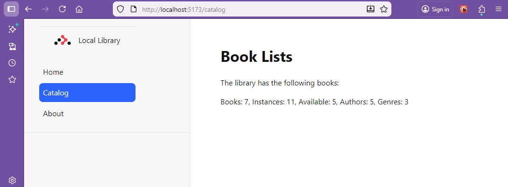

# Reading from the Local_Library database

In this section the routes models and controllers will be set up to read the database.

Make sure that docker and the database are running in the background.

To run the database open powershell and start the database with:

> docker start mongodb

Check that the container starts in docker desktop.

## Implementing models

In the models folder the empty files must be populated with the schema for the database.
This will include author. book, bookinstance and genre.

For each of these files the imports from mongoose must be added.  There is also a date formatting type which  is using the [luxon](https://www.npmjs.com/package/luxon) package.

From the project folder (library) install luxon with:

> npm install luxon

```bash
added 1 package, and audited 287 packages in 2s

46 packages are looking for funding
  run `npm fund` for details

found 0 vulnerabilities
```
> npm i --save-dev @types/luxon

```bash
added 1 package, and audited 288 packages in 918ms

46 packages are looking for funding
  run `npm fund` for details

found 0 vulnerabilities
```

Each model file will export an interface which will include not only the schema but also the virtuals.  These are formatted items which are created from the schema.  For example a name could be fornmed from the family _name and the first_name.

The schema will exactly match the database.

The set and get methods are features of mongoose which allow the schema to be updated and read.

The virtuals are added to the schema using the get method.

Finally the model is exported.

The pattern is followed for each of the models so pouplate the models folder with the following files:

### Author

**author.ts**
```javascript
import { Schema, model } from 'mongoose';
import type { Date } from 'mongoose';
import { DateTime } from 'luxon';

export interface IAuthor extends Document {
  _id: string;
  first_name: string;
  family_name: string;
  date_of_birth: Date;
  date_of_death: Date;
  name: string;
  date_of_birth_formatted: string;
  date_of_death_formatted: string;
  lifespan: number;
  url: string;
}


const AuthorSchema = new Schema(
  {
    first_name: {type: String, required: true, max: 100},
    family_name: {type: String, required: true, max: 100},
    date_of_birth: {type: Date},
    date_of_death: {type: Date || null},
    
  }
);

AuthorSchema.set('toObject', { getters: true });  // https://mongoosejs.com/docs/guide.html#toObject  show virtuals in console logging
AuthorSchema.set('toJSON',   { getters: true });    //https://mongoosejs.com/docs/guide.html#toJSON   show virtuals in JSON.stringify


// Virtual for author's full name
AuthorSchema
.virtual('name')
.get(function () {
  return this.family_name + ', ' + this.first_name;
});

AuthorSchema
.virtual('date_of_birth_formatted')
.get(function () {
  return this.date_of_birth ? DateTime.fromJSDate(this.date_of_birth).toLocaleString(DateTime.DATE_MED) : '';
});

AuthorSchema
.virtual('date_of_death_formatted')
.get(function () {
 if (this.date_of_death != null) {
  return this.date_of_birth ? DateTime.fromJSDate(this.date_of_death).toLocaleString(DateTime.DATE_MED) : '';
 }else{
    return "living";
  }  
});

// Virtual for author's lifespan
AuthorSchema
.virtual('lifespan')
.get(function () {
  if(this.date_of_death != null){
  return "lifespan:" + (this.date_of_death.getFullYear() - this.date_of_birth!.getFullYear()).toString() + " years";
  } else {
    return "living"; 
  }
});


// Virtual for author's URL
AuthorSchema
.virtual('url')
.get(function () {
  return '/catalog/authors/' + this._id;
});


//Export model

const Author =  model<IAuthor>('Author', AuthorSchema);
export default Author;
```

And also:

### Genre

**genre.ts**
```javascript
import {Schema, model} from 'mongoose';

export interface IGenre extends Document{
  _id: string,
  name:string,
  url: string
}


const GenreSchema = new Schema(
  {
    name: {type: String, required: true}
  }
);

GenreSchema.set('toObject', { getters: true });  // https://mongoosejs.com/docs/guide.html#toObject  show virtuals in console logging
GenreSchema.set('toJSON',   { getters: true }); 

// Virtual for genre's URL
GenreSchema
.virtual('url')
.get(function () {
  return '/catalog/genres/' + this._id;
});

//Export model
const Genre = model<IGenre>('Genre', GenreSchema);
export default Genre;
```
And also:

### Book

**book.ts**
```javascript
import {Schema, model} from 'mongoose';
import { type IAuthor } from './author';
import { type IGenre } from './genre';


export interface IBook extends Document{
  _id: string,
  title: string,
  authors: IAuthor [],
  summary: string,
  isbn: string,
  genres: IGenre [],
  url: string 
}


const BookSchema:Schema = new Schema(
  {
    title:    {type: String, required: true},
    authors: [{type: Schema.Types.ObjectId, ref: 'Author', required: true}],
    summary:  {type: String, required: true},
    isbn:     {type: String, required: true},
    genres:  [{type: Schema.Types.ObjectId, ref: 'Genre', required: true}]
  }
);

BookSchema.set('toObject', { getters: true });  // https://mongoosejs.com/docs/guide.html#toObject  show virtuals in console logging
BookSchema.set('toJSON',   { getters: true });  

// Virtual for book's URL
BookSchema
.virtual('url')
.get(function () {
  return '/catalog/books/' + this._id;
});

//Export model
const Book = model<IBook>('Book', BookSchema);
export default Book;
```
And also:

### BookInstance

**bookinstance.ts**
```javascript
import { Schema, model } from 'mongoose';
import type { Date } from 'mongoose';
import { DateTime } from 'luxon';

export interface IBookInstance{
  _id: string;
  book:string,
  imprint:string,
  status:string,
  due_back: Date,
  due_back_formatted: string,
  url: string
}

const BookInstanceSchema = new Schema(
  {
    book: { type: Schema.Types.ObjectId, ref: 'Book', required: true }, //reference to the associated book
    imprint: {type: String, required: true},
    status: {type: String, required: true, enum: ['Available', 'Maintenance', 'Loaned', 'Reserved'], default: 'Maintenance'},
    due_back: {type: Date, default: Date.now}
  }
);

BookInstanceSchema.set('toObject', { getters: true });  // https://mongoosejs.com/docs/guide.html#toObject  show virtuals in console logging
BookInstanceSchema.set('toJSON',   { getters: true });  

// Virtual for bookinstance's URL
BookInstanceSchema
.virtual('url')
.get(function () {
  return '/catalog/instances/' + this._id;
});

BookInstanceSchema
.virtual('due_back_formatted')
.get(function () {
  if (this.due_back != null) {
  return DateTime.fromJSDate(this.due_back).toLocaleString(DateTime.DATE_MED);
}else{
  return "In Library";
}  
});

//Export model

const BookInstance = model<IBookInstance>('BookInstance', BookInstanceSchema);
export default BookInstance;
```

## Implementing the routes

In the roots folder files need to be created with names which match the routes which were created as links in the app.tsx file.  These files will be used to define the routes for the application.

The first file to be created is the **home.tsx** file.  This file will be used to define the route when the application is called without a specific route. Note the filename has a leading underscore.  

There is already a home.tsx file in the routes folder.  This can be modified to reflect the library applicaion.


### Index route

**routes/home.tsx**
```javascript
import { type MetaFunction } from "react-router";

export const meta: MetaFunction = () => {
  return [
    {
      name: "description",
      content: "Home page - Browse your local library",
    },
  ];
};

export default function Home() {
  return (
    <p id="index-page">
      This is a demo local library prohect for React Router.
      <br />
      Check out{" "}
      <a href="https://reactrouter.com">
        the docs at reactrouter.com
      </a>
      .
    </p>
  );
}

```  
Note that the file is a function which returns a JSX element.  This is the standard way to define a React component.  The component is a simple paragraph with a heading and a link to the react router documentation.  This will be rendered in the ```<Outlet />``` element bypassing the layout sidebar defined in root.tsx.


## Create the routes

Now the home page is running the application needs to be updated to include the routes for the application and the commented out array elements can be brought back. 

Populate the following route files with the following code.

### Catalog route

**routes/catalog.tsx**
```javascript
import { type MetaFunction } from "react-router";
import type { Route } from "./+types/catalog";

import { loadCatalogDetails, type CatalogDetails } from "./catalog.server";

export const meta: MetaFunction = () => {
  return [
    {
      name: "description",
      content: "Library catalog overview with book and author statistics",
    },
  ];
};

export async function loader(): Promise<{ details: CatalogDetails }> {
  try {
    const details = await loadCatalogDetails();
    return { details };
  } catch (error) {
    const errorMessage = error instanceof Error ? error.message : String(error);
    console.error("Catalog loader error:", errorMessage, error);
    throw new Response(`Failed to load catalog data: ${errorMessage}`, {
      status: 500,
    });
  }
}

export default function Catalog({ loaderData }: Route.ComponentProps) {
  const { details } = loaderData;

  return (
    <div>
      <div className="text-center">
        <h1>Book Lists</h1>
      </div>
      <p>The library has the following books:</p>
      <div className="card">
        <div className="card-body">
          <p className="card-text">
            Books: {details.numBooks}, Instances: {details.numBookInstances},
            Available: {details.numAvailableBookInstances}, Authors:{" "}
            {details.numAuthors}, Genres: {details.numGenres}
          </p>
        </div>
      </div>
    </div>
  );
}

```
This refers to a function to load the catalog details from the database.  Mongodb is not compatible with the clientLoader, so the server side loader is used.

To enable server side loading the vite config needs to be updated to include the server side code.

**vite.config.ts**
```javascript
import { reactRouter } from "@react-router/dev/vite";
import { defineConfig } from "vite";

export default defineConfig({
  plugins: [reactRouter()],
  build: {
    sourcemap: false,
  },
});
```
SSR is set to true in react-router.config.ts

**react-router.config.ts**
```javascript
import { type Config } from "@react-router/dev/config";

export default {
  ssr: true,
  prerender: ["/about"],
} satisfies Config;

```

The server side code is in the file catalog.server.ts

**catalog.server.ts**
```javascript
import { connectDB } from "../db";
import Book from "../models/book";
import Author from "../models/author";
import BookInstance from "../models/bookinstance";
import Genre from "../models/genre";

export interface CatalogDetails {
  numBooks: number;
  numBookInstances: number;
  numAvailableBookInstances: number;
  numAuthors: number;
  numGenres: number;
}

export async function loadCatalogDetails(): Promise<CatalogDetails> {
  try {
    console.log("Connecting to database...");
    await connectDB();
    console.log("Database connected, querying collections...");

    const [
      numBooks,
      numBookInstances,
      numAvailableBookInstances,
      numAuthors,
      numGenres,
    ] = await Promise.all([
      Book.countDocuments({}).exec(),
      BookInstance.countDocuments({}).exec(),
      BookInstance.countDocuments({ status: "Available" }).exec(),
      Author.countDocuments({}).exec(),
      Genre.countDocuments({}).exec(),
    ]);

    console.log("Catalog data loaded successfully");

    return {
      numBooks,
      numBookInstances,
      numAvailableBookInstances,
      numAuthors,
      numGenres,
    };
  } catch (error) {
    const errorMessage = error instanceof Error ? error.message : String(error);
    console.error("loadCatalogDetails error:", errorMessage, error);
    throw new Error(`Database query failed: ${errorMessage}`);
  }
}

```

The next route is for the author: ```this code will need to be split in the same way as the book route.```

### Author route

The authors.server.ts file communicates with the database and returns the data for the author route.

The getters and virtuals are set to true so that the virtuals are included in the response.

**routes/catalog.authors.server.ts**
```javascript
import { connectDB } from "../db";
import Author from "../models/author";

export interface AuthorData {
  _id: string;
  first_name: string;
  family_name: string;
  date_of_birth: string | null;
  date_of_death: string | null;
  name: string;
  date_of_birth_formatted: string;
  date_of_death_formatted: string;
  lifespan: string;
  url: string;
}

export async function loadAuthors(): Promise<AuthorData[]> {
  try {
    console.log("Connecting to database...");
    await connectDB();
    console.log("Database connected, querying authors...");

    const authors = await Author.find({}).exec();

    console.log(`Loaded ${authors.length} authors`);

    // Convert to plain objects with virtuals and serialized dates
    return authors.map((author: any) => {
      // Convert to object with getters to include virtuals
      const authorObj = author.toObject({ getters: true, virtuals: true });
      
      return {
        _id: authorObj._id.toString(),
        first_name: authorObj.first_name,
        family_name: authorObj.family_name,
        date_of_birth: author.date_of_birth
          ? new Date(author.date_of_birth).toISOString()
          : null,
        date_of_death: author.date_of_death
          ? new Date(author.date_of_death).toISOString()
          : null,
        name: authorObj.name || `${author.family_name}, ${author.first_name}`,
        date_of_birth_formatted: authorObj.date_of_birth_formatted || "",
        date_of_death_formatted: authorObj.date_of_death_formatted || "",
        lifespan: authorObj.lifespan || "unknown",
        url: authorObj.url || `/catalog/authors/${authorObj._id}`,
      };
    });
  } catch (error) {
    const errorMessage = error instanceof Error ? error.message : String(error);
    console.error("loadAuthors error:", errorMessage, error);
    throw new Error(`Failed to load authors: ${errorMessage}`);
  }
}

```
The loaded data is displayed by authors.tsx

**routes/authors.tsx**
```javascript
import { type MetaFunction, Link } from "react-router";
import type { Route } from "./+types/authors";

import { loadAuthors, type AuthorData } from "./authors.server";

export const meta: MetaFunction = () => {
  return [
    {
      name: "description",
      content: "Browse all authors in the library catalog",
    },
  ];
};

export async function loader(): Promise<{ authors: AuthorData[] }> {
  try {
    const authors = await loadAuthors();
    return { authors };
  } catch (error) {
    const errorMessage = error instanceof Error ? error.message : String(error);
    console.error("Authors loader error:", errorMessage, error);
    throw new Response(`Failed to load authors: ${errorMessage}`, {
      status: 500,
    });
  }
}

export default function Authors({ loaderData }: Route.ComponentProps) {
  const { authors } = loaderData as { authors: AuthorData[] };

  return (
    <div>
      <div className="text-center">
        <h1>Author List</h1>
      </div>

      <div className="card" style={{ maxWidth: "60em", margin: "0 auto" }}>
        <div className="card-body">
          <ul className="list-group list-group-flush">
            {authors.length > 0 ? (
              authors.map((author: AuthorData) => (
                <li
                  className="list-group-item"
                  key={author._id}
                  style={{ padding: "1rem" }}
                >
                  <div>
                    <strong>{author.name}</strong>
                  </div>
                  <div className="text-muted small">
                    <div>Born: {author.date_of_birth_formatted}</div>
                    <div>Died: {author.date_of_death_formatted}</div>
                    <div>{author.lifespan}</div>
                  </div>
                  <Link
                    to={author.url}
                    className="btn btn-sm btn-primary mt-2"
                  >
                    View Details
                  </Link>
                </li>
              ))
            ) : (
              <div className="alert alert-info">No authors found</div>
            )}
          </ul>
        </div>
      </div>
    </div>
  );
}
```
The loader function in authors.tsx calls the loadAuthors() fuction of authors.server.ts. This is used to fetch the data from the database and return it as an array of AuthorData objects. The AuthorData objects are then used to display the data in the authors.tsx component.

and also:

### Genre route

**routes/catalog.genres.tsx**
```javascript
import Card from 'react-bootstrap/Card';
import ListGroup from 'react-bootstrap/ListGroup';

import { json } from "@remix-run/node";

import { useLoaderData, Link } from "@remix-run/react";

import Genre, { IGenre } from '../models/genre';


export const loader: unknown = async () => {

  const genres = await Genre.find({}, null, { virtuals: true })
    .sort([['name', 'ascending']])
    .exec();

  if (!genres) {
    throw new Response("Not Found", { status: 404 });
  }

  return json({ genres });
};


export default function Catalog() {
  const data = useLoaderData() as { genres: IGenre[] };
  //console.log(data);
  return (
    <div>
      <center><h1>Genre List</h1></center>
      <p>The library features the following book genres:</p>
      <Card style={{ width: '60em' }}>
        <Card.Body>
          <Card.Text>
            <ListGroup>
              {data.genres.map((genre) => (
                <ListGroup.Item className="card-text" key={genre._id}>
                  Name: {genre.name} <br />
                  <Link to={genre.url}>Details</Link>
                </ListGroup.Item>
              ))}
            </ListGroup>
          </Card.Text>
        </Card.Body>
      </Card>

    </div>
  );
}
```

The pattern of loader function and server side rendering is used for all routes.  This is a good pattern to use as it allows the data retrieval and display to be combined in a single module file.  Some other frameworks use a separate module for the data retrieval and a separate module for the display.

and also:

### Book route

**routes/catalog.books.tsx**
```javascript
import Card from 'react-bootstrap/Card';
import ListGroup from 'react-bootstrap/ListGroup';

import { json } from "@remix-run/node";

import { useLoaderData, Link} from "@remix-run/react";

import Book, { IBook } from '../models/book';

export const loader: unknown = async () => {

  const books = await Book.find({}).populate('authors').populate('genres').exec();
  if (!books) {
    throw new Response("Not Found", { status: 404 });
  }
  return json({ books });
};


export default function Catalog() {
  const data = useLoaderData() as { books: IBook[] };

  return (
    <div>
      <center><h1>Book List</h1></center>
      <p>The library has the following books:</p>
      <Card style={{ width: '60em' }}>
        <Card.Body>
          <Card.Text>
            <ListGroup>
              {data.books.map((book) => (
                <ListGroup.Item className="card-text" key={book._id} >
                  Title: {book.title} <br />
                  Authors:
                  <ul>
                    {book.authors.map((author) => (
                      <li key={author._id}>
                        {author.name}
                      </li>
                    ))}
                  </ul>

                  {/*Description:{book.summary}<br /> */}
                  Genres:
                  {book.genres !== null && book.genres.length > 0 && (
                    <ul>
                      {book.genres.map((genre) => (
                        <li key={genre._id}>
                          {genre.name}
                        </li>
                      ))}
                    </ul>
                  )
                  }
                  ISBN: {book.isbn} <br />
                  <Link to={book.url}>Details</Link>
                </ListGroup.Item>
              ))}
            </ListGroup>
          </Card.Text>
        </Card.Body>
      </Card>

    </div>

  );
}
```
and also:

### BookInstance route

**routes/catalog.bookinstances.tsx**
```javascript
import Card from 'react-bootstrap/Card';
import ListGroup from 'react-bootstrap/ListGroup';

import { json } from "@remix-run/node";

import { useLoaderData } from "@remix-run/react";


import BookInstance, { IBookInstance } from '../models/bookinstance';


export const loader: unknown = async () => {

  //const instances = await BookInstance.find({book: '660e9425cd2a5343c986400a'}).exec();
  const instances = await BookInstance.find().exec();
  if (!instances) {
    throw new Response("Not Found", { status: 404 });
  }
  return json({ instances });
};


export default function Catalog() {
  const data = useLoaderData() as { instances: IBookInstance[] };
  //console.log(data);
  return (
    <div>
      <center><h1>Book List</h1></center>
      <p>The library has the following books:</p>
      <Card style={{ width: '60em' }}>
        <Card.Body>
          <Card.Text>
            <ListGroup>
              {data.instances.map((instance) => (
                <ListGroup.Item className="card-text" key={instance._id} >
                  Book: {instance.book} <br/>
                  Imprint:{instance.imprint}<br/>
                  Status:{instance.status}<br/> 
                </ListGroup.Item>
              ))}
            </ListGroup>
          </Card.Text>
        </Card.Body>
      </Card>

    </div>

  );
}
```


Restart the vite server and test the application at this stage.

The application may need to start a couple of times as you run through this as the model compiles.  Restart if you see messages like:

```bash
[vite] Internal server error: Cannot overwrite `BookInstance` model once compiled.
```

This is because the model is compiled and the model is not recompiled when you make changes to the model.  

> CTRL + C
> npm run dev



The first level of the menu should work and the details links will not work yet.  These will be covered in the next section.


