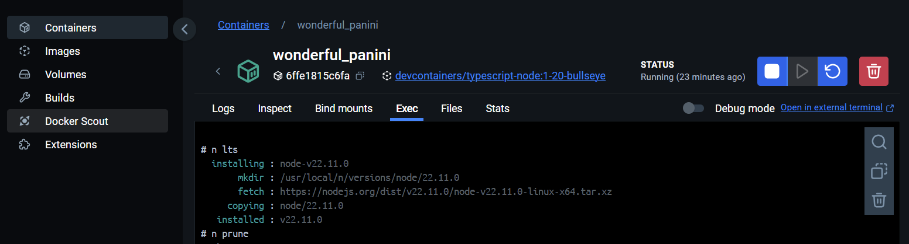

# Node version

When you create a container initially you may choose a safe older version of node say 18 and later want to move up to node 20.Perhaps you are already using version 20.

> node --version

```bash
v20.8.0
```

It may simply be that you encounter a feature which requires a higher version.  For example I tried:

> npm install

on a particular container and got back a stream of deprecation.

```bash
npm warn EBADENGINE Unsupported engine {
npm warn EBADENGINE   package: '@eslint/config-array@0.18.0',
npm warn EBADENGINE   required: { node: '^18.18.0 || ^20.9.0 || >=21.1.0' },
npm warn EBADENGINE   current: { node: 'v20.8.0', npm: '10.9.1' }
npm warn EBADENGINE }
npm warn EBADENGINE Unsupported engine {
npm warn EBADENGINE   package: '@eslint/core@0.7.0',
npm warn EBADENGINE   required: { node: '^18.18.0 || ^20.9.0 || >=21.1.0' },
npm warn EBADENGINE   current: { node: 'v20.8.0', npm: '10.9.1' }
npm warn EBADENGINE }
npm warn EBADENGINE Unsupported engine {
npm warn EBADENGINE   package: '@eslint/eslintrc@3.1.0',
npm warn EBADENGINE   required: { node: '^18.18.0 || ^20.9.0 || >=21.1.0' },
npm warn EBADENGINE   current: { node: 'v20.8.0', npm: '10.9.1' }
npm warn EBADENGINE }
```

So I needed to manage the node version running in the container.

## Version management not working

For this purpose there is a [node version manager](https://www.npmjs.com/package/n) "n".

To install this to a container which already has n running:

> npm install -g n

To use this to install the long term support (lts) version of node the command should be

> n lts

But this does not work showing instea:

```bash
  installing : node-v22.11.0
       mkdir : /usr/local/n/versions/node/22.11.0
mkdir: cannot create directory ‘/usr/local/n’: Permission denied

  Error: sudo required (or change ownership, or define N_PREFIX)
```

The issue is predicted on the [node version manager](https://www.npmjs.com/package/n) page.  "The default root location used when running n is /usr/local where a normal user does not have write permission."

The installation can be tried again but with the sudo command to make this an administative user command.

> sudo npm install -g n

```bash
changed 1 package in 1s
npm notice 
npm notice New major version of npm available! 9.8.1 -> 10.9.1
npm notice Changelog: https://github.com/npm/cli/releases/tag/v10.9.1
npm notice Run npm install -g npm@10.9.1 to update!
npm notice 
```

As usual following the prompt message to update npm

> npm install -g npm@10.9.1

```bash
changed 18 packages in 2s

25 packages are looking for funding
  run `npm fund` for details
```

Now trying to update to node lts still fails!

> n lts

```bash
  installing : node-v22.11.0
       mkdir : /usr/local/n/versions/node/22.11.0
mkdir: cannot create directory ‘/usr/local/n’: Permission denied

  Error: sudo required (or change ownership, or define N_PREFIX)
```

Trying the command "n" does not show the installed node version but leads to a summary of usage for n.

> n

```bash
find: ‘/usr/local/n/versions’: No such file or directory

Usage: n [options] [COMMAND] [args]

Commands:

  n                              Display downloaded Node.js versions and install selection
  n latest                       Install the latest Node.js release (downloading if necessary)
  n lts                          Install the latest LTS Node.js release (downloading if necessary)
  n <version>                    Install Node.js <version> (downloading if necessary)
  n install <version>            Install Node.js <version> (downloading if necessary)
  n run <version> [args ...]     Execute downloaded Node.js <version> with [args ...]
  n which <version>              Output path for downloaded node <version>
  n exec <vers> <cmd> [args...]  Execute command with modified PATH, so downloaded node <version> and npm first
  n rm <version ...>             Remove the given downloaded version(s)
  n prune                        Remove all downloaded versions except the installed version
  n --latest                     Output the latest Node.js version available
  n --lts                        Output the latest LTS Node.js version available
  n ls                           Output downloaded versions
  n ls-remote [version]          Output matching versions available for download
  n uninstall                    Remove the installed Node.js
  n download <version>           Download Node.js <version> into cache

Options:

  -V, --version         Output version of n
  -h, --help            Display help information
  -p, --preserve        Preserve npm and npx during install of Node.js
  -q, --quiet           Disable curl output. Disable log messages processing "auto" and "engine" labels.
  -d, --download        Download if necessary. Used with run/exec/which.
  --cleanup             Remove cached version after install
  -a, --arch            Override system architecture
  --offline             Resolve target version against cached downloads instead of internet lookup
  --all                 ls-remote displays all matches instead of last 20
  --insecure            Turn off certificate checking for https requests (may be needed from behind a proxy server)
  --use-xz/--no-use-xz  Override automatic detection of xz support and enable/disable use of xz compressed node downloads.

Aliases:

  install: i
  latest: current
  ls: list
  lsr: ls-remote
  lts: stable
  rm: -
  run: use, as
  which: bin

Versions:

  Numeric version numbers can be complete or incomplete, with an optional leading 'v'.
  Versions can also be specified by label, or codename,
  and other downloadable releases by <remote-folder>/<version>

    4.9.1, 8, v6.1    Numeric versions
    lts               Newest Long Term Support official release
    latest, current   Newest official release
    auto              Read version from file: .n-node-version, .node-version, .nvmrc, or package.json
    engine            Read version from package.json
    boron, carbon     Codenames for release streams
    lts_latest        Node.js support aliases

    and nightly, rc/10 et al


  Error: no downloaded versions yet, see above help for commands
  ```

  ## The solution

    If you issue the command

    >whoami

    You will see the response

    ```bash
    node
    ```

    In other words visual studio terminal is not acting as the root user.

    The [node version manager](https://www.npmjs.com/package/n) site offers three solutions which range in complexity.

    
    1. change the ownership of the relevant directories to yourself (see below)
    2. tell n to use a custom location where you do have write permissions (see N_PREFIX)
    3. put sudo in front of the command to run it as super user

Fortunately you don't need any of these solutions as within docker you have a terminal to the container which is operating as the root user.


Within this terminnal issue the command:

> n lts

Then to remove any old versions of node.

> n prune

The latest version is now installed.



To see the list of options for the n command in the root container termninal:

> n -h

```bash
Usage: n [options] [COMMAND] [args]

Commands:

  n                              Display downloaded Node.js versions and install selection
  n latest                       Install the latest Node.js release (downloading if necessary)
  n lts                          Install the latest LTS Node.js release (downloading if necessary)
  n <version>                    Install Node.js <version> (downloading if necessary)
  n install <version>            Install Node.js <version> (downloading if necessary)
  n run <version> [args ...]     Execute downloaded Node.js <version> with [args ...]
  n which <version>              Output path for downloaded node <version>
  n exec <vers> <cmd> [args...]  Execute command with modified PATH, so downloaded node <version> and npm first
  n rm <version ...>             Remove the given downloaded version(s)
  n prune                        Remove all downloaded versions except the installed version
  n --latest                     Output the latest Node.js version available
  n --lts                        Output the latest LTS Node.js version available
  n ls                           Output downloaded versions
  n ls-remote [version]          Output matching versions available for download
  n uninstall                    Remove the installed Node.js
  n download <version>           Download Node.js <version> into cache

Options:

  -V, --version         Output version of n
  -h, --help            Display help information
  -p, --preserve        Preserve npm and npx during install of Node.js
  -q, --quiet           Disable curl output. Disable log messages processing "auto" and "engine" labels.
  -d, --download        Download if necessary. Used with run/exec/which.
  --cleanup             Remove cached version after install
  -a, --arch            Override system architecture
  --offline             Resolve target version against cached downloads instead of internet lookup
  --all                 ls-remote displays all matches instead of last 20
  --insecure            Turn off certificate checking for https requests (may be needed from behind a proxy server)
  --use-xz/--no-use-xz  Override automatic detection of xz support and enable/disable use of xz compressed node downloads.

Aliases:

  install: i
  latest: current
  ls: list
  lsr: ls-remote
  lts: stable
  rm: -
  run: use, as
  which: bin

Versions:

  Numeric version numbers can be complete or incomplete, with an optional leading 'v'.
  Versions can also be specified by label, or codename,
  and other downloadable releases by <remote-folder>/<version>

    4.9.1, 8, v6.1    Numeric versions
    lts               Newest Long Term Support official release
    latest, current   Newest official release
    auto              Read version from file: .n-node-version, .node-version, .nvmrc, or package.json
    engine            Read version from package.json
    boron, carbon     Codenames for release streams
    lts_latest        Node.js support aliases

    and nightly, rc/10 et al
```

Now you can move the node version in the container forward and backwards to suit the requirements of either a new or legacy project.
