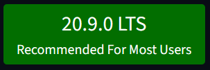
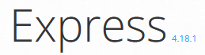
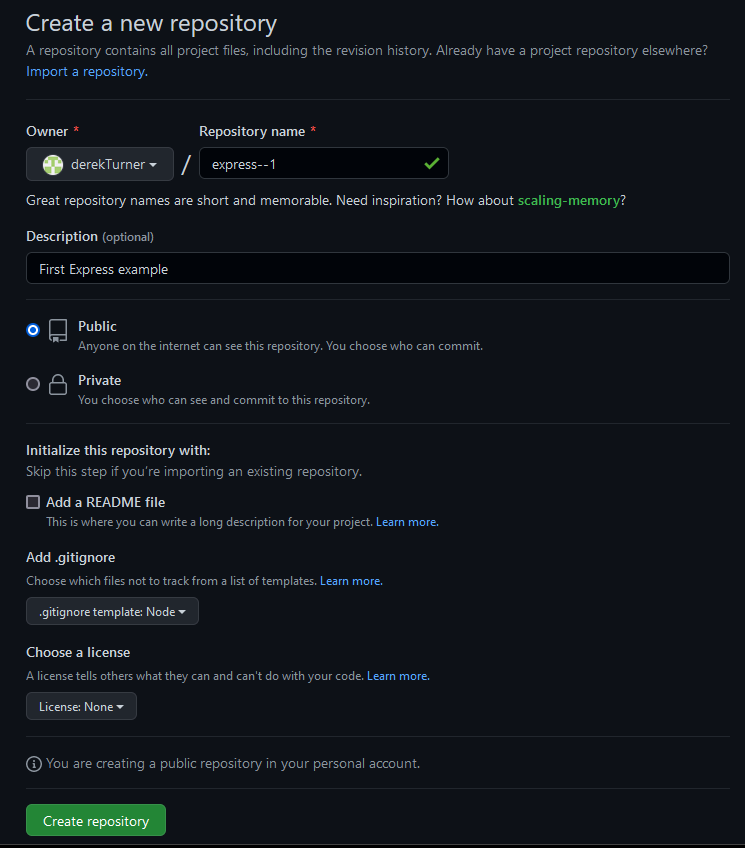
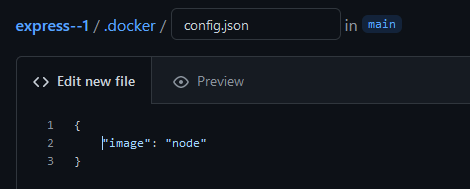
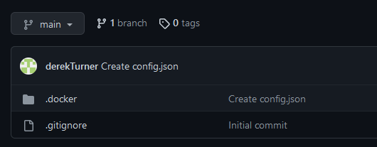
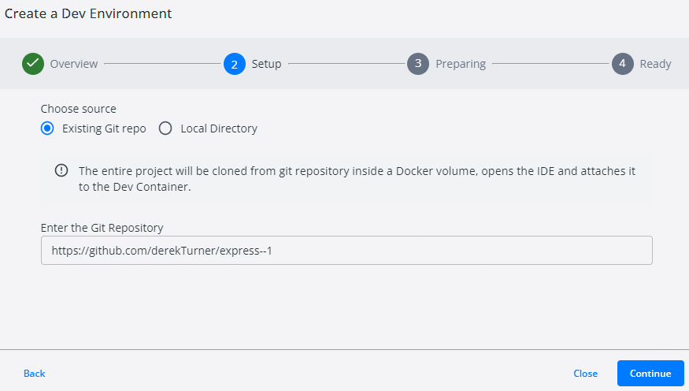
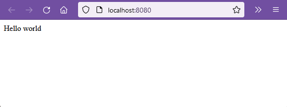
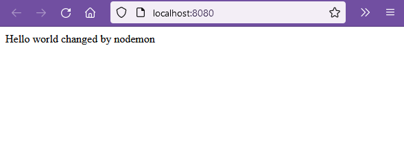

# ExpressJS with node on Docker

In this section we are working towards a server side application combining, node, express and mongoDb, but first we start with a hello world from express.

[Node](https://nodejs.org/en/) is described as "as an asynchronous event driven JavaScript runtime, Node is designed to build scalable network applications". In a browser javascript is to some degree sandboxed, but when it is running on Node it can draw on the many modules which Node provides and that includes networking capabilities. This example uses node version 20.



[ExpressJS](https://expressjs.com/) is a small web framework which sits on top of node.js

Express 4 is the current version  Express 5 is coming soon but code for express 4 may not run on express 5 without modification.  Since version 5 is still in beta we will stick with express 4.




[Mongo](https://www.mongodb.com/) is document based database now in version 6.0.  It can be downloaded and run on a machine, but there is a cloud version mongo [Atlas](https://www.mongodb.com/cloud/atlas/efficiency) which has a free account useful for development.


# Running express in a docker development environment

Now it is time to look at server side programming we will consider Express running in a node environment. The environment will not be started from Visual studio code as I have done previously, but will use development containers linked to a github repositories.

For this I will set up new github repository named express--1 and use this to create a new docker environment.  As I progress through the example I will make a series of github repositories to demonstrate progressive stages.


I need to make a new repository so will add a .gitnore file for node environment.  Remember to to add the .gitignore node template.



Create the file .docker/config.json editing online via the github site.  Take care over the dot and make sure you have the correct folder structure.

```json
{
    "image": "node"
}
```

If we don't specify this will use the latest version of node.




Commit this file.  Express--1 now has two files.




In docker desktop, create a new environment.



After a long wait the container starts to run automatically:


The new container can be opened in VSCode for inspection.


To check that node is working enter into the terminal shell:

> node --version

```code
node --version
v20.9.0
```


# install express 

At this point, the bash shell within visual studio code is running as user node and does not have root priveledges to create a directory to load the node modules for expo.  This is a security feature.  However a work around is available.

In powershell open a bash shell as the root user.

Check the running container for expo (yours will be differently named).

> docker exec -u 0 -it express--1-youthful_goldberg-app-1 bash

To check this is the root type 

> whoami

to confirm:

```code
root
```

Now as the root user install express following the instructions at [express.js](http://expressjs.com/en/starter/installing.html)

Note that express version 5 is still in alpha and has been for a couple of years so it is not ready to use.

Enter the environment folder.

> cd com.docker.devenvironments.code

Create an app for myapp and move into this

> mkdir myapp

>cd myapp

The next line creates package.json and prompts for answers.

> npm init

```code
This utility will walk you through creating a package.json file.
It only covers the most common items, and tries to guess sensible defaults.

See `npm help init` for definitive documentation on these fields
and exactly what they do.

Use `npm install <pkg>` afterwards to install a package and
save it as a dependency in the package.json file.

Press ^C at any time to quit.
package name: (myapp)
```
Hit return to accept default except for the entry point which will be app.js..

```code
package name: (myapp)
version: (1.0.0)
description: Hello World express app
entry point: (index.js) app.js
test command: test
git repository:
keywords:
author:
license: (ISC)
About to write to /com.docker.devenvironments.code/myapp/package.json:

{
  "name": "myapp",
  "version": "1.0.0",
  "description": "Hello World express app",
  "main": "app.js",
  "scripts": {
    "test": "test"
  },
  "author": "",
  "license": "ISC"
}


Is this OK? (yes)
```
Enter return.

```code
root@9a68a35749e1:/com.docker.devenvironments.code/myapp#
```

### Install Express

>npm install express

```code
added 57 packages, and audited 58 packages in 3s

7 packages are looking for funding
  run `npm fund` for details

found 0 vulnerabilities
```

### Install Nodemon

Next step is to install [nodemon](https://www.npmjs.com/package/nodemon).  The intention of this is to give live updates as the code is edited. I have had success with this in the past, but always finickity to set up.

> npm i nodemon


```code
added 32 packages, and audited 90 packages in 2s

10 packages are looking for funding
  run `npm fund` for details

found 0 vulnerabilities
```

## setting the root password

So that I don't need to stay in powershell I can set a root password which I will be able to use in the Docker environment via visual studio code. 

I don't have permission to make a new file as node so I return to powershell and do this as root.

>passwd

```code
New password:
Retype new password:
passwd: password updated successfully
```

Just for the record I set the password to **node** which seems easy to remember for the sake of this exercise.

## superuser access

From Docker, open the dev environment in Visual Studio Code.  

>whoami

Shows that I am root.  This may be a change due to an update of Docker, please check and if you are the root user you can manage to install express without resorting to the powershell.

Generally you should not work as root user as this has too many privilidges and a wrong command could cause unwanted damage.

To chang to a less dangerous user,

>su node

> whoami

```code
node
```

The terminal now is the user node and so does not have root privilidges as a security feature.

Review the contents of package.json

```json
{
  "name": "myapp",
  "version": "1.0.0",
  "description": "Hello World express app",
  "main": "app.js",
  "scripts": {
    "test": "test"
  },
  "author": "",
  "license": "ISC",
  "dependencies": {
    "express": "^4.18.2",
    "nodemon": "^3.0.1"
  }
}

```
This covers the applications installed in their recent versions.

Take  alook at psckage-lock.json.  This is a long file, so only and extract shown here.

```json
{
  "name": "myapp",
  "version": "1.0.0",
  "lockfileVersion": 3,
  "requires": true,
  "packages": {
    "": {
      "name": "myapp",
      "version": "1.0.0",
      "license": "ISC",
      "dependencies": {
        "express": "^4.18.2",
        "nodemon": "^3.0.1"
      }
    },
    "node_modules/abbrev": {
      "version": "1.1.1",
      "resolved": "https://registry.npmjs.org/abbrev/-/abbrev-1.1.1.tgz",
      "integrity": "sha512-nne9/IiQ/hzIhY6pdDnbBtz7DjPTKrY00P/zvPSm5pOFkl6xuGrGnXn/VtTNNfNtAfZ9/1RtehkszU9qcTii0Q=="
    },
    "node_modules/accepts": {
      "version": "1.3.8",
      "resolved": "https://registry.npmjs.org/accepts/-/accepts-1.3.8.tgz",
      "integrity": "sha512-PYAthTa2m2VKxuvSD3DPC/Gy+U+sOA1LAuT8mkmRuvw+NACSaeXEQ+NHcVF7rONl6qcaxV3Uuemwawk+7+SJLw==",
      "dependencies": {
        "mime-types": "~2.1.34",
        "negotiator": "0.6.3"
      },
      "engines": {
        "node": ">= 0.6"
      }
    },
    "node_modules/anymatch": {
      "version": "3.1.3",
      "resolved": "https://registry.npmjs.org/anymatch/-/anymatch-3.1.3.tgz",
      "integrity": "sha512-KMReFUr0B4t+D+OBkjR3KYqvocp2XaSzO55UcB6mgQMd3KbcE+mWTyvVV7D/zsdEbNnV6acZUutkiHQXvTr1Rw==",
      "dependencies": {
        "normalize-path": "^3.0.0",
        "picomatch": "^2.0.4"
      },
      "engines": {
        "node": ">= 8"
      }
    },
```

The purpose of this file is to keep the dependencies correct if the app is reinstated later from the package file.

You can commit changes from the source control section of visual studio code and push these to your github.

If at any time you need to do something the node user cant then you can  

> su root

However the node user seems able to edit the files.

If node does not edit a file it may be that you need to change ownership to the node user:

>chown -hR node myapp

Keep that command in reserve in case you need it.

### Changing machines

If you need to change machines you can create a new docker environment on a new machine from express-1.

This will set up the environment.  Then cd to myapp and 

>npm install

If you see any permissions denied (such as app.js) you may need to go in as a superuser and change the permissions to make the file executable.

>chmod u+x app.js


### Running express

Add the code to **app.js** to make express return a message.  Make sure that this file is inside the myapp folder.  If it is not, please move it.

```javascript
'use strict';

const express = require('express');

// Constants
const PORT = 8080;
const HOST = '127.0.0.1';

// App
const app = express();
app.get('/', (req, res) => {
  res.send('Hello world\n');
});

app.listen(PORT, HOST);
console.log(`Running on http://${HOST}:${PORT}`);
```


To enable the application to run add a start script to package.json.

```json
{
  "name": "myapp",
  "version": "1.0.0",
  "description": "Hello World express app",
  "main": "app.js",
  "scripts": {
    "test": "test",
    "start": "nodemon app.js"
  },
  "author": "",
  "license": "ISC",
  "dependencies": {
    "express": "^4.18.2",
    "nodemon": "^3.0.1"
  }
}
```
To execute the start script

>cd myapp

> npm run start

```code
> myapp@1.0.0 start
> nodemon

> myapp@1.0.0 start
> nodemon app.js

[nodemon] 3.0.1
[nodemon] to restart at any time, enter `rs`
[nodemon] watching path(s): *.*
[nodemon] watching extensions: js,mjs,cjs,json
[nodemon] starting `node app.js`
Running on http://0.0.0.0:8080
```


Open the browser to port 8080 and see the hello world message.


Initially I see an **unable to connect**  message from the browser.

Note that the address http://0.0.0.0:8080 in the terminal display is a link.  Hover over this to see Follow link CTRL + Click

Rather than manually typing the link into the browser ctrl + click this link.

You may asked to **trust** this website! If so answer yes!

Now the browser correctly displays the app.



To check the operation of nodemon, edit the contents of app.js to change the message:

```javascript
'use strict';

const express = require('express');

// Constants
const PORT = 8080;
const HOST = '0.0.0.0';

// App
const app = express();
app.get('/', (req, res) => {
  res.send('Hello world changed by nodemon\n');
});

app.listen(PORT, HOST);
console.log(`Running on http://${HOST}:${PORT}`);
```

Immediately the terminal output changes to note this.

```code
[nodemon] restarting due to changes...
[nodemon] starting `node app.js`
Running on http://0.0.0.0:8080
```
Now refresh the browser to see the updated message.



To stop the app running use 

> ctrl + C

```code
^C
node@9267fdc420a9:/com.docker.devenvironments.code/myapp$
```
A simple example of express is running in a container.

### References

[Building a Simple CRUD Application with Express and MongoDB](https://zellwk.com/blog/crud-express-mongodb/)

[Linux command line cheat sheet](https://www.cheatography.com/davechild/cheat-sheets/linux-command-line/) 

[Bash scripting cheatsheet](https://devhints.io/bash)

[Manage your node version](https://www.npmjs.com/package/n)