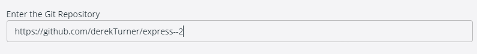
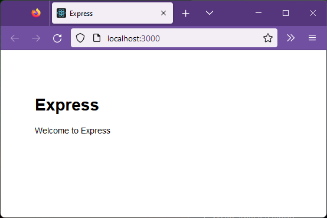
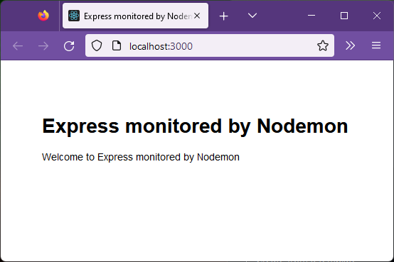

## Express Generator

This section continues our working towards a server side application combining, node, express and mongoDb.

In previous sections we have developed a react application from scratch to show how it works and have then gone on to use a vite to create a full application template ready for use.  

In a similar way, having made an initial express app to say hello world we want to use the express generator to set up a template application with a folder structure ready for use.

## Duplicate repository

The starting point for this is the express 1 code so I will copy this into a new repository named express--2 using the instructions at on [gitHub docs](https://docs.github.com/en/repositories/creating-and-managing-repositories/duplicating-a-repository). 

This will leave a working version of files on github.  If you prefer you might create a new github branch rather than a separate repository.  

This will create a local copy of the express1 repository which is deleted at the end.  I found I had to delete this manually!

Create the local bare clone copy working in powershell;

> git clone --bare https://github.com/derekTurner/express--1.git

Move to the now local copy and Mirror push the thew repository

> cd express--1.git

> git push --mirror https://github.com/derekTurner/express--2.git

Then remove the local repository

> cd..

> rm -rf express--1.git

This last step did not work so I just removed the file using windows file inspector.

## Create dev environment

Working from the new repository create a new environment.




Opening VSC should now have root access, if it does not you can work in powershell as before.

> docker exec -u 0 -it dev-name bash

but I don't need to do that so I am still in the VSC terminal view.


Now install the express generator.

> npm install -g express-generator

```code
npm WARN deprecated mkdirp@0.5.1: Legacy versions of mkdirp are no longer supported. Please update to mkdirp 1.x. (Note that the API surface has changed to use Promises in 1.x.)

added 10 packages, and audited 11 packages in 2s

4 vulnerabilities (1 moderate, 1 high, 2 critical)

To address all issues (including breaking changes), run:
  npm audit fix --force

Run `npm audit` for details.
```
Need to update this non supported version.

> npm install mkdirp@1

```code
added 1 package, and audited 2 packages in 410ms

found 0 vulnerabilities
```

Check the express generator by 

> express -h

```code
  Usage: express [options] [dir]

  Options:

        --version        output the version number
    -e, --ejs            add ejs engine support
        --pug            add pug engine support
        --hbs            add handlebars engine support
    -H, --hogan          add hogan.js engine support
    -v, --view <engine>  add view <engine> support (dust|ejs|hbs|hjs|jade|pug|twig|vash) (defaults to jade)
        --no-view        use static html instead of view engine
    -c, --css <engine>   add stylesheet <engine> support (less|stylus|compass|sass) (defaults to plain css)
        --git            add .gitignore
    -f, --force          force on non-empty directory
    -h, --help           output usage information
```

Using express generator will generate myapp, so the old myapp can be renamed to xmyapp and then deleted when the new myapp is generated.

Rename myapp to xmyapp.

From the root directory (not inside myapp) as root user issue

> express --view=pug myapp

```code
    create : myapp/
   create : myapp/public/
   create : myapp/public/javascripts/
   create : myapp/public/images/
   create : myapp/public/stylesheets/
   create : myapp/public/stylesheets/style.css
   
   create : myapp/routes/
   create : myapp/routes/index.js
   create : myapp/routes/users.js
   create : myapp/views/
   create : myapp/views/error.pug
   create : myapp/views/index.pug
   create : myapp/views/layout.pug
   create : myapp/app.js
   create : myapp/package.json
   create : myapp/bin/
   create : myapp/bin/www

   change directory:
     $ cd myapp

   install dependencies:
     $ npm install

   run the app:
     $ DEBUG=myapp:* npm start

```

Follow the directions still as root.

>cd myapp

Install dependancies.

>npm install

```code
npm WARN deprecated core-js@2.6.12: core-js@<3.23.3 is no longer maintained and not recommended for usage due to the number of issues. Because of the V8 engine whims, feature detection in old core-js versions could cause a slowdown up to 100x even if nothing is polyfilled. Some versions have web compatibility issues. Please, upgrade your dependencies to the actual version of core-js.

added 124 packages, and audited 125 packages in 10s

8 packages are looking for funding
  run `npm fund` for details

4 vulnerabilities (2 low, 2 high)

To address issues that do not require attention, run:
  npm audit fix

To address all issues, run:
  npm audit fix --force

Run `npm audit` for details.
```
Try to fix the deprecated version of core-js up to a mininum of version 3.3, the [current version is 3.19.1](https://www.npmjs.com/package/core-js)

> npm install core-js

```code
npm WARN deprecated core-js@2.6.12: core-js@<3.23.3 is no longer maintained and not recommended for usage due to the number of issues. Because of the V8 engine whims, feature detection in old core-js versions could cause a slowdown up to 100x even if nothing is polyfilled. Some versions have web compatibility issues. Please, upgrade your dependencies to the actual version of core-js.

added 1 package, changed 1 package, and audited 126 packages in 2s

9 packages are looking for funding
  run `npm fund` for details

4 vulnerabilities (2 low, 2 high)

To address issues that do not require attention, run:
  npm audit fix

To address all issues, run:
  npm audit fix --force

Run `npm audit` for details.
```
The updated version is listed in package.json in the new myapp folder.

```json
{
  "name": "myapp",
  "version": "0.0.0",
  "private": true,
  "scripts": {
    "start": "node ./bin/www"
  },
  "dependencies": {
    "cookie-parser": "~1.4.4",
    "core-js": "^3.33.2",
    "debug": "~2.6.9",
    "express": "^4.18.2",
    "http-errors": "~1.6.3",
    "morgan": "~1.9.1",
    "pug": "^3.0.2"
  }
}
```

To load all the dependancies now

>npm install

```code
up to date, audited 126 packages in 572ms

9 packages are looking for funding
  run `npm fund` for details

4 vulnerabilities (2 low, 2 high)

To address issues that do not require attention, run:
  npm audit fix

To address all issues, run:
  npm audit fix --force

Run `npm audit` for details.
```
Go back to the com.docker.devenvironments.code folder

> cd..

Now delete the xmyapp directory which we no longer need.

> rm -r xmyapp

From here 

>cd myapp

Probably also a good moment to save code to github.

## Running the generated app

The standard files and structure are now in place in the local directory.

```code
myapp
|   app.js
|   package.json
|   package-lock.json
|   
|   
+---bin
|       www
|       
+---public
|   +---images
|   +---javascripts
|   \---stylesheets
|           style.css
|           
+---routes
|       index.js
|       users.js
|       
\---views
        error.pug
        index.pug
        layout.pug

```

Files can be inspected. 

Note the bin folder contains an executable file www


This is a characteristic mark of express 4.  The first few lines of www are:

```javascript
#!/usr/bin/env node

/**
 * Module dependencies.
 */

var app = require('../app');
var debug = require('debug')('myapp:server');
var http = require('http');

/**
 * Get port from environment and store in Express.
 */

var port = normalizePort(process.env.PORT || '3000');
app.set('port', port);

/**
 * Create HTTP server.
 */

var server = http.createServer(app);

```
There is more, but the point is that this is a node module which starts the app, and this is pointed to by the start script in package.json

```json
 "scripts": {
    "start": "node ./bin/www"
  },
```

Now in the Container node window, I am trying to edit package.js but see the error:


The reason for this is that the folder was made by root and the permissions are not set for user node to be able to write.

## Add nodemon

Change the start script in the remote container to use nodemon and save this.

```json
{
  "name": "myapp",
  "version": "0.0.0",
  "private": true,
  "scripts": {
    "start": "nodemon ./bin/www"
  },
  "dependencies": {
    "cookie-parser": "~1.4.4",
    "core-js": "^3.33.2",
    "debug": "~2.6.9",
    "express": "^4.18.2",
    "http-errors": "~1.6.3",
    "morgan": "~1.9.1",
    "pug": "^3.0.2"
  }
}
```

Install nodemon

> npm install nodemon

```code
added 32 packages, and audited 158 packages in 2s

12 packages are looking for funding
  run `npm fund` for details

4 vulnerabilities (2 low, 2 high)

To address issues that do not require attention, run:
  npm audit fix

To address all issues, run:
  npm audit fix --force

Run `npm audit` for details.
```

Run the application.

>npm run start

```
> myapp@0.0.0 start
> nodemon ./bin/www

[nodemon] 2.0.20
[nodemon] to restart at any time, enter `rs`
[nodemon] watching path(s): *.*
[nodemon] watching extensions: js,mjs,json
[nodemon] starting `node ./bin/www`
GET / 200 205.454 ms - 170
GET /stylesheets/style.css 200 3.090 ms - 111
```
The application starts and nodemon is looking for changes.

The browser addresses port 3000



Nodemon should track changes to the file so edit the "Welcome to Express" message.

The message is rendered from the pug view **views/index.pug**

```pug
extends layout

block content
  h1= title
  p Welcome to #{title}
```

So to make a longer message the variable title must be altered in the calling file which is **routes/index.js**

```javascript
var express = require('express');
var router = express.Router();

/* GET home page. */
router.get('/', function(req, res, next) {
  res.render('index', { title: 'Express' });
});

module.exports = router;
```

Change the line

```javascript
router.get('/', function(req, res, next) {
  res.render('index', { title: 'Express monitored by Nodemon' });
});
```
```code
[nodemon] restarting due to changes...
[nodemon] starting `node ./bin/www`
```

Refresh the browser to see the change.



As a backup, if you want to restart the server manually (rather than letting nodemon do it) you can do this at any point by the restart (rs) command in the terminal.  (This is not a docker command and does not restart the container, only the server within the container).

>rs

Terminal output:
```
[nodemon] starting `node ./bin/www`
```

Close the server by

CTRL + C

### Back up to github

Although the last changes are minor, back them up to github.


## references

[How To Build a Node.js Application with Docker](https://www.digitalocean.com/community/tutorials/how-to-build-a-node-js-application-with-docker) sharks webpage

[express](https://expressjs.com/)

[How to create a REST API with Express.js in Node.js](https://www.robinwieruch.de/node-express-server-rest-api/)