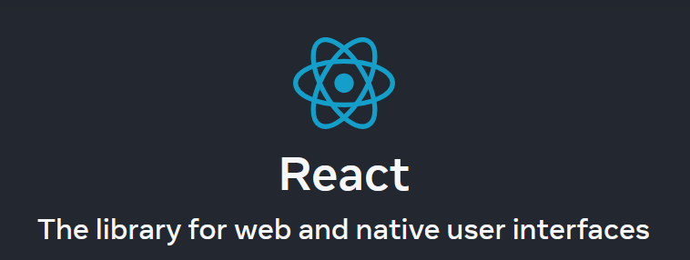
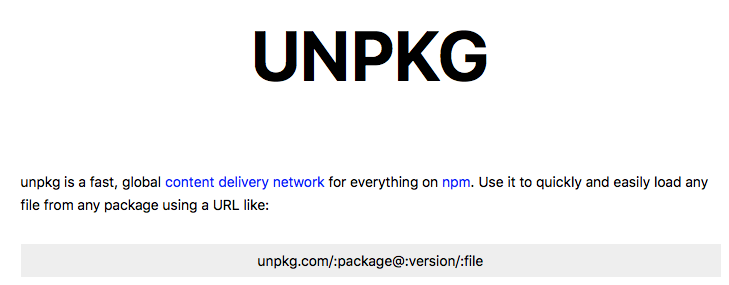
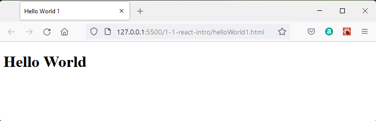
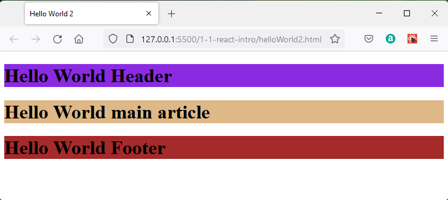

## Introduction to React


[React](https://react.dev/) is a javascript library for building user interfaces.

In normal usage react code would be developed in a [node](https://nodejs.org/en/) environment and then built to produce a website with an index.html page and all the associated javascript ready to run on a browser.  Unnecessary javascript from the development environment should not be brought into the final public folder.

This approach will be taken within this module and the node environment will be maintained within a docker container.

One aspect of the node environment is that it supports JSX which is a format which resembles HTML and describes the output react should make.  While this is not compulsory to use React it is the approach made in the module.

The react-dom  provides a method of writing into a dynamic document object model (DOM) of an HTML page.



## React without a production environment

This is only a way to have a first try and is not a reccommended way to develop for production.

As a starting point for basic try out all that is needed within HTML to embed a react application into it are the links to the javascript libraries.


```javascript
<script src="https://unpkg.com/react@18/umd/react.development.js" crossorigin></script>  
<script src="https://unpkg.com/react-dom@18/umd/react-dom.development.js" crossorigin>
</script>
```

These javasript libraries are drawn from a Content Delivery Network namned [unpkg](https://unpkg.com).  



This provides a rapid download of packages which are held on the node package manager (NPM) site.

Following the link https://unpkg.com/react@18/umd/react.development.js in a browser reveals the react javascript code from the latest version of the library to be supported in this way.  In this case version 18.3.1.

```javascript
/**
 * @license React
 * react.development.js
 *
 * Copyright (c) Facebook, Inc. and its affiliates.
 *
 * This source code is licensed under the MIT license found in the
 * LICENSE file in the root directory of this source tree.
 */
(function (global, factory) {
  typeof exports === 'object' && typeof module !== 'undefined' ? factory(exports) :
  typeof define === 'function' && define.amd ? define(['exports'], factory) :
  (global = global || self, factory(global.React = {}));
}(this, (function (exports) { 'use strict';

  var ReactVersion = '18.3.1';

  // ATTENTION
  // When adding new symbols to this file,
  // Please consider also adding to 'react-devtools-shared/src/backend/ReactSymbols'
  // The Symbol used to tag the ReactElement-like types.
  var REACT_ELEMENT_TYPE = Symbol.for('react.element');
  var REACT_PORTAL_TYPE = Symbol.for('react.portal');
  var REACT_FRAGMENT_TYPE = Symbol.for('react.fragment');
  var REACT_STRICT_MODE_TYPE = Symbol.for('react.strict_mode');
  var REACT_PROFILER_TYPE = Symbol.for('react.profiler');
  var REACT_PROVIDER_TYPE = Symbol.for('react.provider');
  var REACT_CONTEXT_TYPE = Symbol.for('react.context');
  var REACT_FORWARD_REF_TYPE = Symbol.for('react.forward_ref');
  var REACT_SUSPENSE_TYPE = Symbol.for('react.suspense');
  var REACT_SUSPENSE_LIST_TYPE = Symbol.for('react.suspense_list');
  var REACT_MEMO_TYPE = Symbol.for('react.memo');
  var REACT_LAZY_TYPE = Symbol.for('react.lazy');
  var REACT_OFFSCREEN_TYPE = Symbol.for('react.offscreen');
  var MAYBE_ITERATOR_SYMBOL = Symbol.iterator;
  var FAUX_ITERATOR_SYMBOL = '@@iterator';
  function getIteratorFn(maybeIterable) {
    if (maybeIterable === null || typeof maybeIterable !== 'object') {
      return null;
    }

    var maybeIterator = MAYBE_ITERATOR_SYMBOL && maybeIterable[MAYBE_ITERATOR_SYMBOL] || maybeIterable[FAUX_ITERATOR_SYMBOL];

    if (typeof maybeIterator === 'function') {
      return maybeIterator;
    }

    return null;
  }
...
```

The react entry can be seen on the [npm site](https://www.npmjs.com/package/react) and shows:


The packages have to include dependancies so there are a number of options, but to start with stick to the main ones.

## JSX

A feature of React is a dynamic Document Object Model.  In other words, react can write HTML directly into a named \<div>\</div> and this is usually named "container" (but this is not mandatory).

```javascript
<div id="container"></div>
```


The code which adds HTML into the container looks itself like HTML, but it is actually JSX.  An application called Babel is running in the background to convert JSX to HTML.  This can also be loaded as a javasript library.

```javascript
<script src="https://unpkg.com/babel-standalone@6/babel.min.js" crossorigin></script>
```
Note that this is a stand alone version of babel not the standard one.

The code can be viewed at https://unpkg.com/babel-standalone@6.26.0/babel.min.js but it is not in a human readable format here.

Using unpkg links is slow.  A large development code base is accessed.

This approach is slow and should only be used for development and not production.  Usually react applications are constructed in a node environment.  Most books and tutorials go directly to node, but I prefer to work with the javaScript libraries to start off.


## Hello World 1

A basic hello world file would look like:

```html
<!DOCTYPE html>
<html lang="en">
   <head>
      <title>Hello World 1</title>
      <script crossorigin src="https://unpkg.com/react@18/umd/react.development.js"></script>
      <script crossorigin src="https://unpkg.com/react-dom@18/umd/react-dom.development.js"></script>
      <script src="https://unpkg.com/babel-standalone@6.26.0/babel.js"></script>
      <script src="helloWorld1.js"  type="text/babel"></script>
    </head>
   <body>
      <div id="main"></div> 
   </body>
</html>
```
The HTML has a title "Hello World", followed by script links to the React18 resources of react and react-dom.

A link to babel allows the use of JSX

The next script tag calls the javascript helloWorld1.js which contains the react code:

```javascript
const main = ReactDOM.createRoot(document.getElementById("main"));
main.render(<h1>Hello World</h1>);
```
The html file has a div with id "main" which will be the location where react renders output.

In javascript a root is created at the identified div.  Then the renderer method of this root is called.  The text `<h1>Hello World</h1>` is in JSX format and babel translates this.


To see the output the files must be provided by a server.  If you open the files in the same folder using Visual Studio Code with the Live Server extension installed you can right click on the html file and "Open with Live Server".  The folder contents are served on port 5500.  

Since I am editing using Visual Studio Code I prefer to view HTML in a testing server I have installed the liveServer extension.


Then I can right click on the html file in Visual Studio Code and select Open With Live Server.  This serves on 127.0.0.1:5500




## Hello World 2

React is often set to render into an HTML `<div>` element, but it is able to render into any HTML block element.  More generally any element capable of having inner HTML.  In this example I have added HTML5 `<header>`, `<main>` and `<footer>` elements rather than a `<div>`.

HTML5 Elements such as `<div>` and `<span>` are non-semantic as they do not reflect the nature of the content. HTML5 also has a range of [semantic elements](https://www.w3schools.com/html/html5_semantic_elements.asp) which include 

`<article>`, `<aside>`, `<details>`, `<figcaption>`, `<figure>`, `<footer>`, `<header>`, `<main>`, `<mark>`, `<nav>`, `<section>`, `<summary>`, and `<time>`.


The HTML code is similar to the first example except that there are now three block elements in the `<body>` and each of these is identified by a unique id:

```html
<!DOCTYPE html>
<html>
  <head>
    <meta charset="UTF-8" />
    <title>Hello World 2</title>
    <script crossorigin src="https://unpkg.com/react@18/umd/react.development.js"></script>
    <script crossorigin src="https://unpkg.com/react-dom@18/umd/react-dom.development.js"></script>
    <script src="https://unpkg.com/babel-standalone@6.26.0/babel.js"></script>
    <script src="helloWorld2.js" type="text/babel"></script>
    <link rel="stylesheet" type="text/css" href="style.css">
</head>
  <body>
  
    <header id="header"></header>
    <main   id="main"></main>
    <footer id="footer"></footer>
    
  </body>
</html>
```
The helloWorld2.js file now has creates three root objects in the constants, header, main and footer.  A JSX element is then separately rendered by each root.  In this way the text appears in the designated part of the web page.

```javascript
const header = ReactDOM.createRoot(document.getElementById("header"));
const main   = ReactDOM.createRoot(document.getElementById("main"));
const footer = ReactDOM.createRoot(document.getElementById("footer"));

header.render(<h1>Hello World Header</h1>);
main.render(<h1>Hello World main article</h1>);
footer.render(<h1>Hello World main article</h1>);
```

You can also use css to control the layout of the HTML in the normal way. Adding a simple file style.css\:

```css
header {background-color: blueviolet}
main   {background-color: burlywood}
footer {background-color: brown}
```

which is linked within helloWorld2.html 

```javascript
<link rel="stylesheet" type="text/css" href="style.css">
```
This displays as:



This shows that react is building on the HTML javascript css foundations with which you should already be familiar.

## References

The react website has a [getting started](https://react.dev/learn) section. This is the current learning reference which you can use to do some personal study.

