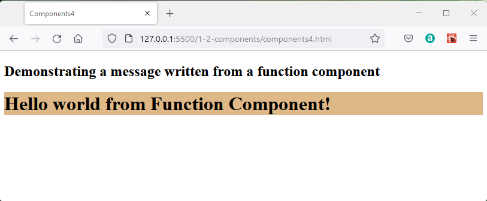
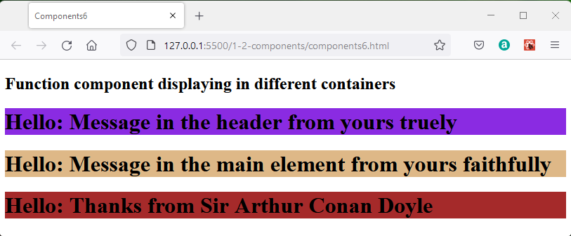

## React Components

An advantgage of react is that it allows the programmer to divide the application into a number of reusable components.  So once you have created, say, a counter component you can use it in several places in the app or in other apps.

If components are to be moveable to other apps it is important that they are completely stand-alone or "pure".

React allows for *class* components and *function* components.  

Class components are now regarded as the legacy approach to writing react code and functions are preferred for new projects.  In spite of this you will come across examples of class components in established apps so I will describe these, but be aware you should not use them for new projects.

The obvious advantage of a class is that it is stand-alone, it will feature methods and properties and will be able to retain values.  This remembering values between usages of the class is called "maintaining state".  Unfortunately extensive usage of classes can make larger programmes difficult to understand and the modern approach is to become less reliant on classes.

The advantage of a function is that it is easy to see arguments going in and a response happening or value being returned.  In older usage styles, global variables might have been read by functions meaning that the output of the function was not entirely controlled by the arguments.  The modern style is to avoid this and ensure that the result of a function is dependant only on the arguments so that same values in produce the same result.  This describes a "pure" function.

The drawback of a function is that it is created in memory when it is called and disposed of when it has run.  The function running for the 100th time has no way of knowing any details from the first 99 calls.  So a function does not maintain state.

React Hooks are a way of maintaining state outside the function and then allowing the called function to hook into this state memory.  
Allowing a function to maintain state means that the function component becomes much more useful and preferred in the modern style.

Class components have been around for a long time and so are established in codebases and are described in books and blogs.  You must be aware of class components and how they work.  However, as you proceed in developing your own react code I recommend using function components in preference.

So in the next section the basic syntax of the function components is described and the class components are presented in a separate section.

Examples will continue to work without a development environment using the following standard code in the head of the HTML document to link to Javascript libraries provided through a content distribution network.


```HTML
 <!DOCTYPE html>
<html>
  <head>
    <meta charset="UTF-8" />
    <title>Components1</title>
    <script crossorigin src="https://unpkg.com/react@18/umd/react.development.js"></script>
    <script crossorigin src="https://unpkg.com/react-dom@18/umd/react-dom.development.js"></script>
    <script src="https://unpkg.com/babel-standalone@6.26.0/babel.js"></script>
    <script src="example.js" type="text/babel"></script>
    <link rel="stylesheet" type="text/css" href="style.css">
</head>
  <body>
    <h2>Descriptive note </h2>
    <main   id="main"></main>
  </body>
</html>
```

This approach is slow and should only be used for development and not production.  


## Function Components

From the code extracts here make up working files **fcomponents1.html** and **fcomponents1.js**

A function component is a function which returns the user interface typically expressed in JSX.

The syntax of the function is relatively simple, here the component takes no arguments and returns a JSX statement.

The function name is Message and is called within the main.render function as `<Message />`.

```javaScript
const main   = ReactDOM.createRoot(document.getElementById("main"));

function Message() {
  return <h1>Hello world from Function Component!</h1>;
}

main.render(<Message />);
```

This renders as:



### Props as Function Arguments

Construct working files **fcomponents2.html** and **fcomponents2.js**

A function class is able to respond to props passed to it as arguments.  The props expressed as name value pair attributes of the JSX Message element are passed through a single {} argument containing the list of props, and are represented within the function by individual {} brackets placed around the prop name required.

```javaScript
const main   = ReactDOM.createRoot(document.getElementById("main"));

function Message({reader, author} ) {
  return <h1>Hello {reader}  from  {author} </h1>;
} 

main.render(<Message reader="dear sleuth" author="Sir Arthur Conan Doyle"/>);
```

This renders as:


### Function Components props and containers

Create working files **fcomponents3.html** and **fcomponents3.js**


The message  function can be called by invoking the message component in three different root renderers with different props to write unique content to three distinct containers.

```javascript
const header   = ReactDOM.createRoot(document.getElementById("header"));
const main     = ReactDOM.createRoot(document.getElementById("main"));
const footer   = ReactDOM.createRoot(document.getElementById("footer"));

function Message({reader, author} ) {
  return <h1>Hello: {reader}  from  {author} </h1>;
} 

header.render(<Message reader="Message in the header"       author="yours truely"/>);  
main.render(  <Message reader="Message in the main element" author="yours faithfully"/>);
footer.render(<Message reader="Thanks"                      author="Sir Arthur Conan Doyle"/>);
```

This renders as:




