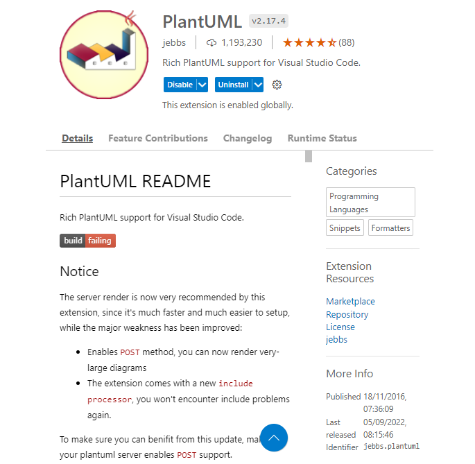
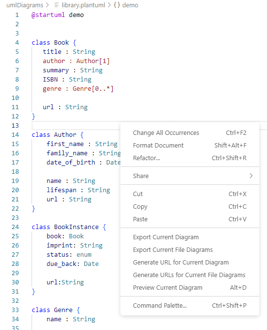
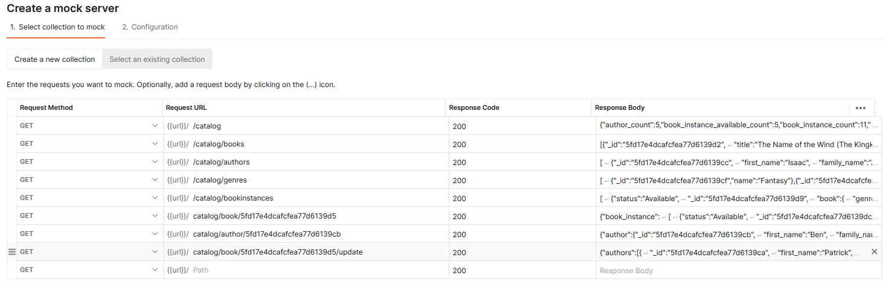

## A library database

To develop an example API a library database will be used which is drawn from the Mozilla tutorial.

## Describe database

In this section I am following the tutorial example at [Mozilla developer](https://developer.mozilla.org/en-US/docs/Learn/Server-side/Express_Nodejs/mongoose)

An app will be developed to administer a book library.

For this purpose the objects which need to be described in the database are:

1. Book: described by title author ISBN etc
2. BookInstance: The library can hold several copies of one book. When it is loaned each book instance will have a due date for return.
3. Author: name and birth/death dates
4. Genre: Crime, Sci-fi, Romance etc

The relationships between these are:

- 1 book may have 0..many instances
- 1..many books may be written by 1 author (ignore multiple authors for the time being)
- 0..many books may match 0..many genres (a book might fit more than one genre or defy categorisation)

This relationship is captured in the UML diagram:


So examples of inital database entries would be:

Book:

- title:'The Name of the Wind (The Kingkiller Chronicle, #1)',
- summary:'I have stolen princesses back from sleeping barrow kings. I burned down the town of Trebon. I have spent the night with Felurian and left with both my sanity and my life. I was expelled from the University at a younger age than most people are allowed in. I tread paths by moonlight that others fear to speak of during day. I have talked to Gods, loved women, and written songs that make the minstrels weep.',
- ISBN: '9781473211896',
- author: authors[0],
- genre: [genres[0],]

BookInstance

- book: books[0],
- imprint: 'London Gollancz, 2014.',
- due_back: false,
- status: 'Available'

Author:

- first_name:'Patrick',
- family_name:'Rothfuss',
- d_birth:'1973-06-06',
- d_death:false

Genre:  
name: "Fantasy"


## Creating a UML diagram

As a brief sidenote, visual studio code is able to create a UML diagram through the addition of a plug in [plantUML](http://plantuml.com/class-diagram).



The installation instructions on the the visual studio plugin are a bit confusing because they say that the plug in needs additional software, but also imply that this is built into the install.  In any case I found that to make this work I did need to install the following pieces of software:

[Graphviz](https://www.graphviz.org/download/) for windows version 6.0.1 64 bit EXE installer.

[Java](https://www.java.com/en/) run time environment.  Follow the download for desktop applications and that will download JRE.  Unless you want Java for other purposes avoid downloading  the JDK or Java SE Development kit.

The plantuml site has lots or examples describing the syntax required to create a wide range of useful diagrams.

A tutorial at code project [UML Made Easy with PlantUML & VS Code](https://www.codeproject.com/Articles/1278703/UML-Made-Easy-with-PlantUML-VS-Code) is a further useful guide to using the plug in although the figures here reflect an older display format they are still relevant.

Working in a new folder named umlDiagrams the following file For the diagram of the library database is saved as library.plantuml.

```java
@startuml demo


class Book {
   title : String
   author : Author[1]
   summary : String
   ISBN : String
   genre : Genre[0..*]

   url : String
}

class Author {
    first_name : String
    family_name : String
    date_of_birth : Date

    name : String
    lifespan : String
    url : String
}

class BookInstance {
    book: Book
    imprint: String
    status: enum
    due_back: Date

    url:String
}

class Genre {
    name : String

    url :String
}


Book "1..*" -- "1" Author
Book "0..*" -- "0..*" Genre
Book "1" -- "0..*" BookInstance
@enduml
```

Right clicking over the file opens a menu to see a preview of the diagram, which will change as the file is edited. Then to print the digram to the desktop in your chosen format. (The plug in works well if you have Java on your machine, otherwise you may need additional software).




## Database content 

Some starting data for the library database is listed here.  It will be discussed again when the database is created, but for now it is the basis from which you can produce a postman mock up.

### Authors
("Patrick", "Rothfuss", "1973-06-06", false);

("Ben", "Bova", "1932-11-8", false);

("Isaac", "Asimov", "1920-01-02", "1992-04-06");

("Bob", "Billings", false, false);

("Jim", "Jones", "1971-12-16", false);

### Genres
("Fantasy");

("Science Fiction");

("French Poetry");

### Books
(
  "The Name of the Wind (The Kingkiller Chronicle, #1)",
  "I have stolen princesses back from sleeping barrow kings. I burned down the town of Trebon. I have spent the night with Felurian and left with both my sanity and my life. I was expelled from the University at a younger age than most people are allowed in. I tread paths by moonlight that others fear to speak of during day. I have talked to Gods, loved women, and written songs that make the minstrels weep.",
  "9781473211896",
  authors[0],
  [genres[0]]
)

(
  "The Wise Man's Fear (The Kingkiller Chronicle, #2)",
  "Picking up the tale of Kvothe Kingkiller once again, we follow him into exile, into political intrigue, courtship, adventure, love and magic... and further along the path that has turned Kvothe, the mightiest magician of his age, a legend in his own time, into Kote, the unassuming pub landlord.",
  "9788401352836",
  authors[0],
  [genres[0]]
)

(
  "The Slow Regard of Silent Things (Kingkiller Chronicle)",
  "Deep below the University, there is a dark place. Few people know of it: a broken web of ancient passageways and abandoned rooms. A young woman lives there, tucked among the sprawling tunnels of the Underthing, snug in the heart of this forgotten place.",
  "9780756411336",
  authors[0],
  [genres[0]]
);

(
  "Apes and Angels",
  "Humankind headed out to the stars not for conquest, nor exploration, nor even for curiosity. Humans went to the stars in a desperate crusade to save intelligent life wherever they found it. A wave of death is spreading through the Milky Way galaxy, an expanding sphere of lethal gamma ...",
  "9780765379528",
  authors[1],
  [genres[1]]
);

(
  "Death Wave",
  "In Ben Bova's previous novel New Earth, Jordan Kell led the first human mission beyond the solar system. They discovered the ruins of an ancient alien civilization. But one alien AI survived, and it revealed to Jordan Kell that an explosion in the black hole at the heart of the Milky Way galaxy has created a wave of deadly radiation, expanding out from the core toward Earth. Unless the human race acts to save itself, all life on Earth will be wiped out...",
  "9780765379504",
  authors[1],
  [genres[1]]
);

("Test Book 1", "Summary of test book 1", "ISBN111111", authors[4], [
  genres[0],
  genres[1]
]);


(
  "Test Book 2",
  "Summary of test book 2",
  "ISBN222222",
  authors[4],
  false
);

### BookInstances

(books[0], "London Gollancz, 2014.", false, "Available");

(books[1], " Gollancz, 2011.", "2020-06-06", "Loaned");

(books[2], " Gollancz, 2015.", false, false);

(
  books[3],
  "New York Tom Doherty Associates, 2016.",
  false,
  "Available"
);

(
  books[3],
  "New York Tom Doherty Associates, 2016.",
  false,
  "Available"
);

(
  books[3],
  "New York Tom Doherty Associates, 2016.",
  false,
  "Available"
);

(
  books[4],
  "New York, NY Tom Doherty Associates, LLC, 2015.",
  false,
  "Available"
);

(
  books[4],
  "New York, NY Tom Doherty Associates, LLC, 2015.",
  false,
  "Maintenance"
);

(
  books[4],
  "New York, NY Tom Doherty Associates, LLC, 2015.",
  false,
  "Loaned"
);

(books[0], "Imprint XXX2", false, false);

(books[1], "Imprint XXX3", false, false);


## Making a mock API

Need to design a URL scheme which can be copied into postman to form a mock for this database allowing CRUD operation. 

| url |  Display |
|---|---|
|/catalog | Home  |
| | |
|/catalog/books  |All books |
|/catalog/authors |All authors|
|/catalog/genres |All genres|
|/catalog/bookinstances |All book-instances|
| | |
|/catalog/book/:id | Single book details |
|/catalog/author/:Id | Single author details |
|/catalog/genre/:id| Single genre details |
|/catalog/ bookinstance/:id | Single book instance details |
| | |
|/catalog/author/create| Create new author|
|/catalog/genre/create| Create new genre|
|/catalog/book/create |Create new book|
|/catalog/bookinstance/create |Create new book instance (copy)|
| | |
/catalog/book/:id/update | book update |
/catalog/author/:id/update | book update |
/catalog/genre/:id/update | genre update |
/catalog/ bookinstance/:id/update | bookinstance update |
| | |
/catalog/book/:id/delete | book delete |
/catalog/author/:id/delete | book delete |
/catalog/genre/:id/delete | genre delete |
/catalog/ bookinstance/:id/delete | bookinstance delete |


## Examples of json returned from postman
                


### /catalog
{"author_count":5,"book_instance_available_count":5,"book_instance_count":11,"genre_count":3,"book_count":7}

### /catalog/books

```JSON
[{"_id":"5fd17e4dcafcfea77d6139d2",
"title":"The Name of the Wind (The Kingkiller Chronicle, #1)",
"author":{"_id":"5fd17e4dcafcfea77d6139ca",
          "first_name":"Patrick",
          "family_name":"Rothfuss",
          "date_of_birth":"1973-06-06T00:00:00.000Z","date_of_death":null}},
  {"_id":"5fd17e4dcafcfea77d6139d3",
  "title":"The Wise Man's Fear (The Kingkiller Chronicle, #2)",
  "author":{"_id":"5fd17e4dcafcfea77d6139ca",
            "first_name":"Patrick",
            "family_name":"Rothfuss","date_of_birth":"1973-06-06T00:00:00.000Z","date_of_death":null}}
]
``` 

### /catalog/authors

```json
[
{"_id":"5fd17e4dcafcfea77d6139cc",
"first_name":"Isaac",
"family_name":"Asimov",
"date_of_birth":"1920-01-02T00:00:00.000Z","date_of_death":"1992-04-06T00:00:00.000Z"},  {"_id":"5fd17e4dcafcfea77d6139cd",
"first_name":"Bob",
"family_name":"Billings",
"date_of_birth":null,
"date_of_death":null}
]
```

### /catalog/genres

```json
[
  {"_id":"5fd17e4dcafcfea77d6139cf","name":"Fantasy"},{"_id":"5fd17e4dcafcfea77d6139d1","name":"French Poetry"},{"_id":"5fd17e4dcafcfea77d6139d0","name":"Science Fiction"}
]
```

### /catalog/bookinstances

```json
[
  {"status":"Available",
  "_id":"5fd17e4dcafcfea77d6139d9",
  "book":{
    "genre":["5fd17e4dcafcfea77d6139cf"],"_id":"5fd17e4dcafcfea77d6139d2",
    "title":"The Name of the Wind (The Kingkiller Chronicle, #1)",
    "summary":"I have stolen princesses back from sleeping barrow kings. I burned down the town of Trebon. I have spent the night with Felurian and left with both my sanity and my life. I was expelled from the University at a younger age than most people are allowed in. I tread paths by moonlight that others fear to speak of during day. I have talked to Gods, loved women, and written songs that make the minstrels weep.",
    "author":"5fd17e4dcafcfea77d6139ca",
    "isbn":"9781473211896"},
  "imprint":"London Gollancz, 2014.",
  "due_back":null}
]  
```

### catalog/book/5fd17e4dcafcfea77d6139d5

```json
{"book_instance":
  [
    {"status":"Available",
    "_id":"5fd17e4dcafcfea77d6139dc",
    "book":"5fd17e4dcafcfea77d6139d5",
    "imprint":"New York Tom Doherty Associates, 2016.",
    "due_back":null},
    {"status":"Available",
    "_id":"5fd17e4dcafcfea77d6139dd",
    "book":"5fd17e4dcafcfea77d6139d5",
    "imprint":"New York Tom Doherty Associates, 2016.",
    "due_back":null},
    {"status":"Available",
    "_id":"5fd17e4dcafcfea77d6139de",
    "book":"5fd17e4dcafcfea77d6139d5",
    "imprint":"New York Tom Doherty Associates, 2016.",
    "due_back":null}
  ],
"book":{"genre":
    [
      {"_id":"5fd17e4dcafcfea77d6139d0",
      "name":"Science Fiction"}
    ],
    "_id":"5fd17e4dcafcfea77d6139d5",
    "title":"Apes and Angels",
    "summary":"Humankind headed out to the stars not for conquest, nor exploration, nor even for curiosity. Humans went to the stars in a desperate crusade to save intelligent life wherever they found it. A wave of death is spreading through the Milky Way galaxy, an expanding sphere of lethal gamma ...",
    "author":{"_id":"5fd17e4dcafcfea77d6139cb",
    "first_name":"Ben",
    "family_name":"Bova",
    "date_of_birth":"1932-11-08T00:00:00.000Z",
    "date_of_death":null},
    "isbn":"9780765379528"
  }
}
```

### catalog/author/5fd17e4dcafcfea77d6139cb

```json
{"author":{"_id":"5fd17e4dcafcfea77d6139cb",
"first_name":"Ben",
"family_name":"Bova",
"date_of_birth":"1932-11-08T00:00:00.000Z",
"date_of_death":null},
"authors_books":[{
  "_id":"5fd17e4dcafcfea77d6139d5",
  "title":"Apes and Angels",
  "summary":"Humankind headed out to the stars not for conquest, nor exploration, nor even for curiosity. Humans went to the stars in a desperate crusade to save intelligent life wherever they found it. A wave of death is spreading through the Milky Way galaxy, an expanding sphere of lethal gamma ..."}
  ]}
```

### catalog/book/5fd17e4dcafcfea77d6139d5/update

```json
{"authors":[{
  "_id":"5fd17e4dcafcfea77d6139ca",
  "first_name":"Patrick",
  "family_name":"Rothfuss",
  "date_of_birth":"1973-06-06T00:00:00.000Z",
  "date_of_death":null}
 ],
"genres":[{
  "_id":"5fd17e4dcafcfea77d6139cf",
  "name":"Fantasy"}
  }],
"book":{
  "genre":[{
    "_id":"5fd17e4dcafcfea77d6139d0",
    "name":"Science Fiction"
    }],
  "_id":"5fd17e4dcafcfea77d6139d5",
  "title":"Apes and Angels",
  "summary":"Humankind headed out to the stars  ...",
  "author":{
    "_id":"5fd17e4dcafcfea77d6139cb",
    "first_name":"Ben",
    "family_name":"Bova",
    "date_of_birth":"1932-11-08T00:00:00.000Z",
    "date_of_death":null},
  "isbn":"9780765379528"
  }
}
```

Use this to create a Postman mock up an then a react site to consume and present the data.



I have used Mock server name as "Library".

