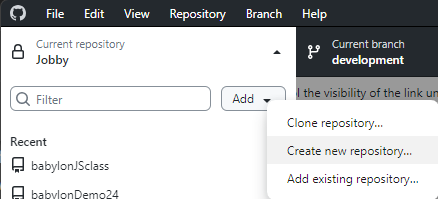
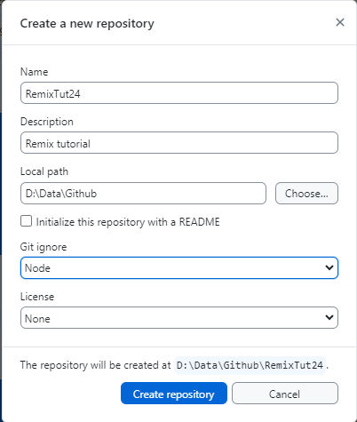
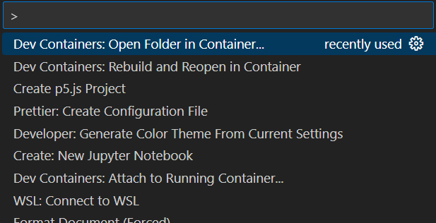
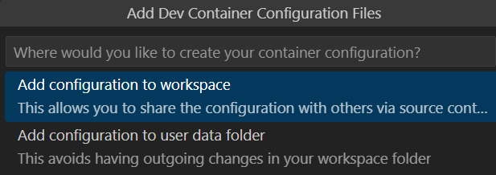
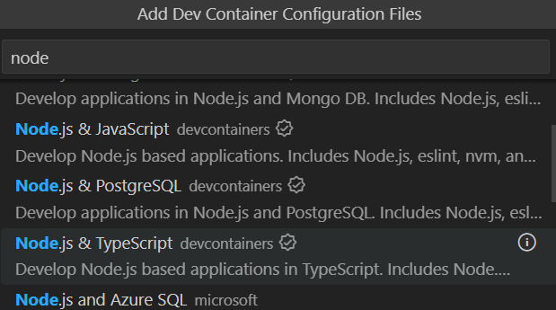
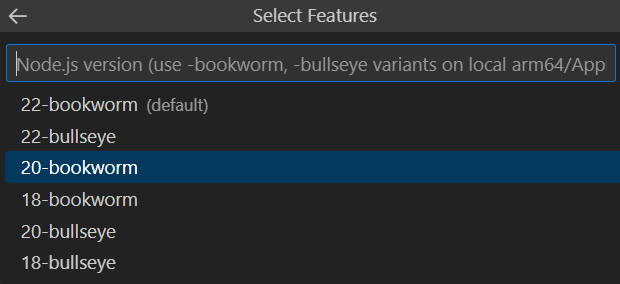
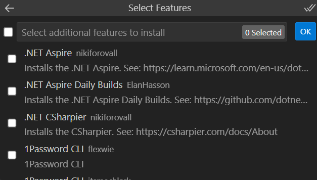
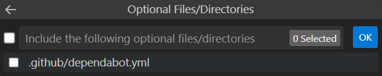
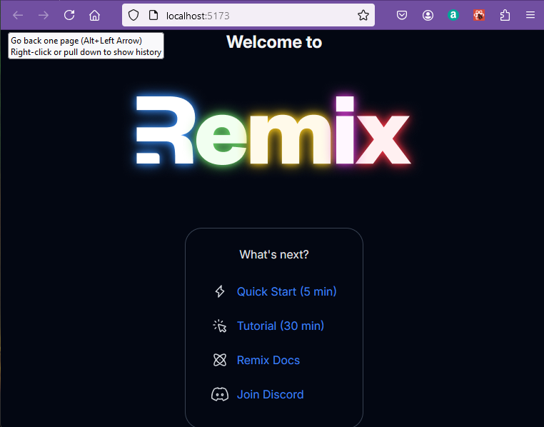
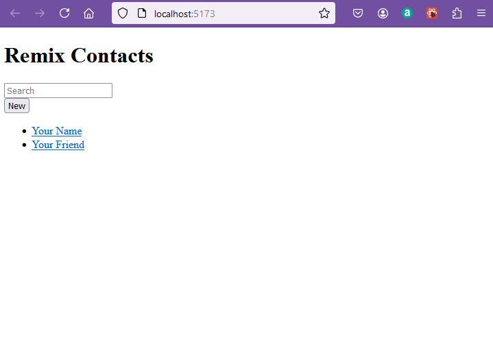

# Remix 

[Remix](https://remix.run/) is a full stack framework which utilises React to render pages to the client.  On the remix website you will find showcases use cases to support the choice of remix as a mainstream framework.

On the Stackoverflow survey or 2024 Remix is well down the web framework league with 1.6% of all respondents, compared with Next.js with 17.9%.  However React is sitting at 39.5% so the question is whether Remix will approach the popularity of Next.js in the future.  The alternative route to apply react is to use the Express serner at 17.8%.  This works well, but you need to supply a lot of energy to make it work.

Remix can be downloaded with a number of ready made [variant stacks](https://remix.run/resources?category=all) supporting different databases and features.  I will use the minimum stack to develop from here, but you can investigate any of these alternatives.

A look at the remix blog indicates the future direction of remix as merging with react router so that Remix V3 will be released a React Router V7.  But for this exercise the current version of Remix will be version 2.

The best introduction to Remix is the [Remix Tutorial](https://remix.run/docs/en/main/start/tutorial) and this should be run in a docker container using Vite for consistancy with other notes.

## Container for remix default page

Start by creating a new Github repository from Github desktop.



Name the new repository RemixTut24



Create the repository.

Publish the empty repository to github.

Open the new folder in visual studio code.

> CTRL + SHIFT + P

Open folder in container.



Select the folder RemixTut24.

Choose to add the configuration to the workspace so that it will be transferred to github and easily passed across to other machines.



Choose a node.js and typescript configuiration.



Accept node version 20, come back to 22 later when remix has updated all its dependencies. (Actually I might suggest trying node 18 I had fewer problems with this version).



No additional features are required.



You will be offered github dependabot.  This is an alert system which identifies when the repository is using a software dependency with a known vunerability.  That is a good security feature.  However, we will not use this for the time being as it may lead to updates out of sync with these notes.



Allow time for the container to download software required.

In a new terminal

> npm install -D vite

```bash
added 10 packages in 1m

3 packages are looking for funding
  run `npm fund` for details
npm notice
npm notice New minor version of npm available! 10.7.0 -> 10.9.0
npm notice Changelog: https://github.com/npm/cli/releases/tag/v10.9.0
npm notice To update run: npm install -g npm@10.9.0
npm notice
node ➜ /workspaces/RemixTut24 (main) $ 
```
Update  npm as suggested.

> npm install -g npm@10.9.0

```bash
added 1 package in 6s

25 packages are looking for funding
  run `npm fund` for details
```

Now install and initialise vite

> npm install

```bash
added 1 package, and audited 12 packages in 792ms

3 packages are looking for funding
  run `npm fund` for details

found 0 vulnerabilities
```

> npm init vite

```bash
Need to install the following packages:
create-vite@5.5.5
Ok to proceed? (y)
```

>y

Set project name to 'contacts'

```bash
? Project name: › contacts
```

Select React as the framework

```bash
? Select a framework: › - Use arrow-keys. Return to submit.
    Vanilla
    Vue
❯   React
    Preact
    Lit
    Svelte
    Solid
    Qwik
    Angular
    Others
```

Select Remix as the variant

```bash
? Select a variant: › - Use arrow-keys. Return to submit.
    TypeScript
    TypeScript + SWC
    JavaScript
    JavaScript + SWC
❯   Remix ↗
```

This will request an installation of create remix

```bash
Need to install the following packages:
create-remix@2.13.1
Ok to proceed? (y) 
```

> y
 
Wait for software to download ... this was a long wait, there ar some warnings about depracated code.

```bash
npm warn deprecated inflight@1.0.6: This module is not supported, and leaks memory. Do not use it. Check out lru-cache if you want a good and tested way to coalesce async requests by a key value, which is much more comprehensive and powerful.
npm warn deprecated glob@7.2.3: Glob versions prior to v9 are no longer supported
```
Then...

```bash
 remix   v2.13.1 💿 Let's build a better website...
      ◼  Directory: Using contents as project directory

      ◼  Using basic template See https://remix.run/guides/templates for more
      ✔  Template copied

   git   Initialize a new git repository? (recommended)
         ● Yes  ○ No 
```

Select no for git repository you already have one in preparation.

```bash
 deps   Install dependencies with npm? (recommended)
         ● Yes  ○ No 
```
Select yes for dependencies and wait for download. Again a long wait.

At the end of the process there should be a package.json file in the remisxtut24 folder which holds the vite dependency for any project in the folder.

```json
{
  "devDependencies": {
    "vite": "^5.4.10"
  }
}
```
In the contents folder there is a package.json file which holds the dependencies and scripts for the project.

```json
{
  "name": "contacts",
  "private": true,
  "sideEffects": false,
  "type": "module",
  "scripts": {
    "build": "remix vite:build",
    "dev": "remix vite:dev",
    "lint": "eslint --ignore-path .gitignore --cache --cache-location ./node_modules/.cache/eslint .",
    "start": "remix-serve ./build/server/index.js",
    "typecheck": "tsc"
  },
  "dependencies": {
    "@remix-run/node": "^2.13.1",
    "@remix-run/react": "^2.13.1",
    "@remix-run/serve": "^2.13.1",
    "isbot": "^4.1.0",
    "react": "^18.2.0",
    "react-dom": "^18.2.0"
  },
  "devDependencies": {
    "@remix-run/dev": "^2.13.1",
    "@types/react": "^18.2.20",
    "@types/react-dom": "^18.2.7",
    "@typescript-eslint/eslint-plugin": "^6.7.4",
    "@typescript-eslint/parser": "^6.7.4",
    "autoprefixer": "^10.4.19",
    "eslint": "^8.38.0",
    "eslint-import-resolver-typescript": "^3.6.1",
    "eslint-plugin-import": "^2.28.1",
    "eslint-plugin-jsx-a11y": "^6.7.1",
    "eslint-plugin-react": "^7.33.2",
    "eslint-plugin-react-hooks": "^4.6.0",
    "postcss": "^8.4.38",
    "tailwindcss": "^3.4.4",
    "typescript": "^5.1.6",
    "vite": "^5.1.0",
    "vite-tsconfig-paths": "^4.2.1"
  },
  "engines": {
    "node": ">=20.0.0"
  }
}
```
Add the --hosts flag to the dev sccript in the package.json file.

```json
"scripts": {
    "build": "remix vite:build",
```
## Project files

The project folder contains the following files:


The vite.config.js file is the configuration file for the project and this is set up to use the remix framework.  Note the vitePlugin is imported from the remix-run package.

The path is set up so that vite and typescipt can be used together.

There are some references to a future interface for v3.  Hopefully this will be used to eas the transiton of the project to v3, but for now v2.13.1 is used.

```javascript
import { vitePlugin as remix } from "@remix-run/dev";
import { defineConfig } from "vite";
import tsconfigPaths from "vite-tsconfig-paths";

declare module "@remix-run/node" {
  interface Future {
    v3_singleFetch: true;
  }
}

export default defineConfig({
  plugins: [
    remix({
      future: {
        v3_fetcherPersist: true,
        v3_relativeSplatPath: true,
        v3_throwAbortReason: true,
        v3_singleFetch: true,
        v3_lazyRouteDiscovery: true,
      },
    }),
    tsconfigPaths(),
  ],
});
```

The tsconfig.json file is the configuration file for typescript.  This is used to set up the project to use typescript.  Note that the target is set to es2022 and the module is set to es2022.  This is to ensure that the project is compatible with browsers that support es2020.  The features of ECMAscript update annually.  EcmaScript 2022 features are summarised by [w3 schools ECMAScript 2022](https://www.w3schools.com/js/js_2022.asp).

Vite takes care of building the project and running it so typescript is set to "noEmit:true.

A tailwind CSS file is included in the project, but it is possible to use other CSS frameworks.

The files entry.server and entry.client are the entry points for the server and client respectively.  These are used to set up the project and to run the project.  Code can be ensured to be held on the server or client by using the isServer or isClient functions.

The file on the client will be code that is hydrated from the server.

The file app/root.tsx is the root file for the project.  This is the file that is used to set up the project.  

This exports a default function App() that returns an <Outlet /> component.  This is the component that is used to render the project.  The Outlet component is used to render the components that are defined in the routes.  The routes are defined in the file app/routes/index.tsx.

There is only one route in the project and it is defined in the file app/routes/index.tsx.  This is the route that is used to render the project.  

An array of resources is defined in json notation.  These define links which can be used to navigate to resources.  These are mapped into anchor tags within the default function Index().

The jsx content output by index is rendered in the <Outlet /> component.

** routes/index.tsx **
```javascript
import type { MetaFunction } from "@remix-run/node";

export const meta: MetaFunction = () => {
  return [
    { title: "New Remix App" },
    { name: "description", content: "Welcome to Remix!" },
  ];
};

export default function Index() {
  return (
    <div className="flex h-screen items-center justify-center">
      <div className="flex flex-col items-center gap-16">
        <header className="flex flex-col items-center gap-9">
          <h1 className="leading text-2xl font-bold text-gray-800 dark:text-gray-100">
            Welcome to <span className="sr-only">Remix</span>
          </h1>
          <div className="h-[144px] w-[434px]">
            
            
          </div>
        </header>
        <nav className="flex flex-col items-center justify-center gap-4 rounded-3xl border border-gray-200 p-6 dark:border-gray-700">
          <p className="leading-6 text-gray-700 dark:text-gray-200">
            What&apos;s next?
          </p>
          <ul>
            {resources.map(({ href, text, icon }) => (
              <li key={href}>
                <a
                  className="group flex items-center gap-3 self-stretch p-3 leading-normal text-blue-700 hover:underline dark:text-blue-500"
                  href={href}
                  target="_blank"
                  rel="noreferrer"
                >
                  {icon}
                  {text}
                </a>
              </li>
            ))}
          </ul>
        </nav>
      </div>
    </div>
  );
}

const resources = [
  {
    href: "https://remix.run/start/quickstart",
    text: "Quick Start (5 min)",
    icon: (
      <svg
        xmlns="http://www.w3.org/2000/svg"
        width="24"
        height="20"
        viewBox="0 0 20 20"
        fill="none"
        className="stroke-gray-600 group-hover:stroke-current dark:stroke-gray-300"
      >
        <path
          d="M8.51851 12.0741L7.92592 18L15.6296 9.7037L11.4815 7.33333L12.0741 2L4.37036 10.2963L8.51851 12.0741Z"
          strokeWidth="1.5"
          strokeLinecap="round"
          strokeLinejoin="round"
        />
      </svg>
    ),
  },
  {
    href: "https://remix.run/start/tutorial",
    text: "Tutorial (30 min)",
    icon: (
      <svg
        xmlns="http://www.w3.org/2000/svg"
        width="24"
        height="20"
        viewBox="0 0 20 20"
        fill="none"
        className="stroke-gray-600 group-hover:stroke-current dark:stroke-gray-300"
      >
        <path
          d="M4.561 12.749L3.15503 14.1549M3.00811 8.99944H1.01978M3.15503 3.84489L4.561 5.2508M8.3107 1.70923L8.3107 3.69749M13.4655 3.84489L12.0595 5.2508M18.1868 17.0974L16.635 18.6491C16.4636 18.8205 16.1858 18.8205 16.0144 18.6491L13.568 16.2028C13.383 16.0178 13.0784 16.0347 12.915 16.239L11.2697 18.2956C11.047 18.5739 10.6029 18.4847 10.505 18.142L7.85215 8.85711C7.75756 8.52603 8.06365 8.21994 8.39472 8.31453L17.6796 10.9673C18.0223 11.0653 18.1115 11.5094 17.8332 11.7321L15.7766 13.3773C15.5723 13.5408 15.5554 13.8454 15.7404 14.0304L18.1868 16.4767C18.3582 16.6481 18.3582 16.926 18.1868 17.0974Z"
          strokeWidth="1.5"
          strokeLinecap="round"
          strokeLinejoin="round"
        />
      </svg>
    ),
  },
  {
    href: "https://remix.run/docs",
    text: "Remix Docs",
    icon: (
      <svg
        xmlns="http://www.w3.org/2000/svg"
        width="24"
        height="20"
        viewBox="0 0 20 20"
        fill="none"
        className="stroke-gray-600 group-hover:stroke-current dark:stroke-gray-300"
      >
        <path
          d="M9.99981 10.0751V9.99992M17.4688 17.4688C15.889 19.0485 11.2645 16.9853 7.13958 12.8604C3.01467 8.73546 0.951405 4.11091 2.53116 2.53116C4.11091 0.951405 8.73546 3.01467 12.8604 7.13958C16.9853 11.2645 19.0485 15.889 17.4688 17.4688ZM2.53132 17.4688C0.951566 15.8891 3.01483 11.2645 7.13974 7.13963C11.2647 3.01471 15.8892 0.951453 17.469 2.53121C19.0487 4.11096 16.9854 8.73551 12.8605 12.8604C8.73562 16.9853 4.11107 19.0486 2.53132 17.4688Z"
          strokeWidth="1.5"
          strokeLinecap="round"
        />
      </svg>
    ),
  },
  {
    href: "https://rmx.as/discord",
    text: "Join Discord",
    icon: (
      <svg
        xmlns="http://www.w3.org/2000/svg"
        width="24"
        height="20"
        viewBox="0 0 24 20"
        fill="none"
        className="stroke-gray-600 group-hover:stroke-current dark:stroke-gray-300"
      >
        <path
          d="M15.0686 1.25995L14.5477 1.17423L14.2913 1.63578C14.1754 1.84439 14.0545 2.08275 13.9422 2.31963C12.6461 2.16488 11.3406 2.16505 10.0445 2.32014C9.92822 2.08178 9.80478 1.84975 9.67412 1.62413L9.41449 1.17584L8.90333 1.25995C7.33547 1.51794 5.80717 1.99419 4.37748 2.66939L4.19 2.75793L4.07461 2.93019C1.23864 7.16437 0.46302 11.3053 0.838165 15.3924L0.868838 15.7266L1.13844 15.9264C2.81818 17.1714 4.68053 18.1233 6.68582 18.719L7.18892 18.8684L7.50166 18.4469C7.96179 17.8268 8.36504 17.1824 8.709 16.4944L8.71099 16.4904C10.8645 17.0471 13.128 17.0485 15.2821 16.4947C15.6261 17.1826 16.0293 17.8269 16.4892 18.4469L16.805 18.8725L17.3116 18.717C19.3056 18.105 21.1876 17.1751 22.8559 15.9238L23.1224 15.724L23.1528 15.3923C23.5873 10.6524 22.3579 6.53306 19.8947 2.90714L19.7759 2.73227L19.5833 2.64518C18.1437 1.99439 16.6386 1.51826 15.0686 1.25995ZM16.6074 10.7755L16.6074 10.7756C16.5934 11.6409 16.0212 12.1444 15.4783 12.1444C14.9297 12.1444 14.3493 11.6173 14.3493 10.7877C14.3493 9.94885 14.9378 9.41192 15.4783 9.41192C16.0471 9.41192 16.6209 9.93851 16.6074 10.7755ZM8.49373 12.1444C7.94513 12.1444 7.36471 11.6173 7.36471 10.7877C7.36471 9.94885 7.95323 9.41192 8.49373 9.41192C9.06038 9.41192 9.63892 9.93712 9.6417 10.7815C9.62517 11.6239 9.05462 12.1444 8.49373 12.1444Z"
          strokeWidth="1.5"
        />
      </svg>
    ),
  },
];
```
> cd contacts

> npm run dev

After a pause the default Remix site will be displayed.



> CTRL + C

CTRL + C closes the server.

## Follow the tutorial

Now that it is tested the default remix site cand be replaced with the tutorial template.

Change the name of the folder we have called contacts to "default" (you may need to opent the folder locally in VS Code to do this).

Pick up the online tutorial from the Remix site.

> cd ..

> npx create-remix@latest --template remix-run/remix/templates/remix-tutorial

Place the project in the contacts folder.

```bash
  dir   Where should we create your new project?
         ./contacts
```
Dont start a new github repository.  Choose NO.

```bash
  git   Initialize a new git repository? (recommended)
         ● Yes  ○ No
```

Install dependencies, choos YES.

```bash
  deps   Install dependencies with npm? (recommended)
         ● Yes  ○ No 
```

Wait while software downloads.
If npm install hangs try this instead.

> npm install --no-audit

```bash
node ➜ /workspaces/RemixTut24/contacts (main) $ npm install --no-audit
npm warn deprecated inflight@1.0.6: This module is not supported, and leaks memory. Do not use it. Check out lru-cache if you want a good and tested way to coalesce async requests by a key value, which is much more comprehensive and powerful.
npm warn deprecated @humanwhocodes/config-array@0.13.0: Use @eslint/config-array instead
npm warn deprecated rimraf@3.0.2: Rimraf versions prior to v4 are no longer supported
npm warn deprecated @humanwhocodes/object-schema@2.0.3: Use @eslint/object-schema instead
npm warn deprecated glob@7.2.3: Glob versions prior to v9 are no longer supported
npm warn deprecated eslint@8.57.1: This version is no longer supported. Please see https://eslint.org/version-support for other options.

added 783 packages in 5m

249 packages are looking for funding
  run `npm fund` for details
```

Add the --host option to the dev command in the package.json file.

Now the project is ready to run.

> npm run dev



This matches the view in the [Remix Tutorial](https://remix.run/docs/en/main/start/tutorial) and the tutorial can be followed from this point.

Add the link to the stylesheet in the app/root.tsx file.

```javascript
import type { LinksFunction } from "@remix-run/node";
import {
  Form,
  Links,
  Meta,
  Scripts,
  ScrollRestoration,
} from "@remix-run/react";

import appStylesHref from "./app.css?url";

export const links: LinksFunction = () => [
  { rel: "stylesheet", href: appStylesHref },
];

export default function App() {
  ...
```

The style is picked up from the app.css file.


Create directory app/routes and a new file contacts.$contactId.tsx

** app/routes/contacts.$contactId.tsx**
```javascript
import { Form } from "@remix-run/react";
import type { FunctionComponent } from "react";

import type { ContactRecord } from "../data";

export default function Contact() {
  const contact = {
    first: "Your",
    last: "Name",
    avatar: "https://placecats.com/200/200",
    twitter: "your_handle",
    notes: "Some notes",
    favorite: true,
  };

  return (
    <div id="contact">
      <div>
        
      </div>

      <div>
        <h1>
          {contact.first || contact.last ? (
            <>
              {contact.first} {contact.last}
            </>
          ) : (
            <i>No Name</i>
          )}{" "}
          <Favorite contact={contact} />
        </h1>

        {contact.twitter ? (
          <p>
            <a
              href={`https://twitter.com/${contact.twitter}`}
            >
              {contact.twitter}
            </a>
          </p>
        ) : null}

        {contact.notes ? <p>{contact.notes}</p> : null}

        <div>
          <Form action="edit">
            <button type="submit">Edit</button>
          </Form>

          <Form
            action="destroy"
            method="post"
            onSubmit={(event) => {
              const response = confirm(
                "Please confirm you want to delete this record."
              );
              if (!response) {
                event.preventDefault();
              }
            }}
          >
            <button type="submit">Delete</button>
          </Form>
        </div>
      </div>
    </div>
  );
}

const Favorite: FunctionComponent<{
  contact: Pick<ContactRecord, "favorite">;
}> = ({ contact }) => {
  const favorite = contact.favorite;

  return (
    <Form method="post">
      <button
        aria-label={
          favorite
            ? "Remove from favorites"
            : "Add to favorites"
        }
        name="favorite"
        value={favorite ? "false" : "true"}
      >
        {favorite ? "★" : "☆"}
      </button>
    </Form>
  );
};
```
This produces nothing new if you browse to /contacts/1.  For the route to show up it needs to be rendered in and Outlet in the parent app/root.tsx.

.. follow throught the tutorial from here.


