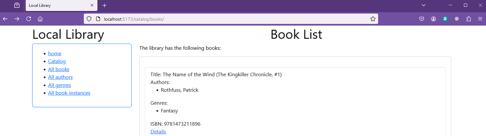
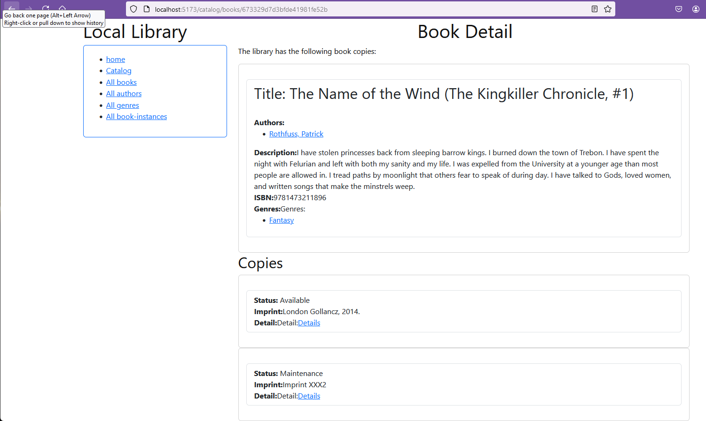
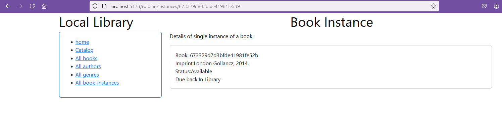
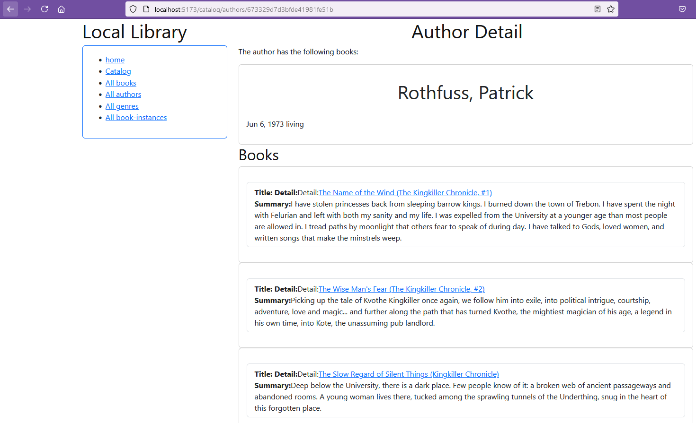
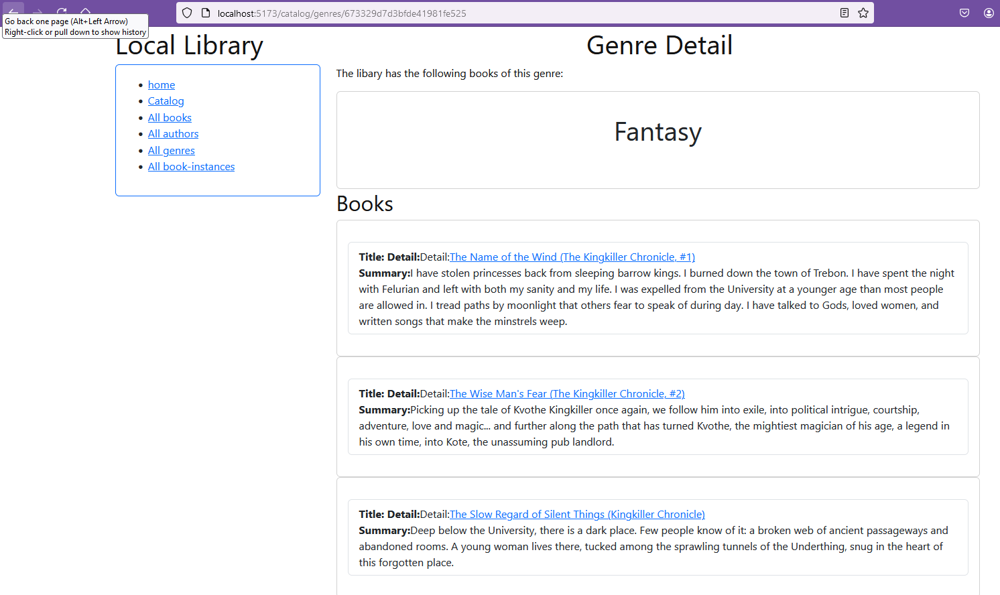

# Reading item details from the Local_Library database

In this section the retrieval of data will be filtered to find the details of single items.

The first step is to implement the route to read the details of a single book from the Details link depicted in the screenshot below.




## Book Detail

In the file routes/catalog.books.tsx a json object is returned as loader data.

**routes/catalog.books.tsx (extract)**
```javascript
export const loader: unknown = async () => {

  const books = await Book.find({}).populate('authors').populate('genres').exec();
  if (!books) {
    throw new Response("Not Found", { status: 404 });
  }
  return json({ books });
};
```

The mongoose populate function is used to retrieve the details of the related authors and genres.

In the file models/book.ts the Book model is defined and includes a unique identifier as _id.
**models/books.ts (extract)**
```javascript
export interface IBook extends Document{
  _id: string,
  title: string,
  authors: IAuthor [],
  summary: string,
  isbn: string,
  genres: IGenre [],
  url: string 
}
```

This id is combined with the route catalog/books to return a virtual database element as the url.

**models/books.ts (extract)**
```javascript
// Virtual for book's URL
BookSchema
.virtual('url')
.get(function () {
  return '/catalog/books/' + this._id;
});
```

Later in route/catalog.books.tsx this url is used  to generate a link which will go to the ```route/catalog.books_.$bookId.tsx``` module file.
**routes/catalog.books.tsx (extract)**
```javascript
<Link to={book.url}>Details</Link>
```
The route/catalog.books_.$bookId.tsx module file is used to retrieve the details of a single book.  The $ sign in the file name is a convention used by Remix to indicate that the file is a dynamic route.  The $bookId is the id of the book to be retrieved.

In the routes folder create a file called catalog.books_.$bookId.tsx.

**routes/catalog.books_.$bookId.tsx**
```javascript
import type { LoaderFunctionArgs } from "@remix-run/node";
import invariant from "tiny-invariant";

import Card from 'react-bootstrap/Card';
import ListGroup from 'react-bootstrap/ListGroup';

import { json } from "@remix-run/node";
import { useLoaderData, Link } from "@remix-run/react";


import Book, { IBook } from '../models/book';
import BookInstance, { IBookInstance } from '../models/bookinstance';


export const loader: unknown = async ({
  params,
}: LoaderFunctionArgs) => {
  invariant(params.bookId, "Missing contactId param");
  //console.log(params.bookId);
  const [bookData, instanceData] = await Promise.all([
    Book.findById(params.bookId).populate('authors').populate('genres').exec(),
    BookInstance.find({ book: params.bookId }).exec()
  ]);

  if (!bookData) {
    throw new Response("Not Found", { status: 404 });
  }
  return json({ book: bookData, bookInstances: instanceData });
};


export default function Catalog() {
  const { book, bookInstances } = useLoaderData<{ book: IBook, bookInstances: IBookInstance[] }>();


  return (
    <div>
      <center><h1>Book Detail</h1></center>
      <p>The library has the following book copies:</p>
      <Card style={{ width: '60em' }}>
        <Card.Body>
          <Card.Text>
            <ListGroup>

              <ListGroup.Item className="card-text" key={book._id} >
                <h2>Title: {book.title} </h2><br />
                <b>Authors:</b>
                <ul>
                  {book.authors.map((author) => (
                    <li key={author._id}>
                      <Link to={author.url}>{author.name}</Link>
                    </li>
                  ))}
                </ul>

                <b>Description:</b>{book.summary}<br />
                <b>ISBN:</b>{book.isbn}<br />
                <b>Genres:</b>Genres:
                {book.genres !== null && book.genres.length > 0 && (
                  <ul>
                    {book.genres.map((genre) => (
                      <li key={genre._id}>
                        <Link to={genre.url}>{genre.name}</Link>
                      </li>
                    ))}
                  </ul>
                )
                }

              </ListGroup.Item>
            </ListGroup>
          </Card.Text>
        </Card.Body>
      </Card>


      <h2>Copies</h2>
      {bookInstances.map((bookInstance) => (
        <Card key={bookInstance._id} style={{ width: '60em' }}>
          <Card.Body>
            <Card.Text>
              <ListGroup>
                <ListGroup.Item className="card-text">
                  <b>Status:</b> {bookInstance.status} <br />
                  <b>Imprint:</b>{bookInstance.imprint}<br />
                  <b>Detail:</b>Detail:<Link to={bookInstance.url}>Details</Link>
                </ListGroup.Item>
              </ListGroup>
            </Card.Text>
          </Card.Body>
        </Card>
      ))}

    </div>

  );
}
```

This uses mongoose command [findById](https://mongoosejs.com/docs/api/model.html#Model.findById()) to retrieve the details of the book find to retrieve the book instances.

Each book instance is displayed in a card and the link to the book instance is displayed using the bookInstance virtual url.

From the model/bookinstance.ts file the virtual url is defined as:
**models/bookinstance.ts (extract)**
```javascript
// Virtual for bookinstance's URL
BookInstanceSchema
.virtual('url')
.get(function () {
  return '/catalog/instances/' + this._id;
});
```

So the link to the book instance:
**routes/catalog.books_.$bookId.tsx (extract)**
```javascript
<b>Detail:</b>Detail:<Link to={bookInstance.url}>Details</Link>
```
will go to the route/catalog.instances_.$instanceId.tsx module file.

In the routes folder create a file called catalog.instances_.$instanceId.tsx.
**routes/catalog.instances_.$instanceId.tsx**
```javascript
import type { LoaderFunctionArgs } from "@remix-run/node";
import invariant from "tiny-invariant";

import Card from 'react-bootstrap/Card';

import { json } from "@remix-run/node";
import { useLoaderData } from "@remix-run/react";

import BookInstance, { IBookInstance } from '../models/bookinstance';


export const loader: unknown = async ({
  params,
}: LoaderFunctionArgs) => {
  invariant(params.instanceId, "Missing instanceId param");

  const instance = await BookInstance.findById(params.instanceId).exec();
  if (!instance) {
    throw new Response("Not Found", { status: 404 });
  }
  console.log(instance);
  return json({ instance });

};


export default function Catalog() {
  
  const {instance} = useLoaderData<{ instance: IBookInstance }>();
  return (
    <div>
      <center><h1>Book Instance</h1></center>
      <p>Details of single instance of a book:</p>
      <Card style={{ width: '60em' }}>
        <Card.Body>
          <Card.Text>
                  Book: {instance.book} <br/>
                  Imprint:{instance.imprint}<br/>
                  Status:{instance.status}<br/> 
                  Due back:{instance.due_back_formatted}<br/>
          </Card.Text>
        </Card.Body>
      </Card>

    </div>

  );
}
```

This will then display the details of the book instance.

So for example if we go to the book "The name of the wind by Patrick Rothfuss" and click on the link to the book Details we will get the following:



If we click on the link to the Details of the first book instance which has status Available we will get the following:



Notice that a book includes details of the book it is associated with including the author (with _id) and genres (with _id).  That allows us to include links to the author and genres in the detail route.

**catalog.books_.$bookId.tsx.tsx (extract)**
```javascript
<Link to={author.url}>{author.name}</Link>
```

And the genre route:
**catalog.genres_.$genreId.tsx (extract)**
```javascript
<Link to={genre.url}>{genre.name}</Link>
```
In the case of "the name of the wind" the author is Patrick Rothfuss and the genre is Fantasy.

For the Author details we need to create a route to display the details of the author as routes/catalog.authors_.$authorId.tsx.

**routes/catalog.authors_.$authorId.tsx**
```javascript
import type { LoaderFunctionArgs } from "@remix-run/node";
import invariant from "tiny-invariant";

import Card from 'react-bootstrap/Card';
import ListGroup from 'react-bootstrap/ListGroup';

import { json } from "@remix-run/node";
import { useLoaderData, Link } from "@remix-run/react";


import Author, { IAuthor } from '../models/author';
import Book, { IBook } from '../models/book';


export const loader: unknown = async ({
  params,
}: LoaderFunctionArgs) => {
  invariant(params.authorId, "Missing contactId param");
  const [author, books] = await Promise.all([
    Author.findById(params.authorId).exec(),
    Book.find({ authors: params.authorId }).exec()
  ]);

  if (!author) {
    throw new Response("Not Found", { status: 404 });
  }
  return json({ author, books });
};


export default function Catalog() {

  const { author, books } = useLoaderData<{ author: IAuthor, books: IBook[] }>();
  return (
    <div>
      <center><h1>Author Detail</h1></center>
      <p>The author has the following books:</p>
      <Card style={{ width: '60em' }}>
        <Card.Body>
          <Card.Text>
          <center><h1>{author.name}</h1></center><br />
          {author.date_of_birth_formatted} {author.lifespan}<br />
          </Card.Text>
        </Card.Body>
      </Card>

   


<h2>Books</h2>
{books.map((book) => (
  <Card key={book._id} style={{ width: '60em' }}>
    <Card.Body>
      <Card.Text>
        <ListGroup>
          <ListGroup.Item className="card-text">
            <b>Title:</b> <b>Detail:</b>Detail:<Link to={book.url}>{book.title}</Link> <br />
            <b>Summary:</b>{book.summary}<br />
            
          </ListGroup.Item>
        </ListGroup>
      </Card.Text>
    </Card.Body>
  </Card>
))}

</div>

  );
}
```

For the genre details we need to create a route to display the details of the genre as routes/catalog.genres_.$genreId.tsx.

**routes/catalog.genres_.$genreId.tsx**
```javascript
import type { LoaderFunctionArgs } from "@remix-run/node";
import invariant from "tiny-invariant";

import Card from 'react-bootstrap/Card';
import ListGroup from 'react-bootstrap/ListGroup';

import { json } from "@remix-run/node";
import { useLoaderData, Link } from "@remix-run/react";

import Genre, { IGenre } from '../models/genre';
import Book, { IBook } from '../models/book';


export const loader: unknown = async ({
  params,
}: LoaderFunctionArgs) => {
  invariant(params.genreId, "Missing contactId param");
  const [genre, books] = await Promise.all([
    Genre.findById(params.genreId).exec(),
    Book.find({ genres: params.genreId }).exec()
  ]);

  if (!genre) {
    throw new Response("Not Found", { status: 404 });
  }
  return json({ genre, books });
};


export default function Catalog() {

  const {genre, books } = useLoaderData<{ genre: IGenre, books: IBook[] }>();
  return (
    <div>
      <center><h1>Genre Detail</h1></center>
      <p>The libary has the following books of this genre:</p>
      <Card style={{ width: '60em' }}>
        <Card.Body>
          <Card.Text>
          <center><h1>{genre.name}</h1></center><br />
          </Card.Text>
        </Card.Body>
      </Card>

   


<h2>Books</h2>
{books.map((book) => (
  <Card key={book._id} style={{ width: '60em' }}>
    <Card.Body>
      <Card.Text>
        <ListGroup>
          <ListGroup.Item className="card-text">
            <b>Title:</b> <b>Detail:</b>Detail:<Link to={book.url}>{book.title}</Link> <br />
            <b>Summary:</b>{book.summary}<br />
            
          </ListGroup.Item>
        </ListGroup>
      </Card.Text>
    </Card.Body>
  </Card>
))}

</div>

  );
}
```
Now the Author and Genre details can be accessed from the book details. The response for the book, "The name of the wind" is:

Author detail:


Genre detail:



### Routes Files

At this point the following module files have been created in the **routes** folder. 

* **_index.tsx**
* **catalog._index.tsx**
* **catalog.authors.tsx**
* **catalog.authors_.$authorId.tsx**
* **catalog.books.tsx**
* **catalog.books_.$bookId.tsx**
* **catalog.genres.tsx**
* **catalog.genres_.$genreId.tsx**
* **catalog.instances.tsx**
* **catalog.instances_.$instanceId.tsx**

The next step is to create the routes to allow the user to create, update and delete the books, authors and genres.


