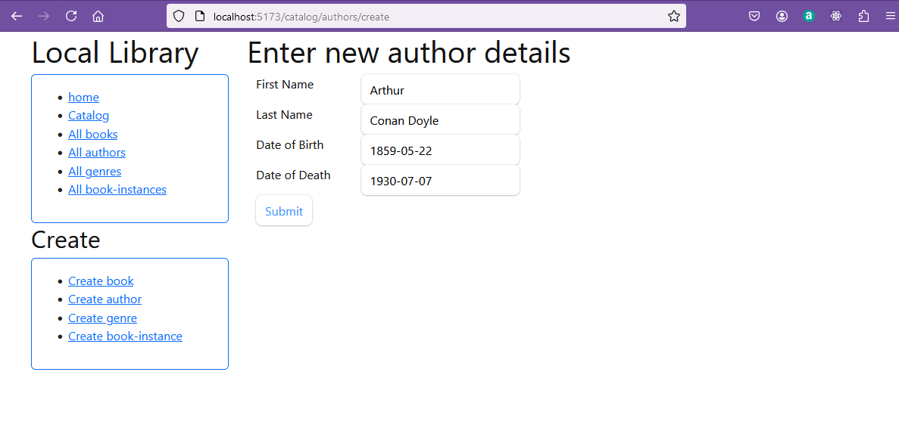
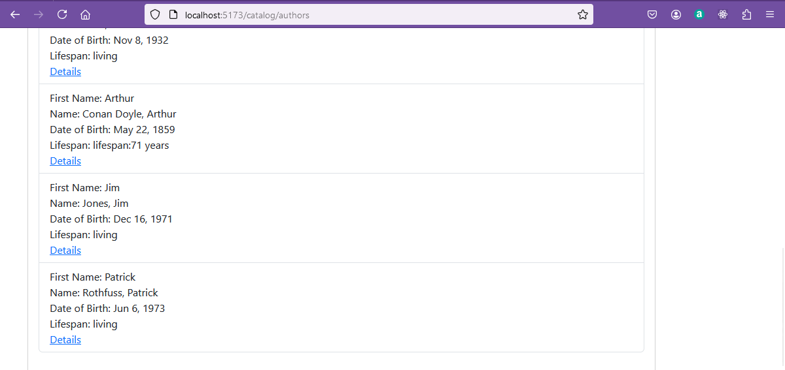
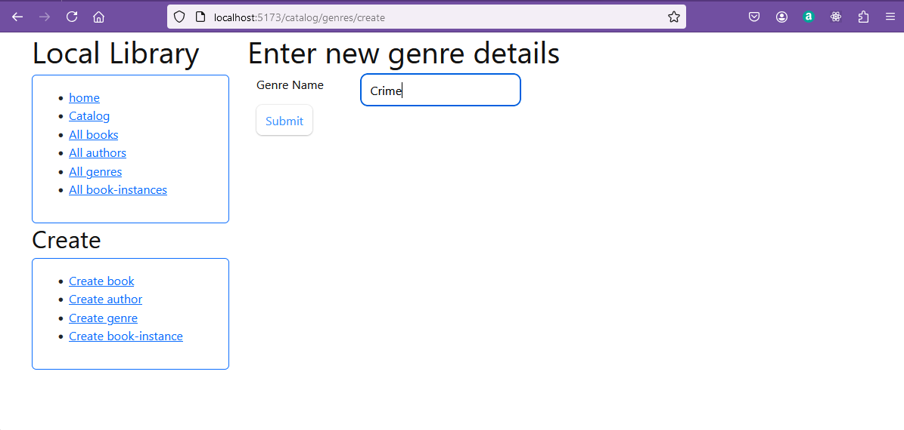
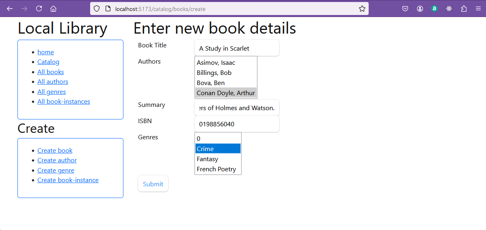
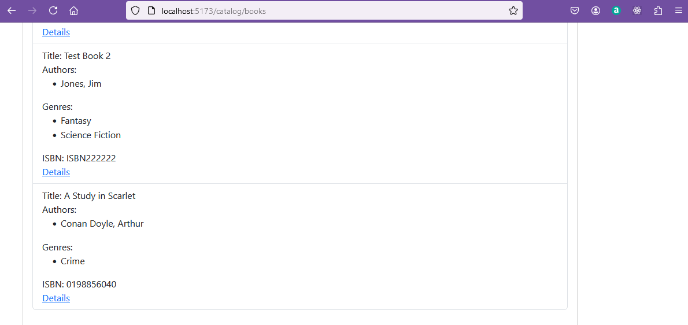
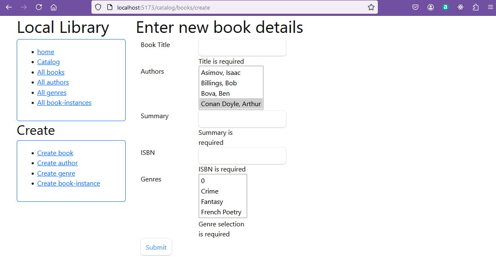

# Creating items in the library database

In this section the routes required to create new items in the database will be implemented.

## Adding links to the root page

The first step is to add links to the root page to the create pages.  This can be done by adding an array named create to the root.tsx file.

**root.tsx (extract)**
```javascript
  const create = [
    ['/catalog/books/create', 'Create book'],
    ['/catalog/authors/create', 'Create author'],
    ['/catalog/genres/create', 'Create genre'],
    ['/catalog/instances/create', 'Create book-instance']
  ]
```
A new card is then added to the first column of the home page to display the links to the create pages.

**root.tsx (extract)**
```javascript
              <h2>Create</h2>
              <Card className="text-left" border="primary">
                <Card.Body>
                  <ul>
                    <nav>
                      {create.map((retriever) => (
                        <li key={retriever[1]}>
                          <NavLink
                            className={({ isActive, isPending }) =>
                              isActive
                                ? "active" : isPending
                                  ? "pending" : ""
                            }
                            to={retriever[0]}
                          >
                            {retriever[1]}
                          </NavLink>
                        </li>
                      ))}
                    </nav>
                  </ul>
                </Card.Body>
              </Card>
            </ Col>
```

The full listing for the root.tsx file is shown below.
**root.tsx (full listing)**
```javascript
//import {redirect } from "@remix-run/node";
import { Container, Row, Col } from 'react-bootstrap';
import Card from 'react-bootstrap/Card';

import {
  Links,
  Meta,
  NavLink,
  Outlet,
  Scripts,
  ScrollRestoration,
} from "@remix-run/react";

import type { MetaFunction } from "@remix-run/node";
// existing imports

import "./app.css"; // includes bootstrap

export const meta: MetaFunction = () => {
  return [
    { title: "Local Library" },
    {
      property: "og:title",
      content: "Very cool app",
    },
    {
      name: "description",
      content: "Acess local library",
    },
  ];
};


export default function App() {

  const retrieve = [
    ['/', 'home'],
    ['/catalog/', 'Catalog'],
    ['/catalog/books/', 'All books'],
    ['/catalog/authors/', 'All authors'],
    ['/catalog/genres/', 'All genres'],
    ['/catalog/instances/', 'All book-instances']

  ]

  const create = [
    ['/catalog/books/create', 'Create book'],
    ['/catalog/authors/create', 'Create author'],
    ['/catalog/genres/create', 'Create genre'],
    ['/catalog/instances/create', 'Create book-instance']
  ]

  return (
    <html lang="en">
      <head>
        <Meta />
        <Links />
      </head>
      <body>
        {/* comments in JSX are in braces  */}
        <Container fluid="md">
          <Row >
            <Col xs={3} >
              <h1>Local Library</h1>
              <Card className="text-left" border="primary">
                <Card.Body>
                  <ul>
                    <nav>
                      {retrieve.map((retriever) => (
                        <li key={retriever[1]}>
                          <NavLink
                            className={({ isActive, isPending }) =>
                              isActive
                                ? "active" : isPending
                                  ? "pending" : ""
                            }
                            to={retriever[0]}
                          >
                            {retriever[1]}
                          </NavLink>
                        </li>
                      ))}
                    </nav>
                  </ul>
                </Card.Body>
              </Card>

              <h2>Create</h2>
              <Card className="text-left" border="primary">
                <Card.Body>
                  <ul>
                    <nav>
                      {create.map((retriever) => (
                        <li key={retriever[1]}>
                          <NavLink
                            className={({ isActive, isPending }) =>
                              isActive
                                ? "active" : isPending
                                  ? "pending" : ""
                            }
                            to={retriever[0]}
                          >
                            {retriever[1]}
                          </NavLink>
                        </li>
                      ))}
                    </nav>
                  </ul>
                </Card.Body>
              </Card>
            </ Col>

            <Col >
              <Outlet />
              <ScrollRestoration />
              <Scripts />
            </Col>
          </Row>
        </Container>
      </body>
    </html>
  );
}
```
## Form component

When creating a new book, author, genre or book instance, a form is required.  In a standard HTML form, the elements of the form could include: input fields, radio buttons, checkboxes, drop-down lists, buttons and labels.

For remix the form is created using the [remix-validated-form](https://www.rvf-js.io/remix) library.  This allows the form to be validated on the client and on the server.  This will require the useForm hook to be imported from "@rvf/react".

The equivalent of the HTML form input element is the ```<input>``` element.
This has an attribute called "name" which is used to identify the input in the form.  An example of the [input element](https://www.rvf-js.io/quick-start)  is reproduced here.

**input element (RVF example)**
```javascript
  import { useForm } from "@rvf/react";

  const validator = // The validator we created above

  const MyForm = () => {
    const form = useForm({
      validator,
    });

    return (
      <form {...form.getFormProps()}>
        <label>
          Name
          <input name="name" />
        </label>

        <label>
          Email
          <input name="email" />
        </label>

        <button type="submit">Submit</button>
      </form>
    );
  }
```
Here a form is created with two input fields, one for the name and one for the email address.  The form is submitted using a button.

Another field available is the ```<select>``` element.  This is used to create a drop-down list.  The options for the drop-down list are created using the ```<option>``` element.  The value of the option is the value that will be sent to the server when the form is submitted.  The text that is displayed in the drop-down list is the value that will be displayed in the drop-down list.

An example of the [select](https://www.rvf-js.io/input-types) element is reproduced here.
**select element (RVF example)**
```javascript
// single select
<select {...form.getInputProps("mySelect")}>
  <option value="foo">Foo</option>
  <option value="bar">Bar</option>
  <option value="baz">Baz</option>
</select>

// multi select
<select {...form.getInputProps("mySelect", { multiple: true })}>
  <option value="foo">Foo</option>
  <option value="bar">Bar</option>
  <option value="baz">Baz</option>
</select>
```

Within the library application the ```input``` element will be used to enter the data for the book, author, genre or book instance.  The ```select``` element will be used to create the drop-down list for the book instance.

The different and appropriate form could be added to the route file for each of the book, author, and  genre routes.  However, this will result in a lot of duplication of code.  Instead, a single form can be created and used for all of the routes.  This will be done by creating a form component that can be used in all of the routes. The form component will be created in the components folder as ```components/formUI.tsx```.

First the resources that are required for the form to work are imported, these include bootrap formatting, the useForm hook from "@rvf/react", and the interfaces for author and genre.

**components/formUI.tsx (extract)**
```javascript
import { Row, Col } from 'react-bootstrap';
import {useForm} from "@rvf/remix";
import { IAuthor } from '../models/author';
import { IGenre } from '../models/genre';
```

The formUI component will create functions which will allow the calling of form elements input, select and submit buttons, passing in parameters as properties which determine the details of each form element as parameters. 

To receive these parameters the types which describe these  properties are created approprate to the type of form element.

**components/formUI.tsx (extract)**
```javascript
type MyInputProps = {
    label: string;
    name: string;
    form: ReturnType<typeof useForm>;
};

type MySubmitProps = {
    form: ReturnType<typeof useForm>;
};

type MySelectProps = {
    label: string;
    name: string;
    form: ReturnType<typeof useForm>;
    data: (IAuthor[] | IGenre[]);
};
```

The function to render the input element is created.  This function will take the properties label, name and form passed in as parameters and use them to create the input element.

**components/formUI.tsx (extract)**
```javascript
export const FormInput = ({ label, name, form }: MyInputProps) => {
    const error = name + "_error";
    return (    
        <div>
            <Row xs={2} md={4} lg={6}>
                <Col><label>{label}</label></Col>
                <Col><input {...form.getInputProps( name )} />
                {form.error(name) && (<div id={error}>{form.error(name)}</div>)}
                </Col>
            </Row>
        </div>
    );
};
```
The function to render the select element is created.  This function will take the properties label, name, form and data passed in as parameters and use them to create the drop down list or the select element.  The drop down list will need to display either the available authors or genres depending on the route. For that reason the data type was defined as an array of either authors or genres.  

**components/formUI.tsx (extract)**
```javascript
type MySelectProps = {
    label: string;
    name: string;
    form: ReturnType<typeof useForm>;
    data: (IAuthor[] | IGenre[]);
};
```

The SelectInput function is created.

**components/formUI.tsx (extract)**
```javascript
export const SelectInput = ({ label, name, form, data }: MySelectProps) => {
    const error = name + "_error";
    return (
        <div>
            <Row xs={2} md={4} lg={6}>
                <Col><label>{label}</label></Col>
                <Col><select name={name} size={4} multiple {...form.getInputProps(name)} >
                    {data.map((item) => (
                        <option key={item._id} value={item._id}>{item.name}</option>
                    ))}
                </select>
                {form.error(name) && (<div id={error}>{form.error(name)}</div>)}
                </Col>
            </Row>
        </div>
    );
};
```

The function to render the submit button is created.  This function will take the form as a parameter and use this to complete form submission when the submit button is pressed.
**components/formUI.tsx (extract)**
```javascript
export const FormSubmit = ({ form }: MySubmitProps) => {
    return (
        <button type="submit" >
            {form.formState.isSubmitting ? "Submitting..." : "Submit"}
        </button>
    );
};
```
The complete listing of the formUI component is shown below.
**components/formUI.tsx (full listing)**
```javascript
import { Row, Col } from 'react-bootstrap';
import {useForm} from "@rvf/remix";
import { IAuthor } from '../models/author';
import { IGenre } from '../models/genre';

type MyInputProps = {
    label: string;
    name: string;
    form: ReturnType<typeof useForm>;
};

type MySubmitProps = {
    form: ReturnType<typeof useForm>;
};

type MySelectProps = {
    label: string;
    name: string;
    form: ReturnType<typeof useForm>;
    data: (IAuthor[] | IGenre[]);
};

export const FormInput = ({ label, name, form }: MyInputProps) => {
    const error = name + "_error";
    return (    
        <div>
            <Row xs={2} md={4} lg={6}>
                <Col><label>{label}</label></Col>
                <Col><input {...form.getInputProps( name )} />
                {form.error(name) && (<div id={error}>{form.error(name)}</div>)}
                </Col>
            </Row>
        </div>
    );
};

export const SelectInput = ({ label, name, form, data }: MySelectProps) => {
    const error = name + "_error";
    return (
        <div>
            <Row xs={2} md={4} lg={6}>
                <Col><label>{label}</label></Col>
                <Col><select name={name} size={4} multiple {...form.getInputProps(name)} >
                    {data.map((item) => (
                        <option key={item._id} value={item._id}>{item.name}</option>
                    ))}
                </select>
                {form.error(name) && (<div id={error}>{form.error(name)}</div>)}
                </Col>
            </Row>
        </div>
    );
};


export const FormSubmit = ({ form }: MySubmitProps) => {
    return (
        <button type="submit" >
            {form.formState.isSubmitting ? "Submitting..." : "Submit"}
        </button>
    );
};
```

These functions can now be used in the create routes below which are linked from the root.tsx file.

## Create a genre

The genre only has a single fild, the name of the genre, so this is the simplest to create as a first step.

To create a genre, a form is required with space for the genre name to be entered.
The form should be validated so that the data entered is valid (even if not correct!). The form should be validated on the client and on the server.

The [remix-validated-form](https://www.rvf-js.io/remix) library is used to validate the form.  This allows the form to be validated on the client and on the server.

The validation can be done using a validation adaptor for [zod](https://zod.dev/) or [yup](https://github.com/jquense/yup).  I will use zod.

The link to ```/catalog/genres/create``` will correspond to a route handler that will be created in the ```routes/catalog/genres_.create.tsx``` file.

This file will start by importing the required libraries and the validation schema.

Note that this does not need a drop down menu so onlu the FormInput and FormSubmit components are imported from components/formUI.tsx.

**routes/catalog/genres_.create.tsx (extract)**
```javascript
import { Container } from 'react-bootstrap';
import { withZod } from "@rvf/zod";
import { z } from "zod";
import { useForm, validationError, } from "@rvf/remix";
import Genre from '../models/genre';
import type { ActionFunctionArgs, } from "@remix-run/node";
import { redirect,json } from "@remix-run/node";
import { FormInput, FormSubmit } from '../components/formUI';
```
The validation schema is defined using zod.  In this case the genre name is required and must be a string of at least 1 character and up to 20 characters.  The trim() will remove any leading or trailing spaces.

This is a simple example of a validation schema.  In a real application, more detailed validation would be required.

**routes/catalog/genres_.create.tsx (extract)**
```javascript
export const validator = withZod(
    z.object({
        name: z.string().min(1, { message: "Genre name is required" }).max(20).trim()
    })
);
```
When the route is called the first action is to wait for the form data to be submitted. The data from the form is read into a constant called newGenre. 

If there is no validation error the database is checked to see if a genre with the same name already exists.  If a genre with the same name already exists, an error is returned.  If a genre with the same name does not exist, a new genre is created using the newGenre.save() method. 
A function createGenre is defined which will take form data as a parameter to create a new genre.  

**routes/catalog/genres_.create.tsx (extract)**
```javascript
async function createGenre(formData: FormData) {
    const newGenre = new Genre({
        name: formData.get('name')?.toString()
    });
    const instances = await Genre.find({ name: formData.get('name')?.toString() }, null, { limit: 1 }).exec();

    if (instances.length > 0) {
        console.log(instances);
        return {
            status: 400,
            body: 'Genre already exists'
        }
    } else {
        await newGenre.save();
    }
    return;
}
```

The file then exports a function called action.  This function takes the request data from a submitted form and 
validates it using the validator.  If there is no validation error the createGenre function is called with the form data.  If there is a validation error the result will be returned and the error message set in the validatior will be displayed on the form.

Finally the file provides a description of the form using the formUI components as it will be displayed on the page by the function GenresForm().  This provides the jsx code for the form.

The ```<form>``` element is created using the [form.getFormProps()](https://www.rvf-js.io/reference/form-api) method.  

**routes/catalog/genres_.create.tsx (extract)**
```javascript
const GenresForm = () => {
    const form = useForm({
        validator,
        method: "post"
    });

    return (
        <form {...form.getFormProps()} >
            <h1>Enter new genre details</h1>
            <Container>
                <FormInput label="Genre Name" name="name" form={form} />   
                <FormSubmit form={form} />
            </Container>
        </form>
    );
}
```

All the above is private to this module.  The default function exports a function which will place the form on the page on the page within <GenresForm />.  

The actions of the form are then run automatically when the form is submitted.

**routes/catalog/genres_.create.tsx (extract)**
```javascript
export default function NewGenre() {
    return (
        <GenresForm />
    );
}
```
The full listing of the file ```routes/catalog/genres_.create.tsx``` is shown below.

**routes/catalog/genres_.create.tsx (full listing)**
```javascript
import { Container } from 'react-bootstrap';
import { withZod } from "@rvf/zod";
import { z } from "zod";
import { useForm, validationError, } from "@rvf/remix";
import Genre from '../models/genre';
import type { ActionFunctionArgs, } from "@remix-run/node";
import { redirect,json } from "@remix-run/node";
import { FormInput, FormSubmit } from '../components/formUI';


export const validator = withZod(
    z.object({
        name: z.string().min(1, { message: "Genre name is required" }).max(20).trim()
    })
);

async function createGenre(formData: FormData) {
    const newGenre = new Genre({
        name: formData.get('name')?.toString()
    });
    const instances = await Genre.find({ name: formData.get('name')?.toString() }, null, { limit: 1 }).exec();

    if (instances.length > 0) {
        console.log(instances);
        return {
            status: 400,
            body: 'Genre already exists'
        }
    } else {
        await newGenre.save();
    }
    return;
}


export const action = async ({
    request,
}: ActionFunctionArgs) => {
    const formData = await request.formData();
    const result = await validator.validate(formData);

    if (result.error) return validationError(result.error, result.submittedData);

    const duplicate = await createGenre(formData);
    console.log('duplicate');
    console.log(duplicate);
    if (duplicate) {
        return json({ error: duplicate.body });
    } else if (duplicate === undefined) {
        return redirect('/catalog/genres');
    }
}


const GenresForm = () => {
    const form = useForm({
        validator,
        method: "post"
    });

    return (
        <form {...form.getFormProps()} >
            <h1>Enter new genre details</h1>
            <Container>
                <FormInput label="Genre Name" name="name" form={form} />   
                <FormSubmit form={form} />
            </Container>
        </form>
    );
}


export default function NewGenre() {
    return (
        <GenresForm />
    );
}
```

In the same way the full listings of the files for all the other 'create' routes are shown below and you should study these to follow the logic of the code.

## Authors

The full listing of the file ```routes/catalog/authors_.create.tsx``` is shown below.
```javascript
// https://remix.run/docs/en/main/guides/data-writes
// https://www.remix-validated-form.io/integrate-your-components
//https://remix.run/docs/en/main/guides/data-writes
//https://www.rvf-js.io/input-types


import { Container } from 'react-bootstrap';
import { withZod } from "@rvf/zod";
import { z } from "zod";
import { useForm, validationError, } from "@rvf/remix";

import Author from '../models/author';
import type { ActionFunctionArgs, } from "@remix-run/node";
import { redirect, } from "@remix-run/node";
import { FormInput, FormSubmit } from '../components/formUI';

const validator = withZod(
    z.object({
        first_name: z.string().min(1, { message: "First name is required" }).max(100).trim(),
        family_name: z.string().min(1, { message: "Last name is required" }).max(100).trim(),
        date_of_birth: z.coerce.date({
            required_error: "Date is required.",
            invalid_type_error: "Wrong date format.",
        }),
        date_of_death: z.union([
            z.string().length(0, { message: "Enter numeric date" }).nullable(),
            z.coerce.date({
                invalid_type_error: "Wrong date format.",
            })
        ]).or(z.undefined()).optional(),
    })
);

async function createAuthor(formData: FormData) {
    const newAuthor = new Author({
        first_name: formData.get('first_name'),
        family_name: formData.get('family_name'),
        date_of_birth: formData.get('date_of_birth'),
        date_of_death: formData.get('date_of_death'),
    });
    await newAuthor.save();
    return;
}


export const action = async ({
    request,
}: ActionFunctionArgs) => {
    const formData = await request.formData();
    const data = await validator.validate(formData);
    console.log(data.error);
    console.log(data.submittedData);
    if (data.error) return validationError(data.error, data.submittedData);
    await createAuthor(formData);
    return redirect('/catalog/authors');
};


const AuthorsForm = () => {
    const form = useForm({
        validator,
        method: "post"
    });

    return (
        <form {...form.getFormProps()} >
            <h1>Enter new author details</h1>
            <Container>
                <FormInput label="First Name" name="first_name" form={form} />
                <FormInput label="Last Name" name="family_name" form={form} />
                <FormInput label="Date of Birth" name="date_of_birth" form={form} />
                <FormInput label="Date of Death" name="date_of_death" form={form} />    
                <FormSubmit form={form} />
            </Container>
        </form>
    );
}


export default function NewAuthor() {
    return (
        <AuthorsForm />
    );
}
```

## Books
The full listing of the file ```routes/catalog/books_.create.tsx``` is shown below.

Note that this uses drop down lists for the author and genre fields and so imports FormInput, FormSubmit and SelectInput from the ```components/formUI.tsx``` file.

**routes/catalog/books_.create.tsx**
```javascript
//https://www.remix-validated-form.io/repeated-field-names
//https://www.npmjs.com/package/zod-form-data/v/1.2.0

import { FormInput, SelectInput, FormSubmit } from '../components/formUI';
import { withZod } from "@rvf/zod";
import { z } from "zod";
import { zfd } from "zod-form-data";
import { useForm, validationError, } from "@rvf/remix";
import type { ActionFunctionArgs, } from "@remix-run/node";//
import { redirect, json } from "@remix-run/node";
import Author, { IAuthor } from '../models/author';
import Genre, { IGenre } from '../models/genre';
import Book from '../models/book';
import { Container } from 'react-bootstrap';
import { useLoaderData } from "@remix-run/react";


export const loader: unknown = async () => {

    const authors = await Author.find({}, null, { virtuals: true })
        .sort([['family_name', 'ascending']])
        .exec();

    if (!authors) {
        throw new Response("Not Found", { status: 404 });
    }

    const genres = await Genre.find({}, null, { virtuals: true })
        .sort([['name', 'ascending']])
        .exec();

    if (!genres) {
        throw new Response("Not Found", { status: 404 });
    }

    return json({ authors, genres });
};

export const validator = withZod(
    z.object({
        title: z.string().min(1, { message: "Title is required" }).max(40).trim(),
        authors: zfd.repeatable(z.array(zfd.text()).min(1, { message: "Author selection is required" })),
        summary: z.string().min(1, { message: "Summary is required" }).max(1000).trim(),
        isbn: z.string().min(1, { message: "ISBN is required" }).max(13).trim(),
        genres: zfd.repeatable(z.array(zfd.text()).min(1, { message: "Genre selection is required" }))
    })
);


async function createBook(formData: FormData) {
    const newBook = new Book({
        title: formData.get('title'),
        authors: formData.getAll('authors'),
        summary: formData.get('summary'),
        isbn: formData.get('isbn'),
        genres: formData.getAll('genres'),
    });
    await newBook.save();
    return;
}


export const action = async ({
    request,
}: ActionFunctionArgs) => {
    const formData = await request.formData();
    console.log("submitted book details")
    console.log(formData.get('title'));
    console.log(formData.getAll('authors'));
    console.log(formData.get('summary'));
    console.log(formData.get('isbn'));
    console.log(formData.getAll('genres'));
    const result = await validator.validate(formData);

    if (result.error) return validationError(result.error, result.submittedData);

    await createBook(formData);
    return redirect('/catalog/books');

};

const BooksForm = () => {
    const data = useLoaderData() as { authors: IAuthor[], genres: IGenre[] };
    const form = useForm({ validator, method: "post" });
    return (
        <form {...form.getFormProps()} >

            <h1>Enter new book details</h1>
            <Container>
                <FormInput   name="title"   label="Book Title" form={form} />
                <SelectInput name="authors" label="Authors"    form={form} data={data.authors} /> 
                <FormInput   name="summary" label="Summary"    form={form} />
                <FormInput   name="isbn"    label="ISBN"       form={form} />
                <SelectInput name="genres"  label="Genres"     form={form} data={data.genres} />
                <FormSubmit form={form} />
            </Container>
        </form>
    );
}

export default function NewBook() {
    return (
        <BooksForm />
    );
}
```

## BookInstance

It is left to you to create the ```routes/catalog/bookinstances_.create.tsx``` file.


## In operation

To check this works I will add a new book to the database.

Add a new author:



Submit redirects to the author list and shows the new author entry in the list.



Add a new genre:



Submit redirects to the genre list and shows the new genre entry in the list.


Add a new book:



Submit redirects to the book list and shows the new book entry in the list.


Check that the validation is working by submitting an invalid book:




