# Database

For development purposes it is preferable to use a local database.  However for production purposes it is better to use a cloud database.  In this section we will set up a database in the cloud.  However this process will not work while you are operating behind a firewall.

## Atlas Cluster

This section looks at setting up a free cluster MongoDBAtlas.  This can be connected to the library app which is being developed by altering the connection string.  The database contents can also be viewed and managed in a browser when you are logged into your online account.  The database can also be created and manipulated using the downloaded program, compass.

Download [compass](https://www.mongodb.com/try/download/atlascli) for windows users download [here](https://downloads.mongodb.com/compass/mongodb-compass-1.39.2-win32-x64.exe).  Run the exe to install to your machine and then run the application.

On first running I don't have an instance of the database running so the ocalhost uri is not connected to anything.  Follow the button to create a free cluster.

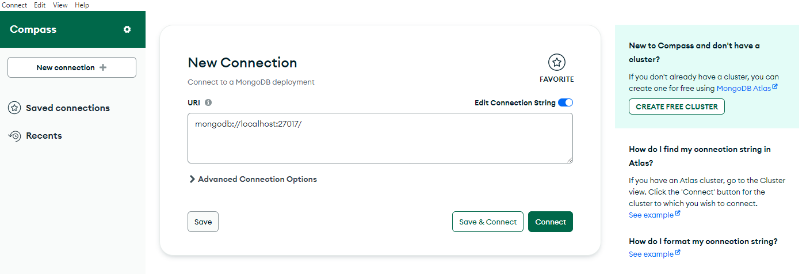

Atlas is a managed mongo database in the cloud and has a free tier.


Follow the button to start free and complete registration details.

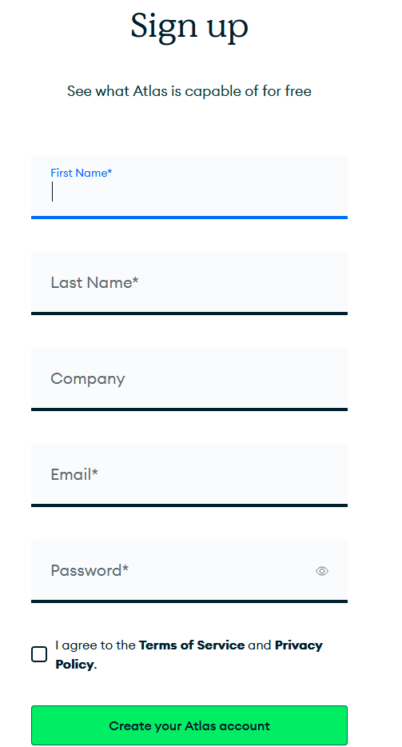

Enter details and then verify your account via email


Check your spam folder to verify your account.

Set up multi factor authentication.

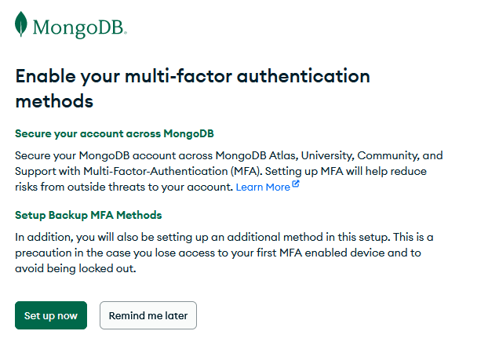

I prefer authenticator app but users can select what suits them best.  You should setup two authentication methods.


Now you  are unlikely too be accidentally locked out of your account.

Read through the background information on the atlas website and then choose to create a deployment.

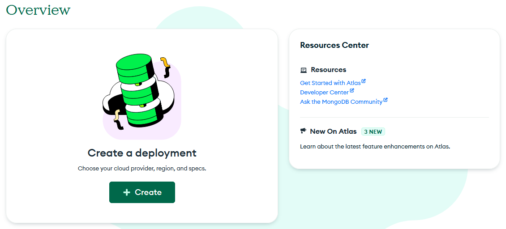

Ensure that you are on the M0 free deployment ( the paid for M10 is the default).add a name for your cluster.

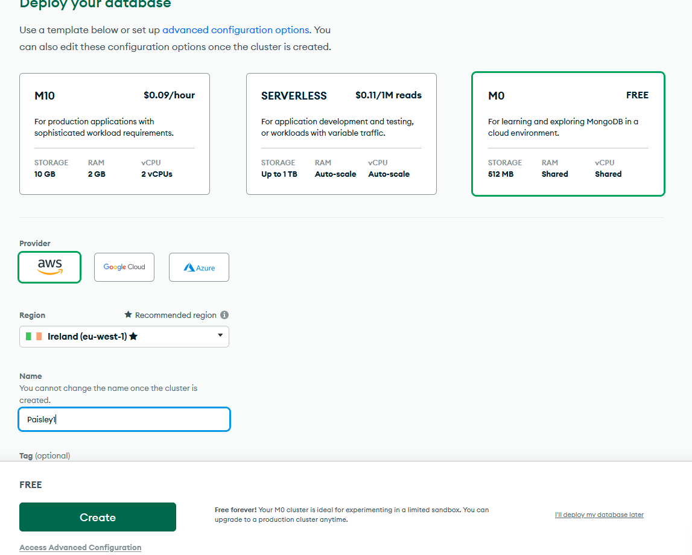

Follow the create button.

Now select a username and password for your database.  You can use an autogenerated one here, but save if securely somewhere!


Click to create user and move down the page to add "My local environment" this will allow you to connect to the dadabase from a local machine.  If you use machines in different locations you will need to manage IPs via the network access page.

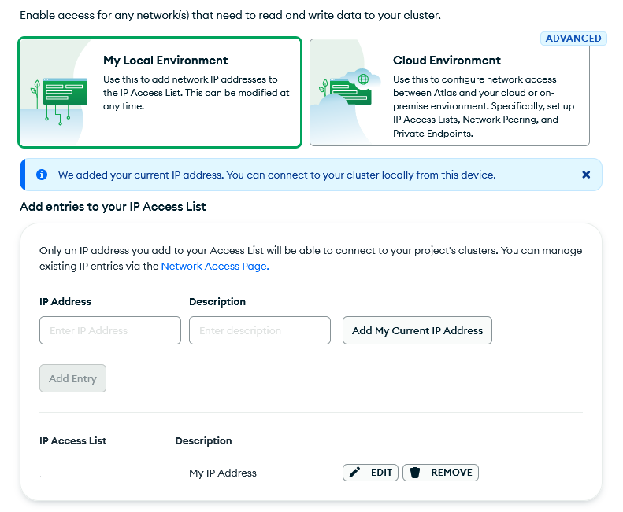

You should see your own local IP address before pressing "Finish and Close".

You should be able to work with the database via your atlas signed in website, but it is convenient to continue to use the compass app running locally.  So press the connect button even though there are no databases here yet.

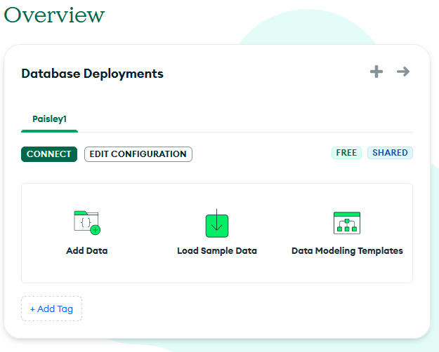

You can access the database by a number of methods, select compass.

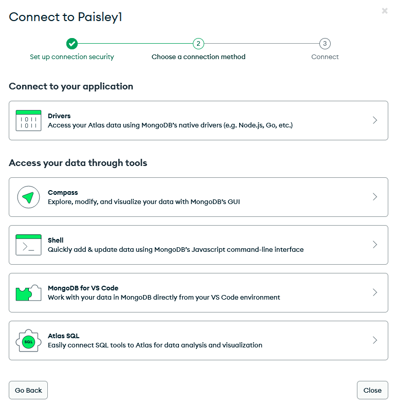

Copy the connection string and add your own password.


Add this string to compass (with your own password).

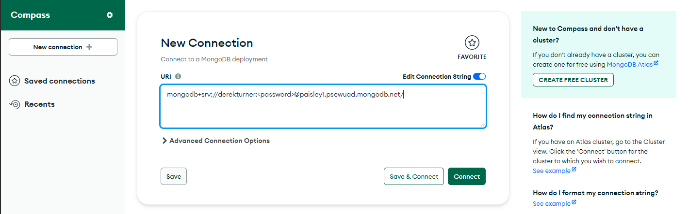

Now compass is connected.

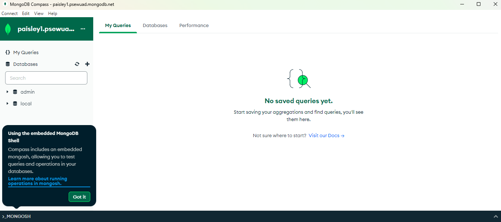

Under the database tag, create a database with name "local_library" and collection name "Collection0".

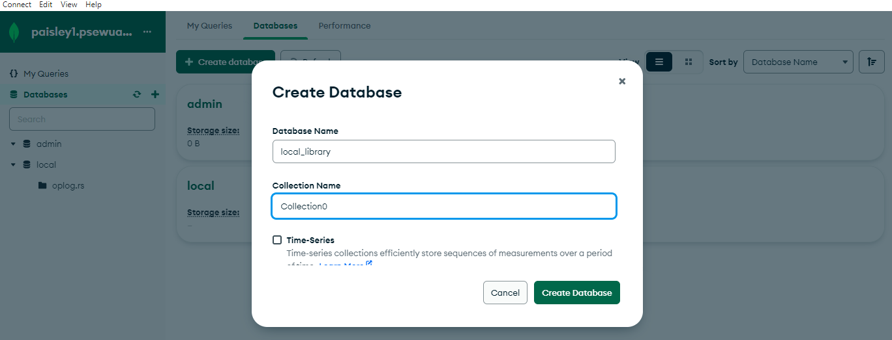


## Create and populate a database

In this section I am following the tutorial example at [Mozilla developer](https://developer.mozilla.org/en-US/docs/Learn/Server-side/Express_Nodejs/mongoose)

An app will be developed to administer a book library.

For this purpose the objects which need to be described in the database are:

1. Book: described by title author ISBN etc
2. BookInstance: The library can hold several copies of one book. When it is loaned each book instance will have a due date for return.
3. Author: name and birth/death dates
4. Genre: Crime, Sci-fi, Romance etc

The relationships between these are:

- 1 book may have 0..many instances
- 1..many books may be written by 1 author (ignore multiple authors for the time being)
- 0..many books may match 0..many genres (a book might fit more than one genre or defy categorisation)

This relationship is captured in the UML diagram:


So examples of inital database entries would be:

Book:

- title:'The Name of the Wind (The Kingkiller Chronicle, #1)',
- summary:'I have stolen princesses back from sleeping barrow kings. I burned down the town of Trebon. I have spent the night with Felurian and left with both my sanity and my life. I was expelled from the University at a younger age than most people are allowed in. I tread paths by moonlight that others fear to speak of during day. I have talked to Gods, loved women, and written songs that make the minstrels weep.',
- ISBN: '9781473211896',
- author: authors[0],
- genre: [genres[0],]

BookInstance

- book: books[0],
- imprint: 'London Gollancz, 2014.',
- due_back: false,
- status: 'Available'

Author:

- first_name:'Patrick',
- family_name:'Rothfuss',
- d_birth:'1973-06-06',
- d_death:false

Genre:  
name: "Fantasy"


### Populating the dataase


Docker provides a method to populate the database which is described in the environmental variables section of the docker hub [mongo page](https://hub.docker.com/_/mongo/).


This is referenced by the environment section of the docker compose file docker-compose.yml

```yml
environment:
      MONGO_INITDB_ROOT_USERNAME: root
      MONGO_INITDB_ROOT_PASSWORD: example
      MONGO_INITDB_DATABASE: local_library
    volumes:
    - ./mongo-init.js:/docker-entrypoint-initdb.d/mongo-init.js:ro
```

The environment variable MONGO_INITDB_DATABASE contains the name of the database which is required to be initialise. If this is omitted the default database will be 'db'.

When the docker compose file is read in the creation of the dev environment the volumes line will cause the file mongo-init to be copied into a reserved name mount point '/docker-entrypoint-initdb.d/'.

When the container is brought up, _if the database is empty,_ the scripts in the '/docker-entrypoint-initdb.d/' mountpoint will be run. Only one script is used in this example, but it is possible to use multiple scripts. These scripts can initialise the database.

Starting and stopping the app again does not cause the database to be altered.

Add a file **mongo-init.js** to the mongo1 github site which will initialise the data for the local-library database. Working through this file:

First set up variables, the database will have four collections as previously described, the data which is going into each of these will be stored to an array.

```javascript
let error = false;

let genres = [];
let authors = [];
let books = [];
let bookinstances = [];
```

Each container will need a function to allow data passed in to be added as a JSON object to the matching array. When the function is called it will also push the JSON data into the res array. No need to declare the res array, it is a keyword representing the response which the script will send to the database.
The overall strategy is to store command objects to the res array (in the correct order) and then output the response.

The function for the genre collection is simplest. The genre just has one name element.

```javascript
function genreCreate(name) {
  genredetail = { name: name };
  genres.push(genredetail);
  res.push(db.genre.insert(genredetail));
}
```

The contents of the res array are now defined.  

The first lines are commands to create the four empty connections. Note that although the database is called local_library, the reference in this file is still to the default database name 'db'.

```javascript
let res = [
  db.book.drop(),
  db.author.drop(),
  db.bookinstance.drop(),
  db.genre.drop(),
```

The next group of commands create the indexes for each of the collections. Note that you need the index name and a number, which in this example is always 1. If a field is to contain unique data this should be noted.

```javascript
  db.book.createIndex({ title: 1 },{ unique: true }),
  db.book.createIndex({ summary: 1 }),
  db.book.createIndex({ author: 1 }),
  db.book.createIndex({ isbn: 1 }),
  db.book.createIndex({ genre: 1 }),
```

The definition of res is now closed off

```javascript
]
```

The functions to create the data can now be called. For authors all the data is known, so the calls are straightforward.

```javascript
authorCreate("Patrick1", "Rothfuss", "1973-06-06", false);
```

For other collections, such as 'book' the related data needs to be included.

```javascript
bookCreate("The Wise Man's Fear ... the unassuming pub landlord.', '9788401352836', authors[0], [genres[0],]);
```

Note that this refers to authors[0], so the authorCreate() calls must all be done before the bookCreate() calls.
In an SQL database a reference authorID would be inserted here. However in a noSQL database every document must be complete and stand alone, so the full JSON object description is added at this point. If you request a book, you don't need to make another request to find out who the author is with authorID 'xxxx'.

Because a book could match zero to many genres, an array of the matching genre objects is included.

A noSQL database does not work with structured querey language, but it does have a structure and there are relationships between data elements.

The last stage is to hope for no errors and send the response to the database.

```javascript
printjson(res);

if (error) {
  print("Error, exiting");
  quit(1);
}
```

The *full listing* for **mongo-init.js** for the local_library tutorial is:

```javascript
let error = false;

let genres = [];
let authors = [];
let books = [];
let bookinstances = [];

function authorCreate(first_name, family_name, d_birth, d_death) {
  authordetail = {
    first_name: first_name,
    family_name: family_name,
    d_birth: null,
    d_death: null
  };
  if (d_birth != false) authordetail.d_birth = d_birth;
  if (d_death != false) authordetail.d_death = d_death;
  authors.push(authordetail);
  res.push(db.author.insert(authordetail));
}

function genreCreate(name) {
  genredetail = { name: name };
  genres.push(genredetail);
  res.push(db.genre.insert(genredetail));
}

function bookCreate(title, summary, isbn, author, genre) {
  bookdetail = {
    title: title,
    summary: summary,
    author: author,
    isbn: isbn,
    genre: null
  };
  if (genre != false) bookdetail.genre = genre;
  books.push(bookdetail);
  res.push(db.book.insert(bookdetail));
}

function bookInstanceCreate(book, imprint, due_back, status) {
  bookinstancedetail = {
    book: book,
    imprint: imprint,
    due_back: null,
    status: null
  };
  if (due_back != false) bookinstancedetail.due_back = due_back;
  if (status != false) bookinstancedetail.status = status;
  bookinstances.push(bookinstancedetail);
  res.push(db.bookinstance.insert(bookinstancedetail));
}

let res = [
  db.book.drop(),
  db.author.drop(),
  db.bookinstance.drop(),
  db.genre.drop(),

  db.book.createIndex({ title: 1 }, { unique: true }),
  db.book.createIndex({ summary: 1 }),
  db.book.createIndex({ author: 1 }),
  db.book.createIndex({ isbn: 1 }),
  db.book.createIndex({ genre: 1 }),

  db.author.createIndex({ first_name: 1 }),
  db.author.createIndex({ family_name: 1 }),
  db.author.createIndex({ d_birth: 1 }),
  db.author.createIndex({ d_death: 1 }),

  db.bookinstance.createIndex({ book: 1 }),
  db.bookinstance.createIndex({ imprint: 1 }),
  db.bookinstance.createIndex({ due_back: 1 }),
  db.bookinstance.createIndex({ status: 1 }),

  db.genre.createIndex({ name: 1 })
];

authorCreate("Patrick", "Rothfuss", "1973-06-06", false);
authorCreate("Ben", "Bova", "1932-11-8", false);
authorCreate("Isaac", "Asimov", "1920-01-02", "1992-04-06");
authorCreate("Bob", "Billings", false, false);
authorCreate("Jim", "Jones", "1971-12-16", false);

genreCreate("Fantasy");
genreCreate("Science Fiction");
genreCreate("French Poetry");

bookCreate(
  "The Name of the Wind (The Kingkiller Chronicle, #1)",
  "I have stolen princesses back from sleeping barrow kings. I burned down the town of Trebon. I have spent the night with Felurian and left with both my sanity and my life. I was expelled from the University at a younger age than most people are allowed in. I tread paths by moonlight that others fear to speak of during day. I have talked to Gods, loved women, and written songs that make the minstrels weep.",
  "9781473211896",
  authors[0],
  [genres[0]]
);
bookCreate(
  "The Wise Man's Fear (The Kingkiller Chronicle, #2)",
  "Picking up the tale of Kvothe Kingkiller once again, we follow him into exile, into political intrigue, courtship, adventure, love and magic... and further along the path that has turned Kvothe, the mightiest magician of his age, a legend in his own time, into Kote, the unassuming pub landlord.",
  "9788401352836",
  authors[0],
  [genres[0]]
);
bookCreate(
  "The Slow Regard of Silent Things (Kingkiller Chronicle)",
  "Deep below the University, there is a dark place. Few people know of it: a broken web of ancient passageways and abandoned rooms. A young woman lives there, tucked among the sprawling tunnels of the Underthing, snug in the heart of this forgotten place.",
  "9780756411336",
  authors[0],
  [genres[0]]
);
bookCreate(
  "Apes and Angels",
  "Humankind headed out to the stars not for conquest, nor exploration, nor even for curiosity. Humans went to the stars in a desperate crusade to save intelligent life wherever they found it. A wave of death is spreading through the Milky Way galaxy, an expanding sphere of lethal gamma ...",
  "9780765379528",
  authors[1],
  [genres[1]]
);
bookCreate(
  "Death Wave",
  "In Ben Bova's previous novel New Earth, Jordan Kell led the first human mission beyond the solar system. They discovered the ruins of an ancient alien civilization. But one alien AI survived, and it revealed to Jordan Kell that an explosion in the black hole at the heart of the Milky Way galaxy has created a wave of deadly radiation, expanding out from the core toward Earth. Unless the human race acts to save itself, all life on Earth will be wiped out...",
  "9780765379504",
  authors[1],
  [genres[1]]
);
bookCreate("Test Book 1", "Summary of test book 1", "ISBN111111", authors[4], [
  genres[0],
  genres[1]
]);
bookCreate(
  "Test Book 2",
  "Summary of test book 2",
  "ISBN222222",
  authors[4],
  false
);

bookInstanceCreate(books[0], "London Gollancz, 2014.", false, "Available");
bookInstanceCreate(books[1], " Gollancz, 2011.", "2020-06-06", "Loaned");
bookInstanceCreate(books[2], " Gollancz, 2015.", false, false);
bookInstanceCreate(
  books[3],
  "New York Tom Doherty Associates, 2016.",
  false,
  "Available"
);
bookInstanceCreate(
  books[3],
  "New York Tom Doherty Associates, 2016.",
  false,
  "Available"
);
bookInstanceCreate(
  books[3],
  "New York Tom Doherty Associates, 2016.",
  false,
  "Available"
);
bookInstanceCreate(
  books[4],
  "New York, NY Tom Doherty Associates, LLC, 2015.",
  false,
  "Available"
);
bookInstanceCreate(
  books[4],
  "New York, NY Tom Doherty Associates, LLC, 2015.",
  false,
  "Maintenance"
);
bookInstanceCreate(
  books[4],
  "New York, NY Tom Doherty Associates, LLC, 2015.",
  false,
  "Loaned"
);
bookInstanceCreate(books[0], "Imprint XXX2", false, false);
bookInstanceCreate(books[1], "Imprint XXX3", false, false);

printjson(res);

if (error) {
  print("Error, exiting");
  quit(1);
}
```

The file is added to github:


## Create a database dev environment 

Create the new environment in Docker desktop.


### troubleshooting
