---
title: 'ReactLibrary2'
metaTitle: 'IT 11'
metaDescription: 'CRUD Database interactions in React'
abstract: |
  Developing full CRUD Database interactions in React

...

# CRUD Database interactions between react and express

The object of the section is to take the express library app, developed in stand alone mode whith server side rendering of HTML using pug views, and strip it back to a JSON REST interface.

Then a react page is developed to replace the pug views and render the JSON on the client side.

In the previous sheet, the connection between the react app and the library API was established for a simple display of the home screen.  In this section wth application is filled out towards a full CRUD implementation.


## Adding React Router

A single page react application can present different components to give an impression of navigating around several pages.  However the links are interpreted by the react app rather than the browser.  Although it is possible to link to external sites it is normal for liks to be internal.  The react router is essential to this funcionality.

Navigate to the reactLibrary folder and start the container up with:

> docker container start -i react_library

This loads an interactive shell in which you can issue linux commands.  Take a look at package.json and note that react-router-dom is not listed here.  

To install this issue in the shell (your container number will vary):

> root@b5aca2e0d7ac:/usr/src# npm install react-router-dom

There is a large amount of console output:

```code
npm WARN deprecated debug@4.1.1: Debug versions >=3.2.0 <3.2.7 || >=4 <4.3.1 have a low-severity ReDos regression when used in a Node.js environment. It is recommended you upgrade to 3.2.7 or 4.3.1. (https://github.com/visionmedia/debug/issues/797)
npm WARN deprecated @hapi/topo@3.1.6: This version has been deprecated and is no longer supported or maintained
npm WARN deprecated @hapi/address@2.1.4: Moved to 'npm install @sideway/address'
npm WARN deprecated @hapi/bourne@1.3.2: This version has been deprecated and is no longer supported or maintained
npm WARN deprecated @hapi/hoek@8.5.1: This version has been deprecated and is no longer supported or maintained
npm WARN deprecated resolve-url@0.2.1: https://github.com/lydell/resolve-url#deprecated
npm WARN deprecated urix@0.1.0: Please see https://github.com/lydell/urix#deprecated
npm WARN deprecated request-promise-native@1.0.9: request-promise-native has been deprecated because it extends the now deprecated request package, see https://github.com/request/request/issues/3142
npm WARN deprecated request@2.88.2: request has been deprecated, see https://github.com/request/request/issues/3142
npm WARN deprecated har-validator@5.1.5: this library is no longer supported
npm WARN deprecated mkdirp@0.5.3: Legacy versions of mkdirp are no longer supported. Please update to mkdirp 1.x. (Note that the API surface has changed to use Promises in 1.x.)
npm WARN deprecated core-js@2.6.12: core-js@<3 is no longer maintained and not recommended for usage due to the number of issues. Please, upgrade your dependencies to the actual version of core-js@3.
npm WARN deprecated fsevents@1.2.13: fsevents 1 will break on node v14+ and could be using insecure binaries. Upgrade to fsevents 2.
npm WARN deprecated debug@3.2.6: Debug versions >=3.2.0 <3.2.7 || >=4 <4.3.1 have a low-severity ReDos regression when used in a Node.js environment. It is recommended you upgrade to 3.2.7 or 4.3.1. (https://github.com/visionmedia/debug/issues/797)
npm WARN deprecated fsevents@2.1.3: Please update to v 2.2.x
npm WARN deprecated chokidar@2.1.8: Chokidar 2 will break on node v14+. Upgrade to chokidar 3 with 15x less dependencies.
npm WARN deprecated rollup-plugin-babel@4.4.0: This package has been deprecated and is no longer maintained. Please use @rollup/plugin-babel.
npm WARN deprecated @hapi/joi@15.1.1: Switch to 'npm install joi'
npm WARN rm not removing /usr/src/node_modules/.bin/jest as it wasn't installed by /usr/src/node_modules/jest
npm WARN rm not removing /usr/src/node_modules/.bin/rimraf as it wasn't installed by /usr/src/node_modules/rimraf
npm WARN rm not removing /usr/src/node_modules/.bin/uuid as it wasn't installed by /usr/src/node_modules/uuid
npm WARN rm not removing /usr/src/node_modules/.bin/terser as it wasn't installed by /usr/src/node_modules/terser
npm WARN rm not removing /usr/src/node_modules/.bin/semver as it wasn't installed by /usr/src/node_modules/semver
npm WARN rm not removing /usr/src/node_modules/.bin/browserslist as it wasn't installed by /usr/src/node_modules/browserslist
npm WARN rm not removing /usr/src/node_modules/.bin/mkdirp as it wasn't installed by /usr/src/node_modules/mkdirp
npm WARN rm not removing /usr/src/node_modules/.bin/json5 as it wasn't installed by /usr/src/node_modules/json5
npm WARN rm not removing /usr/src/node_modules/.bin/parser as it wasn't installed by /usr/src/node_modules/@babel/parser

> core-js@2.6.12 postinstall /usr/src/node_modules/babel-runtime/node_modules/core-js
> node -e "try{require('./postinstall')}catch(e){}"

Thank you for using core-js ( https://github.com/zloirock/core-js ) for polyfilling JavaScript standard library!

The project needs your help! Please consider supporting of core-js on Open Collective or Patreon: 
> https://opencollective.com/core-js 
> https://www.patreon.com/zloirock 

Also, the author of core-js ( https://github.com/zloirock ) is looking for a good job -)


> core-js@3.8.1 postinstall /usr/src/node_modules/core-js
> node -e "try{require('./postinstall')}catch(e){}"

Thank you for using core-js ( https://github.com/zloirock/core-js ) for polyfilling JavaScript standard library!

The project needs your help! Please consider supporting of core-js on Open Collective or Patreon: 
> https://opencollective.com/core-js 
> https://www.patreon.com/zloirock 

Also, the author of core-js ( https://github.com/zloirock ) is looking for a good job -)


> core-js-pure@3.8.1 postinstall /usr/src/node_modules/core-js-pure
> node -e "try{require('./postinstall')}catch(e){}"

Thank you for using core-js ( https://github.com/zloirock/core-js ) for polyfilling JavaScript standard library!

The project needs your help! Please consider supporting of core-js on Open Collective or Patreon: 
> https://opencollective.com/core-js 
> https://www.patreon.com/zloirock 

Also, the author of core-js ( https://github.com/zloirock ) is looking for a good job -)


> ejs@2.7.4 postinstall /usr/src/node_modules/ejs
> node ./postinstall.js

Thank you for installing EJS: built with the Jake JavaScript build tool (https://jakejs.com/)

npm notice created a lockfile as package-lock.json. You should commit this file.
npm WARN optional SKIPPING OPTIONAL DEPENDENCY: fsevents@^2.1.2 (node_modules/jest-haste-map/node_modules/fsevents):
npm WARN notsup SKIPPING OPTIONAL DEPENDENCY: Unsupported platform for fsevents@2.2.1: wanted {"os":"darwin","arch":"any"} (current: {"os":"linux","arch":"x64"})
npm WARN optional SKIPPING OPTIONAL DEPENDENCY: fsevents@^1.2.7 (node_modules/chokidar/node_modules/fsevents):
npm WARN notsup SKIPPING OPTIONAL DEPENDENCY: Unsupported platform for fsevents@1.2.13: wanted {"os":"darwin","arch":"any"} (current: {"os":"linux","arch":"x64"})
npm WARN optional SKIPPING OPTIONAL DEPENDENCY: fsevents@^2.1.2 (node_modules/jest-haste-map/node_modules/fsevents):
npm WARN notsup SKIPPING OPTIONAL DEPENDENCY: Unsupported platform for fsevents@2.2.1: wanted {"os":"darwin","arch":"any"} (current: {"os":"linux","arch":"x64"})
npm WARN optional SKIPPING OPTIONAL DEPENDENCY: fsevents@^2.1.3 (node_modules/react-scripts/node_modules/fsevents):
npm WARN notsup SKIPPING OPTIONAL DEPENDENCY: Unsupported platform for fsevents@2.2.1: wanted {"os":"darwin","arch":"any"} (current: {"os":"linux","arch":"x64"})
npm WARN optional SKIPPING OPTIONAL DEPENDENCY: fsevents@~2.1.2 (node_modules/chokidar/node_modules/fsevents):
npm WARN notsup SKIPPING OPTIONAL DEPENDENCY: Unsupported platform for fsevents@2.1.3: wanted {"os":"darwin","arch":"any"} (current: {"os":"linux","arch":"x64"})
npm WARN optional SKIPPING OPTIONAL DEPENDENCY: fsevents@^1.2.7 (node_modules/watchpack-chokidar2/node_modules/chokidar/node_modules/fsevents):
npm WARN notsup SKIPPING OPTIONAL DEPENDENCY: Unsupported platform for fsevents@1.2.13: wanted {"os":"darwin","arch":"any"} (current: {"os":"linux","arch":"x64"})
npm WARN optional SKIPPING OPTIONAL DEPENDENCY: fsevents@^1.2.7 (node_modules/webpack-dev-server/node_modules/chokidar/node_modules/fsevents):
npm WARN notsup SKIPPING OPTIONAL DEPENDENCY: Unsupported platform for fsevents@1.2.13: wanted {"os":"darwin","arch":"any"} (current: {"os":"linux","arch":"x64"})
npm WARN tsutils@3.17.1 requires a peer of typescript@>=2.8.0 || >= 3.2.0-dev || >= 3.3.0-dev || >= 3.4.0-dev || >= 3.5.0-dev || >= 3.6.0-dev || >= 3.6.0-beta || >= 3.7.0-dev || >= 3.7.0-beta but none is installed. You must install peer dependencies yourself.

+ react-router-dom@5.2.0
added 322 packages from 93 contributors, removed 504 packages, updated 1470 packages and audited 1803 packages in 942.427s

121 packages are looking for funding
  run `npm fund` for details

found 0 vulnerabilities
```
At the end of this, react-router-dom@5.2.0 has been added and package.json should be checked to confirm that it is updated.

```javascript
{
  "name": "src",
  "version": "0.1.0",
  "private": true,
  "dependencies": {
    "@testing-library/jest-dom": "^5.11.4",
    "@testing-library/react": "^11.1.0",
    "@testing-library/user-event": "^12.1.10",
    "react": "^17.0.1",
    "react-dom": "^17.0.1",
    "react-router-dom": "^5.2.0",
    "react-scripts": "4.0.1",
    "web-vitals": "^0.2.4"
  },
  "scripts": {
    "start": "react-scripts start",
    "build": "react-scripts build",
    "test": "react-scripts test",
    "eject": "react-scripts eject"
  },
  "eslintConfig": {
    "extends": [
      "react-app",
      "react-app/jest"
    ]
  },
  "browserslist": {
    "production": [
      ">0.2%",
      "not dead",
      "not op_mini all"
    ],
    "development": [
      "last 1 chrome version",
      "last 1 firefox version",
      "last 1 safari version"
    ]
  }
}
```
## Relocate node modules

The create-react-app command generates many node modules which are shared with the local filesystem and slow down compilation.  These can be moved to another location where they are contained completely within the containers file system.

The process of compiling uses babel and this will still generate some files in the node-module folder in the local file system, but these are few and dont slow down operation.

Check the current path

> root@b5aca2e0d7ac:/usr/src# echo $PATH

```code
/usr/local/sbin:/usr/local/bin:/usr/sbin:/usr/bin:/sbin:/bin
```
Add a new path to the existing path where node modules could be located.

> root@b5aca2e0d7ac:/usr/src# **PATH=$PATH:/node_modules/.bin**

  **(you will need to repeat this PATH command after a container restart it is not remembered).**

Then recheck to ensure the path has been modified.

Check the current path

> root@b5aca2e0d7ac:/usr/src# echo $PATH

```code
/usr/local/sbin:/usr/local/bin:/usr/sbin:/usr/bin:/sbin:/bin:/node_modules/.bin
```

Now try to move the node modules with

> root@b5aca2e0d7ac:/usr/src# mv /usr/src/node_modules /node_modules

There are a lot to move and this should be happening in both the container and the local file system so it could take a while.  But after a wait the node modules are moved.

> root@b5aca2e0d7ac:/usr/src# ls

```code
README.md  package-lock.json  package.json  public  src  src_bak  yarn.lock
```

This will make the running of scripts faster.


## Displaying a home screen

The earlier reactreadsJSON app used bootstrap 4 to style cards for the display.  Although javaScript code has been transferred across from this app, the bootstrap CDN has not yet been linked.  This does not cause a problem, it just means that the css styles are not being applied.  I want to use bootsrap grid to generate a two column display and use bootstrap cards to give some simple formatting.  This makes it easy for you to generate decorative css code when the functionality is complete.

To restore the bootsrap css, add a link to reactLibrary/public/index.html

```html
<link rel="stylesheet" href="https://stackpath.bootstrapcdn.com/bootstrap/4.1.3/css/bootstrap.min.css" 
```

The full listing then becomes:

```html
<!DOCTYPE html>
<html lang="en">
  <head>
    <meta charset="utf-8" />
    <link rel="stylesheet" href="https://stackpath.bootstrapcdn.com/bootstrap/4.1.3/css/bootstrap.min.css" integrity="sha384-MCw98/SFnGE8fJT3GXwEOngsV7Zt27NXFoaoApmYm81iuXoPkFOJwJ8ERdknLPMO" crossorigin="anonymous">
    <link rel="icon" href="%PUBLIC_URL%/favicon.ico" />
    <meta name="viewport" content="width=device-width, initial-scale=1" />
    <meta name="theme-color" content="#000000" />
    <meta
      name="description"
      content="Web site created using create-react-app"
    />
    <link rel="apple-touch-icon" href="%PUBLIC_URL%/logo192.png" />
    <!--
      manifest.json provides metadata used when your web app is installed on a
      user's mobile device or desktop. See https://developers.google.com/web/fundamentals/web-app-manifest/
    -->
    <link rel="manifest" href="%PUBLIC_URL%/manifest.json" />
    <!--
      Notice the use of %PUBLIC_URL% in the tags above.
      It will be replaced with the URL of the `public` folder during the build.
      Only files inside the `public` folder can be referenced from the HTML.

      Unlike "/favicon.ico" or "favicon.ico", "%PUBLIC_URL%/favicon.ico" will
      work correctly both with client-side routing and a non-root public URL.
      Learn how to configure a non-root public URL by running `npm run build`.
    -->
    <title>React App</title>
  </head>
  <body>
    <noscript>You need to enable JavaScript to run this app.</noscript>
    <div id="root"></div>
    <!--
      This HTML file is a template.
      If you open it directly in the browser, you will see an empty page.

      You can add webfonts, meta tags, or analytics to this file.
      The build step will place the bundled scripts into the <body> tag.

      To begin the development, run `npm start` or `yarn start`.
      To create a production bundle, use `npm run build` or `yarn build`.
    -->
  </body>
</html>

```

The home screen must have the possibility of expansion by adding navigation to other pages in the application not directly associated with the library database.  So the navigation for the database displays should be separated from the main App.js.

A new file reactLibrary/src/components/library.js will be developed to display the links and returned data in a two column format.  The left column will display the links starting with Home, list all books, list all authors, list all genres and list all book instances, the right column will display the returned data. 

These links will call the react components which are responsible for querying the database and rendering the returned data.

At the top os library js, the react components: BrowserRouter, Link, Route and Switch must be imported from the react-router-dom.  

```javascript
import React, { Component }from 'react';
import { BrowserRouter, Link, Route, Switch } from 'react-router-dom';
```
The browserRouter ensures that enclosed links are handled by react rather than the browser so that the links can be delivered from within a single page react app rather than sending requests to the server.  The route maps a linked path to a react component and Switch displays on (or more) of the matched routes.

If the Route includes the exact attribute (which is normal) then only one route is displayed.  If this is omitted then all matching routes are displayed.

To create a two column display, the [bootstrap grid system](https://getbootstrap.com/docs/4.0/layout/grid/) is used.  In HTML this would apply CSS to elements with named class attributes.  It is essential to note that in JSX the class is replaced by "className"

```javascript
      <div className = "container-fluid">
        <div  className = "row">
          <div  className = "col-sm-3">Left</div>
          <div  className = "col-sm-9">Right</div>
        </div>  
       <div>
   ```

It is possible to achieve a two column display by using a react component such as [sidebar](https://www.npmjs.com/package/react-sidebar), however I have preferred not to conceal the operation within another component.  I found the  w3Collective reference to [build your own sidebar navigation component](https://w3collective.com/react-sidebar-navigation-component/) useful.

In most references you will find the code enclosed by the <BrowserRouter> element in a compact block within the displaying <div>  however in my example the links are in the left column and the display is in the right column of a single rendered element, so the <BrowserRouter> element must encompas the <div>s for both columns.  Then the Links are within the left hand <div> and the Switch and Routes in the right hand <div>.

The full ilisting for library.js then becomes:

```javascript
// src/components/library.js
// component to display library CRUD

import React, { Component }from 'react';
import { BrowserRouter, Link, Route, Switch } from 'react-router-dom';

import Catalog from './catalog';
import BookList from './bookList';
import AuthorList from './authorList';
import GenreList from './genreList';
import BookInstanceList from './bookInstanceList';
 

 class Library extends Component {

  constructor(props){
    super(props);
  }

 
  render() {
    return (
      <BrowserRouter>
      <div className = "container-fluid">
        <div  className = "row">
          <div  className = "col-sm-3">
            <center><h1>Library Catalog</h1></center>
            <p>&nbsp;</p>
            <div className ="card">
              <div className ="card-body">
                
                <p className ="card-text"><Link to="/catalog">Home</Link></p>
                <p className ="card-text"><Link to="/catalog/books">All Books</Link></p>
                <p className ="card-text"><Link to="/catalog/authors">All Authors</Link></p>
                <p className ="card-text"><Link to="/catalog/genres">All Genres</Link></p>
                <p className ="card-text"><Link to="/catalog/bookinstances">All Book Instances</Link></p>
                
              </div>
            </div>  
          </div>       
          <div  className = "col-sm-9">

              <Switch>
                <Route exact path="/"><Catalog /> </Route>
                <Route exact path="/catalog"><Catalog /> </Route>
                <Route exact path="/catalog/books"><BookList /> </Route>
                <Route exact path="/catalog/authors"><AuthorList /> </Route>
                <Route exact path="/catalog/genres"><GenreList /> </Route>
                <Route exact path="/catalog/bookinstances"><BookInstanceList /> </Route>
              </Switch>
               
          </div>

        </div>
        
      </div>
      </BrowserRouter>
    )
  };
}  
 export default Library
```

The App.js file now has to display the library.js.

On the way to finding this solution the App component had been defined as a class in order that it could maintain state.  At this stage this is not necessary but I have chosen to retain the class rather than change App to a function component.  

A class component can have both state and props.  The initial state is set by this.state in the constructor, I note that React provides a built in static variable, defaultProps to set the initial value of props.  This code is redundant in the current application, but is retained as an example as it will be useful in other contexts.

The full listing of App.js now becomes:

```javascript
import React, { Component }from 'react';
import Library from './components/library';

class App extends Component {

  constructor(props){
    super(props);
    this.state = {c1: <Library />};
  }

  static defaultProps = { c1: <Library /> }


  render() {


    return (
      <div className = "container-fluid">
        <div className = "row">
          <div className = "col-sm-12">
            <center><h1>Local Library Home</h1>
            <p>Welcome to Local Library a very basic Express website rendered by React</p>
            <p>&nbsp;</p>
            </center>  
          </div>
        </div>

        <div  className = "row">
          <div className = "col-sm-12">
            <Library />
          </div>
        </div>
      </div>
    )
  }

}  

export default App;

```

Although <library /> is hard coded here at the moment there is nothing to stop the inclusion of routing on this page so that other components could be navigated to.


Along the principle followed in the previous labsheet.  Clicking on Home activates the link to /catalog this is captured exactly in the route /catalog and the element Catalog is rendered.

Now the code which addresses the REST API is included in the body of  catalog.js and updated when the component is mounted to the DOM.  The updating of elements is an aspect of the [react component lifecycle.](https://www.w3schools.com/react/react_lifecycle.asp)


Remember that the variable which holds state must match the fields of the JSON data returned by the REST API.

```javascript
 // src/components/catalog.js

 import React, { Component }from 'react';

 class Catalog extends Component {
  state = {
    libCatalog:{"book_instance_count":1,
                "book_count":2,
                "book_instance_available_count":3,
                "author_count":4,
                "genre_count":5}
  }

  componentDidMount() {
    fetch('http://localhost:3000/catalog')
    .then(res => res.json())
    .then((data) => {
      console.log("data: ", data);
      this.setState({ libCatalog: data })
    })
    .catch(console.log)
  }

  render(){
   return (
     <div>

       <center><h1>Dynamic Content</h1></center>
       <p>The library has the following record counts:</p>
         <div className ="card">
           <div className ="card-body">
             <ul>
              <li className ="card-text">Books: {this.state.libCatalog.book_count}</li>
              <li className ="card-text">Copies: {this.state.libCatalog.book_instance_count}</li>
              <li className ="card-text">Copies Available: {this.state.libCatalog.book_instance_available_count}</li>
              <li className ="card-text">Authors: {this.state.libCatalog.genre_count}</li>
              <li className ="card-text">Genres: {this.state.libCatalog.book_count}</li>
             </ul>  
           </div>
         </div>
     </div>
   )
  }
 };

 export default Catalog
```

Also remember that the JSON was enabled to be returned from the libraryAPI by diverting the flow of code from the pug view (res.render) to the HTTP response (res.send) within a section of bookContoller.js

```javascript
// Display list of all Books.
exports.book_list = function(req, res, next) {

    Book.find({}, 'title author')
      .populate('author')
      .exec(function (err, list_books) {
        if (err) { return next(err); }
        //Successful, so render
        //res.render('book_list', { title: 'Book List', book_list: list_books });
        res.send( list_books );
    }); 
  };
```


If it is not currently running start the libraryAPI from within the libraryAPI folder using:

> docker-compose -f stack.yml start 

Likewise from within reactLibrary folder the react app can be started by:

> docker container start -i react_library

If you are restarting the react_library container you will need to repeat the commands to set the path: 

> root@b5aca2e0d7ac: PATH=$PATH:/node_modules/.bin

Before starting the compilation onto the development server with:

> root@b5aca2e0d7ac:/usr/src# yarn start   


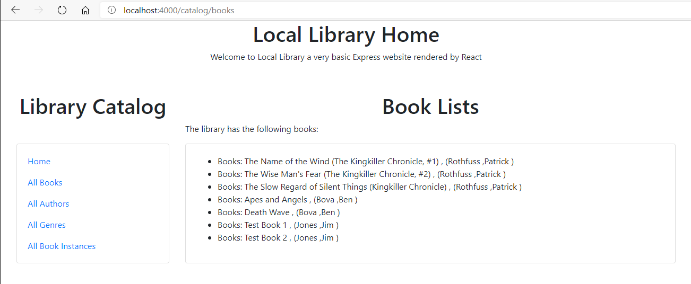

Within the Developer Tool view an error can be seen as library.js has a useless constructor.

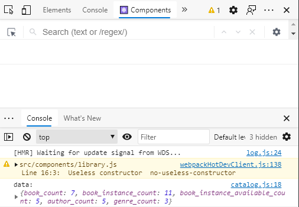

This arises because I have not added any default state to the constructor.  It would be perfectly valid to change the library back to a function rather than a class, but I will hold on to the class for now.

## Listing All

Now I want to list all books, authors, genres and instances in turn from the links which are already in the library.js file.

The steps required in each case will be:

1. modify the appropriate controller file in libraryAPI to return JSON via HTTP rather than rendering to pug.
2. Check the format of the JSON returned
3. Create a component file in reactLibrary with state variables which match the returned JSON
4. Read from the REST libraryAPI
5. Render the appropriate data patterned loosely on the equivalent pug view.

### List all books

Modify bookcontroller.js to return the book list as JSON.

```javascript
// Display list of all Books.
exports.book_list = function(req, res, next) {

    Book.find({}, 'title author')
      .populate('author')
      .exec(function (err, list_books) {
        if (err) { return next(err); }
        //Successful, so render
        //res.render('book_list', { title: 'Book List', book_list: list_books });
        res.send( list_books );
    }); 
  };
```

Check the returned JSON:

```JSON
[{"_id":"5fd17e4dcafcfea77d6139d2",
"title":"The Name of the Wind (The Kingkiller Chronicle, #1)",
"author":{"_id":"5fd17e4dcafcfea77d6139ca",
          "first_name":"Patrick",
          "family_name":"Rothfuss",
          "date_of_birth":"1973-06-06T00:00:00.000Z","date_of_death":null}},
  {"_id":"5fd17e4dcafcfea77d6139d3",
  "title":"The Wise Man's Fear (The Kingkiller Chronicle, #2)",
  "author":{"_id":"5fd17e4dcafcfea77d6139ca",
            "first_name":"Patrick",
            "family_name":"Rothfuss","date_of_birth":"1973-06-06T00:00:00.000Z","date_of_death":null}}
]
```

Create booklist.js and match the state variables:

```javascript
 class BookList extends Component {
  state = {
    libBooks:[{ "_id":"1",
              "title":" ",
              author:{
                "_id":" ",
                "first_name":" ",
                "family_name":" ",
                "date_of_birth":" ",
                "date_of_death":""}
            }]
  }
```

Read from the libraryAPI

```javascript
  componentDidMount() {
    fetch('http://localhost:3000/catalog/books')
    .then(res => res.json())
    .then((data) => {
      console.log("data: ", data);
      this.setState({ libBooks: data })
    })
    .catch(console.log);
  }
```

Render the list of books.  Note that in this case the JSON is returned as an array so the use of the .map funcition is appropriate.  In some other cases a single JSON object will be returned and this will not require the use of .map which is there to iterate around the array.

```javascript
  render(){
    //this.update();
    return (
      <div>
        <center><h1>Book Lists</h1></center>
        <p>The library has the following books:</p>
        <div className ="card">
          <div className ="card-body">
            <ul>
              {this.state.libBooks.map((libBook) => (
                <li className ="card-text" key = {libBook._id} >
                Books: {libBook.title} ,
                ({libBook.author.family_name} ,
                {libBook.author.first_name} )
                
                </li>
              ))}  
            </ul>  
          </div>
        </div>
      </div>
    )
 }
}
```

The full listing of booklist.js is then:

```javascript
 // src/components/bookList.js

 import React, { Component }from 'react';

 class BookList extends Component {
  state = {
    libBooks:[{ "_id":"1",
              "title":" ",
              author:{
                "_id":" ",
                "first_name":" ",
                "family_name":" ",
                "date_of_birth":" ",
                "date_of_death":""}
            }]
  }

  componentDidMount() {
    fetch('http://localhost:3000/catalog/books')
    .then(res => res.json())
    .then((data) => {
      console.log("data: ", data);
      this.setState({ libBooks: data })
    })
    .catch(console.log);
  }

  render(){
    //this.update();
    return (
      <div>
        <center><h1>Book Lists</h1></center>
        <p>The library has the following books:</p>
        <div className ="card">
          <div className ="card-body">
            <ul>
              {this.state.libBooks.map((libBook) => (
                <li className ="card-text" key = {libBook._id} >
                Books: {libBook.title} ,
                ({libBook.author.family_name} ,
                {libBook.author.first_name} )
                
                </li>
              ))}  
            </ul>  
          </div>
        </div>
      </div>
    )
 }
}

 export default BookList
```

The link now displays the list of books:

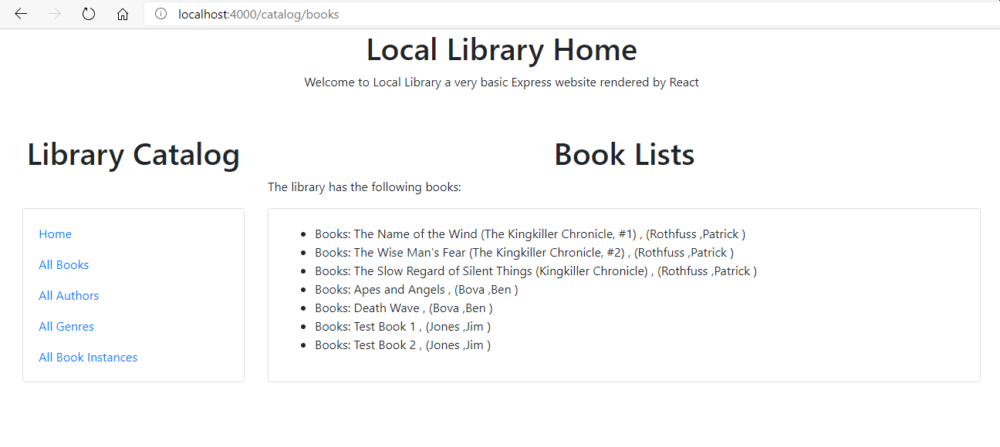

### List all Authors

To list all authors authorController.js must be modified to return the author list as JSON:

```javascript
exports.author_list = function(req, res, next) {

    Author.find()
      .sort([['family_name', 'ascending']])
      .exec(function (err, list_authors) {
        if (err) { return next(err); }
        //Successful, so render
        //res.render('author_list', { title: 'Author List', author_list: list_authors });
        res.send(list_authors);
      });
  
  };
```

This returns the format:

```JSON
[
{"_id":"5fd17e4dcafcfea77d6139cc",
"first_name":"Isaac",
"family_name":"Asimov","date_of_birth":"1920-01-02T00:00:00.000Z","date_of_death":"1992-04-06T00:00:00.000Z"},  {"_id":"5fd17e4dcafcfea77d6139cd",
"first_name":"Bob",
"family_name":"Billings",
"date_of_birth":null,
"date_of_death":null}
]
```

Then create authorList.js:

```javascript
// src/components/authorLists.js

import React, { Component }from 'react';

class AuthorList extends Component {
 state = {
   libAuthors:[{ "_id":"1",
             "first_name":" ",
             "family_name":" ",
             "date_of_birth":" ",
             "date_of_death":" ",
           }]
 }

 componentDidMount() {
   fetch('http://localhost:3000/catalog/authors')
   .then(res => res.json())
   .then((data) => {
     console.log("data: ", data);
     this.setState({ libAuthors: data })
   })
   .catch(console.log);
 }

 render(){
   //this.update();
   return (
     <div>
       <center><h1>Author Lists</h1></center>
       <p>The library has the following authors:</p>
       <div className ="card">
         <div className ="card-body">
           <ul>
             {this.state.libAuthors.map((libAuthor) => (
               <li className ="card-text" key = {libAuthor._id} >
               Author: {libAuthor.family_name} ,
               {libAuthor.first_name} ,
               {libAuthor.date_of_birth} ,
               {libAuthor.date_of_death}
               </li>
             ))}  
           </ul>  
         </div>
       </div>
     </div>
   )
}
}

export default AuthorList
```

The resulting display still needs a bit of formatting to match the original pug view.

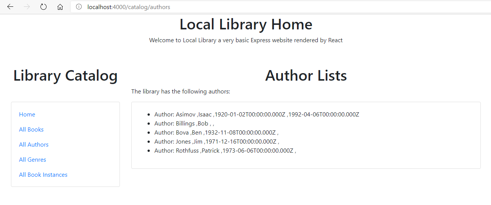

### List all Genres

To list all genres genreController.js must be modified to return the author list as JSON:

```javascript
// Display list of all Genres.
exports.genre_list = function(req, res, next) {

    Genre.find()
      .sort([['name', 'ascending']])
      .exec(function (err, list_genres) {
        if (err) { return next(err); }
        //Successful, so render
        //res.render('genre_list', { title: 'Genre List', genre_list: list_genres });
        res.send(list_genres);
      });
  
  };
```

This returns the JSON format:

```JSON
[
  {"_id":"5fd17e4dcafcfea77d6139cf","name":"Fantasy"},{"_id":"5fd17e4dcafcfea77d6139d1","name":"French Poetry"},{"_id":"5fd17e4dcafcfea77d6139d0","name":"Science Fiction"}
]
```

Create genreList.js

```javascript
 // src/components/GenreList.js

 import React, { Component }from 'react';

 class GenreList extends Component {
  state = {
    libGenres:[{ "_id":"1",
              "name":" ",
            }]
  }
 
  componentDidMount() {
    fetch('http://localhost:3000/catalog/genres')
    .then(res => res.json())
    .then((data) => {
      console.log("data: ", data);
      this.setState({ libGenres: data })
    })
    .catch(console.log);
  }
 
  render(){
    //this.update();
    return (
      <div>
        <center><h1>Genre Lists</h1></center>
        <p>The library has the following genres:</p>
        <div className ="card">
          <div className ="card-body">
            <ul>
              {this.state.libGenres.map((libGenre) => (
                <li className ="card-text" key = {libGenre._id} >
                Genre: {libGenre.name} ,
                </li>
              ))}  
            </ul>  
          </div>
        </div>
      </div>
    )
 }
 }
 
 export default GenreList
```

The Genre list then displays as:


### List all Book Instances

To list all book instances bookInstanceController.js must be modified to return the author list as JSON:

```javascript
// Display list of all BookInstances.
exports.bookinstance_list = function(req, res, next) {

    BookInstance.find()
      .populate('book')
      .exec(function (err, list_bookinstances) {
        if (err) { return next(err); }
        // Successful, so render
        //res.render('bookinstance_list', { title: 'Book Instance List', bookinstance_list: list_bookinstances });
        res.send(list_bookinstances);
      });
      
  };
```

This returns the JSON format:

```JSON
[
  {"status":"Available",
  "_id":"5fd17e4dcafcfea77d6139d9",
  "book":{
    "genre":["5fd17e4dcafcfea77d6139cf"],"_id":"5fd17e4dcafcfea77d6139d2",
    "title":"The Name of the Wind (The Kingkiller Chronicle, #1)","summary":"I have stolen princesses back from sleeping barrow kings. I burned down the town of Trebon. I have spent the night with Felurian and left with both my sanity and my life. I was expelled from the University at a younger age than most people are allowed in. I tread paths by moonlight that others fear to speak of during day. I have talked to Gods, loved women, and written songs that make the minstrels weep.",
    "author":"5fd17e4dcafcfea77d6139ca",
    "isbn":"9781473211896"},
  "imprint":"London Gollancz, 2014.",
  "due_back":null}
]  
```

Create bookInstanceList.js

```javascript
// src/components/BookInstanceList.js

import React, { Component }from 'react';

class BookInstanceList extends Component {
  state = {
    libBookInstances:[{ "status":"A",
              "_id":"0",
              book:{
                "genre":" ",
                "_id":" ",
                "title":" ",
                "summary":" ",
                "author":" ",
                "isbn":" ",
              },
              "imprint":" ",
              "due_back":" "
            }]
  }

 componentDidMount() {
   fetch('http://localhost:3000/catalog/bookinstances')
   .then(res => res.json())
   .then((data) => {
     console.log("data: ", data);
     this.setState({ libBookInstances: data })
   })
   .catch(console.log);
 }

 render(){
   //this.update();
   return (
     <div>
       <center><h1>BookInstance Lists</h1></center>
       <p>The library has the following book copies:</p>
       <div className ="card">
         <div className ="card-body">
           <ul>
             {this.state.libBookInstances.map((libBookInstance) => (
               <li className ="card-text" key = {libBookInstance._id} >
               BookInstance: {libBookInstance.title} ,
               {libBookInstance.imprint} ,
               {libBookInstance.due_back} 
               </li>
             ))}  
           </ul>  
         </div>
       </div>
     </div>
   )
}
}

export default BookInstanceList
```


The resulting display appears as:

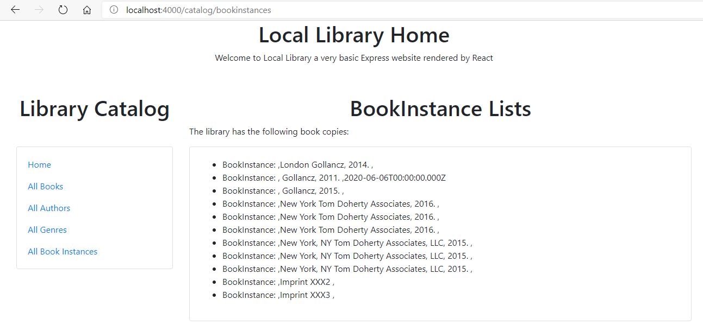

## Date formatting

The dates on the Authorlist and BookInstance list need to be converted from their UTC strings back to dates, datespans may neet to be created and the dates should be presented in the required format.

### Date formatting Authors

For the authors page we aim to display the authors lifespan or the messages "living" or "unknown".

We could use node module [luxon](https://moment.github.io/luxon/) to format the date but here I am using the basic javaScript method of converting dates to times in ms and [calculating the time difference](https://www.w3resource.com/javascript-exercises/javascript-date-exercise-49.php).

Return to authorList.js and in this file add a function component which will receive two dates as props and return the difference in years with checks to make sure the dates recieved are valid.

```javascript
function Lifespan(props){
  if (props.birth && ! props.death){return("living")}
  if (! props.birth){return ("unknown")}
  let birthDate = new Date(props.birth);
  let deathDate = new Date(props.death);
  let diff = (birthDate.getTime() - deathDate.getTime()) / 1000;
  diff /= (60 * 60 * 24);
  diff = Math.abs(Math.round(diff/365.25));
  return (diff + " years")
}
```
Note that props must be included in the () arguments to allow it to be passed.  In many references the props are described being used in a JSX section in brackets {props.myprops}.  However in a standard javascript section of the code the {} are not required. 

When the Lifespan component is called, the props must be passed with names matching those used in the function.

```javascript
              <Lifespan birth = {libAuthor.date_of_birth} death = {libAuthor.date_of_death} /> 
```

The complete listing of authorList.js becomes:

```javascript
// src/components/authorLists.js

import React, { Component }from 'react';

function Lifespan(props){
  if (props.birth && ! props.death){return("living")}
  if (! props.birth){return ("unknown")}
  let birthDate = new Date(props.birth);
  let deathDate = new Date(props.death);
  let diff = (birthDate.getTime() - deathDate.getTime()) / 1000;
  diff /= (60 * 60 * 24);
  diff = Math.abs(Math.round(diff/365.25));
  return (diff + " years")
}


class AuthorList extends Component {
 state = {
    libAuthors:[{ "_id":"1",
             "first_name":" ",
             "family_name":" ",
             "date_of_birth":" ",
             "date_of_death":" ",
           }],
          
 }

 componentDidMount() {
   fetch('http://localhost:3000/catalog/authors')
   .then(res => res.json())
   .then((data) => {
     console.log("data: ", data);
     this.setState({ libAuthors: data })
   })
   .catch(console.log);
   
  }

  render(){
   return (
     <div>
       <center><h1>Author Lists</h1></center>
       <p>The library has the following authors:</p>
       <div className ="card">
         <div className ="card-body">
           <ul>
             {this.state.libAuthors.map((libAuthor) => (
               <li className ="card-text" key = {libAuthor._id} >
               Author: {libAuthor.family_name} ,
               {libAuthor.first_name} ,
               <Lifespan birth = {libAuthor.date_of_birth} death = {libAuthor.date_of_death} /> 
               </li>
             ))}  
           </ul>  
         </div>
       </div>
     </div>
   )
  }
}

export default AuthorList
```

The lifespans are displayed on the authorList page as:

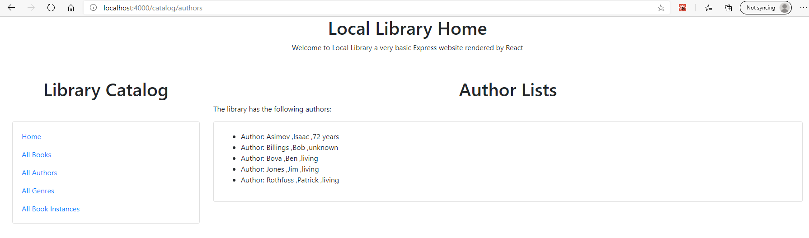

### Date formatting Book Instances

Unless the book instance is available, it will have a status of Maintenance or Loaned in which case it carries a due_back date.  This is formatted within a reacf function component, Due.  This could be done using the node module [Luxon](https://moment.github.io/luxon/), but I have preferred here to use the standard javascript [.toLocaleDateString](https://reactgo.com/format-date-time-javascript/)

The formatting function is:

```javascript
function Due(props){
  if (props.status === "Available"){
    return(" ")
  }else{
    const options = {
      weekday: "long",
      month:"long",
      day:"numeric",
      year: "numeric"};
    let dueDate = new Date(props.due);
    return (" Due (" + dueDate.toLocaleDateString("en-GB",options) +" )");
  }
}
```
which is caled with appropriate props:

```javascript
               <Due status = {libBookInstance.status} due = {libBookInstance.due_back} />  
```
The full listing of bookInstanceList.js becomes:

```javascript
// src/components/BookInstanceList.js

import React, { Component }from 'react';

function Due(props){
  if (props.status === "Available"){
    return(" ")
  }else{
    const options = {
      weekday: "long",
      month:"long",
      day:"numeric",
      year: "numeric"};
    let dueDate = new Date(props.due);
    return (" Due (" + dueDate.toLocaleDateString("en-GB",options) +" )");
  }
}

class BookInstanceList extends Component {
  state = {
    libBookInstances:[{ "status":" ",
              "_id":"0",
              book:{
                "genre":" ",
                "_id":" ",
                "title":" ",
                "summary":" ",
                "author":" ",
                "isbn":" ",
              },
              "imprint":" ",
              "due_back":" "
            }]
  }

 componentDidMount() {
   fetch('http://localhost:3000/catalog/bookinstances')
   .then(res => res.json())
   .then((data) => {
     console.log("data: ", data);
     this.setState({ libBookInstances: data })
   })
   .catch(console.log);
 }

 render(){
   //this.update();
   return (
     <div>
       <center><h1>BookInstance Lists</h1></center>
       <p>The library has the following book copies:</p>
       <div className ="card">
         <div className ="card-body">
           <ul>
             {this.state.libBookInstances.map((libBookInstance) => (
               <li className ="card-text" key = {libBookInstance._id} >
               BookInstance: {libBookInstance.title} ,
               {libBookInstance.imprint} . -{libBookInstance.status}
               <Due status = {libBookInstance.status} due = {libBookInstance.due_back} />  
               </li>
             ))}  
           </ul>  
         </div>
       </div>
     </div>

   )
}
}

export default BookInstanceList
```

The display with due dates and status then appears as:

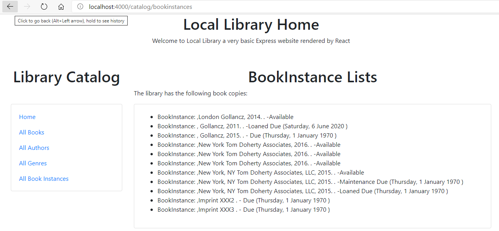

## Showing Details of Selected items

Alongside each of the listed items, books, authors, genres and instances a link will be added to the detail page which will show details of an individual entry an links which will then be used to edit and delete an entry. 

The steps required in each case will be:

1. Add a link to the item list display which uses the item id as the last field of the URL and also passes the id value to the recieving container
2. Modify the appropriate controller file in libraryAPI to return JSON via HTTP rather than rendering to pug.
3. Check the format of the JSON returned
4. Create a component file in reactLibrary with state variables which match the returned JSON
5. Update the library.js file to add a ROUTE which passes the id value forward to the target component.
6. Formulate a URL to Read from the REST libraryAPI based on the transferred ID
7. Render the appropriate data in the component file patterned loosely on the equivalent pug view.
8. Include links around elements where deeper details are available such as bookInstances.
9. Add Delete and update links to the display to prepare for the next stage of editing.

### Book Details

In the pug view version, a request for a single book detail with an selected id resulted in a display comprising of title, author, summary, isbn, list of genres and list of copies (with status, imprint and id).  Genres and bookInstances had links to find more precise details and at the foot of the page are links to Update and delete the current book details.

**Step 1:** Add a link to the item list display which uses the item id as the last field of the URL and also passes the id value to the recieving container

Add a link to bookList.js which will allow individual books to be called referencing the books ID.  This requires the concatenation of the URL string with the id data.  Advice on [how To Concatenate Variables and Strings in JSX and React.js](https://www.jsdiaries.com/how-to-concatenate-variables-and-strings-in-jsx-and-react-js/) is given at "jsdiaries.com". 

First intuition would be to ammend the to attribute of the Link in a format like:

```javascript
<Link  to= "/catalog/book/ + {libBook._id} "  >Details</ Link>
```

But this does not work because the {} inside the string are interpreted literally and the libBook.id value is not evaluated.

The correct format is to include both the string and the variable within the { parenthesis} in this way:

```javascript
<Link  to= {"/catalog/book/" +libBook._id }  >Details</ Link>
```
The full listing of bookList.js becomes:

```javascript
 // src/components/bookList.js

 import React, { Component} from 'react';
 import { Link } from 'react-router-dom';


 class BookList extends Component {
  state = {
    libBooks:[{ "_id":"1",
              "title":" ",
              author:{
                "_id":" ",
                "first_name":" ",
                "family_name":" ",
                "date_of_birth":" ",
                "date_of_death":""}
            }]
  }

  componentDidMount() {
    fetch('http://localhost:3000/catalog/books')
    .then(res => res.json())
    .then((data) => {
      console.log("data: ", data);
      this.setState({ libBooks: data })
    })
    .catch(console.log);
  }

  render(){
    return (
      <div>
        <center><h1>Book Lists</h1></center>
        <p>The library has the following books:</p>
        <div className ="card">
          <div className ="card-body">
            <ul>
              {this.state.libBooks.map((libBook) => (
                <li className ="card-text" key = {libBook._id} >
                  Books: {libBook.title} ,
                  ({libBook.author.family_name} ,
                  {libBook.author.first_name} )
                  <Link  to= {"/catalog/book/" +libBook._id }  >Details</ Link>
                </li>
              ))}  
            </ul>  
          </div>
        </div>
      </div>
    )
 }
}

 export default BookList
 //
```

**Step 2:** Modify the appropriate controller file in libraryAPI to return JSON via HTTP rather than rendering to pug.

To modify the appropriate controller; edit the bookdetail section of bookControllers.js to return JSON via HTTP rather than displaying via the pug view.

```javascript
// Display detail page for a specific book.
exports.book_detail = function(req, res, next) {

    async.parallel({
        book: function(callback) {

            Book.findById(req.params.id)
              .populate('author')
              .populate('genre')
              .exec(callback);
        },
        book_instance: function(callback) {

          BookInstance.find({ 'book': req.params.id })
          .exec(callback);
        },
    }, function(err, results) {
        if (err) { return next(err); }
        if (results.book==null) { // No results.
            var err = new Error('Book not found');
            err.status = 404;
            return next(err);
        }
        // Successful, so render.
        //res.render('book_detail', { title: results.book.title, book: results.book, book_instances: results.book_instance } );
        res.send(results);
    });
};
```

**Step 3:**  Check the format of the JSON returned

The request for a single book detail returns the JSON format ,you can check this at:

> http://localhost:3000/catalog/book/5fd17e4dcafcfea77d6139d5 

```JSON
{"book_instance":
  [
    {"status":"Available",
    "_id":"5fd17e4dcafcfea77d6139dc",
    "book":"5fd17e4dcafcfea77d6139d5",
    "imprint":"New York Tom Doherty Associates, 2016.",
    "due_back":null},
    {"status":"Available",

    "_id":"5fd17e4dcafcfea77d6139dd",
    "book":"5fd17e4dcafcfea77d6139d5",
    "imprint":"New York Tom Doherty Associates, 2016.",
    "due_back":null},
    {"status":"Available",
    "_id":"5fd17e4dcafcfea77d6139de",
    "book":"5fd17e4dcafcfea77d6139d5",
    "imprint":"New York Tom Doherty Associates, 2016.",
    "due_back":null}
  ],
"book":{"genre":
    [
      {"_id":"5fd17e4dcafcfea77d6139d0",
      "name":"Science Fiction"}
    ],
    "_id":"5fd17e4dcafcfea77d6139d5",
    "title":"Apes and Angels",
    "summary":"Humankind headed out to the stars not for conquest, nor exploration, nor even for curiosity. Humans went to the stars in a desperate crusade to save intelligent life wherever they found it. A wave of death is spreading through the Milky Way galaxy, an expanding sphere of lethal gamma ...",
    "author":{"_id":"5fd17e4dcafcfea77d6139cb",
    "first_name":"Ben",
    "family_name":"Bova",
    "date_of_birth":"1932-11-08T00:00:00.000Z",
    "date_of_death":null},
    "isbn":"9780765379528"
  }
}
```

**Step 4:** Create a component file in reactLibrary with state variables which match the returned JSON

This is matched in the state variables of reactLibrary/src/components/bookDetail.js.  You can use bookList.js as a starting point for creating bookDetail.js.   Care is needed in naming and subsequently referencing the state detail when the returned javascript includes a combination of objects and arrays.

```javascript
 class BookDetail extends Component {
  state = {
    detail:{
      book_instance:[{ 
        "status":" ",
        "_id":" ",
        "imprint":" ",
        "due_back":" "}],
      book:{
        genre:[{
          "_id":" ",
          "name":" "   
        }],
      "_id":" ",
      "title":" ",
      "summary":" ",
      author:{
        "_id":" ",
        "first_name":" ",
        "family_name":" ",
        "date_of_birth":" ",
        "date_of_death":""},
      "isbn":" "
      }
    }  
  }
```

**Step 5:** Update the library.js file to add a ROUTE which passes the id value forward to the target component.

Within library.js it will be ncessary to import the bookDetail element which is currently under development in bookDetail.js as:

```javascript
import BookDetail from './bookDetail';
```

The URL for the particular book provided by <BookList> in the current example is 

```code
/catalog/book/5fd17e4dcafcfea77d6139d5
```
The last part of the URL represents the identifier for a particular book.  Within library.js a Route for this must be added.  The identifier will be dynamically generated so cannot be represented as a single value, instead it is marked with a label preceeded by a colon.  The label ":id" is selected and is commonly used, but it is not a keyword.

```javascript
<Route exact path="/catalog/book/:id"><BookDetail /> </Route>
```

The router automatically forwards the value of the :id as to the props of the targetted component.  

**Step 6:** Formulate a URL to Read from the REST libraryAPI based on the transferred ID

To retrieve the value passed as :id in the targetted component (<BookDetail>) the code should be included:

```javascript
  const id = this.props.match.params.id;
```

React components may be of either the function type of the class type.  The class based approach is more comfortable to programmers familiar with object oriented programming.  However, the command to match params will initially create an error in class based components.

The stackoverflow comment [react-router-dom useParams() inside class component](https://stackoverflow.com/questions/58548767/react-router-dom-useparams-inside-class-component) provides guidance how to adapt a class to enable match.params to be used.  Essentially the class must be wrapped with the router when it is exported.

This means that the withRouter component must be imported into bookDetail.js:

```javascript
 import { withRouter } from "react-router";
```
and the last line export is ammended to:

```javascript
export default withRouter(BookDetail);
```
Having done that, the URL within the fetch command to access the libraryAPI can be modified:

``` javascript
fetch("http://localhost:3000/catalog/book/" + id )
```

Note that since id has been assigned to a constant that {parentheses} are not needed in any part of the line to concatenate the string.

**Step 7:**  Render the appropriate data in the component file patterned loosely on the equivalent pug view.

In the pug view version, a request for a single book with id 5fd17e4dcafcfea77d6139dc resulted in a display of:

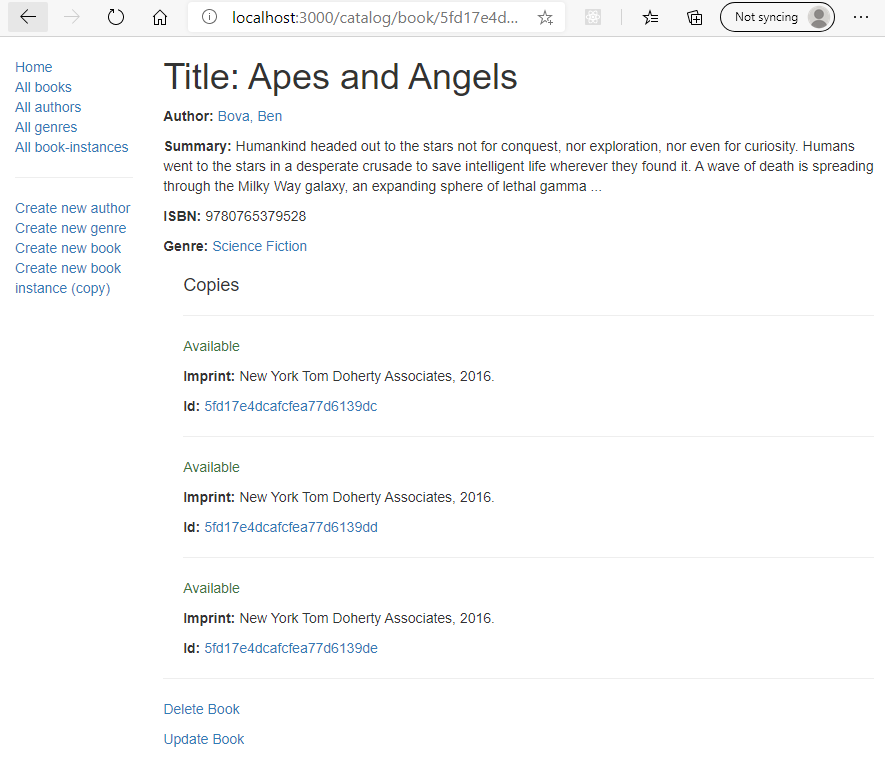

This comprises of author, summary, isbn, list of genres and list of copies (with status, imprint and id)


This information can be provided within bookDetail.js noting that the title, author, summary and ISBN are associated uniquely with the book.  A book may contain many genres and have many copies, so these sections will ust the .map method to iterate around the array.  It is a requirement of react that the repeating sibling elements have a unique key.  In booklist, this was appied to the <li> element as is seen in many references, however in this case it is applied to the first element inside the .map method.

In the case of the genre a redundant <span> element was added so that the key could be applied.

```javascript
{this.state.detail.book.genre.map((gen) => (<span  key = {gen._id} >{gen.name}, &nbsp; </span>))}  
```

In the case of the key is applied to the outer enclosing <div> element

```javascript
{this.state.detail.book_instance.map((copy) => (<div className ="card-body" key = {copy._id}>
```

The code needed to display the data is:

```javascript
  render(){
    return ( 
      <div>
        <center><h1>Book Details</h1></center>
        <p>The library has the following books:</p>
        <div className ="card">
          <div className ="card-body">
            <h1 className = "card-title">Title: {this.state.detail.book.title} </h1>
            <p className = "card-text"><strong>Author: </strong>
              {this.state.detail.book.author.family_name}, 
              {this.state.detail.book.author.first_name} 
            </p>
            <p className = "card-text"><strong>Summary: </strong>{this.state.detail.book.summary} </p>
            <p className = "card-text"><strong>ISBN: </strong>{this.state.detail.book.isbn} </p>
            <p className = "card-text"><strong>Genre: </strong> 
              {this.state.detail.book.genre.map((gen) => (<span  key = {gen._id} >{gen.name}, &nbsp; </span>))}  
            </p>
            <h2 className = "card-title">Copies:</h2>

              {this.state.detail.book_instance.map((copy) => (
                <div className ="card-body" key = {copy._id}>
                  <p className = "card-text"><strong>Status: </strong>{copy.status} </p>
                  <p className = "card-text"><strong>Imprint: </strong>{copy.imprint} </p>
                  <p className = "card-text"><strong>Id: </strong> {copy._id}</p>
                </div>
              ))} 
          </div>        
        </div>
      </div>
    )
 }
```

**Step 8:**  Include links around elements where deeper details are available in this case for genes and bookInstances.

For genres:

```javascript
{this.state.detail.book.genre.map((gen) => (
  <span  key = {gen._id} > 
  {gen.name} <Link  to= {"/catalog/genre/" +copy._id }  > Details  </ Link> , &nbsp; 
  </span>))}  
```
and for bookInstances:

```javascript
<p className = "card-text"><strong>Id: </strong> 
{copy._id} <Link  to= {"/catalog/bookinstance/" +copy._id }  > Details  </ Link> 
</p>
```


**Step 9:**  Add Delete and update links to the display to prepare for the next stage of editing.

To delete and update the book add:

```javascript
<Link  to= {"/catalog/book/" +this.state.detail.book._id + "/delete" }  >Delete </ Link><br />
<Link  to= {"/catalog/book/" +this.state.detail.book._id + "/update" }  >Update </ Link>
```

Although these links will be made, they are not routed to anythin at this stage so should not be used yet.

The full listing of bookDetail.js thus becomes:

```javascript
 // src/components/bookDetails.js

 import React, { Component }from 'react';
 import { Link } from 'react-router-dom';
 import { withRouter } from "react-router";

 class BookDetail extends Component {
  state = {
    detail:{
      book_instance:[{ 
        "status":" ",
        "_id":" ",
        "imprint":" ",
        "due_back":" "}],
      book:{
        genre:[{
          "_id":" ",
          "name":" "   
        }],
      "_id":" ",
      "title":" ",
      "summary":" ",
      author:{
        "_id":" ",
        "first_name":" ",
        "family_name":" ",
        "date_of_birth":" ",
        "date_of_death":""},
      "isbn":" "
      }
    }  
  }

  componentDidMount() {
    const id = this.props.match.params.id;
    console.log("id:",id);
    fetch("http://localhost:3000/catalog/book/" + id )
    .then(res => res.json())
    .then((data) => {
      // console.log("data: ", data);
      this.setState({ detail: data });
    })
    .catch(console.log);
  }

  render(){
    return ( 
      <div>
        <center><h1>Book Details</h1></center>
        <p>The library has the following books:</p>
        <div className ="card">
          <div className ="card-body">
            <h1 className = "card-title">Title: {this.state.detail.book.title} </h1>
            <p className = "card-text"><strong>Author: </strong>
              {this.state.detail.book.author.family_name}, 
              {this.state.detail.book.author.first_name} 
            </p>
            <p className = "card-text"><strong>Summary: </strong>{this.state.detail.book.summary} </p>
            <p className = "card-text"><strong>ISBN: </strong>{this.state.detail.book.isbn} </p>
            <p className = "card-text"><strong>Genre: </strong> 
              {this.state.detail.book.genre.map((gen) => (<span  key = {gen._id} > {gen.name} <Link  to= {"/catalog/genre/" +gen._id }  > Details  </ Link> , &nbsp; </span>))}  
            </p>
            <h2 className = "card-title">Copies:</h2>

              {this.state.detail.book_instance.map((copy) => (
                <div className ="card-body" key = {copy._id}>
                  <p className = "card-text"><strong>Status: </strong>{copy.status} </p>
                  <p className = "card-text"><strong>Imprint: </strong>{copy.imprint} </p>
                  <p className = "card-text"><strong>Id: </strong> {copy._id}
                  <Link  to= {"/catalog/bookinstance/" +copy._id }  > Details  </ Link> 
                  </p>
                </div>
              ))} 
          </div>        
        </div>
        <Link  to= {"/catalog/book/" +this.state.detail.book._id + "/delete" }  >Delete </ Link><br />
        <Link  to= {"/catalog/book/" +this.state.detail.book._id + "/update" }  >Update </ Link>
      </div>
    )
 }
}

export default withRouter(BookDetail);
```

Listing all books and following the details link to Apes and Angels will lead to the display:

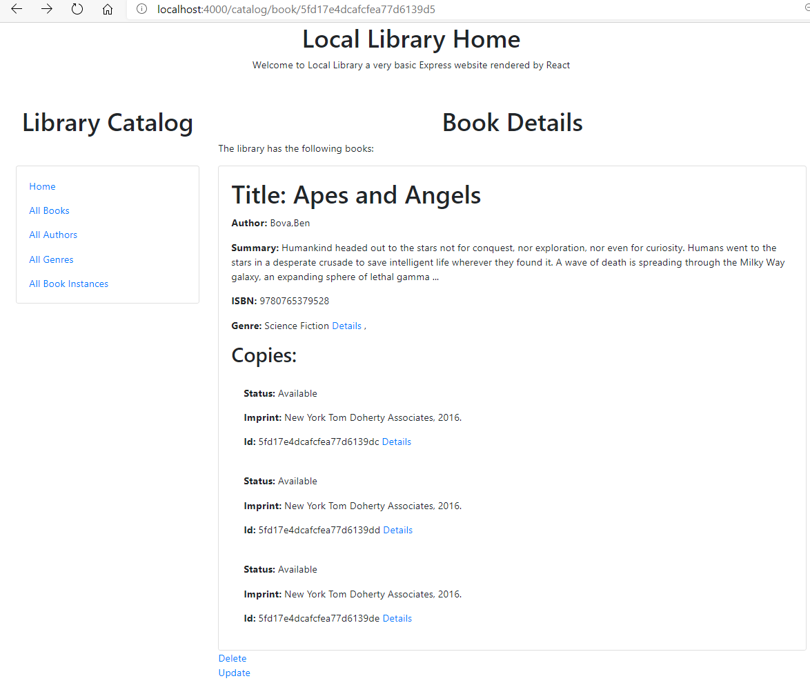

### Author Details

Following the same steps the author details can be added as links from the authorList 

**step 1** Add a link to the item list display which uses the item id as the last field of the URL and also passes the id value to the recieving container

Ammend the listing of reactLibrary/src/components/authorList.js to include a link to catalog/author/libAuthor._id:

```javascript
// src/components/authorList.js

import React, { Component }from 'react';
import { Link } from 'react-router-dom';

function Lifespan(props){
  if (props.birth && ! props.death){return("living")}
  if (! props.birth){return ("unknown")}
  let birthDate = new Date(props.birth);
  let deathDate = new Date(props.death);
  let diff = (birthDate.getTime() - deathDate.getTime()) / 1000;
  diff /= (60 * 60 * 24);
  diff = Math.abs(Math.round(diff/365.25));
  return (diff + " years")
}


class AuthorList extends Component {
 state = {
    libAuthors:[{ "_id":"1",
             "first_name":" ",
             "family_name":" ",
             "date_of_birth":" ",
             "date_of_death":" ",
           }],
          
 }

 componentDidMount() {
   fetch('http://localhost:3000/catalog/authors')
   .then(res => res.json())
   .then((data) => {
     console.log("data: ", data);
     this.setState({ libAuthors: data })
   })
   .catch(console.log);
   
  }

  render(){
   return (
     <div>
       <center><h1>Author Lists</h1></center>
       <p>The library has the following authors:</p>
       <div className ="card">
         <div className ="card-body">
           <ul>
             {this.state.libAuthors.map((libAuthor) => (
               <li className ="card-text" key = {libAuthor._id} >
               Author: {libAuthor.family_name} ,
               {libAuthor.first_name} ,
               <Lifespan birth = {libAuthor.date_of_birth} death = {libAuthor.date_of_death} /> 
               <Link  to= {"/catalog/author/" +libAuthor._id }  > Details</ Link>
               </li>
             ))}  
           </ul>  
         </div>
       </div>
     </div>
   )
  }
}

export default AuthorList
```

**step 2** Modify the appropriate controller file in libraryAPI to return JSON via HTTP rather than rendering to pug.

In libraryAPI/myapp/controllers/authorControllers.js edit author_detail to return JSON by HTTP.

```javascript
// Display detail page for a specific Author.
exports.author_detail = function(req, res, next) {

    async.parallel({
        author: function(callback) {
            Author.findById(req.params.id)
              .exec(callback)
        },
        authors_books: function(callback) {
          Book.find({ 'author': req.params.id },'title summary')
          .exec(callback)
        },
    }, function(err, results) {
        if (err) { return next(err); } // Error in API usage.
        if (results.author==null) { // No results.
            var err = new Error('Author not found');
            err.status = 404;
            return next(err);
        }
        // Successful, so render.
        //res.render('author_detail', { title: 'Author Detail', author: results.author, author_books: results.authors_books } );
        res.send(results);
    });
```

**step 3** Check the format of the JSON returned

See the JSON format returned by:

> http://localhost:3000/catalog/author/5fd17e4dcafcfea77d6139cb

```JSON
{"author":{"_id":"5fd17e4dcafcfea77d6139cb",
"first_name":"Ben",
"family_name":"Bova",
"date_of_birth":"1932-11-08T00:00:00.000Z",
"date_of_death":null},
"authors_books":[{
  "_id":"5fd17e4dcafcfea77d6139d5",
  "title":"Apes and Angels",
  "summary":"Humankind headed out to the stars not for conquest, nor exploration, nor even for curiosity. Humans went to the stars in a desperate crusade to save intelligent life wherever they found it. A wave of death is spreading through the Milky Way galaxy, an expanding sphere of lethal gamma ..."}
  ]}
```

**step 4** Create a component file in reactLibrary with state variables which match the returned JSON

Create authorDetail.js based on authorList 

```javascript
class AuthorDetail extends Component {
 state = {
   detail:{ 
    author:{
      "_id":" ",
      "first_name":" ",
      "family_name":" ",
      "date_of_birth":" ",
      "date_of_death":""},
    authors_books:[{
        "_id":" ",
        "title":" ",
        "summary":" "
      }] 
    }
  }
```

**step 5** Update the library.js file to add a ROUTE which passes the id value forward to the target component.

Import AuthorDetail:

```javascript
import AuthorDetail from './authorDetail';
```
Describe a route with :id representing the authorID

```javascript
<Route exact path="/catalog/author/:id"><AuthorDetail /> </Route>
```

**step 6** Formulate a URL to Read from the REST libraryAPI based on the transferred ID

Add to authorDetail:

```javascript
  const id = this.props.match.params.id;
  fetch("http://localhost:3000/catalog/author/" + id )
  ...
   this.setState({ detail: data })
```

**step 7** Render the appropriate data in the component file patterned loosely on the equivalent pug view.

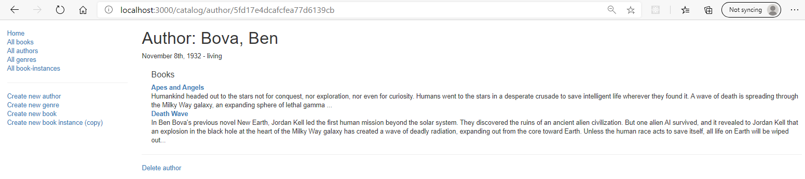

Include the function lifespan above the authorDetail class.

```javascript
function Lifespan(props){
  if (props.birth && ! props.death){return("living")}
  if (! props.birth){return ("unknown")}
  let birthDate = new Date(props.birth);
  let deathDate = new Date(props.death);
  let diff = (birthDate.getTime() - deathDate.getTime()) / 1000;
  diff /= (60 * 60 * 24);
  diff = Math.abs(Math.round(diff/365.25));
  return (diff + " years")
}
```

Also add a date formatting function:

```javascript
function Lifespan(props){
  if (props.birth && ! props.death){return("living")}
  if (! props.birth){return ("unknown")}
  let birthDate = new Date(props.birth);
  let deathDate = new Date(props.death);
  let diff = (birthDate.getTime() - deathDate.getTime()) / 1000;
  diff /= (60 * 60 * 24);
  diff = Math.abs(Math.round(diff/365.25));
  return (diff + " years")
}
```

Use these in the code to render the state variables.

**step 8** Include links around elements where deeper details are available such as bookInstances.
**step 9** Add Delete and update links to the display to prepare for the next stage of editing.

Full listing of authorDetails.js

```javascript
// src/components/authorDetail.js

import React, { Component }from 'react';
import { Link } from 'react-router-dom';
import { withRouter } from "react-router";


function Lifespan(props){
  if (props.birth && ! props.death){return("living")}
  if (! props.birth){return ("unknown")}
  let birthDate = new Date(props.birth);
  let deathDate = new Date(props.death);
  let diff = (birthDate.getTime() - deathDate.getTime()) / 1000;
  diff /= (60 * 60 * 24);
  diff = Math.abs(Math.round(diff/365.25));
  return (diff + " years")
}

function FormattedDate(props){
  
    const options = {
      weekday: "long",
      month:"long",
      day:"numeric",
      year: "numeric"};
    let FormattedDate = new Date(props.fDate);
    return ( FormattedDate.toLocaleDateString("en-GB",options) );
  
}

class AuthorDetail extends Component {
 state = {
   detail:{ 
    author:{
      "_id":" ",
      "first_name":" ",
      "family_name":" ",
      "date_of_birth":" ",
      "date_of_death":""},
    authors_books:[{
        "_id":" ",
        "title":" ",
        "summary":" "
      }] 
    }
  }

  

 componentDidMount() {
   console.log("author Detail mounted")
  const id = this.props.match.params.id;
  fetch("http://localhost:3000/catalog/author/" + id )
   .then(res => res.json())
   .then((data) => {
     console.log("authordata: ", data);
     this.setState({ detail: data })
   })
   .catch(console.log);
 }

 render(){
   //this.update();
   return (
    <div>
    <center><h1>Author Details</h1></center>
    <p>The library has the following author details:</p>
    <div className ="card">
      <div className ="card-body">
        <h1 className = "card-title">Author: {this.state.detail.author.family_name},  {this.state.detail.author.first_name}</h1>
        <p className = "card-text">
          <FormattedDate fDate = {this.state.detail.author.date_of_birth} />, 
          <Lifespan birth = {this.state.detail.author.date_of_birth} death = {this.state.detail.author.date_of_death} /> 
        </p>
        <h2 className = "card-title">Books:</h2>

          {this.state.detail.authors_books.map((aBook) => (
            <div className ="card-body" key = {aBook._id}>
              <p className = "card-text"><strong>Title: 
                </strong> &nbsp; {aBook.title} <Link  to= {"/catalog/book/" + aBook._id }  > Details  </ Link>
              </p>
              <p className = "card-text"><strong>Summary: </strong> &nbsp; {aBook.summary} </p>
            </div>
          ))} 
      </div>        
    </div>
    <Link  to= {"/catalog/author/" +this.state.detail.authors_books._id + "/delete" }  >Delete </ Link><br />
    <Link  to= {"/catalog/author/" +this.state.detail.authors_books._id  + "/update" }  >Update </ Link>
  </div>
   )
}
}

export default withRouter (AuthorDetail)
```

Then Following the authors list through to Ben Bova displays as:

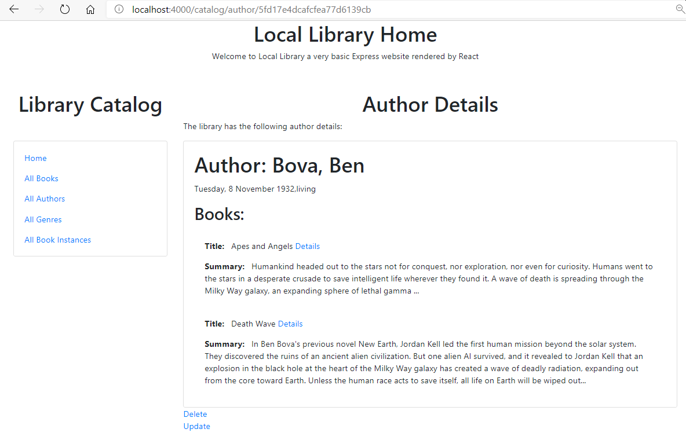

## Genre details and BookInstance details 

Left as an exercise.

# Updating entries

Updating a database entry has two stages.  The first must read the current database entry and present the data in an editable form.  The second must update the database by form submission and return to the detail description to confirm the editing has taken place.

## Update book details

In libraryAPI/myapp/controllers/bookController.js there is  function book_update_get which will return the full database entry relating to a book.  

```javascript
// Display book update form on GET.
exports.book_update_get = function(req, res, next) {

    // Get book, authors and genres for form.
    async.parallel({
        book: function(callback) {
            Book.findById(req.params.id).populate('author').populate('genre').exec(callback);
        },
        authors: function(callback) {
            Author.find(callback);
        },
        genres: function(callback) {
            Genre.find(callback);
        },
        }, function(err, results) {
            if (err) { return next(err); }
            if (results.book==null) { // No results.
                var err = new Error('Book not found');
                err.status = 404;
                return next(err);
            }
            // Success.
            // Mark our selected genres as checked.
            for (var all_g_iter = 0; all_g_iter < results.genres.length; all_g_iter++) {
                for (var book_g_iter = 0; book_g_iter < results.book.genre.length; book_g_iter++) {
                    if (results.genres[all_g_iter]._id.toString()==results.book.genre[book_g_iter]._id.toString()) {
                        results.genres[all_g_iter].checked='true';
                    }
                }
            }
            res.render('book_form', { title: 'Update Book', authors: results.authors, genres: results.genres, book: results.book });
        });

};
```

And a second function book_update_post which will recieve posted data, validate and sanitize it before updating the database.

```javascript
// Handle book update on POST.
exports.book_update_post = [

    // Convert the genre to an array
    (req, res, next) => {
        if(!(req.body.genre instanceof Array)){
            if(typeof req.body.genre==='undefined')
            req.body.genre=[];
            else
            req.body.genre=new Array(req.body.genre);
        }
        next();
    },
   
    // Validate fields.
    body('title', 'Title must not be empty.').isLength({ min: 1 }).trim(),
    body('author', 'Author must not be empty.').isLength({ min: 1 }).trim(),
    body('summary', 'Summary must not be empty.').isLength({ min: 1 }).trim(),
    body('isbn', 'ISBN must not be empty').isLength({ min: 1 }).trim(),

    // Sanitize fields.
    sanitizeBody('title').escape(),
    sanitizeBody('author').escape(),
    sanitizeBody('summary').escape(),
    sanitizeBody('isbn').escape(),
    sanitizeBody('genre.*').escape(),

    // Process request after validation and sanitization.
    (req, res, next) => {

        // Extract the validation errors from a request.
        const errors = validationResult(req);

        // Create a Book object with escaped/trimmed data and old id.
        var book = new Book(
          { title: req.body.title,
            author: req.body.author,
            summary: req.body.summary,
            isbn: req.body.isbn,
            genre: (typeof req.body.genre==='undefined') ? [] : req.body.genre,
            _id:req.params.id //This is required, or a new ID will be assigned!
           });

        if (!errors.isEmpty()) {
            // There are errors. Render form again with sanitized values/error messages.

            // Get all authors and genres for form.
            async.parallel({
                authors: function(callback) {
                    Author.find(callback);
                },
                genres: function(callback) {
                    Genre.find(callback);
                },
            }, function(err, results) {
                if (err) { return next(err); }

                // Mark our selected genres as checked.
                for (let i = 0; i < results.genres.length; i++) {
                    if (book.genre.indexOf(results.genres[i]._id) > -1) {
                        results.genres[i].checked='true';
                    }
                }
                res.render('book_form', { title: 'Update Book',authors: results.authors, genres: results.genres, book: book, errors: errors.array() });
            });
            return;
        }
        else {
            // Data from form is valid. Update the record.
            Book.findByIdAndUpdate(req.params.id, book, {}, function (err,thebook) {
                if (err) { return next(err); }
                   // Successful - redirect to book detail page.
                   res.redirect(thebook.url);
                });
        }
    }
];
```

In libraryAPI/myapp/routes/catalog.js the routes are described to access these functions and it is noted that both are identified by the same URL, however the express router differentiates between these by the type of request, GET or POST.

```javascript
// GET request to update Book.
router.get('/book/:id/update', book_controller.book_update_get);

// POST request to update Book.
router.post('/book/:id/update', book_controller.book_update_post);
```
Reviewing the operation of the server side Pug view application,

> http://localhost:3000/catalog/book/5fd17e4dcafcfea77d6139d5/update

The generated form includes basic book information title, summary and isbn together with a drop down select box of all the available authors (in our scenario a book can only have one principal author) and a checkbox showing all available genres (a book may match one or more genres).

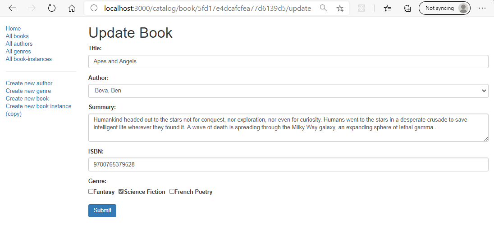

Changing the last lines of book_update_get the function can be set to return JSON

```javascript
            //res.render('book_form', { title: 'Update Book', authors: results.authors, genres: results.genres, book: results.book });
            res.send(results);
```

The resulting (abridged) JSON formatted data from tepeating the api call:

> http://localhost:3000/catalog/book/5fd17e4dcafcfea77d6139d5/update

becomes:

```JSON
{"authors":[{
  "_id":"5fd17e4dcafcfea77d6139ca",
  "first_name":"Patrick",
  "family_name":"Rothfuss",
  "date_of_birth":"1973-06-06T00:00:00.000Z",
  "date_of_death":null}
 ],
"genres":[{
  "_id":"5fd17e4dcafcfea77d6139cf",
  "name":"Fantasy"}
  }],
"book":{
  "genre":[{
    "_id":"5fd17e4dcafcfea77d6139d0",
    "name":"Science Fiction"
    }],
  "_id":"5fd17e4dcafcfea77d6139d5",
  "title":"Apes and Angels",
  "summary":"Humankind headed out to the stars  ...",
  "author":{
    "_id":"5fd17e4dcafcfea77d6139cb",
    "first_name":"Ben",
    "family_name":"Bova",
    "date_of_birth":"1932-11-08T00:00:00.000Z",
    "date_of_death":null},
  "isbn":"9780765379528"
  }
}
```
Create reactLibrary/src/components/bookForm.js based on bookDetail.js

Match the state variables to the JSON format recieved

```javascript
  class BookForm extends Component {
   state = {
     detail:{
      authors:[{
        "_id":" ",
        "first_name":" ",
        "family_name":" ",
        "date_of_birth":" ",
        "date_of_death":" "}
       ],
      genres:[{
        "_id":" ",
        "name":" "
        }],
      book:{
        genre:[{
           "_id":" ",
           "name":" "   
         }],
        "_id":" ",
        "title":" ",
        "summary":" ",
        author:{
          "_id":" ",
          "first_name":" ",
          "family_name":" ",
          "date_of_birth":" ",
          "date_of_death":""},
        "isbn":" "
       }
     }  
   }
```

Note that this is more data than should be written back to the database.  Recall the database schema:


Referring back to the schema which set up the database (listed in nodeexpress4 labsheet):

```javascript
var BookSchema = new Schema(
  {
    title: {type: String, required: true},
    author: {type: Schema.Types.ObjectId, ref: 'Author', required: true},
    summary: {type: String, required: true},
    isbn: {type: String, required: true},
    genre: [{type: Schema.Types.ObjectId, ref: 'Genre'}]
  }
);
```

So examples of inital database entries would be (with invented id values):

Book:

title:'The Name of the Wind (The Kingkiller Chronicle, #1)',
summary:'I have stolen princesses back from sleeping barrow kings. I burned down the town of Trebon. I have spent the night with Felurian and left with both my sanity and my life. I was expelled from the University at a younger age than most people are allowed in. I tread paths by moonlight that others fear to speak of during day. I have talked to Gods, loved women, and written songs that make the minstrels weep.',
ISBN: '9781473211896',
author: ad56qwe34lk3456l45,
genre: [ad56qwe34lk3423f, ad56qwezzzk3456l45]

So in <bookForm > a formValues state is needed which represents this information and this will then match the names and values set up in the form.  If any onChange events happen when the form is editted these must result in updating the formValues state and on submission the formValues state will be stringified and posted to the update url.

```javascript

 formValues:{
      "title":" ",
      "summary":" ",
      "isbn":" ",
      "author":" ",
      "genre":[{"_id":" " }]
     }
```

These form values must be set up from the details after the original data has been returned from the library API.  For this purpose create a new method in <BookBorm> named initialiseFormValues.

A useful example of [api-form-submission](https://gist.github.com/whoisryosuke/578be458b5fdb4e71b75b205608f3733) is provided by Ryosuke.


Within library.js import the <bookForm> component

```javascript
import BookForm from './bookForm';
```

then add a route to update <BookForm> 

```javascript
<Route exact path="/catalog/book/:id/update"><BookForm /> </Route>
```

Within bookForm.js modify the fetch URL so that it will call the libraryAPI route to book_update_get. 

```javascript
     fetch("http://localhost:3000/catalog/book/" + id + "/update")
```

The <bookForm> element wil need to render the data into a react form.  [The react form documents](https://reactjs.org/docs/forms.html) provide templates for the organisation of the react form.  There are also react components for forms which could be used such as [formik](https://formik.org/docs/overview) which make the syntax les verbose and add built in falidation, however basic operation should be understood first so I will stick with the react form.

dd

How to post to API

Needed to tweek sanitize to get working genres

# References

[handling events](https://reactjs.org/docs/handling-events.html)

[state and lifecycle](https://reactjs.org/docs/state-and-lifecycle.html#state-updates-are-merged)

[api-form-submit](https://gist.github.com/whoisryosuke/578be458b5fdb4e71b75b205608f3733)

[how do I set state for a nested object](https://stackoverflow.com/questions/34956479/how-do-i-setstate-for-nested-object)

[get the indesx of an object in an array](https://stackoverflow.com/questions/35823783/finding-the-array-index-of-an-object-with-javascript-react-js)

[spread syntax](https://developer.mozilla.org/en-US/docs/Web/JavaScript/Reference/Operators/Spread_syntax)

[React + Fetch - HTTP POST Request Examples](https://jasonwatmore.com/post/2020/02/01/react-fetch-http-post-request-examples)

[How to add, remove, and replace items using Array.splice() in JavaScript](https://attacomsian.com/blog/javascript-array-splice)

[Bootstrap: Examples and usage guidelines for form control styles](https://getbootstrap.com/docs/4.5/components/forms/)

## Local topics

### Routing
 * How to handle routing with [react router](https://www.digitalocean.com/community/tutorials/how-to-handle-routing-in-react-apps-with-react-router)

## General react reading

A number of general references to consilidate or develop your React knowledge.  Please dip in an use the ones which you kind most useful.

Develop a new 

* [W3cubDocs/React](https://docs.w3cub.com/react/) - not using react? This site's homepage offers a wide choice of topic.

* Digital Ocean: [how to code in react.js](https://www.digitalocean.com/community/tutorial_series/how-to-code-in-react-js)

* [Getting started with react](https://scotch.io/starters/react/getting-started-with-react-2019-edition?ref=home-start-here) (SCOTCH) Tutorials 1 - 33
* [A beginners guide to React with ES6](https://medium.com/the-andela-way/a-beginners-guide-to-react-with-es6-a2ed0b5c977e) (online of ebook)


## React Developer tools

* [Microsoft Edge](https://microsoftedge.microsoft.com/addons/detail/react-developer-tools/gpphkfbcpidddadnkolkpfckpihlkkil)
* [Google Chrome](https://chrome.google.com/webstore/detail/react-developer-tools/fmkadmapgofadopljbjfkapdkoienihi)
* [Firefox](https://addons.mozilla.org/en-US/firefox/addon/react-devtools/)